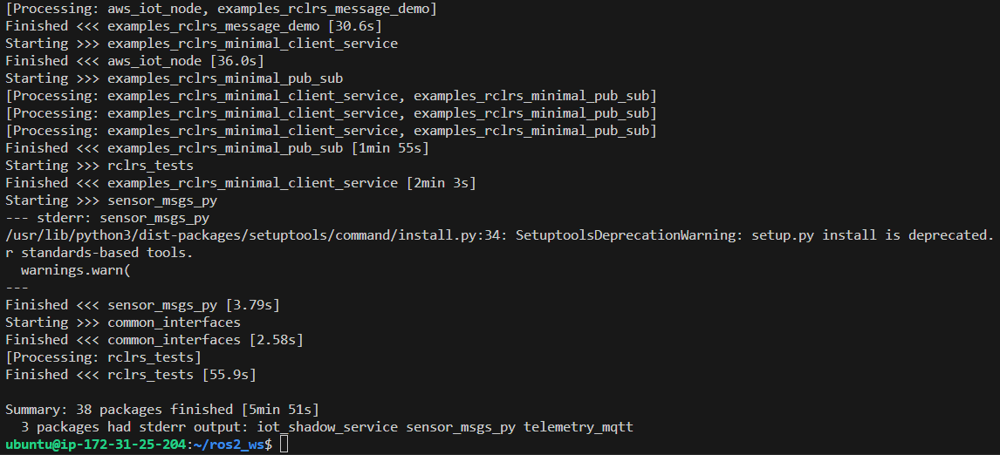
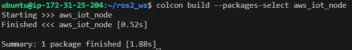
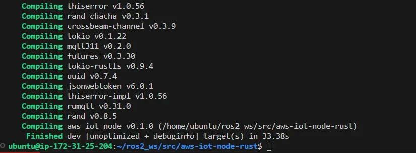
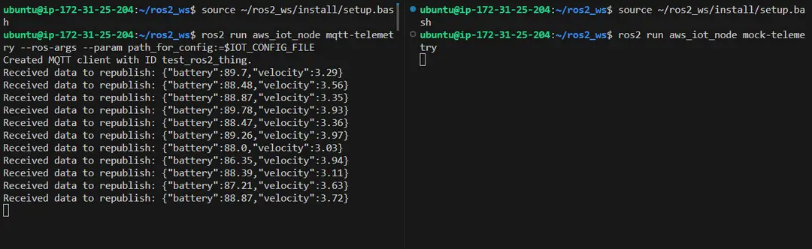
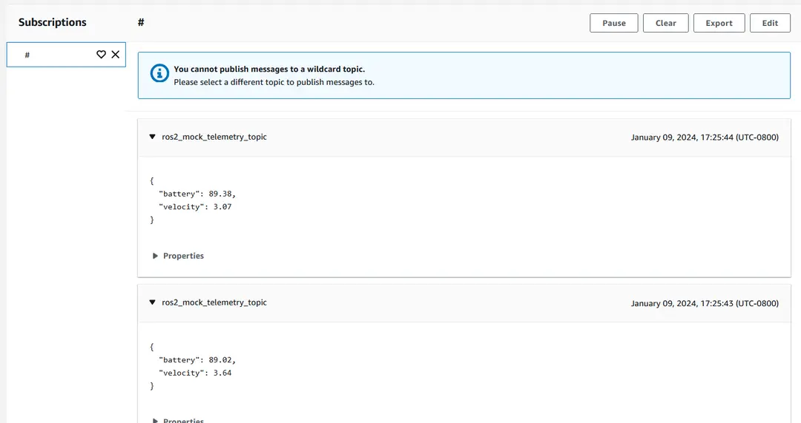

This post shows how to build a Robot Operating System 2 node using Rust, a systems programming language built for safety, security, and performance. In the post, I'll tell you about [Rust](https://www.rust-lang.org/) - the programming language, not the video game! I'll tell you why I think it's useful in general, then specifically in robotics, and finally show you how to run a ROS2 node written entirely in Rust that will send messages to AWS IoT Core.

This post is also available in video form - check the video link below if you want to follow along!

<iframe class="youtube-video" src="https://www.youtube.com/embed/U5wHiZpNdvg?si=sOkqQglS_wBYwRLu" title="YouTube video player" frameborder="0" allow="accelerometer; autoplay; clipboard-write; encrypted-media; gyroscope; picture-in-picture; web-share" allowfullscreen></iframe>

## Why Rust?

The first thing to talk about is, why Rust in particular over other programming languages? Especially given that ROS2 has strong support for C++ and Python, we should think carefully about whether it's worth travelling off the beaten path.

There are much more in-depths articles and videos about the language itself, so I'll keep my description brief. Rust is a systems-level programming language, which is the same langauge as C and C++, but with a very strict compiler that blocks you from doing "unsafe" operations. That means the language is built for high performance, but with a greatly diminished risk of doing something unsafe as C and C++ allow.

Rust is also steadily growing in traction. It is the only language other than C to make its way into the Linux kernel - and the Linux kernel was originally written in C! The Windows kernel is also rewriting some modules in Rust - check here to see what they have to say:

<iframe class="youtube-video" src="https://www.youtube.com/embed/1uAsA1hm52I?si=jX23v8UTqkCFf04z&amp;start=265" title="YouTube video player" frameborder="0" allow="accelerometer; autoplay; clipboard-write; encrypted-media; gyroscope; picture-in-picture; web-share" allowfullscreen></iframe>

The major tech companies are adopting Rust, including Google, Facebook, and Amazon. This recent 2023 keynote from Dr Wener Vogels, Vice President and CTO of Amazon.com, had some choice words to say about Rust. Take a look here to hear this expert in the industry:

<iframe class="youtube-video" src="https://www.youtube.com/embed/UTRBVPvzt9w?si=QsIxqpnwmpGowx0e&amp;start=3699" title="YouTube video player" frameborder="0" allow="accelerometer; autoplay; clipboard-write; encrypted-media; gyroscope; picture-in-picture; web-share" allowfullscreen></iframe>

### Why isn't Rust used more?

That's a great question. Really, I've presented the best parts in this post so far. Some of the drawbacks include:

1. Being a newer language means less community support and less components provided out of the box. For example, writing a desktop GUI in Rust is possible, but the libraries are still maturing.
1. It's harder to learn than most languages. The stricter compiler means some normal programming patterns don't work, whcih means relearning some concepts and finding different ways to accomplish the same task.
1. It's hard for a new language to gain traction! Rust has to prove it will stand the test of time.

Having said that, I believe learning the language is worth it for safety, security, and sustainability reasons. Safety and security comes from the strict compiler, and sustainability comes from being a low-level language that does the task faster and with fewer resources.

That's true for robotics as much as it is for general applications. Some robot software can afford to be slow, like high-level message passing and decision making, but a lot of it needs to be real-time and high-performance, like processing Lidar data. My example today is perfectly acceptable in Python because it's passing non-urgent messages, but it is a good use case to explore using Rust in.

With that, let's stop talking about Rust, and start looking at building that ROS2 node.

## Building a ROS2 Node

The node we're building replicates the Python-based node from [this blog post](https://aws.amazon.com/blogs/robotics/how-to-connect-your-robots-to-the-aws-cloud-and-drive-data-driven-innovation/). The same setup is required, meaning the setup of X.509 certificates, IoT policies, and so on will be used. If you want to follow along, make sure to run through that setup to the point of running the code - at which point, we can switch over to the Rust-based node. If you prefer to follow instructions from a README, please [follow this link](https://github.com/mikelikesrobots/aws-iot-node-rust) - it is the repository containing the source code we'll be using!

### Prerequisites

The first part of our setup is making sure all of our tools are installed. This node can be built on any operating system, but instructions are given for Ubuntu, so you may need some extra research for other systems.

Execute the following to install Rust using [Rustup](https://rustup.rs/):

```bash
curl --proto '=https' --tlsv1.2 -sSf https://sh.rustup.rs | sh
```

There are further dependencies taken from the [ROS2 Rust repository](https://github.com/ros2-rust/ros2_rust#sounds-great-how-can-i-try-this-out) as follows:

```bash
sudo apt install -y git libclang-dev python3-pip python3-vcstool # libclang-dev is required by bindgen
# Install these plugins for cargo and colcon:
cargo install --debug cargo-ament-build  # --debug is faster to install
pip install git+https://github.com/colcon/colcon-cargo.git
pip install git+https://github.com/colcon/colcon-ros-cargo.git
```

### Source Code

Assuming your existing ROS2 workspace is at `~/ros2_ws`, the following commands can be used to check out the source code:

```bash
cd ~/ros2_ws/src
git clone https://github.com/mikelikesrobots/aws-iot-node-rust.git
git clone https://github.com/ros2-rust/ros2_rust.git
git clone https://github.com/aws-samples/aws-iot-robot-connectivity-samples-ros2.git
```

ROS2 Rust then uses `vcs` to import the other repositories it needs:

```bash
cd ~/ros2_ws
vcs import src < src/ros2_rust/ros2_rust_humble.repos
```

That concludes checking out the source code.

### Building the workspace

The workspace can now be built. It takes around 10m to build ROS2 Rust, which should only need to be done once. Following that, changes to the code from this repository can be built very quickly. To build the workspace, execute:

```bash
cd ~/ros2_ws
colcon build
source install/setup.bash
```

The build output should look something like this:



Once the initial build has completed, the following command can be used for subsequent builds:

```bash
colcon build --packages-select aws_iot_node
```

Here it is in action:



Now, any changes that are made to this repository can be built and tested with `cargo` commands, such as:

```bash
cargo build
cargo run --bin mock-telemetry
```

The cargo build log will look something like:



### Multi-workspace Setup

The ROS2 Rust workspace takes a considerable amount of time to build, and often gets built as part of the main workspace when it's not required, slowing down development. A different way of structuring workspaces is to separate the ROS2 Rust library from your application, as follows:

```bash
# Create and build a workspace for ROS2 Rust
mkdir -p ~/ros2_rust_ws/src
cd ~/ros2_rust_ws/src
git clone https://github.com/ros2-rust/ros2_rust.git
cd ~/ros2_rust_ws
vcs import src < src/ros2_rust/ros2_rust_humble.repos
colcon build
source install/setup.bash

# Check out application code into main workspace
cd ~/ros2_ws/src
git clone https://github.com/mikelikesrobots/aws-iot-node-rust.git
git clone https://github.com/aws-samples/aws-iot-robot-connectivity-samples-ros2.git
cd ~/ros2_ws
colcon build
source install/local_setup.bash
```

This method means that the ROS2 Rust workspace only needs to be updated with new releases for ROS2 Rust, and otherwise can be left. Furthermore, you can source the setup script easily by adding a line to your `~/.bashrc`:

```bash
echo "source ~/ros2_rust_ws/install/setup.bash" >> ~/.bashrc
```

The downside of this method is that you can only source further workspaces using the `local_setup.bash` script, or it will overwrite the variables needed to access the ROS2 Rust libraries.

### Running the Example

To run the example, you will need the `IOT_CONFIG_FILE` variable set from the Python repository.

Open two terminals. In each terminal, source the workspace, then run one of the two nodes as follows:

```bash
source ~/ros2_ws/install/setup.bash  # Both terminals
source ~/ros2_ws/install/local_setup.bash  # If using the multi-workspace setup method
ros2 run aws_iot_node mqtt-telemetry --ros-args --param path_for_config:=$IOT_CONFIG_FILE  # One terminal
ros2 run aws_iot_node mock-telemetry  # Other terminal
```

Using a split terminal in [VSCode](https://code.visualstudio.com/), this looks like the following:



You should now be able to see messages appearing in the [MQTT test client](https://us-west-2.console.aws.amazon.com/iot/home?region=us-west-2#/test) in [AWS IoT Core](https://us-west-2.console.aws.amazon.com/iot/home). This will look like the following:



## Conclusion

We've demonstrated that it's possible to build nodes in Rust just as with C++ and Python - although there's an extra step of setting up ROS2 Rust so our node can link to it. We can now build other nodes in Rust if we're on a resource constrained system, such as a Raspberry Pi or other small dev kit, and we want the guarantees from the Rust compiler that the C++ compiler doesn't have while being more secure and sustainable than a Python-based version.

Check out the repo and give it a try for yourself!
