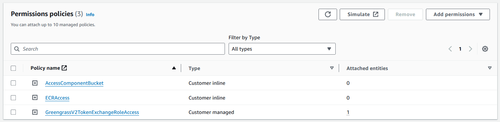
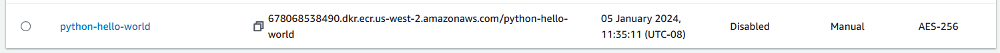
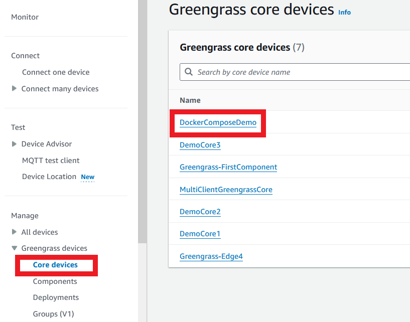
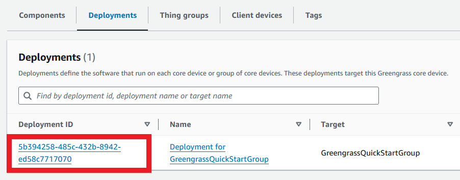
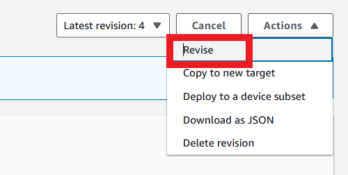
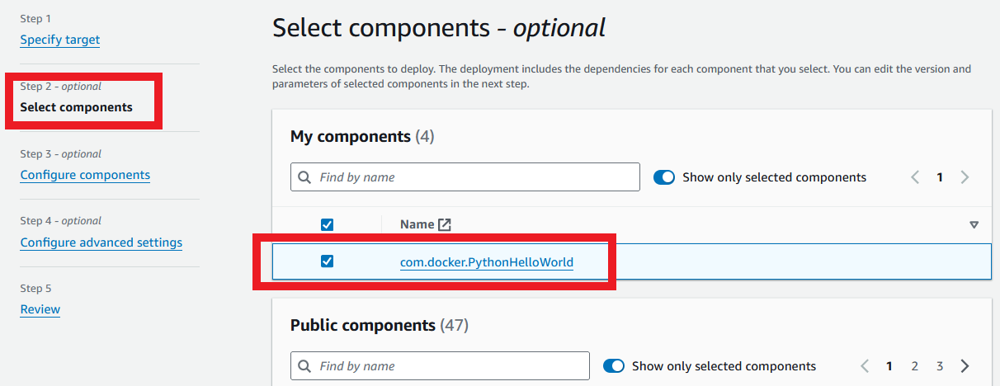

In this post, I'll show how to use two major concepts together:
1. [Docker](https://docs.docker.com/) images that can be privately hosted in [Amazon Elastic Container Registry (ECR)](https://aws.amazon.com/ecr/); and
1. [AWS IoT Greengrass](https://aws.amazon.com/greengrass/) components containing [Docker Compose](https://docs.docker.com/compose/) files.

These Docker Compose files can be used to run public Docker components, or pull private images from ECR. This means that you can deploy your own system of microservices to any platform compatible with AWS Greengrass.

This post is also available in video form - check the video link below if you want to follow along!

<iframe class="youtube-video" src="https://www.youtube.com/embed/7lA-CDG22oo?si=F0fY2dIyqO40HpP3" title="YouTube video player" frameborder="0" allow="accelerometer; autoplay; clipboard-write; encrypted-media; gyroscope; picture-in-picture; web-share" allowfullscreen></iframe>

<!-- truncate -->

## What is Docker?

Docker is very widely known in the DevOps world, but if you haven't heard of it, it's a way of taking a software application and bundling it up with all its dependencies so it can be easily moved around and run as an application. For example, if you have a Python application, you have two options:

1. Ask the user to install Python, the `pip` dependencies needed to run the application, and give instructions on downloading and running the application; or
1. Ask the user to install Docker, then provide a single command to download and run your application.

Either option is viable, but it's clear to see the advantages of the Docker method.

:::note[Docker Terminology]

A container is a running instance of an application, and an image is the result of saving a container so it can be run again. You can have multiple containers based on the same image. Think of it as a movie saved on a hard disk: the file on disk is the "image", and playing that movie is the "container". 

:::

### Docker Compose

On top of bundling software into images, Docker has a plugin called Docker Compose, which is a way of defining a set of containers that can be run together. With the right configuration, the containers can talk to each or the host computer. For instance, you might want to run a web server, API server, and database at the same time; with Docker Compose, you can define these services in one file and give them permission to talk to each other.

## Building Docker Compose into Greengrass Components

We're now going to use Docker Compose by showing how to deploy and run an application using Greengrass and Docker Compose. Let's take a look at the code.

The code we're using comes from [my sample repository](https://github.com/mikelikesrobots/greengrass-docker-compose).

### Clone the Code

The first step is to check the code out on your local machine. The build scripts use Bash, so I'd recommend something Linux-based, like Ubuntu. Execute the following to check out the code:

```bash
git clone https://github.com/mikelikesrobots/greengrass-docker-compose.git
```

### Check Dependencies

The next step is to make sure all of our dependencies are installed and set up. Execute all of the following and check the output is what you expect - a help or version message.

```bash
aws --version
gdk --version
jq --version
docker --version
```

The AWS CLI will also need credentials set up such that the following call works:

```bash
aws sts get-caller-identity
```

Docker will need to be able to run containers as a super user. Check this using:

```bash
sudo docker run hello-world
```

Finally, we need to make sure Docker Compose is installed. This is available either as a standalone script or as a plugin to Docker, where the latter is the more recent method of installing. If you have access to the plugin version, I would recommend using that, although you will need to update the Greengrass component build script - `docker-compose` is currently used.

```bash
# For the script version
docker-compose --version

# For the plugin version
docker compose --version
```

More information can be found for any of these components using:

1. [AWS CLI](https://docs.aws.amazon.com/cli/latest/userguide/getting-started-install.html)
2. [Greengrass Development Kit (GDK)](https://docs.aws.amazon.com/greengrass/v2/developerguide/install-greengrass-development-kit-cli.html)
3. `jq`: `sudo apt install jq`
4. [Docker](https://docs.docker.com/get-docker/)
5. [Docker Compose](https://docs.docker.com/compose/install/)

### Greengrass Permissions Setup

The [developer guide for Docker in Greengrass](https://docs.aws.amazon.com/greengrass/v2/developerguide/run-docker-container.html) tells us that we may need to add permissions to our Greengrass Token Exchange Role to be able to deploy components using either/both of ECR and S3, for storing private Docker images and Greengrass component artifacts respectively. We can check this by navigating to the [IAM console](https://us-east-1.console.aws.amazon.com/iam/home), searching for Greengrass, and selecting the TokenExchangeRole. Under this role, we should see one or more policies granting us permission to use ECR and S3.



For the ECR policy, we expect a JSON block similar to the following:

```json
{
  "Version": "2012-10-17",
  "Statement": [
    {
      "Action": [
        "ecr:GetAuthorizationToken",
        "ecr:BatchGetImage",
        "ecr:GetDownloadUrlForLayer"
      ],
      "Resource": [
        "*"
      ],
      "Effect": "Allow"
    }
  ]
}
```

For the S3 policy, we expect:

```json
{
  "Version": "2012-10-17",
  "Statement": [
    {
      "Action": [
        "s3:GetObject"
      ],
      "Resource": [
        "*"
      ],
      "Effect": "Allow"
    }
  ]
}
```

With these policies in place, any system we deploy Greengrass components to should have permission to pull Docker images from ECR and Greengrass component artifacts from S3.

### Elastic Container Registry Setup

By default, this project builds and pushes a Docker image tagged `python-hello-world:latest`. It expects an ECR repository of the same name to exist. We can create this by navigating to the [ECR console](https://us-west-2.console.aws.amazon.com/ecr/private-registry/repositories) and clicking "Create repository". Set the name to python-hello-world and keep the settings default otherwise, then click Create repository. This should create a new entry in the Repositories list:



Copy the URI from the repo and strip off the `python-hello-world` ending to get the `BASE_URI`. Then, back in your cloned repository, open the `.env` file and replace the `ECR_REPO` variable with your base URL. It should look like the following:

```bash
ECR_REPO=012345678901.dkr.ecr.us-west-2.amazonaws.com
```

Any new Docker image you attempt to create locally will need a new ECR repository. You can follow the creation steps up to the base URI step - this is a one-time operation.

### Building the Docker Images and Greengrass Components

At this point, you can build all the components and images by running:

```bash
./build_all.sh
```

Alternatively, any individual image/component can be built by changing directory into the component and running:
```bash
source ../../.env && ./build.sh
```

### Publishing Docker Images and Greengrass Components

Just as with building the images/components, you can now publish them using:

```bash
./publish_all.sh
```

If any image/component fails to publish, it should prevent the script execution to allow you to investigate further.

## Deploying Your Component

With the images and component pushed, you can now use the component in a Greengrass deployment.

First, make sure you have Greengrass running on a system. If you don't, you can follow the guide in the video below:

<iframe class="youtube-video" src="https://www.youtube.com/embed/2VXIILtiMiU?si=_Wnp2PDX6dCS5EN0" title="YouTube video player" frameborder="0" allow="accelerometer; autoplay; clipboard-write; encrypted-media; gyroscope; picture-in-picture; web-share" allowfullscreen></iframe>

Once you have Greengrass set up, you can navigate to the core device in the console. Open the [Greengrass console](https://us-west-2.console.aws.amazon.com/iot/home), select core devices, and then select your device.



From the deployments tab, click the current deployment.



In the top right, select Actions, then Revise.



Click Select components, then tick the new component to add it to the deployment. Skip to Review and accept.



This will now deploy the component to your target Greengrass device. Assuming all the setup is correct, you can access the Greengrass device, and list the most recent logs using:

```bash
sudo vim /greengrass/v2/logs/com.docker.PythonHelloWorld.log
```

This will show all current logs. It may take a few minutes to get going, so keep checking back! Once the component is active, you should see some log lines similar to the following:

```log
2024-01-19T21:46:03.514Z [INFO] (Copier) com.docker.PythonHelloWorld: stdout. [36mpython-hello-world_1  |^[[0m Received new message on topic /topic/local/pubsub: Hello from local pubsub topic. {scriptName=services.com.docker.PythonHelloWorld.lifecycle.Run.Script, serviceName=com.docker.PythonHelloWorld, currentState=RUNNING}
2024-01-19T21:46:03.514Z [INFO] (Copier) com.docker.PythonHelloWorld: stdout. [36mpython-hello-world_1  |^[[0m Successfully published 999 message(s). {scriptName=services.com.docker.PythonHelloWorld.lifecycle.Run.Script, serviceName=com.docker.PythonHelloWorld, currentState=RUNNING}
2024-01-19T21:46:03.514Z [INFO] (Copier) com.docker.PythonHelloWorld: stdout. [36mpython-hello-world_1  |^[[0m Received new message on topic /topic/local/pubsub: Hello from local pubsub topic. {scriptName=services.com.docker.PythonHelloWorld.lifecycle.Run.Script, serviceName=com.docker.PythonHelloWorld, currentState=RUNNING}
2024-01-19T21:46:03.514Z [INFO] (Copier) com.docker.PythonHelloWorld: stdout. [36mpython-hello-world_1  |^[[0m Successfully published 1000 message(s). {scriptName=services.com.docker.PythonHelloWorld.lifecycle.Run.Script, serviceName=com.docker.PythonHelloWorld, currentState=RUNNING}
2024-01-19T21:46:05.306Z [INFO] (Copier) com.docker.PythonHelloWorld: stdout. [36mcomdockerpythonhelloworld_python-hello-world_1 exited with code 0. {scriptName=services.com.docker.PythonHelloWorld.lifecycle.Run.Script, serviceName=com.docker.PythonHelloWorld, currentState=RUNNING}
```

From these logs, we can see both "Successfully published" messages and "Received new message" messages, showing that the component is running correctly and has all the permissions it needs.

This isn't the only way to check the component is running! We could also use the Local Debug Console, a locally-hosted web UI, to publish/subscribe to local topics. Take a look at this excellent video if you want to set this method up for yourself:

<iframe class="youtube-video" src="https://www.youtube.com/embed/adx3zUGRoWw?si=pkuzWSUErByqiJsb" title="YouTube video player" frameborder="0" allow="accelerometer; autoplay; clipboard-write; encrypted-media; gyroscope; picture-in-picture; web-share" allowfullscreen></iframe>

:::info[Congratulations!]

If you got to this point, you have successfully deployed a Docker Compose application using Greengrass!

:::

## Diving into the code

To understand how to extend the code, we need to first understand how it works.

From the top-level directory, we can see a couple of important folders (`components`, `docker`) and a couple of important scripts (`build_all.sh`, `publish_all.sh`).

`components` contains all of the Greengrass components, where each component goes in a separate folder and is built using GDK. We can see this from the folder inside, `com.docker.PythonHelloWorld`.
`docker` contains all of the Docker images, where each image is in a separate folder and is built using Docker.
We have already seen `build_all.sh` and `publish_all.sh`, but if we take a look inside, we see that both scripts source the `.env` file, then goes through all Docker folders followed by all Greengrass folders, for each one executing the `build.sh` or `publish.sh` script inside. The only exception is for publishing Greengrass components, where the standard `gdk component publish` command is used directly instead of adding an extra file.

Let's take a deeper dive into the Docker image and the Greengrass component in turn.

### Docker Image (docker/python-hello-world)

Inside this folder, we can see the [LocalPubSub sample application](https://github.com/mikelikesrobots/greengrass-docker-compose/blob/main/docker/python-hello-world/main.py) from Greengrass (see [the template](https://github.com/aws-greengrass/aws-greengrass-component-templates/tree/main/templates/python/LocalPubSub)), with some minor modifications. Instead of passing in the topic to publish on and the message to publish, we are instead using environment variables.

```python
topic = os.environ.get("MQTT_TOPIC", "example/topic")
message = os.environ.get("MQTT_MESSAGE", "Example Hello!")
```

Passing command line arguments directly to Greengrass components is easy, but passing those same arguments through Docker Compose is more difficult. It's an easier pattern to use environment variables specified by the Docker Compose file and modified by Greengrass configuration - we will see more on this in the Greengrass Component deep dive.

Therefore, the component retrieves its topic and message from the environment, then published 1000 messages and listens for those same messages.

We also have [a simple Dockerfile](https://github.com/mikelikesrobots/greengrass-docker-compose/blob/main/docker/python-hello-world/Dockerfile) showing how to package the application. From a base image of `python`, we add the application code into the `app` directory, and then specify the entrypoint as the `main.py` script.

Finally, we have the [build.sh](https://github.com/mikelikesrobots/greengrass-docker-compose/blob/main/docker/python-hello-world/build.sh) and [publish.sh](https://github.com/mikelikesrobots/greengrass-docker-compose/blob/main/docker/python-hello-world/publish.sh). The build simply uses the `docker build` command with a default tag of the ECR repo. The publish step does slightly more work by logging in to the ECR repository with Docker before pushing the component. Note that both scripts use the `ECR_REPO` variable set in the `.env` file.

If we want to add other Docker images, we can add a new folder with our component name and copy the contents of the `python-hello-world` image. We can then update the image name in the build and publish scripts and change the application code and Dockerfile as required. A new ECR repo will also be required, matching the name given in the build and publish scripts.

### Greengrass Component (components/com.docker.PythonHelloWorld)

Inside our Greengrass component, we can see a build script, the Greengrass component files, and the `docker-compose.yml` that will be deployed using Greengrass.

The [build script](https://github.com/mikelikesrobots/greengrass-docker-compose/blob/main/components/com.docker.PythonHelloWorld/build.sh) is slightly more complicated than the Docker equivalent, which is because the ECR repository environment variable needs to be replaced in the other files, but also needs to be reset after the component build to avoid committing changes to the source code. These lines...

```bash
find . -maxdepth 1 -type f -not -name "*.sh" -exec sed -i "s/{ECR_REPO}/$ECR_REPO/g" {} \;
gdk component build
find . -maxdepth 1 -type f -not -name "*.sh" -exec sed -i "s/$ECR_REPO/{ECR_REPO}/g" {} \;
```

...replace the `ECR_REPO` placeholder with the actual repo, then build the component with GDK, then replace that value back to the placeholder. As a result, the built files are modified, but the source files are changed to their original state.

Next we have the [GDK configuration file](https://github.com/mikelikesrobots/greengrass-docker-compose/blob/main/components/com.docker.PythonHelloWorld/gdk-config.json), which shows that our build system is set to `zip`. We could push only the Docker Compose file, but this method allows us to zip other files that support it if we want to extend the component. We also have the version tag, which needs to be incremented with new component versions.

After that, we have the [Docker Compose file](https://github.com/mikelikesrobots/greengrass-docker-compose/blob/main/components/com.docker.PythonHelloWorld/docker-compose.yml). This contains one single service, some environment variables, and a volume. The service refers to the `python-hello-world` Docker image built by `docker/python-hello-world` by specifying the image name.

:::warning

This component references the `latest` tag of `python-hello-world`. If you want your Greengrass component version to be meaningful, you should extend the build scripts to give a version number as the Docker image tag, so that each component version references a specific Docker image version.

:::

We can see the `MQTT_TOPIC` and `MQTT_MESSAGE` environment variables that need to be passed to the container. These can be overridden in the `recipe.yaml` by Greengrass configuration, allowing us to pass configuration through to the Docker container.

Finally, we can see some other parameters which are needed for the Docker container to be able to publish and subscribe to local MQTT topics:

```yaml
environment:
    - SVCUID
    - AWS_GG_NUCLEUS_DOMAIN_SOCKET_FILEPATH_FOR_COMPONENT
volumes:
    - ${AWS_GG_NUCLEUS_DOMAIN_SOCKET_FILEPATH_FOR_COMPONENT}:${AWS_GG_NUCLEUS_DOMAIN_SOCKET_FILEPATH_FOR_COMPONENT}
```

These will need to be included in any Greengrass component where the application needs to use MQTT. Other setups are available in the [Greengrass Docker developer guide](https://docs.aws.amazon.com/greengrass/v2/developerguide/run-docker-container.html).

If we want to add a new Docker container to our application, we can create a new service block, just like `python-hello-world`, and change our environment variables and image tags. Note that we don't need to reference images stored in ECR - we can also access public Docker images!

The last file is the [recipe.yaml](https://github.com/mikelikesrobots/greengrass-docker-compose/blob/main/components/com.docker.PythonHelloWorld/recipe.yaml), which contains a lot of important information for our component. Firstly, the default configuration allows our component to publish and subscribe to MQTT, but also specifies the environment variables we expect to be able to override:

```yaml
ComponentConfiguration:
  DefaultConfiguration:
    Message: "Hello from local pubsub topic"
    Topic: "/topic/local/pubsub"
```

This allows us to override the message and topic using Greengrass configuration, set in the cloud.

The recipe also specifies that the Docker Application Manager and Token Exchange Service are required to function correctly. Again, see the [developer guide](https://docs.aws.amazon.com/greengrass/v2/developerguide/run-docker-container.html) for more information.

We also need to look at the Manifests section, which specifies the Artifacts required and the Lifecycle for running the application. Within Artifacts, we can see:

```yaml
- URI: "docker:{ECR_REPO}/python-hello-world:latest"
```

This line specifies that a Docker image is required from our ECR repo. Each new private Docker image added to the Compose file will need a line like this to grant permission to access it. However, public Docker images can be freely referenced.

```yaml
- URI: "s3://BUCKET_NAME/COMPONENT_NAME/COMPONENT_VERSION/com.docker.PythonHelloWorld.zip"
  Unarchive: ZIP
```

This section specified that the component files are in a zip, and the S3 location is supplied during the GDK build. We are able to use files from this zip by referencing the `{artifacts:decompressedPath}/com.docker.PythonHelloWorld/` path.

In fact, we do this during the Run lifecycle stage:

```yaml
Lifecycle:
  Run: 
    RequiresPrivilege: True
    Script: |
      MQTT_TOPIC="{configuration:/Topic}" \
      MQTT_MESSAGE="{configuration:/Message}" \
      docker-compose -f {artifacts:decompressedPath}/com.docker.PythonHelloWorld/docker-compose.yml up
```

This uses privilege, as Docker requires super user privilege in our current setup. It is possible to set it up to work without super user, but this method is the simplest. We also pass `MQTT_TOPIC` and `MQTT_MESSAGE` as environment variables to the `docker-compose` command. With the up command, we tell the component to start the application in the Docker Compose file.

:::tip

If we want to change to use Compose as a plugin, we can change the run command here to start with docker compose.

:::

And that's the important parts of the source code! I encourage you to read through and check your understanding of the parameters - not setting permissions and environment variables correctly can lead to some confusing errors.

# Where to go from here

Given this setup, we should be able to deploy private or public Docker containers, which paves the path for deploying our robot software using Greengrass. We can run a number of containers together for the robot software. This method of deployment gives us the advantages of Greengrass, like having an easier route to the cloud, a more fault-tolerant deployment with roll-back mechanism and version tracking, and allowing us to deploy other components like the CloudWatch Log Manager.

In the future, we can extend this setup to build ROS2 containers, allowing us to migrate our robot software to Docker images and Greengrass components. We could install Greengrass on each robot, then deploy the full software with configuration options. We then also have a mechanism to update components or add more as needed, all from the cloud.

Give the [repository](https://github.com/mikelikesrobots/greengrass-docker-compose.git) a clone and try it out for yourself!
