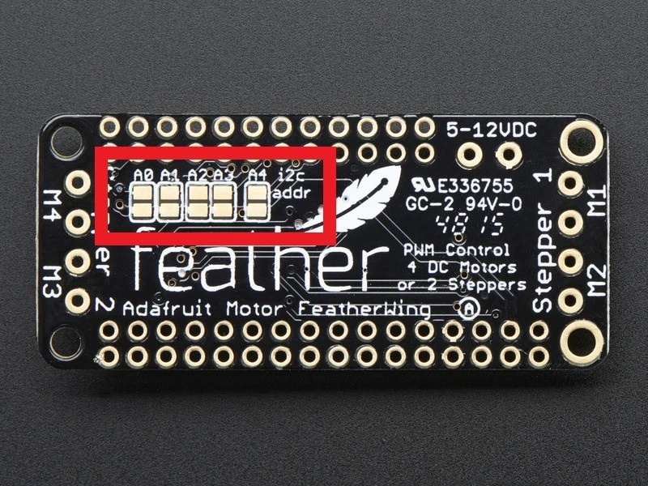

Welcome to a new series - setting up the JetBot to work with [ROS2 Control](https://control.ros.org) interfaces! Previously, I showed how to set up the JetBot to work from ROS commands, but that was a very basic motor control method. It didn't need to be advanced because a human was remote controlling it. However, if we want autonomous control, we need to be able to travel a specific distance or follow a defined path, like a [spline](https://en.wikipedia.org/wiki/Spline_(mathematics)). A better way of moving a robot using ROS is by using the ROS Control interfaces; if done right, this means your robot can autonomously follow a path sent by the ROS navigation stack. That's our goal for this series: move the JetBot using RViz!

The first step towards this goal is giving ourselves the ability to control the motors using C++. That's because the controllers in ROS Control requires extending C++ classes. Unfortunately, the existing drivers are in Python, meaning we'll need to rewrite them in C++ - which is a good opportunity to learn how the serial control works. We use I<sup>2</sup>C to talk to the motor controller chip, an [AdaFruit DC Motor + Stepper FeatherWing](https://www.adafruit.com/product/2927), which sets the PWM duty cycle that makes the motors move. I'll refer to this chip as the FeatherWing for the rest of this article.

First, we'll look at how I<sup>2</sup>C works in general. We don't *need* to know this, but it helps to understand how the serial communication works so we can understand the function calls in the code better.

Once we've seen how I<sup>2</sup>C works, we'll look at the commands sent to set up and control the motors. This will help us understand how to translate the ROS commands into something our motors will understand.

The stage after this will be in another article in this series, so stay tuned!

This post is also available in video form - check the video link below if you want to follow along!

<iframe class="youtube-video" src="https://www.youtube.com/embed/MdHeETllDN8?si=WKEe2Ti-hzN871fM" title="YouTube video player" frameborder="0" allow="accelerometer; autoplay; clipboard-write; encrypted-media; gyroscope; picture-in-picture; web-share" allowfullscreen></iframe>

## Inter-Integrated Circuit (IIC/I<sup>2</sup>C)

I<sup>2</sup>C can get complicated! If you want to really dive deep into the timings and circuitry needed to make it work, [this article](https://www.design-reuse.com/articles/54776/i2c-interface-timing-specifications-and-constraints.html) has great diagrams and explanations. The image I use here is from the same site.

### SDA and SCLK

I<sup>2</sup>C is a serial protocol, meaning that it sends bits one at a time. It uses two wires called SDA and SCLK; together, these form the I<sup>2</sup>C bus. Multiple devices can be attached to these lines and take it in turns to send data. We can see the bus in the image below:


Data is sent on the SDA line, and a clock signal is sent on the SCLK line. The clock helps the devices know when to send the next bit. This is a very helpful part of I<sup>2</sup>C - the speed doesn't need to be known beforehand! Compare this with [UART communication](https://www.rohde-schwarz.com/us/products/test-and-measurement/essentials-test-equipment/digital-oscilloscopes/understanding-uart_254524.html), which has two lines between every pair of devices: one to send data from A to B, and one to send data from B to A. Both devices must know in advance how fast to send their data so the other side can understand it. If they don't agree on timing, or even if one side's timing is off, the communication fails. By using a line for the clock in I<sup>2</sup>C, all devices are given the timing to send data - no prior knowledge required!

The downside of this is that there's only one line to send data on: SDA. The devices must take it in turns to send data. I<sup>2</sup>C solves this by designating a master device and one or more slave devices on the bus. The master device is responsible for sending the clock signal and telling the slave devices when to send data. In our case, the master device is the Jetson Nano, and the slave device is the FeatherWing. We **could** add extra FeatherWing boards to the bus, each with extra motors, and I<sup>2</sup>C would allow the Jetson to communicate with all of them - but this brings a new problem: how would each device know when it is the one meant to respond to a request?

### Addressing

The answer is simple. Each slave device on the bus has a unique *address*. In our case, the FeatherWing has a default address of 0x60, which is hex notation for the number 96. In fact, if we look at the [Python version of the JetBot motor code](https://github.com/mikelikesrobots/jetbot-joy-teleop/blob/main/jetbot_complete_ws/src/py_jetbot_control/py_jetbot_control/motor.py#L47), we can see the following:

```python
if 96 in addresses:
```

Aha! So when we check what devices are available on the bus, we see device 96 - the FeatherWing.

When the Jetson wants to talk to a specific device, it starts by selecting the address. It sends the address it wants on the SDA line before making a request, and each device on the bus can check that address with the address it is expecting. If it's the wrong address, it ignores the request. For example, if the FeatherWing has a device of 0x61, and the Jetson sends the address 0x60, the FeatherWing should ignore that request - it's for a different address.

But, how do we *assign* an address to each device?

The answer comes by looking at the [documentation for the FeatherWing](https://learn.adafruit.com/adafruit-stepper-dc-motor-featherwing/pinouts#i2c-addressing-1883531):



By soldering different pins on the board together, we can tell the board a new address to take when it starts up. That way, we can have multiple FeatherWing boards, each with a different address, all controllable from the Jetson. Cool!

## Pulse Width Modulation (PWM)

With that, we have a basic understanding of how the Jetson controls I<sup>2</sup>C devices connected to it, including our FeatherWing board. Next we want to understand how the FeatherWing controls the motors, so we can program the Jetson to issue corresponding commands to the FeatherWing.

The first step of this is PWM itself - how does the board run a motor at a particular speed? The following step is the I<sup>2</sup>C commands needed to make the FeatherWing do that. I'll start with the speed.

### Motor Wires

Each JetBot motor is a DC motor with two wires. By making one wire a high voltage with the other wire at 0V, the motor will run at full speed in one direction; if we flip which wire is the high voltage, the motor will turn in the opposite direction. We will say that the wire that makes the motor move forwards is the positive terminal, and the backwards wire is the negative terminal.

We can see the positive (red) wire and the negative (black) wire from the [product information page](https://www.adafruit.com/product/3777):


That means we know how to move the motor at full speed:
1. Forwards - red wire has voltage, black wire is 0V
2. Backwards - black wire has voltage, red wire is 0V

There are another couple of modes that we should know about:
1. Motor off - both wires are 0V
2. Motor brakes - both wires have voltage

Which gives us full speed forwards, full speed backwards, brake, and off. How do we move the motor at a particular speed? Say, half speed forwards?

### Controlling Motor Speed

The answer is PWM. Essentially, instead of having a wire constantly have high voltage, we turn the voltage on and off. For half speed forwards, we have the wire *on* for 50% of the time, and *off* for 50% of the time. By switching between them really fast, we effectively make the motor move at half speed because it can't switch on and off fast enough to match the wire - the average voltage is half the full voltage!

That, in essence, is PWM: switch the voltage on the wire very fast from high to low and back again. The proportion of time spent high determines how much of the time the motor is on.

We can formalize this a bit more with some language. The *frequency* is how quickly the signal changes from high to low and back. The *duty cycle* is the proportion of time the wire is on. We can see this in the following diagram from [Cadence](https://resources.pcb.cadence.com/blog/2021-how-and-why-to-convert-analog-signals-to-pwm-signals):


We can use this to set a slower motor speed. We choose a high enough frequency, which in our case is 1.6 kHz. This means the PWM signal goes through a high-low cycle 1600 times per second. Then if we want to go forwards at 25% speed, we cane set the duty cycle of the positive wire to our desired speed - 25% speed means 25% duty cycle. We can go backwards at 60% speed by setting 60% duty cycle on the negative wire.

Producing this signal sounds very manual, which is why the FeatherWing comes with a dedicated PWM chip. We can use I<sup>2</sup>C commands from the Jetson to set the PWM frequency and duty cycle for a motor, and it handles generating the signal for us, driving the motor. Excellent!

## Controlling Motors through the FeatherWing

Now we know how to move a particular motor at a particular speed, forwards or backwards, we need to understand how to command the FeatherWing to do so. I struggled with this part! I couldn't find information on the product page about how to do this, which I would ordinarily use to set up an embedded system like this. This is because AdaFruit provides libraries to use the FeatherWing without needing any of this I<sup>2</sup>C or PWM knowledge.

Thankfully, the AdaFruit MotorKit library and its dependencies had all of the code I needed to write a basic driver in C++ - thank you, AdaFruit! The following is the list of links I used for a reference on controlling the FeatherWing:

1. [Adafruit_CircuitPython_MotorKit](https://github.com/adafruit/Adafruit_CircuitPython_MotorKit)
1. [Adafruit_CircuitPython_PCA9685](https://github.com/adafruit/Adafruit_CircuitPython_PCA9685)
1. [Adafruit_CircuitPython_Motor](https://github.com/adafruit/Adafruit_CircuitPython_Motor)
1. [Adafruit_CircuitPython_BusDevice](https://github.com/adafruit/Adafruit_CircuitPython_BusDevice)
1. [Adafruit_CircuitPython_Register](https://github.com/adafruit/Adafruit_CircuitPython_Register)

Thanks to those links, I was able to put together a basic C++ driver, available on [here on Github](https://github.com/mikelikesrobots/jetbot-ros-control/tree/jetbot-motors-pt1). 

:::note[Git Tag]

Note that this repository will have updates in future to add to the ROS Control of the JetBot. To use the code quoted in this article, ensure you use the git tag `jetbot-motors-pt1`.

:::

### FeatherWing Initial Setup

To get the PWM chip running, we [first do some chip setup](https://github.com/mikelikesrobots/jetbot-ros-control/blob/jetbot-motors-pt1/src/i2c_device.cpp#L24) - resetting, and setting the clock value. This is done in the `I2CDevice` constructor by opening the I<sup>2</sup>C bus with the Linux I<sup>2</sup>C driver; selecting the FeatherWing device by address; setting its mode to reset it; and setting its clock using a few reads and writes of the mode and prescaler registers. Once this is done, the chip is ready to move the motors.

```cpp
I2CDevice::I2CDevice() {
  i2c_fd_ = open("/dev/i2c-1", O_RDWR);
  if (!i2c_fd_) {
    std::__throw_runtime_error("Failed to open I2C interface!");
  }

  // Select the PWM device
  if (!trySelectDevice())
    std::__throw_runtime_error("Failed to select PWM device!");

  // Reset the PWM device
  if (!tryReset()) std::__throw_runtime_error("Failed to reset PWM device!");

  // Set the PWM device clock
  if (!trySetClock()) std::__throw_runtime_error("Failed to set PWM clock!");
}
```

Let's break this down into its separate steps. First, we [use the Linux driver](https://github.com/mikelikesrobots/jetbot-ros-control/blob/jetbot-motors-pt1/src/i2c_device.cpp#L25) to open the I<sup>2</sup>C device.

```cpp
// Headers needed for Linux I2C driver
#include <fcntl.h>
#include <linux/i2c-dev.h>
#include <linux/i2c.h>
#include <linux/types.h>
#include <sys/ioctl.h>
#include <unistd.h>

// ...

// Open the I2C bus
i2c_fd_ = open("/dev/i2c-1", O_RDWR);
// Check that the open was successful
if (!i2c_fd_) {
  std::__throw_runtime_error("Failed to open I2C interface!");
}
```

We can now use this `i2c_fd_` with Linux system calls to select the device address and read/write data. To [select the device by address](https://github.com/mikelikesrobots/jetbot-ros-control/blob/jetbot-motors-pt1/src/i2c_device.cpp#L126):

```cpp
bool I2CDevice::trySelectDevice() {
  return ioctl(i2c_fd_, I2C_SLAVE, kDefaultDeviceAddress) >= 0;
}
```

This uses the `ioctl` function to select a slave device by the default device address 0x60. It checks the return code to see if it was successful. Assuming it was, we can proceed to [reset](https://github.com/mikelikesrobots/jetbot-ros-control/blob/jetbot-motors-pt1/src/i2c_device.cpp#L124):

```cpp
bool I2CDevice::tryReset() { return tryWriteReg(kMode1Reg, 0x00); }
```

The reset is done by writing a 0 into the Mode1 register of the device. Finally, we can set the clock. I'll omit the code for brevity, but you can take a look at [the source code](https://github.com/mikelikesrobots/jetbot-ros-control/blob/jetbot-motors-pt1/src/i2c_device.cpp#L100) for yourself. It involves setting the mode register to accept a new clock value, then setting the clock, then setting the mode to accept the new value and waiting 5ms. After this, the PWM should run at 1.6 kHz.

Once the setup is complete, the `I2CDevice` exposes two methods: one to enable the motors, and one to set a duty cycle. The motor enable sets a particular pin on, so I'll skip that function. The [duty cycle setter](https://github.com/mikelikesrobots/jetbot-ros-control/blob/jetbot-motors-pt1/src/i2c_device.cpp#L57C1-L82C2) has more logic:

```cpp
buf_[0] = kPwmReg + 4 * pin;

if (duty_cycle == 0xFFFF) {
  // Special case - fully on
  buf_[1] = 0x00;
  buf_[2] = 0x10;
  buf_[3] = 0x00;
  buf_[4] = 0x00;
} else if (duty_cycle < 0x0010) {
  // Special case - fully off
  buf_[1] = 0x00;
  buf_[2] = 0x00;
  buf_[3] = 0x00;
  buf_[4] = 0x10;
} else {
  // Shift by 4 to fit 12-bit register
  uint16_t value = duty_cycle >> 4;
  buf_[1] = 0x00;
  buf_[2] = 0x00;
  buf_[3] = value & 0xFF;
  buf_[4] = (value >> 8) & 0xFF;
}
```

Here we can see that the function checks the requested duty cycle. If at the maximum, it sets the motor PWM signal at its maximum - `0x1000`. If below a minimum, it sets the duty cycle to its minimum. Anywhere in between will *shift* the value by 4 bits to match the size of the register in the PWM chip, then transmit that. Between the three `if` blocks, the `I2CDevice` has the ability to set any duty cycle for a particular pin. It's then up to the `Motor` class to decide which pins should be set, and the duty cycle to set them to.

### Initialize Motors

Following the setup of `I2CDevice`, each `Motor` gets a reference to the `I2CDevice` to allow it to talk to the PWM chip, as well as a set of pins that correspond to the motor. The pins are as follows:

| Motor   | Enable Pin | Positive Pin | Negative Pin |
| ------- | ---------- | ------------ | ------------ |
| Motor 1 |          8 |            9 |           10 |
| Motor 2 |         13 |           11 |           12 |

The `I2CDevice` and `Motor`s are constructed in the JetBot control node. Note that the pins are [passed inline](https://github.com/mikelikesrobots/jetbot-ros-control/blob/jetbot-motors-pt1/src/jetbot_control.cpp#L17):

```cpp
device_ptr_ = std::make_shared<JetBotControl::I2CDevice>();
motor_1_ = JetBotControl::Motor(device_ptr_, std::make_tuple(8, 9, 10), 1);
motor_2_ =
    JetBotControl::Motor(device_ptr_, std::make_tuple(13, 11, 12), 2);
```

Each motor can then request the chip enables the motor on the enable pin, which again is done [in the constructor](https://github.com/mikelikesrobots/jetbot-ros-control/blob/jetbot-motors-pt1/src/motor.cpp#L7):

```cpp
Motor::Motor(I2CDevicePtr i2c, MotorPins pins, uint32_t motor_number)
    : i2c_{i2c}, pins_{pins}, motor_number_{motor_number} {
  u8 enable_pin = std::get<0>(pins_);
  if (!i2c_->tryEnableMotor(enable_pin)) {
    std::string error =
        "Failed to enable motor " + std::to_string(motor_number) + "!";
    std::__throw_runtime_error(error.c_str());
  }
}
```

Once each motor has enabled itself, it is ready to send the command to spin forwards or backwards, brake, or turn off. This example only allows the motor to set itself to spinning or not spinning. The command is sent by the [control node](https://github.com/mikelikesrobots/jetbot-ros-control/blob/jetbot-motors-pt1/src/jetbot_control.cpp#L30) once more:

```cpp
motor_1_.trySetSpinning(spinning_);
motor_2_.trySetSpinning(spinning_);
```

To [turn on](https://github.com/mikelikesrobots/jetbot-ros-control/blob/jetbot-motors-pt1/src/motor.cpp#L25), the positive pin is set to fully on, or `0xFFFF`, while the negative pin is set to off:

```cpp
if (!i2c_->trySetDutyCycle(pos_pin, 0xFFFF)) {
    return false;
}
if (!i2c_->trySetDutyCycle(neg_pin, 0)) {
    return false;
}
```

To [turn off](https://github.com/mikelikesrobots/jetbot-ros-control/blob/jetbot-motors-pt1/src/motor.cpp#L32), both positive and negative pins are set to fully on, or `0xFFFF`:

```cpp
if (!i2c_->trySetDutyCycle(pos_pin, 0xFFFF)) {
    return false;
}
if (!i2c_->trySetDutyCycle(neg_pin, 0xFFFF)) {
    return false;
}
```

Finally, when the node is stopped, the motors make sure they stop spinning. This is done in the [destructor of the `Motor` class](https://github.com/mikelikesrobots/jetbot-ros-control/blob/jetbot-motors-pt1/src/motor.cpp#L17C1-L19C2):

```cpp
Motor::~Motor() {
  trySetSpinning(false);
}
```

While the `Motor` class only has the ability to turn fully on or fully off, it has the code to set a duty cycle anywhere between 0 and `0xFFFF` - which means we can set any speed in the direction we want the motors to spin!

## Trying it out

If you want to give it a try, and you have a JetBot to do it with, you can follow my setup guide in this video:

<iframe class="youtube-video" src="https://www.youtube.com/embed/GdUGegYUOpM?si=ro3p8F5YnbNUno_e" title="YouTube video player" frameborder="0" allow="accelerometer; autoplay; clipboard-write; encrypted-media; gyroscope; picture-in-picture; web-share" allowfullscreen></iframe>

Once this is done, follow the [instructions in the README](https://github.com/mikelikesrobots/jetbot-ros-control/blob/jetbot-motors-pt1/README.md) to get set up. This means cloning the code onto the JetBot, opening the folder inside the dev container, and then running:

```bash
source /opt/ros/humble/setup.bash
colcon build
source install/setup.bash
ros2 run jetbot_control jetbot_control
```

This will set the motors spinning for half a second, then off for half a second.

:::info[Congratulations!]

If you followed along to this point, you have successfully moved your JetBot's motors using a driver written in C++!

:::
