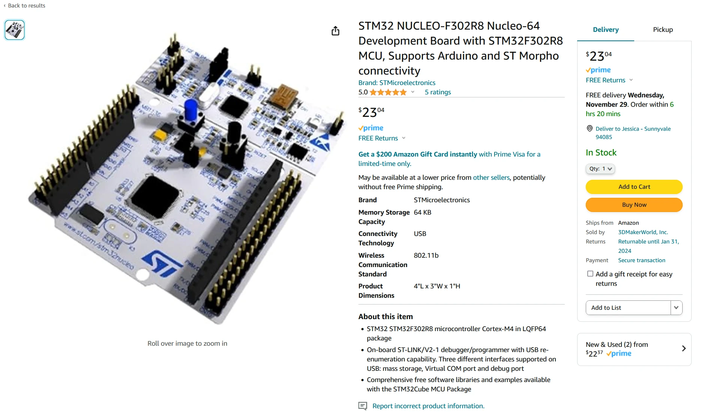
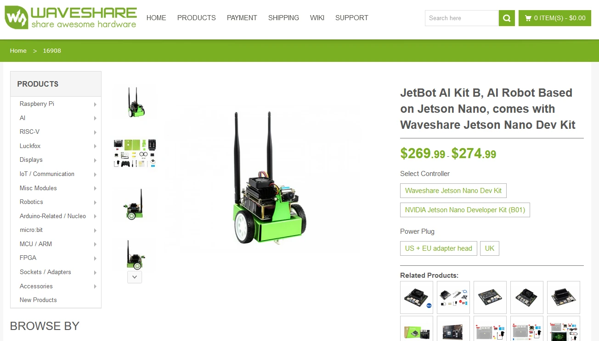
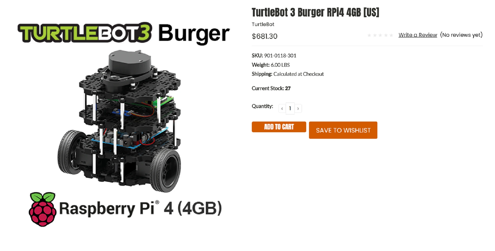

This post is all about my advice on getting started as a Robotics Software Engineer. I want to tell you a little of my journey to get to this point, then what you should do to practise and give yourself the best start possible.

If you prefer a video format, check out my YouTube video below:

<iframe class="youtube-video" src="https://www.youtube.com/embed/tkYZmw8x-SM?si=bisw0KJiTccKzEGg" title="YouTube video player" frameborder="0" allow="accelerometer; autoplay; clipboard-write; encrypted-media; gyroscope; picture-in-picture; web-share" allowfullscreen></iframe>

## Who is this post for?

This post is aimed at absolute beginners. If you've seen Boston Dynamics robots [running through assault courses](https://bostondynamics.com/atlas/) or [automated drone deliveries](https://www.aboutamazon.com/news/tag/prime-air) and thought, "this is the kind of stuff that I want to work on my whole career" - this post is for you.

Robotics contains a lot of engineering disciplines. If you're interested in the intelligence behind a robot - the way it messages, figures out where it is and where to go, and how it makes decisions - this post is for you.

With that said, if you're interested in building your own arm, 3D printed parts, or printed circuit boards, this post isn't likely to be much help to you. Feel free to read through anyway!

<figure>

<figcaption>[Atlas Gets a Grip | Boston Dynamics by Boston Dynamics](https://www.youtube.com/watch?v=-e1_QhJ1EhQ)</figcaption>
</figure>

## Who am I?

I'm a Software Development Engineer focused on robotics. I have a master's degree in Electrical & Electronic Engineering from Imperial College London in the UK. I have 11 years experience in software engineering, with 7 years of that specialising in robotics.

Throughout my career, I've worked on:

1. A robot arm to cook steak and fries
1. A maze-exploring rover
1. A robot arm to tidy your room by picking up pens, toys, and other loose items
1. [Amazon Scout](https://en.wikipedia.org/wiki/Amazon_Scout), a delivery rover

That's to name just a few! Suffice to say, I've worked on a lot of different projects, but I'm not a deep expert in any particular field. What I specialise in now is connecting robots to the cloud and getting value from it. That's why I'm working for Amazon Web Services as a Senior Software Development Engineer specialised in robotics. With that history, I'm a good person for getting you started in the world of robotics - starting with the hardware you need.

## What hardware do you need?

Thankfully, not a lot! All you really need to get going is a computer. It doesn't need to be especially powerful while you're learning. If you want to be able to run simulations, a GPU will help, but you don't *need* one.

For the operating system (OS), you'll have a slightly easier time if it's running Linux or Mac OS, but Windows is very close to being as good because of great steps in recent years building the Windows Subsystem for Linux (WSL2). It's basically a way of running Linux insides your Windows computer. Overall, any OS will work just fine, so don't sweat this part.

That's all you need to get started, because the first step to becoming a software engineer for robotics is the software engineer part. You need to learn how to program.

## How should you learn to program?

### Pick a Language

First, pick a starting language. I do mean a starting language - a good way to think of programming languages is as tools in a toolbox. Each tool can perform multiple jobs, but there's usually a tool that's better suited for completing a given task. Try to fill out your toolbox instead of learning how to use one tool for every job.

Before you can fill out your toolbox, you need to start with one tool. You want to use your tools for robotics at some point, which helps narrow options down to [Python](https://www.python.org/) and [C++](https://cplusplus.com/) - those are the most common options in robotics. I would recommend Python, as it's easier to understand in the beginning, and learning to program is hard enough without the difficult concepts that come with C++. There are tons of tutorials online for starting in Python. I would recommend trying a [Codecademy](https://www.codecademy.com/) course, which you can work through to get the beginning concepts.

Once you grasp the concepts, it's time to practise. The important part to understand here is that programming is a different way of thinking - you need to *train your brain*. You will have to get used to the new concepts and fully understand them before you can use them without thinking about them.

To practise, you could try [Leetcode](https://leetcode.com/) or [Project Euler](https://projecteuler.net/), but those are puzzles in problem-solving or teach computer science concepts, and they aren't the best tool for learning a language in my eyes. I believe that the best way to learn is to come up with a project idea and build it. It doesn't have to be in robotics. You could build a text-based RPG, like:

```
$ You are in a forest, what do you do?
1. Go forward
2. Look around
>>> 
```

Or, you could build a text-based pokemon battle simulator, where you pick a move that damages the other pokemon. The important part is that the project is something you're interested it - that's what will motivate you to keep building it and practising.

:::tip

Try writing some post-it notes of features you want to add to your project and stick them on the wall. Try to complete one post-it note before starting another.

:::

Spend time building your project. Look online for different concepts and how they can fit your project. Use sites like [Stack Overflow](https://stackoverflow.com/) to help if you get stuck. If you can, find someone with more experience who's able to help guide you through the project. You can ask people you know or look online for help, like joining a discord community. There will be times when you're absolutely stumped as to why your project isn't working, and while you could figure it out yourself eventually, a mentor would not only help you past those issues more quickly but also teach you more about the underlying concept.

In essence, that's all you have to do. Get a computer, pick a language, and build a project in it. Look at tutorials and forums online when you get stuck, and find a mentor if you can. If you do this for a while, you'll train your brain to use programming concepts as naturally as thinking.

### Other Tools

On top of Python, a couple of tools that you need to learn:

1. Version control
1. Linux Terminal

#### Version Control

Version control is software that allows you to store different versions of files and easily switch between them. Every change to the file can be "committed" as a new version, allowing you to see the differences between every version of your code. There's a lot more it can do, and it is absolutely invaluable to software developers.

[Git](https://git-scm.com/) is by far the most commonly used version control software. Check out a course on how to use it, then get into the havit of committing code versions whenever you get something working - you'll thank yourself when you break your code and can easily reset it to a working version with the tool.

#### Linux Terminal

The Linux Terminal is a way of typing commands for the computer to execute. You will be using the Terminal extensively when developing software. You don't need a course to learn it, but when you do have to write commands in the terminal, try not to just copy and paste it without looking at the command - read through it and figure out what it's doing. Pretty soon, you'll be writing your own commands.

:::tip

Use Ctrl+R to search back through history for a command you've already executed and easily run it again.

:::

### Work with Others

You don't just have to learn alone - it is hugely helpful to learn from other people. You could look into making a project with friends or an online community, or better yet, join a robotics competition as part of a team.

If you practise enough with what I've told you here, you'll also be eligible for internships. Look around and see what's available. Try to go for companies with experienced software engineers to learn from, and if you're successful in your application, learn **as much as you can** from them. Software development as a job is very different from doing it at home, and you will learn an incredible amount from the people around you and the processes that the company uses.

## What about robots?

So far, we've not talked about robots very much. Getting a solid ground in programming is very important before going on to the next step. But, once you have the basics, this part is how to get going with programming robots.

### Robot Operating System (ROS)

The best starting point is [ROS](https://www.ros.org/). This is the most popular robotics framework, although far from the only one. It is free, will run on any system, and has a ton of tools available that you can learn from. Also, because it's the most popular, there's a lot of help available when you're struggling. Follow the documentation, install it on your system, and get it passing messages around. Then understand the publish and subscribe system it uses for messages - this is crucial for robotics in general. The resources [on this blog](https://mikelikesrobots.github.io/docs/getting-started/intro) can help, or you can think of a project you want to build in ROS. Start small, like getting a robot moving around with an Xbox controller: you'll learn pretty quickly during this process that developing robots is really difficult, so set achievable goals for yourself!

### Simulation

If you want to work with robots in simulation, that's great! You can get going with just your computer. You need to understand that it's incredibly difficult to make robots behave the same in simulation as they do in real life, so don't expect it to transfer easily. However, it is better for developing robotics software quickly - it's faster to run and quicker to reset, so it's easier to work with. Because of that, it's a valuable skill to have.

If you're looking for somewhere to start, there are a few options. [Gazebo](https://gazebosim.org/home) is well-known as a ROS simulation tool, but there are also third party simulation software applications that still support ROS. I would start by looking at either [NVIDIA Isaac SIM](https://developer.nvidia.com/isaac-sim) or [O3DE](https://o3de.org/) - both are user-friendly applications that would be a great starting point.

<figure>

<figcaption>[NVIDIA - Narrowing the Sim2Real Gap with NVIDIA Isaac Sim](https://www.youtube.com/watch?v=VW-dOMBFj7o)</figcaption>
</figure>

### Embedded

As far as embedded development goes, I consider this optional - but helpful. It's good for understanding how computers work, and you may need it if you want to get closer to the electronics. However, I don't think you *need* it; most programming is on development kits, like Raspberry Pi and Jetson Nano boards. These are running full Linux operating systems, so you don't need to know embedded to use them. If you do want to learn embedded, consider buying a development kit - I would recommend a NUCLEO board ([example here](https://www.amazon.com/NUCLEO-F302R8-Nucleo-64-Development-STM32F302R8-connectivity/dp/B07JQYW5V4)) - and work with it to understand how UART, I2C, and other serial communications work, plus operating its LEDs. If you want more advice, let me know.

<figure>

<figcaption>[NUCLEO-F302R8 Product Page on Amazon](https://www.amazon.com/NUCLEO-F302R8-Nucleo-64-Development-STM32F302R8-connectivity/dp/B07JQYW5V4)</figcaption>
</figure>


### Real Robot Hardware

How about real robots? This is a bit of an issue - a lot of the cheaper robots you see don't have good computers running on them. You want to find something with at least a Raspberry Pi or Jetson Nano making it work, and that's getting into the hundreds of dollars. It's possible to go cheaper, like with an $80 kit and a $20 board bought separately - but I wouldn't recommend that for a beginner; it's a lot harder to get working. If you are interested in a kit that you can add your own board to, take a look at the [Elegoo Robot Kit on Amazon](https://www.amazon.com/ELEGOO-Tracking-Ultrasonic-Intelligent-Educational/dp/B07KPZ8RSZ).

My recommended option here would be the [JetBot](https://www.waveshare.com/jetbot-ai-kit.htm) that I've already been making [blogs](/blog/tags/jetbot) and [videos](https://www.youtube.com/playlist?list=PLBrq1OKRHMwXE9nNaaN7SMofoYJcqAqCj) about. It should run up just under $300, and comes with everything you need to start making robotics applications. There will also be a lot of resources and videos on it to get it going.

<figure>

<figcaption>[WaveShare JetBot Product Information](https://www.waveshare.com/jetbot-ai-kit.htm)</figcaption>
</figure>

If your budget is a bit higher and you want something more advanced, you could take a look at Turtlebot, like a [Turtlebot Burger](https://www.robotis.us/turtlebot-3-burger-rpi4-4gb-us/). That will cost nearer $700, but also comes with a Lidar, which is great for mapping its environment.

<figure>

<figcaption>[Turtlebot 3 Burger RPi4](https://www.robotis.us/turtlebot-3-burger-rpi4-4gb-us/)</figcaption>
</figure>

If your budget is lower than a JetBot, I would recommend either working in simulation or trying to build your own robot. Building your own will be a lot tougher and take a lot longer, but you should learn quite a bit from it too.

## Some Final Advice

Before finishing up this post, I wanted to give some more general advice.

First, look for and use every resource you have available to you. Look online, ask people, work in the field; anything you can to make your journey easier.

Second, you should *get a mentor*. This is related to the first point, but it's so important. Find someone you can respect and learn as much as you can from them. This is really the secret to learning a lot - use others' experience to jump ahead instead of learning it yourself the slow, hard way. Finding the right mentor can be a challenge, and you may need to go through a few people before you get to the most helpful person, so be prepared!

I'm sure there's a lot more advice I could give you, but this is my best advice for beginners. At this stage, you need to learn how to learn - finding resources and taking advantage of them. It is the best possible foundation you can give yourself for the rest of your career.
