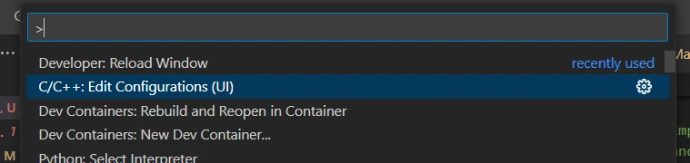
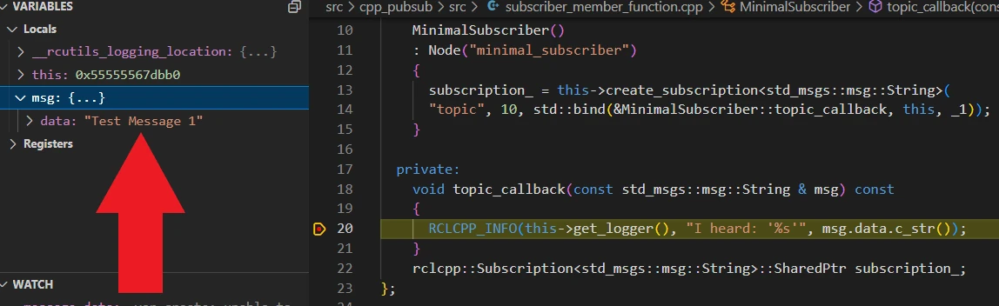

This post is about how beginners can make the most out of every tutorial by digging deep into the code to understand it. This is the best foundation you can give yourself for continuing to work on the code and making your own modifications. It follows on from [Getting Started as a Robotics Software Engineer!](/blog/getting-started-robot-sw-eng/), where I give the advice: 

> First, look for and use every resource you have available to you. Look online, ask people, work in the field; anything you can to make your journey easier.

Following on from that, I wanted to show how to take a tutorial and use various resources to understand what's happening in the provided code. I'll take the tutorial from ROS about [writing a simple publisher/subscriber](https://docs.ros.org/en/humble/Tutorials/Beginner-Client-Libraries/Writing-A-Simple-Cpp-Publisher-And-Subscriber.html), and I'll use C++ to build it, as this is less well-known than Python and so a better way to demonstrate self-learning.

If you'd prefer to follow along, I've built a video demonstrating everything in this article, available here:

<iframe class="youtube-video" src="https://www.youtube.com/embed/Isk6Uh_i-8s?si=dkFYHbCkgh6CE70c" title="YouTube video player" frameborder="0" allow="accelerometer; autoplay; clipboard-write; encrypted-media; gyroscope; picture-in-picture; web-share" allowfullscreen></iframe>

<!-- truncate -->

To understand the tutorial code, we'll be using the following resources:
1. [Version control (git)](#using-source-control-to-your-advantage) - to check the differences between versions and understand what's changed
1. [Explaining the code](#try-to-explain-the-code) - try to explain as much of the code as you can, either in comments or out loud to someone or something else.
1. [Setting up your IDE](#using-the-ide) - using your editor to help you move around the code and look up parts of it will help you find out what's going on.
1. [Using online resources](#using-online-resources) - tutorials, blogs, videos, and a number of other resources can help explain parts that you don't understand up to this point.
1. [Debugging](#debugging) - using a debugger to attach to running code and stop it to interrogate variables and step through each line.
1. [Testing](#testing-advanced) - using unit tests to check your understanding or set up simple test cases to focus on a particular area of code.

## Using Source Control to your advantage

This isn't strictly speaking about understanding your code - what it does do is help you get back to a known state, and see what's changed since then. Let's follow the tutorial until there's a blank project checked out, then commit our progress using Git.

### Installing Git

First, we need to install Git and do some configuration. Follow the [install instructions](https://git-scm.com/book/en/v2/Getting-Started-Installing-Git), then set up your username and e-mail address:

```bash
# Replace with your username and email!
git config --global user.name "Mike Likes Robots"
git config --global user.email "mikelikesrobots@outlook.com"
```

### Committing the template project

Follow the tutorial up until [Create a package](https://docs.ros.org/en/humble/Tutorials/Beginner-Client-Libraries/Writing-A-Simple-Cpp-Publisher-And-Subscriber.html#create-a-package), then execute the `pkg create` command:

```bash
ros2 pkg create --build-type ament_cmake --license Apache-2.0 cpp_pubsub
```

Once this is done, let's stop and commit our progress:

```bash
cd cpp_pubsub
# This initializes a git repository
git init
git add --all
git commit -m "Initial commit"
```

### Checking Git Status

Our project is now in source control. If we check the status now, we should see that there are no changes:

```bash
$ cd ~/dev_ws/src/cpp_pubsub
$ git status
On branch main
nothing to commit, working tree clean
```

Great! There are no file changes since the last commit. Try running this command again after changing a file!

### Adding New Files

Let's follow through the next few steps - work through the whole of [step 2](https://docs.ros.org/en/humble/Tutorials/Beginner-Client-Libraries/Writing-A-Simple-Cpp-Publisher-And-Subscriber.html#write-the-publisher-node). From here, we can run git status again and see some changes.

```bash
$ git status
On branch main
Changes not staged for commit:
  (use "git add <file>..." to update what will be committed)
  (use "git restore <file>..." to discard changes in working directory)
        modified:   CMakeLists.txt
        modified:   package.xml

Untracked files:
  (use "git add <file>..." to include in what will be committed)
        src/

no changes added to commit (use "git add" and/or "git commit -a")
```

Git tracks files, but won't track empty folders, so adding the new source file tells git that the `src` folder exists. As the whole file is new, we won't take a look, but we can take a look at the `package.xml` changes to see what has been updated:

```bash
# Tell me the difference between this file and the last committed version
$ git diff package.xml
diff --git a/package.xml b/package.xml
index 909dca9..5504dc9 100644
--- a/package.xml
+++ b/package.xml
@@ -12,6 +12,9 @@
   <test_depend>ament_lint_auto</test_depend>
   <test_depend>ament_lint_common</test_depend>
 
+  <depend>rclcpp</depend>
+  <depend>std_msgs</depend>
+
   <export>
     <build_type>ament_cmake</build_type>
   </export>
```

The plus signs tell us that lines have been added. If there were any minus signs, that shows the line has been deleted. So not only can we restore a previous version of a file (or even the whole project), we can see the exact changes that have happened!

Any time we get something working, we should make sure to commit it so we can compare against it later. Let's do that now:

```bash
$ git add --all
# Use a meaningful commit message - not just "made changes"
$ git commit -m "Add talker node"
```

Now we can carry on with the tutorial!

## Try to Explain the Code

At this point, you should read through the only source file and see how much of it you understand. But, not only should you understand it - you should be able to *explain* it. For each line, see if you can write a comment above the line with exactly what is happening. You could also do "rubber duck debugging" - take a rubber duck (or another toy), and tell the duck what the code is doing *in detail*. This is to force you to slow down and read each line thoroughly instead of skimming over lines you think you understand.

Let's take an example from the code and explain it together.

```cpp
// Gives access to time-related functions
#include <chrono>
// Functional?
#include <functional>
// Gives access to smart pointers
#include <memory>
// Gives access to string functions like string length, string concatenation
#include <string>
```

Work through the file and see how much of it you understand just from reading the tutorial. Even in the block above, it's not very clear what `#include <functional>` does - let's see if we can use our IDE to explain it.

## Using the IDE

IDE stands for Integrated Development Environment, which means a set of tools to help development integrated into one place. There are a few examples with different amounts of setup required, such as:

1. [Visual Studio Code (aka VSCode)](https://code.visualstudio.com/)
1. [CLion (or other JetBrains IDEs)](https://www.jetbrains.com/clion/)
1. [NeoVim](https://neovim.io/)

These just to name a few - there are a great many IDEs out there, and you should experiment to find the one you prefer. The ones I've listed here are some of the most popular in my experience, but I would recommend using VSCode with the [C/C++ extensions](https://code.visualstudio.com/docs/languages/cpp).

Using an IDE will help us to look up functions and variables more easily, highlight issues in the code, and run everything all in one place - including a [debugger](#debugging). In this case, if I open the project in VSCode, I can right click on `<functional>` and Go To Definition:


This is hugely complicated! We're not getting the information we need from the IDE here. Let's take another example - hover over the `using namespace std::chrono_literals` line and wait for the explanation:


That's much more help! Now we can see that this line helps define time periods, like the `500ms` on line 38. We are getting some red underlines in the same image though - this is the IDE telling us that something is wrong. In this case, the IDE can't find the two underlined files that the code is trying to access, even though the build system can; it just means that the IDE isn't working properly. We can do some configuration to solve this error by pressing Ctrl+Shift+P (on Windows/Linux) and searching for C/C++ configuration:



Then scroll down to the Include path section and add `/opt/ros/humble/setup.bash`:


Success! Our red squiggles have disappeared. That's our IDE configured. Try typing some code into functions and see the autocomplete working!

## Using Online Resources

The IDE explained chrono literals for us - but what about that functional header? This is where we need to leave the IDE and get some extra information. Here are a few examples of resources available online that you can use to supplement your understanding:

1. **Documentation:** in particular for ROS2, the [ROS2 docs](https://docs.ros.org/en/humble/index.html) are extensive and have a lot of guides to get you started.
1. **Tutorials:** plenty of articles exist to get you started with tutorials. This blog post alone uses two tutorials - [Writing a simple publisher and subscriber (C++)](https://docs.ros.org/en/humble/Tutorials/Beginner-Client-Libraries/Writing-A-Simple-Cpp-Publisher-And-Subscriber.html) and [Writing Basic Tests with C++ with GTest](https://docs.ros.org/en/humble/Tutorials/Intermediate/Testing/Cpp.html). With tutorials, try not to go through the steps until they work - take the time to understand what's going on, and read the explanations.
1. **Open Source Examples:** there are plenty of open source projects in general that can help provide examples for how to do something. For example, [Husky](https://github.com/husky/husky/tree/humble-devel) has a lot of ROS2 code showing how to organize packages, write launch files, write tests, and so on. It can be very difficult to enter someone else's project, so my advice here is to figure out the project structure, then search for the specific thing you're looking for. Understanding a full package with no help takes a long time, even for seasoned developers.
1. **Blogs/Videos/Podcasts:** these are great for general knowledge about coding or for searching for a specific thing to learn. I recommend finding blogs, video channels, or podcasts that cover interesting topics with good explanations, then follow those resources for new updates. I like [Joel on Software](https://www.joelonsoftware.com/) as a general blog, and [Articulated Robotics](https://www.youtube.com/@ArticulatedRobotics) gives great explanations while going through examples.
1. **Forums:** sites like [Stack Overflow](https://stackoverflow.com/) and [Reddit](https://www.reddit.com/) can directly answer your questions, or have many previously answered questions that may help with your issue. Don't be afraid to post your own question! Folks on these sites are there to help. One tip if you do post a question is to make a small example of your problem and include it in your post so others can instantly see what the issue is. If you don't provide enough information, or you ask a question with an answer that's easily found through a Google search, you won't get a good reception.
1. **Online courses:** sites like [Codecademy](https://www.codecademy.com/catalog/language/python) and [LeetCode Explore](https://leetcode.com/explore/) have courses available to guide you through different languages and concepts, explaining every step along the way. These are great to build a great foundation and understand what you're reading and writing better.
1. **Coding challenges:** sites like [LeetCode](https://leetcode.com/problemset/) and [Project Euler](https://projecteuler.net/) provide sample problems that need you to write code in order to solve them. They're good practice and good fun too! My particular favorite is the [Advent of Code](https://adventofcode.com/), which runs every year during advent, and I try to keep up with until I inevitably run out of time and give up on (normally about 11 days in).
1. **AI:** the recent surge of GenAI technologies has an amazing benefit to coders, as it can explain tricky concepts. Any part of the code you don't understand, you can usually just plug it in to [ChatGPT](https://chat.openai.com/) and get a thorough explanation. There are also coding companions, like Amazon CodeWhisperer, which suggest lines of code while you're programming so you don't need to look up everything in documentation - which can be a significant speedup!

Find the resources that suit you best, and keep them available when you're trying to understand the code. In this case, we can find the [C++ reference guide for the functional header](https://en.cppreference.com/w/cpp/header/functional), which explains that our header is likely to give access to the `std::bind` expression in our code.

See if you can go through every line in the code and explain it thoroughly. Even if you can explain it, it's still worth checking through the next sections on [debugging](#debugging) and [testing](#testing-advanced) to understand the flow of the code.

## Debugging

Broadly speaking, debugging is the process of finding and correcting issues in your code, but there's a special tool called a debugger that is REALLY helpful with this process. A debugger can be used to pause actively running code and let you look inside!

You can use a debugger to stop the code at a particular line, or when a variable has a particular value, or when a line has been "hit" a certain number of times - all from within your IDE. You can also step through, line by line, to see how the variables are changing. Let's try it out in our simple talker.

:::tip

A common method of debugging is to add print/log statements throughout your code and then run the code. This is effective a lot of the time, but doesn't give you the same amount of control as a full debugger, so it is still well worth learning!

:::

### Setting up the Debugger

Normally for a project with a standard build system, it's fairly easy to set up debugging. For our system, as it's using `colcon build`, there's a couple of extra configuration steps to go through.

First, open up the debug menu. Select "create a launch.json file".


Select the C++ (GDB/LLDB) option. This will open a blank file with no configuration, like this:

```json
{
  // Use IntelliSense to learn about possible attributes.
  // Hover to view descriptions of existing attributes.
  // For more information, visit: https://go.microsoft.com/fwlink/?linkid=830387
  "version": "0.2.0",
  "configurations": []
}
```

### Install GDB

We will be using `gdb` as a debugger, which means we will need to install it:

```bash
sudo apt install gdb
```

### Add Debugger Launch Configuration

With that installed, we can add a new configuration for debugging our talker. Click the Add Configuration button in the bottom right and select C/C++: (gdb) Launch.


This will create a template launch file. Now change the program entry to `"${workspaceFolder}/install/cpp_pubsub/lib/cpp_pubsub/talker"`. Once finished, your debug configuration file should look like this:

```json
{
    // Use IntelliSense to learn about possible attributes.
    // Hover to view descriptions of existing attributes.
    // For more information, visit: https://go.microsoft.com/fwlink/?linkid=830387
    "version": "0.2.0",
    "configurations": [
        {
            "name": "(gdb) Launch",
            "type": "cppdbg",
            "request": "launch",
            "program": "${workspaceFolder}/install/cpp_pubsub/lib/cpp_pubsub/talker",
            "args": [],
            "stopAtEntry": false,
            "cwd": "${fileDirname}",
            "environment": [],
            "externalConsole": false,
            "MIMode": "gdb",
            "setupCommands": [
                {
                    "description": "Enable pretty-printing for gdb",
                    "text": "-enable-pretty-printing",
                    "ignoreFailures": true
                },
                {
                    "description": "Set Disassembly Flavor to Intel",
                    "text": "-gdb-set disassembly-flavor intel",
                    "ignoreFailures": true
                }
            ]
        }

    ]
}
```

That's the debug configuration done - time to build and debug.

### Build with Debug Information

One more thing to bear in mind is that we have to build with debug information enabled - this is how the debugger can tell which line corresponds to which part of the running code. We can do this by using a different build command - instead of `colcon build`, we will instead use:

```bash
colcon build --symlink-install --cmake-args -DCMAKE_BUILD_TYPE=RelWithDebInfo
```

Now we're ready to launch!

### Pausing on a Breakpoint

Let's tell our debugger to pause inside the timer callback function by adding a breakpoint. That's the red dot to the left of the line number. Open the `publish_member_function.cpp` file and click to the left of the line number to add the breakpoint - it will look like this:


Now launch the debugger with the green triangle in the debug menu:


The program should launch and hit your breakpoint. There's a lot of information here, so let's keep it simple: stepping through the code and watching the `message` variable change. Take a look at the debugger window:


In the top left, numbered 1, we can see the controls for stepping through the code. Number 2 shows the current value of the `message` object, which is empty at this point. Number 3 shows the point in the program where the debugger has stopped. Bonus: in the bottom left, there's a watch panel, where you can add specific variables to watch - I've added `count_` and `message.data` for easier viewing.

The controls for stepping through the code allow us to:
1. Resume - continue execution. Keeps running until another breakpoint is hit.
1. Step over - step to the next line.
1. Step into - if there is a function call, step into the function.
1. Step out - run to the end of the current function and step back out.
1. Stop - quit the program entirely.

We can also edit the breakpoint to have more control over when it stops. Right click the breakpoint and click Edit Breakpoint to see the options available - I'll leave these out for brevity.

Now we can click the step over button a few times to see the `message.data` variable update with the string that we're going to publish. We can also resume a few times to see the `count_` variable increment every time.

From this, we can stop the code, check what variables are doing, and look at the flow of the code. Any time we don't understand how code links together, or we're not sure what kind of data is passed around, debugging can tell us exactly!

However, if we're looking at code that requires a callback to do anything, it can be less convenient to run multiple different programs at the same time. For example, the other half of this tutorial is to create a listener node that listens for messages from the talker node - what happens if we only run the listener node? Nothing, because it doesn't have any messages to listen to. One way we can debug the subscriber code with the same data every single time is to use testing.

## Testing \[Advanced\]

[Testing](https://docs.ros.org/en/humble/Tutorials/Intermediate/Testing/Testing-Main.html) is an incredibly useful tool in software development. It doesn't just mean verifying the code works correctly at the time of writing - the tests can be run automatically for any future update to ensure that the code doesn't break in unexpected places. In this case, we're looking at understanding the code, so you're not likely to be writing your own complete test suite - instead, we'll set up one test that will let us check how the listener node works without having to run the talker node at all!

:::note

This is a more advanced way of diving deeper into a file. It's very useful once you can get it working, but can be difficult to set up.

:::

### Adding Tests to the Listener

First, to get this working, we need to download the listener file. Follow the tutorial to the end of [step 4](https://docs.ros.org/en/humble/Tutorials/Beginner-Client-Libraries/Writing-A-Simple-Cpp-Publisher-And-Subscriber.html#build-and-run) - and remember to commit your code once you're sure it works!

With the new node downloaded and working, we're next going to hack our subscriber source file a bit by changing the main function to GTest if a particular symbol is defined. That basically means we can compile the file twice and get two different outcomes depending on how we set up the compiler. Replace the subscriber source file with the following:

```cpp
#include <memory>

#include "rclcpp/rclcpp.hpp"
#include "std_msgs/msg/string.hpp"
using std::placeholders::_1;

class MinimalSubscriber : public rclcpp::Node
{
  public:
    MinimalSubscriber()
    : Node("minimal_subscriber")
    {
      subscription_ = this->create_subscription<std_msgs::msg::String>(
      "topic", 10, std::bind(&MinimalSubscriber::topic_callback, this, _1));
    }

  private:
    void topic_callback(const std_msgs::msg::String & msg) const
    {
      RCLCPP_INFO(this->get_logger(), "I heard: '%s'", msg.data.c_str());
    }
    rclcpp::Subscription<std_msgs::msg::String>::SharedPtr subscription_;
};

#ifndef DEBUG_TEST_MODE
int main(int argc, char * argv[])
{
  rclcpp::init(argc, argv);
  rclcpp::spin(std::make_shared<MinimalSubscriber>());
  rclcpp::shutdown();
  return 0;
}

#else
#include <gtest/gtest.h>

class RclCppRunner {
public:
  RclCppRunner(int* argc, char** argv) {
    rclcpp::init(*argc, argv);
  }
  ~RclCppRunner() {
    rclcpp::shutdown();
  }
};

class TestPublisher : public rclcpp::Node {
public:
  TestPublisher() : Node("test_publisher") {
    publisher_ = this->create_publisher<std_msgs::msg::String>("topic", 10);
  }
  void publish(const std::string contents) {
    auto message = std_msgs::msg::String();
    message.data = contents;
    publisher_->publish(message);
  }
private:
  rclcpp::Publisher<std_msgs::msg::String>::SharedPtr publisher_;
};

TEST(package_name, debug_listener)
{
  auto listener = std::make_shared<MinimalSubscriber>();
  TestPublisher talker;
  talker.publish("Test Message 1");
  rclcpp::spin_some(listener);
}

int main(int argc, char** argv)
{
  testing::InitGoogleTest(&argc, argv);
  RclCppRunner runner(&argc, argv);

  return RUN_ALL_TESTS();
}

#endif
```

:::tip

A useful resource for learning how the testing works here is from the [ROS2 documentation on writing tests](https://docs.ros.org/en/humble/Tutorials/Intermediate/Testing/Cpp.html). We're not following this because the test is only temporary - we're going to remove it once we understand the code.

:::

### Compiling our Test Function

We also need to set up the `CMakeLists.txt` to compile the file differently so we can run our test. To do that, add the following to the end of the `CMakeLists.txt` file:

```cmake
if(BUILD_TESTING)
  find_package(ament_cmake_gtest REQUIRED)
  ament_add_gtest(${PROJECT_NAME}_tutorial_test src/subscriber_member_function.cpp)
  target_include_directories(${PROJECT_NAME}_tutorial_test PUBLIC
    $<BUILD_INTERFACE:${CMAKE_CURRENT_SOURCE_DIR}/include>
    $<INSTALL_INTERFACE:include>
  )
  ament_target_dependencies(${PROJECT_NAME}_tutorial_test
    rclcpp
    std_msgs
  )
  target_compile_definitions(${PROJECT_NAME}_tutorial_test
    PRIVATE
    DEBUG_TEST_MODE
  )
endif()
```

Now we can run the build command again to build our new test file:

```bash
colcon build --symlink-install --cmake-args -DCMAKE_BUILD_TYPE=RelWithDebInfo
```

### Running the Test

From here, you can run the tests either using:

```bash
colcon test
colcon test-result --all
```

Or my preferred method for seeing the GTest output:
```bash
$ cd ~/dev_ws
$ ./build/cpp_pubsub/cpp_pubsub_tutorial_test 
[==========] Running 1 test from 1 test suite.
[----------] Global test environment set-up.
[----------] 1 test from package_name
[ RUN      ] package_name.debug_listener
[INFO] [1707940864.492059362] [minimal_subscriber]: I heard: 'Test Message 1'
[       OK ] package_name.debug_listener (31 ms)
[----------] 1 test from package_name (31 ms total)

[----------] Global test environment tear-down
[==========] 1 test from 1 test suite ran. (31 ms total)
[  PASSED  ] 1 test.
```

At this point, our subscriber printed a message saying it heard the Test Message. Great! We can even change the test message to whatever we want by changing the test:

```cpp
TEST(package_name, debug_listener)
{
  auto listener = std::make_shared<MinimalSubscriber>();
  TestPublisher talker;
  // Change the string in the following line
  talker.publish("Test Message 1");
  rclcpp::spin_some(listener);
}
```

Rebuild, and the new message will be used instead.

### Launch the Test with a Debugger

Finally, we can set up the debugger to run with our new test. Go back to the debug tab and add a new configuration. This time, the program name will be `${workspaceFolder}/build/cpp_pubsub/cpp_pubsub_tutorial_test`, and we will change the `name` to be something more meaningful as well. The end result is something like:

```json
{
    "name": "Launch tutorial test",
    "type": "cppdbg",
    "request": "launch",
    "program": "${workspaceFolder}/build/cpp_pubsub/cpp_pubsub_tutorial_test",
    "args": [],
    "stopAtEntry": false,
    "cwd": "${fileDirname}",
    "environment": [],
    "externalConsole": false,
    "MIMode": "gdb",
    "setupCommands": [
        {
            "description": "Enable pretty-printing for gdb",
            "text": "-enable-pretty-printing",
            "ignoreFailures": true
        },
        {
            "description": "Set Disassembly Flavor to Intel",
            "text": "-gdb-set disassembly-flavor intel",
            "ignoreFailures": true
        }
    ]
},
```

Now set a breakpoint on line 20 inside the `topic_callback` function and launch the debugger. It should break on the line and let you check the contents of the message!



Now we can write whatever test data we want, or write multiple tests with different data or testing different code paths.

### This seems complicated!

I don't disagree. Setting up debugging for compiled languages already gets a bit tricky, especially when the language strictly enforces if something is `private` or `public` - this isn't an issue we would be facing for Python! Python is much easier to debug, which is another reason it's a great choice for beginners.

With that said, once the initial setup is done, it becomes much easier to extend and get some really valuable information. It's certainly worth learning.

## Summary

In short, my advice is to try to thoroughly understand the code in a tutorial, rather than doing the minimum work to get it working. This will help you in the long run, even if it takes you more time now.

Use git to help you track changes and revert to working versions as you experiment. Thoroughly explain the code as you work through it, preferably out loud to a rubber duck. Use your IDE, debugger, and testing setup to help read and run the code so you can see how it works. Last of all, and perhaps most obviously, use all of the resources you can from online to learn more about the code and the technology around it - take a look at [my shortlist](#using-online-resources) to figure out the best option for your use case.

Good luck with your future tutorials!
