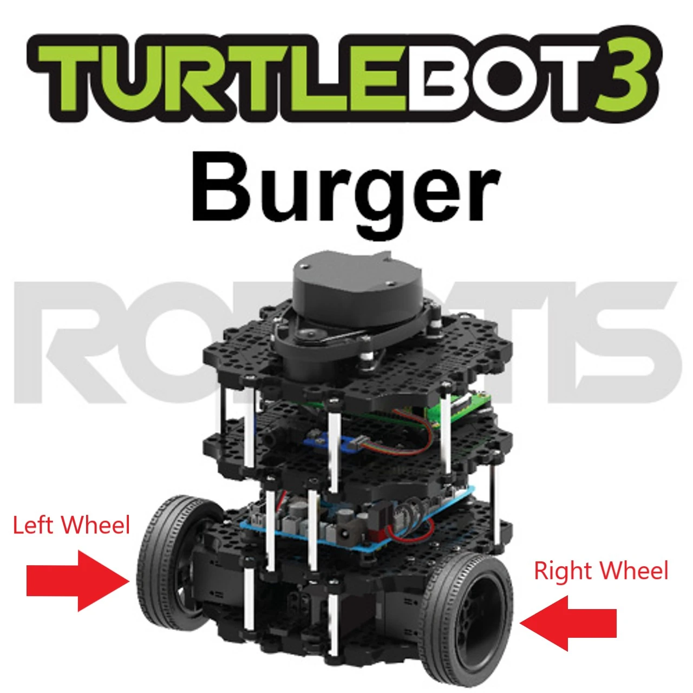
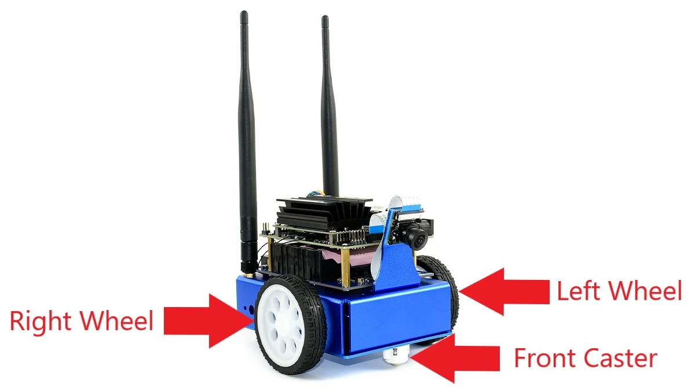

This is the second part of the "ROS2 Control with the JetBot" series, where I show you how to get a JetBot working with ROS2 Control! This is a sequel to the [part 1 blog post](/blog/jetbot-motors-pt2), where I showed how to drive the JetBot's motors using I<sup>2</sup>C and PWM with code written in C++.

In this post, I show the next step in making ROS2 Control work with the WaveShare JetBot - wrapping the motor control code in a System. I'll walk through some concepts, show the example repository for ROS2 Control implementations, and then show how to implement the System for JetBot and see it running.

This post is also available in video form - check the video link below if you want to follow along!

<iframe class="youtube-video" src="https://www.youtube.com/embed/2JJApj-PNVk?si=_nkaaluuLeg8ggnS" title="YouTube video player" frameborder="0" allow="accelerometer; autoplay; clipboard-write; encrypted-media; gyroscope; picture-in-picture; web-share" allowfullscreen></iframe>

<!-- truncate -->

## ROS2 Control Concepts

First, before talking about any of these concepts, there's an important distinction to make: [ROS Control](http://wiki.ros.org/ros_control) and [ROS2 Control](https://control.ros.org/master/index.html) are *different frameworks*, and are not compatible with one another. This post is focused on ROS2 Control - or as their documentation calls it, ros2_control.

ros2_control's purpose is to simplify integrating new hardware into ROS2. The central idea is to separate controllers from [systems, actuators, and sensors](https://control.ros.org/master/doc/getting_started/getting_started.html#hardware-components). A controller is responsible for controlling the movement of a robot; an actuator is responsible for moving a particular joint, like a motor moving a wheel. There's a good reason for this separation: it allows us to write a controller for a wheel configuration, without knowing which specific motors are used to move the wheels.

Let's take an example: the Turtlebot and the [JetBot](https://www.nvidia.com/en-us/autonomous-machines/embedded-systems/jetbot-ai-robot-kit/) are both driven using one wheel on each side and casters to keep the robots level. These are known as differential drive robots. 

<figure>

<figcaption>Turtlebot 3 Burger image edited from [Robotis](https://www.robotis.us/turtlebot-3-burger-us/)</figcaption>
</figure>

<figure>

<figcaption>WaveShare JetBot AI Kit image edited from [NVIDIA](https://www.nvidia.com/en-us/autonomous-machines/embedded-systems/jetbot-ai-robot-kit/)</figcaption>
</figure>

As the motor configuration is the same, the mathematics for controlling them is also the same, which means we can write one controller to control either robot - assuming we can abstract away the code to move the motors.

In fact, this is exactly what's provided by the [ros2_controllers](https://control.ros.org/master/doc/ros2_controllers/doc/controllers_index.html) library. This library contains several standard controllers, including our differential drive controller. We could build a JetBot and a Turtlebot by setting up this standard controller to be able to move their motors - all we need to do is write the code for moving the motors when commanded to by the controller.

ros2_control also provides the controller manager, which is used to manage resources and activate/deactivate controllers, to allow for advanced functionality like switching between controllers. Our use case is simple, so we will only use it to activate the controller. This architecture is explained well in the ros2_control documentation - see the [architecture page](https://control.ros.org/master/doc/getting_started/getting_started.html#architecture) for more information.

This post shows how to perform this process for the JetBot. We're going to use the I<sup>2</sup>C and motor classes from the [previous post in the series](/blog/jetbot-motors-pt2) to define a ros2_control system that will work with the differential drive controller. We use a System rather than an Actuator because we want to define one class that can control both motors in one `write` call, instead of having two separate Actuators.

## ROS2 Control Demos Repository

To help us with our ros2_control system implementation, the ros2_control framework has helpfully provided us with a [set of examples](https://control.ros.org/master/doc/ros2_control_demos/doc/index.html). One of these examples is exactly what we want - building a differential drive robot (or diffbot, in the examples) with a custom System for driving the motors.

The repository has a great many examples available. If you're here to learn about ros2_control, but not to build a diffbot, there are examples of building simulations, building URDF files representing robots, externally connected sensors, and many more.

We will be using [example 2](https://github.com/ros-controls/ros2_control_demos/tree/master/example_2) from this demo repository as a basis, but stripping out anything we don't require right now, like supporting simulation; we can return these parts in later iterations as we come to understand them.

## JetBot System Implementation

In this section, I'll take you through the key parts of my JetBot System implementation for ros2_control. The code is available on [Github](https://github.com/mikelikesrobots/jetbot-ros-control/tree/jetbot-motors-pt2) - remember that this repository will be updated over time, so select the tag `jetbot-motors-pt2` to get the same code version as in this article!

### Components are libraries, not nodes

ros2_control uses a different method of communication from the standard ROS2 publish/subscribe messaging. Instead, the controller will load the code for the motors as a **plugin library**, and directly call functions inside it. This is the reason we had to rewrite the motor driver in C++ - it *has* to be a library that can be loaded by ros2_control, which is written in C++.

Previously, we wrote an example node that span the wheels using the motor driver; now we are replacing this **executable** by a **library** that can be loaded by ros2_control. In CMakeLists.txt, we can see:

```cmake
add_library(${PROJECT_NAME}
  SHARED
  hardware/src/jetbot_system.cpp
  hardware/src/i2c_device.cpp
  hardware/src/motor.cpp
)

...

pluginlib_export_plugin_description_file(hardware_interface jetbot_control.xml)
```

These are the lines that build the JetBot code as a library instead of a system, and export definitions that show it is a valid plugin library to be loaded by ros2_control. A new file, `jetbot_control.xml`, tells ros2_control more information about this library to allow it to be loaded - in this case, the library name and ros2_control plugin type (SystemInterface - we'll discuss this more in the [Describing the JetBot](#describing-the-jetbot) section).

### Code Deep Dive

For all of the concepts in ros2_control, the actual implementation of a System is quite simple. Our `JetBotSystemHardware` class extends the SystemInterface class:

```cpp
class JetBotSystemHardware : public hardware_interface::SystemInterface {
```

In the private fields of the class, we create the fields that we will need during execution. This includes the `I2CDevice` and two `Motor` classes from the [previous post](/blog/jetbot-motors-pt1), along with two vectors for the hardware commands and hardware velocities:

```cpp
 private:
  std::vector<MotorPins> motor_pin_sets_;
  std::vector<Motor> motors_;
  std::shared_ptr<I2CDevice> i2c_device_;
  std::vector<double> hw_commands_;
  std::vector<double> hw_velocities_;
```

Then, a number of methods need to be overridden from the base class. Take a look at the [full header file](https://github.com/mikelikesrobots/jetbot-ros-control/blob/jetbot-motors-pt2/hardware/include/jetbot_control/jetbot_system.hpp) to see them, but essentially it boils down to three concepts:

1. `export_state_interfaces`/`export_command_interfaces`: report the state and command interfaces supported by this system class. These interfaces can then be checked by the controller for compatibility.
1. `on_init`/`on_activate`/`on_deactivate`: lifecycle methods automatically called by the controller. Different setup stages for the System occur in these methods, including enabling the motors in the `on_activate` method and stopping them in `on_deactivate`.
1. `read`/`write`: methods called every controller update. `read` is for reading the velocities from the motors, and `write` is for writing requested speeds into the motors.

From these, we use the `on_init` method to:

1. Initialize the base SystemInterface class
1. Read the pin configuration used for connecting to the motors from the parameters
1. Check that the provided hardware information matches the expected information - for example, that there are two velocity command interfaces
1. Initialize the `I2CDevice` and `Motor`s

This leaves the System initialized, but not yet activated. Once `on_activate` is called, the motors are enabled and ready to receive commands. The `read` and `write` methods are then repeatedly called for reading from and writing to the motors respectively. When it's time to shutdown, `on_deactivate` will stop the motors, and the destructors of the classes perform any required cleanup. There are more lifecycle states that could potentially be used for a more complex system - these are documented in the [ros2 demos repository](https://github.com/ros2/demos/blob/humble/lifecycle/README.rst).

This System class, plus the `I2CDevice` and `Motor` classes, are compiled into the plugin library, ready to be loaded by the controller.

### Describing the JetBot

The SystemInterface then comes into play when *describing* the robot. The `description` folder from the example contains the files that define the robot, including its ros2_control configuration, simulation configuration, and materials used to represent it during simulation. As this implementation has been pared down to basics, only the ros2_control configuration with mock hardware flag have been kept in.

The `jetbot.ros2_control.xacro` file defines the ros2_control configuration needed to control the robot. It uses `xacro` files to define this configuration, where `xacro` is a tool that extends XML files by allowing us to define macros that can be referenced in other files: 

```xml
<xacro:macro name="jetbot_ros2_control" params="name prefix use_mock_hardware">
```

In this case, we are defining a macro for the ros2_control part of the JetBot that can be used in the overall robot description.

We then define the ros2_control portion with type `system`:

```xml
<ros2_control name="${name}" type="system">
```

Inside this block, we give the path to the [plugin library](#code-deep-dive), along with the parameters needed to configure it. You may recognize the pin numbers in this section!

```xml
<hardware>
  <plugin>jetbot_control/JetBotSystemHardware</plugin>
  <param name="pin_enable_0">8</param>
  <param name="pin_pos_0">9</param>
  <param name="pin_neg_0">10</param>
  <param name="pin_enable_1">13</param>
  <param name="pin_pos_1">12</param>
  <param name="pin_neg_1">11</param>
</hardware>
```

This tells any controller loading our JetBot system hardware which pins are used to drive the PWM chip. But, we're not done yet - we also need to tell ros2_control the *command* and *state* interfaces available.

#### ros2_control Joints, Command Interfaces, and State Interfaces

ros2_control uses joints to understand what the movable parts of a robot are. In our case, we define one joint for each motor.

Each joint then defines a number of command and state interfaces. Each command interface accepts velocity, position, or effort commands, which allows ros2_control controllers to command the joints to move as it needs. State interfaces report a measurement from the joint out of velocity, position, or effort, which allows ros2_control to monitor how much the joint has actually moved and adjust itself. In our case, each joint accepts velocity commands and reports measured velocity - although we configure the controller to ignore the velocity, because we don't actually have a sensor like an encoder in the JetBot. This means we're using **open loop** control, as opposed to **closed loop** control.

```xml
<joint name="${prefix}left_wheel_joint">
  <command_interface name="velocity"/>
  <state_interface name="velocity"/>
</joint>
```

Closed loop control is far more accurate than open loop control. Imagine you're trying to sprint exactly 100 metres from a starting line, but you have to do it once blindfolded, and once again without a blindfold and line markings every ten metres - which run is likely to be more accurate? In the JetBot, there's no sensor to measure how much it has moved, so the robot is effectively blindfolded and guessing how far it has travelled. This means our navigation won't be as accurate - we are limited by hardware.

#### JetBot Description

With the ros2_control part of the JetBot defined, we can import and use this macro in the overall JetBot definition. As we've stripped out all other definitions, such as simulation parameters, this forms the only part of the overall JetBot definition:

```xml
<xacro:include filename="$(find jetbot_control)/ros2_control/jetbot.ros2_control.xacro" />
<xacro:jetbot_ros2_control
    name="JetBot" prefix="$(arg prefix)" use_mock_hardware="$(arg use_mock_hardware)"/>
```

Let's summarize what we've created so far:

1. A plugin library capable of writing commands to the JetBot motors
1. A ros2_control xacro file, describing the plugin to load and the parameters to give it
1. One joint per motor, each with a velocity command and state interface
1. An overall description file that imports the ros2_control file and calls the macro

Now when we use `xacro` to build the overall description file, it will import the ros2_control file macro and expand it, giving a complete robot description that we can add to later. It's now time to look at creating a controller manager and a differential drive controller.

### Creating A Controller

So far, we've defined a JetBot using description files. Now we want to be able to launch ros2_control and tell it what controller to create, how to configure it, and how load our defined JetBot. For this, we use the `jetbot_controllers.yaml` file.

We start with the controller_manager. This is used to load one or more controllers and swap between them. It also makes sure that resources are only used by one controller at a time and manages the change between controllers. In our case, we're only using it to load and run one controller:

```yaml
controller_manager:
  ros__parameters:
    update_rate: 10  # Hz

    jetbot_base_controller:
      type: diff_drive_controller/DiffDriveController
```

We tell the manager to update at 10Hz and to load the `diff_drive_controller/DiffDriveController` controller. This is the standard differential drive controller discussed earlier. If we take a look at the [information page](https://control.ros.org/master/doc/ros2_controllers/diff_drive_controller/doc/userdoc.html), we can see a lot of configuration for it - we provide this configuration in the same file.

We define that the controller is open loop, as there is no feedback. We give the names of the joints for the controller to control - this is how the controller knows it can send velocities to the two wheels implemented by our system class. We also set velocity limits on both linear and angular movement:

```yaml
linear.x.max_velocity: 0.016
linear.x.min_velocity: -0.016
angular.z.max_velocity: 0.25
angular.z.min_velocity: -0.25
```

These numbers are obtained through experimentation! ros2_control operates using target velocities specified in radians per second \[[source](https://answers.ros.org/question/242766/what-is-the-unit-of-the-commands-from-the-diff_drive_controller/)\]. However, the velocity we send to motors doesn't correspond to radians per second - the range of -1 to +1 is the minimum velocity up to maximum velocity of the motors, which change with the battery level of the robot. I obtained the numbers given through experimentation - these move the robot at a reasonable pace.

Finally, we supply the wheel separation and radius, specified in metres. I measured these from my own robot. The separation is the minimum separation between wheels, and the radius is from the centre of one wheel to the very edge:

```yaml
wheel_separation: 0.104
wheel_radius: 0.032
```

With this, we have described how to configure a controller manager with a differential drive controller to control our JetBot!

### Launching the Controller

The last step here is to provide a launch script to bring everything up. The example again provides us with the launch script, including a field that allows us to launch with mock hardware if we want - this is great for testing that everything loads correctly on a system that doesn't have the right hardware.

The launch script goes through a few steps to get to the full ros2_control system, starting with loading the [robot description](#describing-the-jetbot). We specify the path to the description file relative to the package, and use the `xacro` tool to generate the full XML for us:

```python
# Get URDF via xacro
robot_description_content = Command(
    [
        PathJoinSubstitution([FindExecutable(name="xacro")]),
        " ",
        PathJoinSubstitution(
            [FindPackageShare("jetbot_control"), "urdf", "jetbot.urdf.xacro"]
        ),
        " ",
        "use_mock_hardware:=",
        use_mock_hardware,
    ]
)
robot_description = {"robot_description": robot_description_content}
```

Following this, we load the [jetbot controller configuration](#creating-a-controller):

```python
robot_controllers = PathJoinSubstitution(
    [
        FindPackageShare("jetbot_control"),
        "config",
        "jetbot_controllers.yaml",
    ]
)
```

With the robot description and the robot controller configuration loaded, we can pass these to the [controller manager](#creating-a-controller):

```python
control_node = Node(
    package="controller_manager",
    executable="ros2_control_node",
    parameters=[robot_description, robot_controllers],
    output="both",
)
```

Finally, we ask the launched controller manager to start up the `jetbot_base_controller`:

```python
robot_controller_spawner = Node(
    package="controller_manager",
    executable="spawner",
    arguments=[
        "jetbot_base_controller",
        "--controller-manager",
        "/controller_manager",
    ],
)
```

All that remains is to build the package and launch the new launch file!

### ros2_control Launch Execution

This article has been written from the bottom up, but now we have the full story, we can look from the top down:

1. We launch the JetBot launch file defined in the package
1. The launch file spawns the **controller manager**, which is used to load controllers and manage resources
1. The launch file requests that the controller manager launches the differential drive controller
1. The differential drive controller loads the JetBot System as a plugin library
1. The System connects to the I2C bus, and hence, the motors
1. The controller can then command the System to move the motors as requested by ROS2 messaging

:::success

Hooray! We have defined everything we need to launch ros2_control and configure it to control our JetBot! Now we have a controller that is able to move our robot around.

:::

## Running on the JetBot

To try the package out, we first need a working JetBot. If you're not sure how to do the initial setup, I've created a video on exactly that:

<iframe class="youtube-video" src="https://www.youtube.com/embed/GdUGegYUOpM?si=b70pUlHgR4W7dNkI" title="YouTube video player" frameborder="0" allow="accelerometer; autoplay; clipboard-write; encrypted-media; gyroscope; picture-in-picture; web-share" allowfullscreen></iframe>

With the JetBot working, we can create a workspace and clone the code into it. Use VSCode over SSH to execute the following commands:

```bash
mkdir ~/dev_ws
cd ~/dev_ws
git clone https://github.com/mikelikesrobots/jetbot-ros-control -b jetbot-motors-pt2
cp -r ./jetbot-ros-control/.devcontainer .
```

Then use the Dev Containers plugin to rebuild and reload the container. This will take a few minutes, but the step is crucial to allow us to run ROS2 Humble on the JetBot, which uses an older version of Ubuntu. Once complete, we can build the workspace, source it, and launch the controller:

```bash
source /opt/ros/humble/setup.bash
colcon build --symlink-install
source install/setup.bash
ros2 launch jetbot_control jetbot.launch.py
```

This should launch the controller and allow it to connect to the motors successfully. Now we can use `teleop_twist_keyboard` to test it - but with a couple of changes.

First, we now expect messages to go to `/jetbot_base_controller/cmd_vel` topic instead of the previous `/cmd_vel` topic. We can fix that by asking `teleop_twist_keyboard` to remap the topic it normally publishes to.

Secondly, we normally expect `/cmd_vel` to accept [Twist](https://docs.ros2.org/galactic/api/geometry_msgs/msg/Twist.html) messages, but the controller expects [TwistStamped](https://docs.ros2.org/galactic/api/geometry_msgs/msg/TwistStamped.html) messages. There is a parameter for `teleop_twist_keyboard` that turns its messages into TwistStamped messages, but while trying it out I found that the node ignored that parameter. Checking it out from source fixed it for me, so in order to run the keyboard test, I recommend building and running from source:

```bash
git clone https://github.com/ros2/teleop_twist_keyboard
colcon build --symlink-install
source install/setup.bash
ros2 run teleop_twist_keyboard teleop_twist_keyboard \
    --ros-args \
    -p stamped:=true \
    -r /cmd_vel:=/jetbot_base_controller/cmd_vel
```

Once running, you should be able to use the standard keyboard controls written on screen to move the robot around. Cool!

Let's do one more experiment, to see how the configuration works. Go into the `jetbot_controllers.yaml` file and play with the maximum velocity and acceleration fields, to see how the robot reacts. Relaunch after every configuration change to see the result. You can also tune these parameters to match what you expect more closely.

That's all for this stage - we have successfully integrated our JetBot's motors into a ros2_control System interface!

## Next Steps

Having this setup gives us a couple of options going forwards.

First, we stripped out a lot of configuration that supported simulation - we could add this back in to support Gazebo simulation, where the robot in the simulation should act nearly identically to the real life robot. This allows us to start developing robotics applications purely in simulation, which is likely to be faster due to the reset speed of the simulation, lack of hardware requirements, and so on.

Second, we could start running a navigation stack that can move the robot for us; for example, we could request that the robot reaches an end point, and the navigation system will plan a path to take the robot to that point, and even face the right direction.

Stay tuned for more posts in this series, where we will explore one or both of these options, now that we have the robot integrated into ROS2 using ros2_control.
