This post shows how to build two simple functions, running in the cloud, using AWS Lambda. The purpose of these functions is the same - to update the status of a given robot name in a database, allowing us to view the current statuses in the database or build tools on top of it. This is one way we could coordinate robots in one or more fleets - using the cloud to store the state and run the logic to co-ordinate those robots.

This post is also available in video form - check the video link below if you want to follow along!

TODO: post video link

## What is AWS Lambda?

AWS Lambda is a service for executing serverless functions. That means you don't need to provision any virtual machines or clusters in the cloud - just trigger the Lambda with some kind of event, and your pre-built function will run. It runs on inputs from the event and could give you some outputs, make changes in the cloud (like database modifications), or both.

AWS Lambda charges based on the time taken to execute the function and the memory assigned to the function. The compute power available for a function scales with the memory assigned to it. We will explore this later in the post by comparing the memory and execution time of two Lambda functions.

In short, AWS Lambda allows you to build and upload functions that will execute in the cloud when triggered by configured events. Take a look at [the documentation](https://aws.amazon.com/lambda/) if you'd like to learn more about the service!

## How does that help with robot co-ordination?

Moving from one robot to multiple robots helping with the same task means that you will need a central system to co-ordinate between them. The system may distribute orders to different robots, tell them to go and recharge their batteries, or alert a user when something goes wrong.

This central service can run anywhere that the robots are able to communicate with it - on one of the robots, on a server near the robots, or in the cloud. If you want to avoid standing up and maintaining a server that is constantly online and reachable, the cloud is an excellent choice, and AWS Lambda is a great way to run function code as part of this central system.

Let's take an example: you have built a prototype robot booth for serving drinks. Customers can place an order at a terminal next to the robot and have their drink made. Now that your booth is working, you want to add more booths with robots and distribute orders among them. That means your next step is to add two new features:

1. Customers should be able to place orders online through a digital portal or webapp.
1. Any order should be dispatched to any available robot at a given location, and alert the user when complete.

Suddenly, you have gone from one robot capable of accepting orders through a terminal to needing a central database with ordering system. Not only that, but if you want to be able to deploy to a new location, having a single server per site makes it more difficult to route online orders to the right location. One central system in the cloud to manage the orders and robots is *perfect* for this use case.

## Building Lambda Functions

Convinced? Great! Let's start by building a simple Lambda function - or rather, two simple Lambda functions. We're going to build one Python function and one Rust function. That's to allow us to explore the differences in memory usage and runtime, both of which increase the cost of running Lambda functions.

All of the code used in this post is [available on Github](https://github.com/mikelikesrobots/lambda-iot-rule), with setup instructions in the [README](https://github.com/mikelikesrobots/lambda-iot-rule/blob/main/README.md). In this post, I'll focus on relevant parts of the code.

### Python Function

Firstly, what are the Lambda functions doing? In both cases, they accept a `name` and a `status` as arguments, attached to the `event` object passed to the handler; check the status is valid; and update a DynamoDB table for the given robot `name` with the given robot `status`. For example, in the [Python code](https://github.com/mikelikesrobots/lambda-iot-rule/blob/main/handlers/python-update-status/handler.py#L5-L11):

```python
def lambda_handler(event, context):
    # ...
    name = str(event["name"])
    status = str(event["status"])
```

We can see that the event is passed to the lambda handler and contains the required fields, `name` and `status`. If valid, the [DynamoDB table is updated](https://github.com/mikelikesrobots/lambda-iot-rule/blob/main/handlers/python-update-status/handler.py#L20-L30):

```python
ddb = boto3.resource("dynamodb")
table = ddb.Table(table_name)
table.update_item(
    Key={"name": name},
    AttributeUpdates={
        "status": {
            "Value": status
        }
    },
    ReturnValues="UPDATED_NEW",
)
```

### Rust Function

Here is the equivalent for checking the [input arguments for Rust](https://github.com/mikelikesrobots/lambda-iot-rule/blob/main/handlers/rust-update-status/src/main.rs#L6-L21):

```rust
#[derive(Deserialize, Debug, Serialize)]
#[serde(rename_all = "UPPERCASE")]
enum Status {
    Online,
}
// ...
#[derive(Deserialize, Debug)]
struct Request {
    name: String,
    status: Status,
}
```

The difference here is that Rust states its allowed arguments using an `enum`, so no extra code is required for checking that arguments are valid. The arguments are obtained by [accessing `event.payload` fields](https://github.com/mikelikesrobots/lambda-iot-rule/blob/main/handlers/rust-update-status/src/main.rs#L46-L48):

```rust
let status_str = format!("{}", &event.payload.status);
let status = AttributeValueUpdate::builder().value(AttributeValue::S(status_str)).build();
let name = AttributeValue::S(event.payload.name.clone());
```

With the fields obtained and checked, the [DynamoDB table can be updated](https://github.com/mikelikesrobots/lambda-iot-rule/blob/main/handlers/rust-update-status/src/main.rs#L49-L59):

```rust
let request = ddb_client
    .update_item()
    .table_name(table_name)
    .key("name", name)
    .attribute_updates("status", status);
tracing::info!("Executing request [{request:?}]...");

let response = request
    .send()
    .await;
tracing::info!("Got response: {:#?}", response);
```

### CDK Build

To make it easier to build and deploy the functions, the sample repository contains a CDK stack. I've talked more about Cloud Development Kit (CDK) and the advantages of Infrastructure-as-Code (IaC) in my video "From AWS IoT Core to SiteWise with CDK Magic!":

<iframe class="youtube-video" src="https://www.youtube.com/embed/9ZRZhrJFz7A?si=ZFBWN24xmXXWcDFH" title="YouTube video player" frameborder="0" allow="accelerometer; autoplay; clipboard-write; encrypted-media; gyroscope; picture-in-picture; web-share" allowfullscreen></iframe>

In this case, our CDK stack is building and deploying a few things:

1. The two Lambda functions
1. The DynamoDB table used to store the robot statuses
1. An IoT Rule per Lambda function that will listen for MQTT messages and call the corresponding Lambda function

The DynamoDB table comes from Amazon DynamoDB, another service from AWS that keeps a NoSQL database in the cloud. This service is also serverless, again meaning that no servers or clusters are needed.

There are also two IoT Rules, which are from AWS IoT Core, and define an action to take when an MQTT message is published on a particular topic filter. In our case, it allows robots to publish an MQTT message saying they are online, and will call the corresponding Lambda function. I have used IoT Rules before for inserting data into AWS IoT SiteWise; for more information on setting up rules and seeing how they work, take a look at the video I linked just above.

### Testing the Functions

Once the CDK stack has been built and deployed, take a look at the [Lambda console](https://us-west-2.console.aws.amazon.com/lambda/home). You should have two new functions built, just like in the image below:

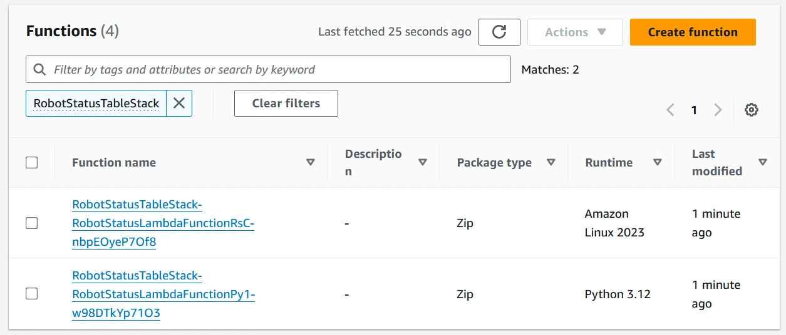

Great! Let's open one up and try it out. Open the function name that has "Py" in it and scroll down to the Test section (top red box). Enter a test name (center red box) and a valid input JSON document (bottom red box), then save the test. 

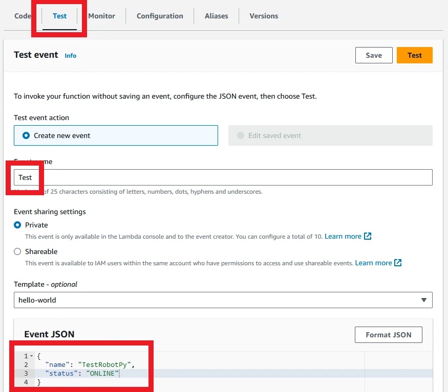

Now run the test event. You should see a box pop up saying that the test was successful. Note the memory assigned and the billed duration - these are the main factors in determining the cost of running the function. The actual memory used is not important for cost, but can help optimize the right settings for cost and speed of execution.

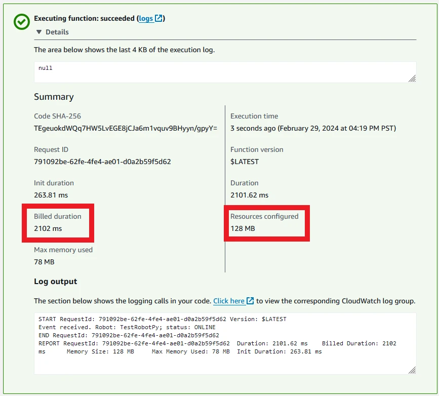

You can repeat this for the Rust function, only with the test event name changed to `TestRobotRs` so we can tell them apart. Note that the memory used and duration taken are significantly lower.

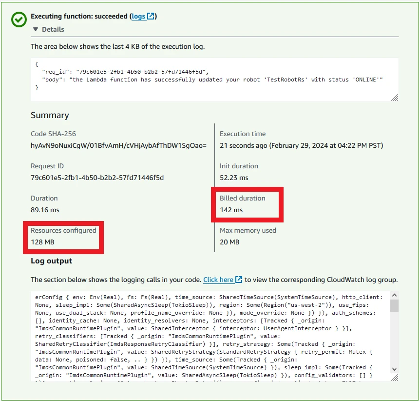

### Checking the Database Table

We can now access the DynamoDB table to check the results of the functions. Access the [DynamoDB console](https://us-west-2.console.aws.amazon.com/dynamodbv2/home) and click on the table created by the stack.

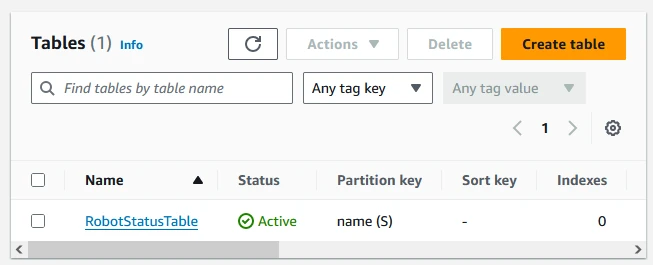

Select the button in the top right to explore items.

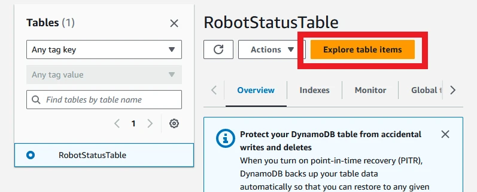

This should reveal a screen with the current items in the table - the two test names you used for the Lambda functions:

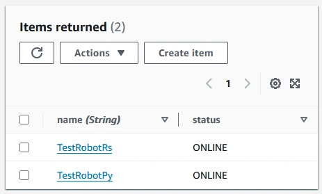

Success! We have used functions run in the cloud to modify a database to contain the current status of two robots. We could extend our functions to allow different statuses to be posted, such as OFFLINE or CHARGING, then write other applications to work using the current statuses of the robots, all within the cloud. One issue is that this is a console-heavy way of executing the functions - surely there's something more accessible to our robots?

### Executing the Functions

Lambda functions have a huge variety of ways that they can be executed. For example, we could set up an API Gateway that is able to accept API requests and forward them to the Lambda, then return the results. One way to check the possible input types is to access the Lambda, then click the "Add trigger" button. There are far too many options to list them all here, so I encourage you to take a look for yourself!

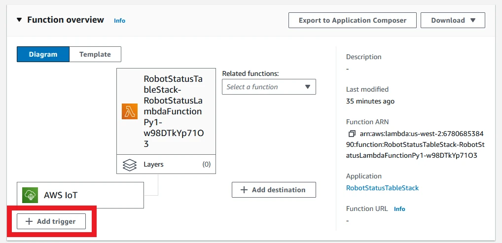

There's already one input for each Lambda - the AWS IoT trigger. This is an IoT Rule set up by the CDK stack, which is watching the topic filter `robots/+/status`. We can test this using either the MQTT test client or by running the test script in the sample repository:

```bash
./scripts/send_mqtt.sh
```

One message published on the topic will trigger both functions to run, and we can see the update in the table.

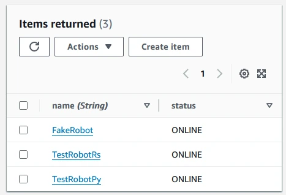

There is only one extra entry, and that's because both functions executed on the same input. That means "FakeRobot" had its status updated to ONLINE once by each function.

If we wanted, we could set up the robot to call the Lambda function when it comes online - it could make an API call, or it could connect to AWS IoT Core and publish a message with its ONLINE status. We could also set up more Lambda functions to take customer orders, dispatch them to robots, and so on - the Lambda functions and accompanying AWS services allow us to build a completely serverless robot co-ordination system in the cloud. If you want to see more about connecting ROS2 robots to AWS IoT Core, take a look at my video here:

<iframe class="youtube-video" src="https://www.youtube.com/embed/OnVewSeayjI?si=tGqH8sE93w_CzHUF" title="YouTube video player" frameborder="0" allow="accelerometer; autoplay; clipboard-write; encrypted-media; gyroscope; picture-in-picture; web-share" allowfullscreen></iframe>

## Lambda Function Cost

How much does Lambda cost to run? For this section, I'll give rough numbers using the [AWS Price Calculator](https://calculator.aws). We will assume a rough estimate of 100 messages per minute - that accounts for customer orders arriving, robots reporting their status when it changes, and orders are being distributed; in all, I'll assume a rough estimate of 100 messages per minute, triggering 1 Lambda function invocation each.

For our functions, we can run the test case a few times for each function to get a small spread of numbers. We can also edit the configuration in the console to set higher memory limits, to see if the increase in speed will offset the increased memory cost.

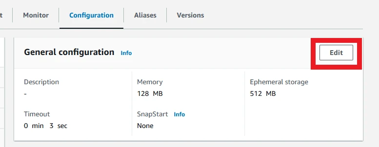

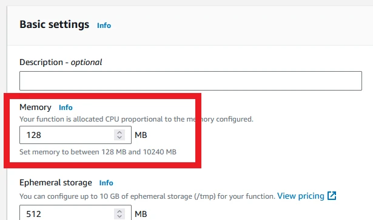

Finally, we will use an ARM architecture, as this currently costs less than x86 in AWS.

I will run a valid test input for each test function 4 times each for 3 different memory values - 128MB, 256MB, and 512MB - and take the latter 3 invocations, as the first invocation takes much longer. I will then take the median billed runtime and calculate the cost per month for 100 invocations per minute at that runtime and memory usage.

My results are as follows:

| Test | Python (128MB) | Python (256MB) | Python (512MB) | Rust (128MB) | Rust (256MB) | Rust (512MB) |
| ---- | -------------- | -------------- | --------------- | ------------ | ------------ | ------------- |
| 1      | 594 ms | 280 ms | 147 ms | 17 ms | 5 ms | 6 ms |
| 2      | 574 ms | 279 ms | 147 ms | 15 ms | 6 ms | 6 ms |
| 3      | 561 ms | 274 ms | 133 ms |  5 ms | 5 ms | 6 ms |
| Median | 574 ms | 279 ms | 147 ms | 15 ms | 5 ms | 6 ms |
| Monthly Cost | $5.07 | $4.95 | $5.17 | $0.99 | $0.95 | $1.06 |

There is a lot of information to pull out from this table! The first thing to notice is the monthly cost. This is the estimated cost per month for Lambda - 100 invocations per minute for the entire month costs a maximum total of $5.17. These are rough numbers, and other services will add to that cost, but that's still very low!

Next, in the Python function, we can see that multiplying the memory will divide the runtime by roughly the same factor. The cost stays roughly the same as well. That means we can configure the function to use more memory to get the fastest runtime, while still paying the same price. In some further testing, I found that 1024MB is a good middle ground. It's worth experimenting to find the best price point and speed of execution.

If we instead look at the Rust function, we find that the execution time is pretty stable from 256MB onwards. Adding more memory doesn't speed up our function - it is most likely limited by the response time of DynamoDB. The optimal point seems to be 256MB, which gives very stable (and snappy) response times.

Finally, when we compare the two functions, we can see that Rust is much faster to respond (5ms instead of 279 ms at 256MB), and costs ~20% as much per month. That's a large difference in execution time and in cost, and tells us that it's worth considering a compiled language (Rust, C++, Go etc) when building a Lambda function that will be executed many times.

The main point to take away from this comparison is that memory and execution time are the major factors when estimating Lambda cost. If we can minimize these parameters, we will minimize cost of Lambda invocation. The follow-up to that is to consider using a compiled language for frequently-run functions to minimize these parameters.

## Summary

Once you move from one robot working alone to multiple robots working together, you're very likely to need some central management system, and the cloud is a great option for this. What's more, you can use serverless technologies like AWS Lambda and Amazon DynamoDB to only pay for the transactions - no upkeep, and no server provisioning. This makes the management process easy: just define your database and the functions to interact with it, and your system is good to go!

AWS Lambda is a great way to define one or more of these functions. It can react to events like API calls or MQTT messages by integrating with other services. By combining IoT, DynamoDB, and Lambda, we can allow robots to send an MQTT message that triggers a Lambda, allowing us to track the current status of robots in our fleet - all deployed using CDK.

Lambda functions are charged by invocation, where the cost for each invocation depends on the memory assigned to the function and the time taken for that function to complete. We can minimize the cost of Lambda by reducing the memory required and the execution time for a function. Because of this, using a compiled language could translate to large savings for functions that run frequently. With that said, the optimal price point might not be the minimum possible memory - the Python function seems to be cheapest when configured with 1024MB.

We could continue to expand this system by adding more possible statuses, defining the fleet for each robot, and adding more functions to manage distributing orders. This is the starting point of our management system. See if you can expand one or both of the Lambda functions to define more possible statuses for the robots!
