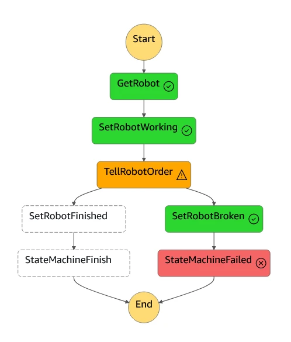

This post is about how to build an AWS Step Functions state machine and how you can use it to interact with IoT edge devices. In this case, we are sending a smoothie order to a "robot" and waiting for it to make that smoothie.

The state machine works by chaining together a series of Lambda functions and defining how data should be passed between them (if you're not sure about Lambda function, take a look at [this blog post](/blog/coordinating-with-lambda)!). There's also a step where the state machine needs to wait for the smoothie to be made, which is slightly more complicated - we'll cover that later in this post.

This post is also available in video form - check the video link below if you want to follow along!

<iframe class="youtube-video" src="https://www.youtube.com/embed/zFPx83DiFG8?si=vyYbWDy1K2GmfNja" title="YouTube video player" frameborder="0" allow="accelerometer; autoplay; clipboard-write; encrypted-media; gyroscope; picture-in-picture; web-share" referrerpolicy="strict-origin-when-cross-origin" allowfullscreen></iframe>

## AWS Step Functions Service

[AWS Step Functions](https://aws.amazon.com/step-functions/) is an AWS service that allows users to build serverless workflows. Serverless came up in [my post on Lambda functions](/blog/coordinating-with-lambda) - it means that you can run applications in the cloud without provisioning any servers or contantly-running resources. That in turns means you only pay for the time that something is executing in the cloud, which is often much cheaper than provisioning a server, but with the same performance.

To demonstrate Step Functions, we're building a state machine that accepts smoothie orders from customers and sends them to an available robot to make that smoothie. Our state machine will look for an available robot, send it the order, and wait for the order to complete. The state machine will be built in AWS Step Functions, which we can access using [the console](https://us-west-2.console.aws.amazon.com/states/home?region=us-west-2#/statemachines).

### State Machine Visual Representation

First, we'll look at the finished state machine to get an idea of how it works. Clicking the edit button within the state machine will open the workflow Design tab for a visual representation of the state machine:


Each box in the diagram is a stage of the Step Functions state machine. Most of the stages are Lambda functions, which are configured to interface with AWS resources. For example, the first stage (`GetRobot`) scans a DynamoDB table for the first robot with the ONLINE status, meaning that it is ready for work.

If at least one robot is available, `GetRobot` will pass its name to the next stage - `SetRobotWorking`. This function updates that robot's entry in the DynamoDB table to WORKING, so future invocations don't try to give that robot another smoothie order.

From there, the robot name is again passed on to `TellRobotOrder`, which is responsible for sending an MQTT message via AWS IoT Core to tell the robot its new smoothie order. This is where the state machine gets slightly more complicated - we need the state machine to pause and wait for the smoothie to be made.

### Activities

While we're waiting for the smoothie to be made, we could have the Lambda function wait for a response, but we would be paying for the entire time that function is sitting and waiting. If the smoothie takes 5 minutes to complete, that would be over 6000x the price!

Instead, we can use the [Activities feature of Step Functions](https://docs.aws.amazon.com/step-functions/latest/dg/concepts-activities.html) to allow the state machine to wait at no extra cost. The system follows this setup:


When the state machine sends the smoothie order to the robot, it includes a generated task token. The robot thens make the smoothie, and when it is finished, publishes a message saying it was successful with that same task token. An IoT Rule that forwards that message to another Lambda function, which tells the state machine that the task was a success. Finally, the state machine updates the robot's status back to ONLINE, so it can receive more orders, and the state machine completes successfully.

:::note Why go through Lambda and IoT Core?

The robot could directly call the Task Success API, but we would need to give it permission to do so - as well as a direct internet connection. This version of the system means that the robot only ever communicates using MQTT messages via AWS IoT Core. See [my video on AWS IoT Core](https://youtu.be/OnVewSeayjI) to see how to set this up.

:::

## Testing the Smoothie State Machine

To test the state machine, we start with a table with two robots, both with ONLINE status. If you follow the setup instructions in the [README](https://github.com/mikelikesrobots/smoothie-state-machine/blob/main/README.md), your table will have these entries:


### Successful Execution

If we now request any kind of smoothie using the `test_stepfunction.sh` script, we start an execution of the state machine. It will find that Robot1 is free to perform the function and update its status to WORKING:


Then it will send an MQTT message requesting the smoothie. After a few seconds, the mock robot script will respond with a success message. We can see this in the [MQTT test client](https://us-west-2.console.aws.amazon.com/iot/home?region=us-west-2#/test):


This allows the state machine to finish its execution successfully:


If we click on the execution, we can see the successful path lit up in green:


:::success Smoothie Complete!

We've made our first fake smoothie! Now we should make sure we can handle errors that happen during smoothie making.

:::

### Robot Issue during Execution

What happens if there is an issue with the robot? Here we can use error handling in Step Functions. We define a timeout on the smoothie making task, and if that timeout is reached before the task is successful, we catch the error - in this case, we update the robot's state to BROKEN and fail that state machine's execution.

To test this, we can kill the mock robot script, which simulates all robots being offline. In this case, running the `test_stepfunction.sh` will request the smoothie from Robot1, but will then time out after 10 seconds. This then updates the robot's state to BROKEN, ensuring that future executions do not request smoothies from Robot1.


The overall state execution also fails, allowing us to alert the customer of the failure:


We can also see what happened to cause the failure by clicking on the execution and scrolling to the diagram:



Another execution will have the same effect for Robot2, leaving us with no available robots.

### No Available Robots

If we never add robots into the table, or all of our robots are BROKEN or WORKING, we won't have a robot to make a smoothie order. That means our state machine will fail at the first step - getting an available robot:


That's our state machine defined and tested. In the next section, we'll take a look at how it's built.

## Building a State Machine

To build the Step Functions state machine, we have a few options, but I would recommend using CDK for the definition and the visual designer in the console for prototyping. If you're not sure what the benefits of using CDK are, I invite you to watch my video on the benefits, where I discuss how to use CDK with SiteWise:

<iframe class="youtube-video" src="https://www.youtube.com/embed/9ZRZhrJFz7A?si=7A77hjIMlgYxKtbS" title="YouTube video player" frameborder="0" allow="accelerometer; autoplay; clipboard-write; encrypted-media; gyroscope; picture-in-picture; web-share" referrerpolicy="strict-origin-when-cross-origin" allowfullscreen></iframe>

The workflow goes something like this:

1. Make a base state machine with functions and AWS resources using CDK
1. Use the visual designer to prototype and build the stages of the state machine up further
1. Define the stages back in the CDK code to make the state machine reproducible and recover from any breaking changes made in the previous step

Once complete, you should be able to deploy the CDK stack to any AWS account and have a fully working serverless application! To make this step simpler, I've uploaded my CDK code to a [Github repository](https://github.com/mikelikesrobots/smoothie-state-machine). Setup instructions are in the [README](https://github.com/mikelikesrobots/smoothie-state-machine/blob/main/README.md), so I'll leave them out of this post. Instead, we'll break down some of the code in the repository to see how it forms the full application.

### CDK Stack

This time, I've split the CDK stack into multiple files to make the dependencies and interactions clearer. In this case, the main stack is at [`lib/cdk-stack.ts`](https://github.com/mikelikesrobots/smoothie-state-machine/blob/main/lib/cdk-stack.ts), and refers to the four components:

1. [`RobotTable`](#robottable) - the DynamoDB table containing robot names and statuses
1. [`Functions`](#functions) - the Lambda functions with the application logic, used to interact with other AWS services
1. [`IoTRules`](#iot-rules) - the IoT Rule used to forward the MQTT message from a successful smoothie order back to the Step Function
1. [`SmoothieOrderHandler`](#smoothie-order-handler) - the definition of the state machine itself, referring to the Lambda functions in the `Functions` construct

We can take a look at each of these in turn to understand how they work.

#### RobotTable

[This construct](https://github.com/mikelikesrobots/smoothie-state-machine/blob/main/lib/components/robot_table.ts#L11) is simple; it defines a DynamoDB table where the name of the robot is the primary key. The table will be filled by a script after stack deployment, so this is as much as it needed. Once filled, the table will have the same contents as shown in [the testing section](#testing-the-smoothie-state-machine).

#### Functions

[This construct](https://github.com/mikelikesrobots/smoothie-state-machine/blob/main/lib/components/functions.ts#L15) defines four Lambda functions. All four are written using Rust to minimize the execution time - the benefits are discussed more in my [blog post on Lambda functions](/blog/coordinating-with-lambda). Each handler function is responsible for one small task to show how the state machine can pass data around.

:::note Combining Functions

We could simplify the state machine by combining functions together, or using Step Functions to call AWS services directly. I'll leave it to you to figure out how to simplify the state machine!

:::

The functions are as follows:

1. [Get Available Robot](https://github.com/mikelikesrobots/smoothie-state-machine/blob/main/lib/components/functions.ts#L19) - scans the DynamoDB table to find the first robot with ONLINE status. Requires the table name as an environment variable, and permission to read the table.
1. [Update Status](https://github.com/mikelikesrobots/smoothie-state-machine/blob/main/lib/components/functions.ts#L33) - updates the robot name to the given status in the DynamoDB table. Also requires the table name as an environment variable, and permission to write to the table.
1. [Send MQTT](https://github.com/mikelikesrobots/smoothie-state-machine/blob/main/lib/components/functions.ts#L47) - sends a smoothie order to the given robot name. Requires IoT data permissions to connect to IoT Core and publish a message.
1. [Send Task Success](https://github.com/mikelikesrobots/smoothie-state-machine/blob/main/lib/components/functions.ts#L67) - called by an IoT Rule when a robot publishes that it has successfully finished a smoothie. Requires permission to send the task success message to the state machine, which has to be done after the state machine is defined, hence updating the permission in [a separate function](https://github.com/mikelikesrobots/smoothie-state-machine/blob/main/lib/components/functions.ts#L67).

#### IoT Rules

[This construct](https://github.com/mikelikesrobots/smoothie-state-machine/blob/main/lib/components/iot_rules.ts#L20) defines an IoT Rule that listens on topic filter `robots/+/success` for any messages, then pulls out the contents of the MQTT message and calls the Send Task Success Lambda function. The only additional permission it needs is to call a Lambda function, so it can call the Send Task Success function.

#### Smoothie Order Handler

[This construct](https://github.com/mikelikesrobots/smoothie-state-machine/blob/main/lib/components/smoothie_order_handler.ts#L76) pulls all the Lambda functions together into our state machine. Each stage corresponds to one of the stages in the [State Machine Visual Representation](#state-machine-visual-representation) section. 

The actual state machine is defined as a chain of functions:

```typescript
const orderDef =
  getAvailableRobot
    .next(setRobotWorking)
    .next(tellRobotOrder
      .addCatch(setRobotBroken.next(finishFailure),
        {
          errors: [step.Errors.TIMEOUT],
          resultPath: step.JsonPath.DISCARD,
        })
    )
    .next(setRobotFinished)
    .next(finishSuccess);
```

Defining each stage as a constant, then chaining them together, allows us to see the logic of the state machine more easily. However, it does hide the information that is being passed between stages - Step Functions will store metadata while executing and pass the output of one function to the next. We don't always want to pass the output of one function directly to another, so we define how to modify the data for each stage.

For example, the Get Robot function looks up a robot name, so the entire output payload should be saved for the next function:

```typescript
const getAvailableRobot = new steptasks.LambdaInvoke(this, 'GetRobot', {
  lambdaFunction: functions.getAvailableRobotFunction,
  outputPath: "$.Payload",
});
```

However, the Set Robot Working stage does not produce any relevant output for future stages, so its output can be discarded. Also, it needs a new Status field defined for the function to work, so the payload is defined in the stage. To set one of the fields based on the output of the previous function, we use `.$` to tell Step Functions to fill it in automatically. Hence, the result is:

```typescript
const setRobotWorking = new steptasks.LambdaInvoke(this, 'SetRobotWorking', {
  lambdaFunction: functions.updateStatusFunction,
  payload: step.TaskInput.fromObject({
    "RobotName.$": "$.RobotName",
    "Status": "WORKING",
  }),
  resultPath: step.JsonPath.DISCARD,
});
```

Another interesting thing to see in this construct is how to define a stage that waits for a task to complete before continuing. This is done by changing the integration pattern, plus passing the task token to the task handler - in this case, our mock robot. The definition is as follows:

```typescript
const tellRobotOrder = new steptasks.LambdaInvoke(this, 'TellRobotOrder', {
  lambdaFunction: functions.sendMqttFunction,
  // Define the task token integration pattern
  integrationPattern: step.IntegrationPattern.WAIT_FOR_TASK_TOKEN,
  // Define the task timeout
  taskTimeout: step.Timeout.duration(cdk.Duration.seconds(10)),
  payload: step.TaskInput.fromObject({
    // Pass the task token to the task handler
    "TaskToken": step.JsonPath.taskToken,
    "RobotName.$": "$.RobotName",
    "SmoothieName.$": "$.SmoothieName",
  }),
  resultPath: step.JsonPath.DISCARD,
});
```

This tells the state machine to generate a task token and give it to the Lambda function as defined, then wait for a task success signal before continuing. We can also define a catch route in case the task times out, which is done using the `addCatch` function:

```typescript
.addCatch(setRobotBroken.next(finishFailure),
  {
    errors: [step.Errors.TIMEOUT],
    resultPath: step.JsonPath.DISCARD,
  })
```

With that, we've seen how the state machine is built, seen how it runs, and seen how to completely define it in CDK code.

## Challenge!

Do you want to test your understanding? Here are a couple of challenges for you to extend this example:

1. **Retry making the smoothie!** If a robot times out making the smoothie, just cancelling the order is not a good customer experience - ideally, the system should give the order to another robot instead. See if you can set up a retry path from the BROKEN robot status update back to the start of the state machine.
1. **Add a queue to the input!** At present, if we have more orders than robots, the later orders will simply fail immediately. Try adding a queue that starts executing the state machine using [Amazon Simple Queue Service (SQS)](https://aws.amazon.com/sqs/).

## Summary

Step Functions can be used to build serverless applications as state machines that call other AWS resources. In particular, a powerful combination is Step Functions with AWS Lambda functions for the application logic.

We can use other serverless AWS resources to access more cloud functionality or interface with edge devices. In this case, we use MQTT messages via IoT Core to message robots with smoothie orders, then listen for the responses to those messages to continue execution. We can also use a DynamoDB table to store robot statuses, which is a serverless database table. The table contains each robot's current status as the step function executes.

Best of all, this serverless application runs in the cloud, giving us all of the advantages of running using AWS - excellent logging and monitoring, fine-grained permissions, and modifying the application on demand, to name a few!
