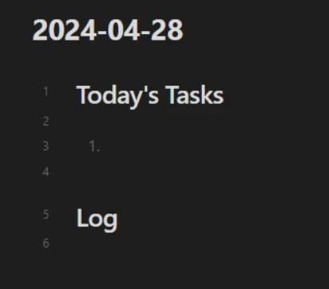
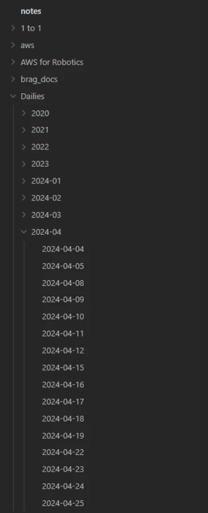

This post is to give you my five tops on how to stand out as a Software Engineer. These are tips that will help at any career level, not just when you're starting out.

If you prefer a video format, check out my YouTube video below:

<iframe class="youtube-video" src="https://www.youtube.com/embed/wEQqo-Exmd0?si=xXkjKOR0XdJkP5bf" title="YouTube video player" frameborder="0" allow="accelerometer; autoplay; clipboard-write; encrypted-media; gyroscope; picture-in-picture; web-share" referrerpolicy="strict-origin-when-cross-origin" allowfullscreen></iframe>

## Knowing When to Ask Questions

My first tip is knowing when to ask questions. The phrasing of this title sounds like you need to ask fewer questions, but mostly likely you need to ask _more_ questions. The truth is that when you start on a new team, that team is expecting you to ask a lot of questions. This is especially true when you're just starting out, so my advice to you is this:

1. When you need to know something that you can't find out online, don't waste your time. Ask another team member straight away.
1. When you need to know something that you could possibly find online, try setting yourself a time limit before asking for help. Give it 15-30 minutes, try and work through it, then find a team member to take a look with you.

This will give you a good balance between feeling like you're pestering people and taking all their time up, and being able to actually complete your work. The last thing your new team members want for you is to sit there wasting hours or even days on something they could have helped you with in two minutes.

:::info[Example - Ask Straight Away]

You want to find some documentation for your project. It's very unlikely you could find this information by yourself, so it's best for you to find a tem member to ask for help.

:::

:::info[Example - Wait, Then Ask]

You've changed something in the code and it won't compile any more. This is something you could probably figure out by yourself given enough time, so set a timer for 15 minutes, then try to work through it. If the timer goes off, and you haven't made any progress, find someone who can help.

:::

## Taking Responsibility

My second tip is to take responsibility, and there's two ways to take responsibility that I'm talking about: first, taking responsibility for tasks that you don't normally do as part of your work; second, taking responsibility when you make a mistake.

### Volunteering for Tasks

As far as tasks outside your normal work goes, it's very common for your manager or your team to have a task come up that needs to be completed, but doesn't naturally fall to a particular person. Chances are, your team would prefer one person to be responsible for it and drive it to completion. If that's something you could do, but is outside of your normal work area, it's a great idea to consider taking it on. It's a way that you can stand out as an engineer, learn something new, and grow in your career.

:::info[Example - Running a Hackathon]

I had a teammate who wanted to participate in the Hackathon, but when I encouraged them to try and organise it for themself, they weren't willing to take on that responsibility. Instead, I took on the task: I arranged it, chose the theme for it, and made sure it went ahead. Now, I'm much more prepared to run other Hackathons in the future.

:::

## Owning Your Mistakes

The second way that you should take responsibility is when you've made a mistake. Especially when you're starting out, but all throughout your career, you can and will make mistakes. The best thing that you can do is learn from them and try to make sure they don't happen again.

The best response you can give if you get called out in a meeting for something you've done wrong is to avoid getting upset, and to simply say, "yes, I made a mistake there, and here's what I'm going to do to stop it happening again."

That could be something you do differently, or it could be a process that you or your team put in place to make sure that no one will make that mistake again.

:::info[Example - Not Paying Attention]

I took part in an informational meeting with a lot of distractions in the house. I couldn't pay full attention, I wasn't able to ask questions at the end, and I didn't even realise how distracted I was until both my manager and one of my colleagues commented on it. I realised how disrespectful it was to the presenter at the time. To this day, I make sure that there as few distractions in the house as possible when I'm attending a meeting out of respect for other people's time.

:::

## Actively Pursue Advancement

My third tip for you is to actively pursue advancement. By that, I mean you need to go after what you want for your next career step.

In my experience, many people are content to receive tasks from their team, and do their work well and on time, but that's not the way that you can grow your career the fastest. The best thing that you can do is have an honest conversation with your manager about where you want to be. Is there more responsibility that you want to take on? Do you want a raise, or a promotion? These are things that you need to bring attention to if you want to make them happen and you need to make them happen **yourself**.

To understand this better, try and think of it from your manager's point of view - or their manager's point of view. They have teams ot manage, projects to get out on time, customers they need to talk to and keep happy; how much of their attention do you think is solely on you? The answer is probably not that much, which is why you need to bring their attention on to you. **You** need to make it happen, and that's what this conversation would do.

Talk to your manager, tell them what you need, and ask them for feedback so you understand exactly where you are and what weaknesses you need to work on in order to progress.

:::info[Example - Asking for a Raise]

My most recent example of this was when I was working on a team and I felt like I was taking on more responsibility than my level required - even acting in a team lead role. I had a conversation with my manager and asked him for a raise. Not only did he respond positively to this, he actually helped me to get promoted instead so that I became the official team lead. It was a benefit to me and a benefit to him because it showed how he was growing his team.

:::

## Document Your Wins

My fourth tip is to document your wins, by which I mean writing down what you're doing as you're doing it, including any wins that you have in that process.

You can start this by taking notes every day of what you're doing. Open a note with the date and your responsibilities for the day, then log what you do during the day.

<figure class="text--center">

<figcaption>I've configured my note-taking software [Obsidian](https://obsidian.md) to automatically open this every day.</figcaption>
</figure>

This is a great way to keep a log and look back on how you fixed something in the past, but it will also help you with the next step: periodically updating a document that contains all of your wins.

<figure class="text--center">

<figcaption>My list of daily notes since starting digital notes.</figcaption>
</figure>

My recommendation for this is something called a brag doc. I use a modified version of the [document suggested by Julia Evans](https://jvns.ca/blog/brag-documents/). To use this document effectively, set time aside every 2-4 weeks and update the document with what you've been doing and what has gone well. Use the daily notes you've been taking to help supplement this. By doing it bit by bit, it's a lot easier to keep track of what you've done over a long period of time. You'll also have a great body of evidence if you need to pursue advancement; you can show evidence that you've been working above your level. Bonus points if you can write some sort of data down - numbers are even more convincing than quotes when you're trying to prove something.

The next step after this is to use that brag doc to keep your resume, CV, or LinkedIn profile up to date. This is another point where it's much easier to do it little by little over time so it's always up to date, instead of making one large effort when you need it.

:::info[Example - Resource Feedback Spreadsheet]

For example, I have a spreadsheet that keeps track of everyone that's reached out to me from the company saying something about the resources that I put online. This is a great way for me to figure out what the best resources are what's been most helpful - plus, if I need to prove that what I've done has been helpful, I have all the evidence right there.

:::

Remember to set that time aside for writing your daily notes and updating your brag doc and LinkedIn profile. Don't dismiss this - keeping my LinkedIn profile up to date was what landed me my job at Amazon in the first place!

## Know Your Worth

My fifth and final tip is to know your worth. Getting into software engineering is no easy feat. It takes a lot of training and technical knowledge, so getting where you are is already a battle - not to mention any experience that you can get on top of that.

You've earned the right to be confident. You should be confident in your statements and your decisions while being prepared to learn from your mistakes. Even if you don't feel confident from your amount of experience, I advise you to act like you're confident. Enough time acting like you're confident and you will eventually feel that confidence.

:::info[Example - High-Level Meeting]

My most recent example of this was taking part in a meeting with leaders several levels above me. I was nervous and didn't want to speak in case I didn't sound like I knew what I was talking about. I spent a lot of the meeting sitting and taking notes, distilling what I had heard down right up until the point where I made some realisations. When I eventually spoke up about them, the leaders listened to me and the conversation took a whole different direction.

:::

Another part of knowing your worth is being aware of what other options you have. Keep an eye on your career field and see what other job opportunities there are, as well as the kind of salary your job normally makes. It's a great idea to know what's out there - either you'll find something that you think is more exciting and is a better opportunity, or you can be satisfied that where you are is the best place for you.

## Putting the Tips into Action

So there you have my top five tips on how to stand out as a software engineer.

Some things you can do periodically, like updating your brag doc or your LinkedIn profile. You can start straight away by opening up a daily note, writing the date, and starting to take notes. You can also make an empty brag doc, ready to start filling in your first entries.

Another way you can get started is by arranging a talk with your manager, where you can have an honest conversation about where you want to be and what kind of feedback your manager can provide you. Arrange the meeting, go in knowing what you want, and write down the result of the meeting so you can look back on it in your log.

The last part is interacting with your team. Start acting with more confidence around your team, take responsibility for something that's outside of your comfort zone, and take responsibility for your mistakes as they happen. A few good examples of tasks you can take responsibility for are being the Scrum Master for your team, writing up documentation that is currently missing, or leading a meeting that no one has volunteered for.

Any of these options will help you to get started and to grow in your career. Good luck standing out as a software engineer!
