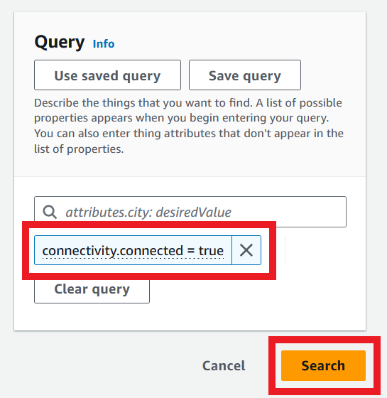

Congratulations! You have a whole lab full of robots running your latest software. Now you want to start looking at an **overall** view of your robots. It's time to build a fleet overview, and this post will show you how to use Fleet Indexing from AWS IoT Device Management to start your overview.

Fleet Indexing is a feature of AWS IoT Core that collects and indexes information about all of your selected Things and allows you to execute queries on them and aggregate data about them. For example, you can check which of your Things are online, giving you an easy way to determine which of your robots are connected.

I want to walk you through this process and show you what it looks like in the console and using Command Line Interface (CLI) commands. We'll be using the sample code from [aws-iot-robot-connectivity-samples-ros2](https://github.com/aws-samples/aws-iot-robot-connectivity-samples-ros2), but I've forked it to add some helper scripts that make setup a little easier for multiple robots. It also adds a launch script so multiple robots can be launched at the same time.

This guide is also available in video form - see the link below!

<iframe class="youtube-video" src="https://www.youtube.com/embed/IbCCwTWp0ec?si=7N-uGh6eO16yJE0_" title="YouTube video player" frameborder="0" allow="accelerometer; autoplay; clipboard-write; encrypted-media; gyroscope; picture-in-picture; web-share" referrerpolicy="strict-origin-when-cross-origin" allowfullscreen></iframe>

## Fleet Indexing

[Fleet Indexing](https://docs.aws.amazon.com/iot/latest/developerguide/iot-indexing.html) is a feature of IoT Device Management that allows you to index, search, and aggregate your device data from multiple AWS IoT sources. Once the index has been enabled and built, you would be able to run queries such as:

- How many devices do I have online?
- How many devices have less than 30% battery left?
- Which devices are currently on a mission?
- What is the average metres travelled for my fleet of robots at this location?

To perform these queries, AWS has a query language which can be used for console or CLI commands. There is also the option to aggregate data over time, post that aggregated data to CloudWatch (allowing for building dashboards), and enabling alarms on the aggregate state of your fleet based on pre-defined thresholds.

Device Management has a suite of features, including bulk registration, device jobs (allowing for Over The Air updates, for example), and secure tunnelling. I won't go into depth on these - Fleet Indexing is the focus of this post. If you are interested in these other features, you can read more [in the docs](https://aws.amazon.com/iot-device-management/), or let me know directly!

### Pricing

Fleet Indexing is a paid service at AWS, and it's worth understanding where the costs come from. The [Device Management pricing page](https://aws.amazon.com/iot-device-management/pricing/) has the most detail. In short, there is a very low charge for registering devices, then additional charges for updating the index and querying the index.

Fleet Indexing is opt-in. Every service added to the index, such as connectivity or shadow indexing, will increase the size of the index and the operations that will trigger an index update. For example, if connectivity is not enabled, then a device coming online or offline will not update the index, so there will be no additional fleet indexing charge. If shadow indexing is enabled, then every update of an indexed shadow will incur a charge. At time of writing, update charges are measured in a few USD per million updates, and queries cost a few cents per thousand queries.

Overall, we can keep this in mind when deciding which features to include in the Fleet Index given a particular budget. Frequent shadow updates from a large robot fleet will have a larger associated cost.

If you'd like to learn more about pricing estimates and monitoring your usage at AWS, take a look at my video on the topic:

<iframe class="youtube-video" src="https://www.youtube.com/embed/LreFpJDXZs0?si=JM9oyzPXRk0gSCrX" title="YouTube video player" frameborder="0" allow="accelerometer; autoplay; clipboard-write; encrypted-media; gyroscope; picture-in-picture; web-share" referrerpolicy="strict-origin-when-cross-origin" allowfullscreen></iframe>

## Setup Guide

Now we know a bit more about what Fleet Indexing is, I want to show you how to set it up. I'll use a sample application with multiple ROS2 nodes posting frequent shadow updates so we can see the changes in the shadow index. Each pair of ROS2 nodes is acting as one robot. I'll show you how to enable Fleet Indexing first only with Connectivity data, then add named shadows.

### Sample Application Setup

For the sample application, use a computer with Ubuntu 22.04 and [ROS2 Humble](https://docs.ros.org/en/humble/Installation/Ubuntu-Install-Debians.html) installed. Install `ros-dev-tools` as well as `ros-humble-desktop`. Also install the AWS CLI and the AWS IoT SDK - instructions are in the [repository's README](https://github.com/mikelikesrobots/aws-iot-robot-connectivity-samples-ros2) and my video on setting up the sample application:

<iframe class="youtube-video" src="https://www.youtube.com/embed/OnVewSeayjI?si=K6ZHoPqSCoU8Kb7T" title="YouTube video player" frameborder="0" allow="accelerometer; autoplay; clipboard-write; encrypted-media; gyroscope; picture-in-picture; web-share" referrerpolicy="strict-origin-when-cross-origin" allowfullscreen></iframe>

Once the necessary tools are installed, clone the repository:

```bash
cd ~
git clone https://github.com/mikelikesrobots/aws-iot-robot-connectivity-samples-ros2.git
```

Make sure that the application builds correctly by building the ROS2 workspace:

```bash
cd ~/aws-iot-robot-connectivity-samples-ros2/workspace
source /opt/ros/humble/setup.bash
colcon build --symlink-install
source install/setup.bash
```

Next, set the CERT_FOLDER_PATH so that the certificates are written to the right place:

```bash
export CERT_FOLDER_LOCATION=~/aws-iot-robot-connectivity-samples-ros2/iot_certs_and_config/
echo "export CERT_FOLDER_LOCATION=$CERT_FOLDER_LOCATION" >> ~/.bashrc
```

At this point we can set up a few robots for the sample application. For this, we can use the new script in the forked repository:

```bash
cd ~/aws-iot-robot-connectivity-samples-ros2
# Install python dependencies for the script
python3 -m pip install -r scripts/requirements.txt
# Create certificates, policies etc for robot1, robot2, and robot3
python3 scripts/make_robots.py robot1 robot2 robot3
```

This will create Things, certificates, policies and so on for three robots.

:::info[Cleaning Up Resources]

Once you're finished working with the sample application, you can clean all of these resources up using the corresponding cleanup script:

```bash
cd ~/aws-iot-robot-connectivity-samples-ros2
python3 scripts/delete_robots.py robot1 robot2 robot3
```

:::

With your robots created, you now need to launch the shadow service launch script. Execute the command:

```bash
ros2 launch iot_shadow_service crack_all_safes.launch.py certs_path:=$CERT_FOLDER_LOCATION
```

This should find all the robots you've created in the certificates folder and launch an instance of the sample application for each one. In this case, three "safe cracker" robots will start up. The logs will show shadow updates for each one. We now have three robots in our fleet, each connecting to AWS IoT Core to post their shadow updates.

You can now leave this application running while following the rest of the instructions.

### Enabling Fleet Index with Connectivity

For each step, I'll show how to use the console and CLI for enabling Fleet Indexing.

#### Enabling in Console

In the console, navigate to the AWS Console IoT Core page, and scroll to the bottom of the navigation bar. Open the Settings page.


Fleet indexing is partway done the page. Click the Manage indexing button.


In the title bar of the Thing indexing box, there's a check box to enable indexing. Check this box.


At this point, you could confirm the update and see the Fleet Index include the names of your Things. However, to get some utility from it, we can also include Connectivity to see whether devices are online or not. To do this, scroll down and check the box next to "Add thing connectivity".


Now scroll to the bottom of the page and click Update.


Once enabled, it may take a few minutes to build the Index. You can proceed to the next section, and if the searches are not returning results, wait for a few minutes before trying again.

#### Enabling using CLI

To enable Fleet Indexing with only Connectivity, execute the following command:

```bash
aws iot update-indexing-configuration --thing-indexing-configuration '{
    "thingIndexingMode": "REGISTRY",
    "thingConnectivityIndexingMode": "STATUS"
}'
```

The index may take a few minutes to build. If the following section does not immediately work, wait for a few minutes before trying again.

### Querying the Fleet Index

Now that connectivity is enabled, we can query our Fleet Index to find out how many devices are online.

#### Console Advanced Search

In the AWS Console, go to the IoT Core page and open the Things page.


In the controls at the top, two buttons are available that require Fleet Indexing to work. Let's start with Advanced Search.


Within the Query box, enter `connectivity.connected = true`. Press enter to add it as a query, then click Search.



This should give all three robots as connected devices.


Success! We have listed three devices as connected. You can also experiment with the query box to see what other options are available. We can also increase the options available by allowing other IoT services to be indexed. 

:::caution

The console uses queries with a slightly different syntax to the CLI and examples page. If you use an example, be careful to translate the syntax!

:::

As a next step, we can see how to aggregate data. Go back to the Things page and instead click the "Run aggregations" button.


Search for "thingName = robot*", and under aggregation properties, select "connectivity.connected" with aggregation type "Bucket". This search will return that 3 devices are connected. Explore the page - in particular the Fleet metrics section - to see what else this tool is able to do.


You can use the console to explore the data available.

#### CLI Queries and Aggregations

To search for the names of connected devices, the CLI command is:

```bash
aws iot search-index \
    --index-name "AWS_Things" \
    --query-string "connectivity.connected:true"
```

This will return a json structure containing all of the things that are currently connected. This can further be processed, such as with the tool `jq`:

```bash
sudo apt install jq
aws iot search-index \
    --index-name "AWS_Things" \
    --query-string "connectivity.connected:true" \
    | jq '.things[].thingName'
```

This returns the following lines:

```bash
"robot1"
"robot2"
"robot3"
```

Success! We can even watch this whole command to view the connected devices over time:

```bash
watch "aws iot search-index --index-name 'AWS_Things' --query-string 'connectivity.connected:true' | jq '.things[].thingName'"
```

We could get a number of connected devices by counting the lines in the response:

```bash
aws iot search-index \
    --index-name 'AWS_Things' \
    --query-string 'connectivity.connected:true' \
    | jq '.things[].thingName' \
    | wc -l
```

Or, we can use an aggregation. To search for Things with a name starting with `robot` that are connected, we can use this command:

```bash
aws iot get-buckets-aggregation \
    --query-string "thingName:robot*" \
    --aggregation-field connectivity.connected \
    --buckets-aggregation-type '{"termsAggregation": {"maxBuckets": 10}}'
```

This gives the following response:

```bash
{
    "totalCount": 3,
    "buckets": [
        {
            "keyValue": "true",
            "count": 3
        }
    ]
}
```

In both cases, we can see that 3 devices are connected. The latter command is more complicated, but can be altered to provide other aggregated data - you can now explore the different aggregation types to perform more queries on your Fleet Index!

### Indexing Named Shadows

Next, we will see how to add Named Shadows to the Fleet Index. Again, we will see both the console and CLI methods of accomplishing this.

:::caution

As described in the [pricing](#pricing) section, anything that increases the number of updates to the index will incur additional charges. In this sample application, each robot updates its shadow multiple times per second. Be careful with your own system design if you plan to index your shadow with how many shadow updates are required!

:::

Enabling named shadows is a two-step process. First, you must enable indexing named shadows; then, you must specify the shadows to be indexed. This is to allow you to optimize the fleet index for cost and performance - you can select which shadows should be included to avoid unnecessary updates.

#### Enabling Named Shadows using the Console

Back in the Fleet Indexing settings, check the box for Add named shadows, then add the shadow names `robot1-shadow`, `robot2-shadow`, `robot3-shadow`.


Click Update. This will result in a banner on the page saying that the index is updating. Wait for a couple of minutes, and if the banner persists, continue with the next steps regardless - this banner can remain on screen past when the indexing is complete.

#### Enabling Named Shadows using the CLI

To add named shadows to the index, you need to both enable the named shadow indexing and specify the shadow names to be indexed. This must be done all in one command - the configuration in the command overwrites the previous configuration, meaning that if you omit the connectivity configuration argument, it will remove connectivity information from the index.

The command to add the shadows to the existing configuration is as follows:

```bash
aws iot update-indexing-configuration --thing-indexing-configuration '{
    "thingIndexingMode": "REGISTRY",
    "namedShadowIndexingMode": "ON",
    "thingConnectivityIndexingMode": "STATUS",
    "filter": {"namedShadowNames": ["robot1-shadow", "robot2-shadow", "robot3-shadow"]}
}'
```

The command keeps the indexing mode and connectivity mode the same, but adds named shadow indexing and the specific shadow names to the index.

### Querying shadow data

Shadow data can be indexed using the console and CLI - however, the use of wildcards with named shadows is not supported at time of writing. It is possible to query data using a particular shadow name, but currently can't query across the whole fleet.

#### Querying Shadow via Console

To query for `robot1-shadow`, open the Advanced search page again. Enter the query `shadow.name.robot1-shadow.hasDelta = true`, then click search. It may take a few searches depending on the shadow's delta, but this should return `robot1` as a Thing.


You can then select any of the Things returned to see more information about that Thing, including viewing its shadow.

#### Querying Shadow via CLI

With the console, searching for your `robot*` things will return a table of links, which means clicking through each Thing to see the shadow. The query result from the CLI has more detail in one place, including the entire indexed shadow contents for all things matching the query. For example, the following query will return the thing name, ID, shadow, and connectivity status for all `robot*` things.

```bash
aws iot search-index --index-name 'AWS_Things' --query-string 'connectivity.connected:true'
```

Example output:

```json
{
    "things": [
        {
            "thingName": "robot1",
            "thingId": "13032b27-e770-4146-8706-8ec1249b7015",
            "shadow": "{\"name\":{\"robot1-shadow\":{\"desired\":{\"digit\":59},\"reported\":{\"digit\":59},\"metadata\":{\"desired\":{\"digit\":{\"timestamp\":1718135446}},\"reported\":{\"digit\":{\"timestamp\":1718135446}}},\"hasDelta\":false,\"version\":55137}}}",
            "connectivity": {
                "connected": true,
                "timestamp": 1718134574557
            }
        },
        {
            "thingName": "robot2",
            "thingId": "7e396088-6d02-461e-a7ca-a64076f8a0ca",
            "shadow": "{\"name\":{\"robot2-shadow\":{\"desired\":{\"digit\":70},\"reported\":{\"digit\":70},\"metadata\":{\"desired\":{\"digit\":{\"timestamp\":1718135462}},\"reported\":{\"digit\":{\"timestamp\":1718135463}}},\"hasDelta\":false,\"version\":55353}}}",
            "connectivity": {
                "connected": true,
                "timestamp": 1718134574663
            }
        },
        {
            "thingName": "robot3",
            "thingId": "b5cf7c73-3b97-4d8e-9ccf-a1d5788873c8",
            "shadow": "{\"name\":{\"robot3-shadow\":{\"desired\":{\"digit\":47},\"reported\":{\"digit\":22},\"delta\":{\"digit\":47},\"metadata\":{\"desired\":{\"digit\":{\"timestamp\":1718135446}},\"reported\":{\"digit\":{\"timestamp\":1718135447}},\"del
ta\":{\"digit\":{\"timestamp\":1718135446}}},\"hasDelta\":true,\"version\":20380}}}",
            "connectivity": {
                "connected": true,
                "timestamp": 1718134574573
            }
        }
    ]
}
```

We can filter this again using `jq` to get all of the current reported digits for the shadows. The following command uses a few chained Linux commands to parse the desired data. The purpose of the command is to show that the data returned by the query can be further parsed for particular fields, or used by a program to take further action.

```bash
aws iot search-index \
    --index-name 'AWS_Things' \
    --query-string 'connectivity.connected:true' \
    | jq -r '.things[].shadow | fromjson | .name | to_entries[] | {name: .key, desired: .value.desired.digit}'
```

The above command searches for all connected devices, then for those devices, retrieves the desired digit field from all of its shadows and places them into a map of the following format:

```json
{
  "name": "robot1-shadow",
  "desired": 24
}
{
  "name": "robot2-shadow",
  "desired": 54
}
{
  "name": "robot3-shadow",
  "desired": 8
}
```

We can again wrap this in a `watch` command to see how frequently the values update:

```bash
watch "aws iot search-index --index-name 'AWS_Things' --query-string 'connectivity.connected:true' | jq -r '.things[].shadow | fromjson | .name | to_entries[] | {name: .key, desired: .value.desired.digit}'"
```

Success! We can see the desired digit of our three safe cracking robots update live on screen, all from the fleet index.

## CloudWatch Metrics and Device Management Alarms

Fleet Indexing is a launching point for sending specific data to CloudWatch Metrics or activating Device Management Alarms. AWS allows you to set up queries and aggregated data that you're interested in, such as the average battery level across a fleet of mobile robots, and perform actions based on that. You could set an alarm to get an alert when the average battery drops too low, emit metrics based on queries that are tracked in CloudWatch, and even start building a CloudWatch Dashboard to view a graph of the average battery level over time.

These are just a few examples of how valuable it is to connect robots to the cloud. Once they are connected and data starts flowing, you can set up monitoring, alarms, and actions to take directly in the cloud, without needing to deploy any of your own infrastructure.

## Summary

Overall, Fleet Indexing from IoT Device Management is a useful tool for collecting data from your fleet into one place, then allowing you to query and aggregate data across the fleet or even subsections of the fleet. This post shows how to index device connectivity and named shadow data, plus how to query and aggregate data, both using the console and using the command line. Finally, I briefly mentioned some of the future possibilities with the Fleet Index data, such as setting up alarms, metrics, and dashboards - all from data already flowing into AWS!

Have a try for yourself using the sample code - but remember, frequent updates of the index will incur higher costs. Be careful with your system design and the IoT services you select to index to optimize costs and performance.
