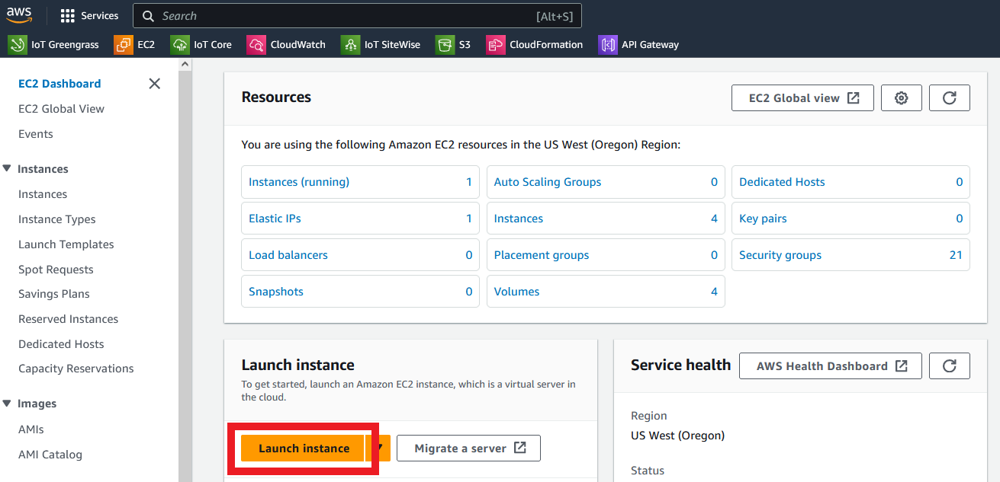
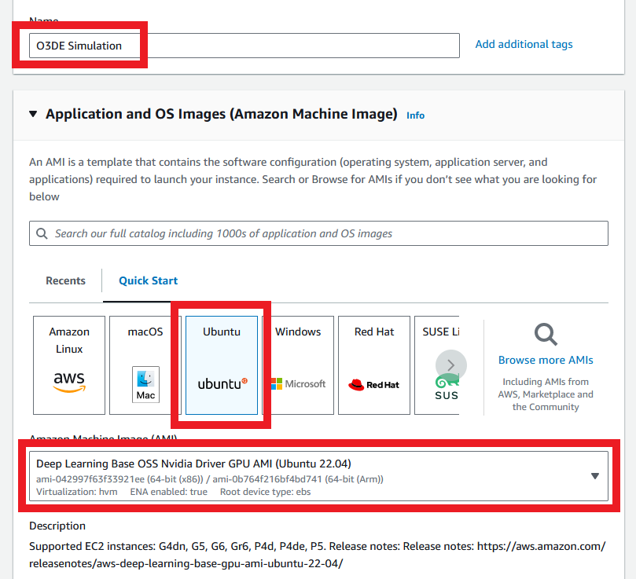
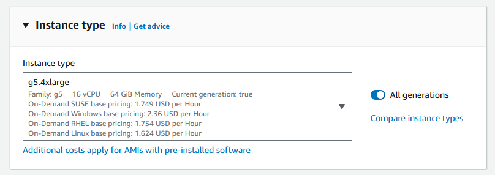
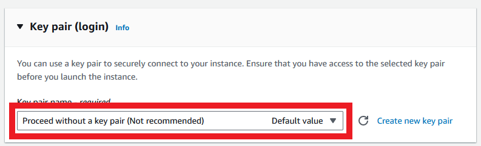
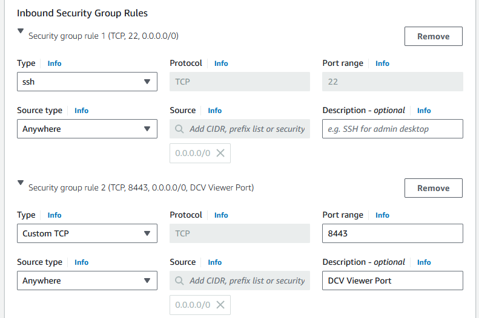
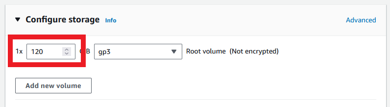
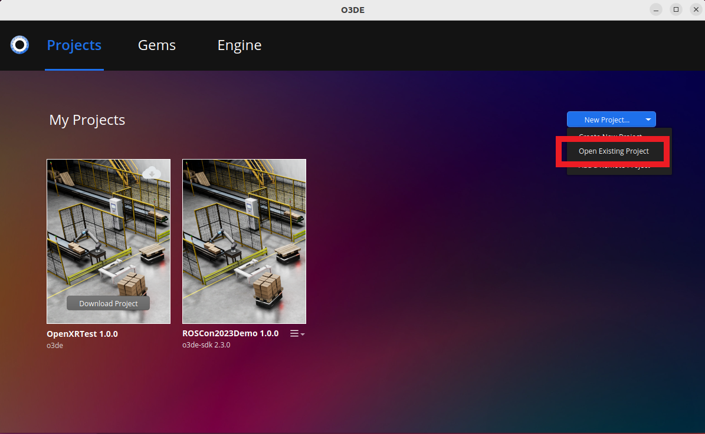
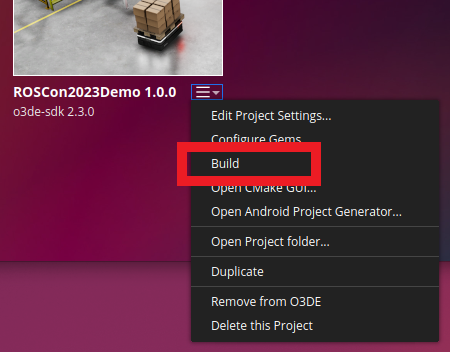
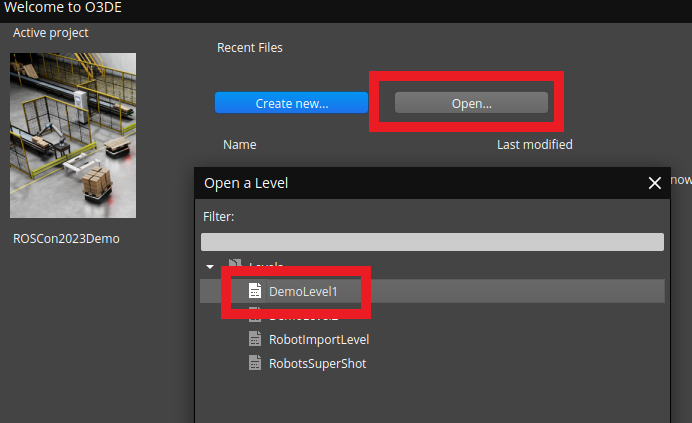
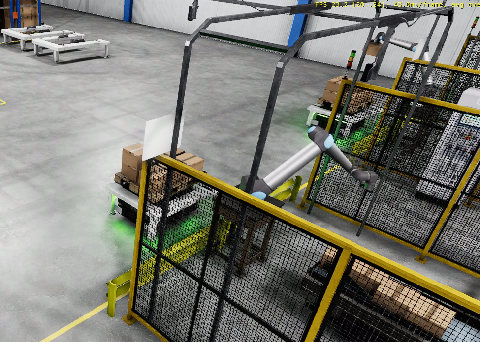

Simulators such as [Gazebo](https://gazebosim.org/home), [NVIDIA Isaac Sim](https://developer.nvidia.com/isaac/sim), and [O3DE](https://o3de.org/) are incredibly helpful tools when it comes to robotics development. Robots are very slow and expensive to develop, and a large part of the reason is not being able to test how the robot works for real because of how slow it is to set up and run tests. With simulations, we can repeatedly run a robot through exactly the same setup every time to see how it behaves, allowing us to more quickly modify the robot software and run it again.

There's one issue - the more realistic the simulation, the more powerful the computer needed to run it. That's where the cloud comes in; instead of buying the hardware outright and running the computer in-house, you can run simulations _on demand_ in the cloud, and only pay for the server while you're using it!

In this post, I'll show you how to run a multi-robot sample simulation using O3DE in the cloud, using an on-demand EC2 instance with graphics hardware available. If you'd like to follow along, this post is also available in video form using the link below:

<iframe class="youtube-video" src="https://www.youtube.com/embed/GOcf0bCtINM?si=qJfoIAos1G7UIfzK" title="YouTube video player" frameborder="0" allow="accelerometer; autoplay; clipboard-write; encrypted-media; gyroscope; picture-in-picture; web-share" referrerpolicy="strict-origin-when-cross-origin" allowfullscreen></iframe>

## O3DE

[O3DE](https://o3de.org/) is the world's first high-fidelity, real-time open source 3D engine - and the engine we will be using today. High fidelity means that the simulation it runs is close to the real world in behaviour. Simulation generally has a trade-off between speed and fidelity - the more accurately you simulate the world, the more effort and time it takes for the computer to do so.

O3DE does not require any payment or account setup to be able to use it, which makes it a great candidate for this tutorial. By removing the signup steps, we can get to a full simulation more quickly.

O3DE also has ROS2 integration, which is a huge benefit for us, as a lot of the tutorials I write use ROS2. We can use O3DE to _simulate_ robots running instead of running them for real in a lab, which is incredibly useful for testing our behaviour without the slow loop of manually setting up a real robot and testing. In fact, O3DE received a lot of attention in the last ROSCon, and is co-sponsoring the only platinum sponsor for the [upcoming ROSCon 2024](https://o3de.org/events/roscon-2024/) along with its member company, [Robotec.AI](https://robotec.ai/). The demo that O3DE and Robotec.AI showed is [available online](https://github.com/RobotecAI/ROSCon2023Demo), and it's the demo we will be running today!

This tutorial shows how to set up an EC2 instance for the simulation, then working through the rest of the setup steps for the application. By the end, we will have a fully working simulator, visible through a remote desktop, running on hardware in the cloud. We will interact with the simulation using a desktop viewer that will allow us to install, run, and control the demo.

## Amazon EC2

EC2 is a service that allows a user to launch virtual machines in the cloud. I frequently use this service for my tutorials, as it provides a clean installation for running demos on, making sure that the setup steps work for everyone.

In this case, we will use EC2 to launch a virtual machine with access to a graphics card and a reasonable size of hard disk for running simulations. Generally, you only pay for the instance while it's running. When the instance is offline, you pay a small amount for the virtual hard disk not currently in use. It is possible to reduce even this cost by storing files in S3, but that's beyond the scope of this tutorial. This would be a good stretch goal for learning EC2!

### Launching an Instance for Simulation

To launch an instance, you need a valid AWS account. Log in and navigate to the EC2 page, then click Launch Instance.



Give the instance a reasonable name, like "Simulation Instance", then go on to select the Ubuntu AMI. Click the drop-down underneath and select the Deep Learning Base OSS Nvidia Driver GPU AMI - this is the Ubuntu instance with graphics drivers already installed.

:::info

AMI stands for Amazon Machine Image, which means the base image that an EC2 instance will start up with. You can select a particular AMI for a different Operating System, such as selecting between Amazon Linux 2, Windows, and Ubuntu.

:::



Under instance type, select any instance in the g5 family. I'll use g5.4xlarge, as this meets the recommended specifications of the sample application.

:::info

EC2 instances are grouped into families based on their purpose. `g5` instances are intended for graphics applications, and come with access to a graphics card.

Don't be worried about selecting the wrong instance type here. It is easy to change the instance type after initial selection - in fact, one of the advantages of EC2 is how easy it is to restart with a more powerful instance type, perform a task, then downgrade again afterwards. You only pay for what you use.

:::



For keypairs, select the no keypair option. We don't need keypairs for EC2 Connect, and we won't need much setup before changing to the remote desktop viewer.



The next section is to allow outside connections. EC2 blocks any traffic that isn't on approved ports. In this case, we need to allow port 22 for remote control over SSH and port 8443 for our remote desktop viewer. Click Edit at the top of Network settings, then make sure there are two rules: one for SSH access; and one for TCP access on port 8443. Copy the image below for the exact details.



Finally, we need to configure Storage. The default drive size at time of writing is 65GB, but we'll need more than that for the simulator and its dependencies. We will increase that amount to 120GB.



With that, we're ready to launch! Click Launch instance, then go back to the Instances list and monitor its status until it is fully online (Running status).

:::warning

Make sure to stop the instance when you aren't using it! Instances with graphics card access are more expensive, and it can be easy to forget that the instance is running.

:::

Once online, tick the instance and click the Connect button in the top right. Leave the options as default and click Connect. You should now have full command line access to a virtual machine running in the cloud with access to a graphics card!

We can check this by executing one command: `nvidia-smi -q`. If the graphics drivers are installed and working properly, it should print out a lot of information about the available graphics card.

Now let's look at how to install our remote desktop viewer - DCV!

### Remote Desktop Viewer

EC2 provides licensing for [DCV](https://aws.amazon.com/hpc/dcv/) at no extra cost. This is a high performance desktop viewer that we can use for the sample application setup. As the networking ports have been set up in the previous step, we just need to install and configure the server before connecting.

:::info

Using DCV with a full license on the EC2 instance does require that the instance has permission to retrieve the license from an S3 bucket, which I've skipped over to keep the AWS setup portion shorter. You can read more in the [licensing documentation](https://docs.aws.amazon.com/dcv/latest/adminguide/setting-up-license.html). This setup isn't needed for the initial installation.

:::

#### Prerequisites

The [instructions for installing DCV](https://docs.aws.amazon.com/dcv/latest/adminguide/setting-up-installing-linux.html) has a [prerequisites step](https://docs.aws.amazon.com/dcv/latest/adminguide/setting-up-installing-linux-prereq.html). We can skip most of these prerequisites, but a couple are still important for our instance.

Before we can connect to the remote desktop, we need to install a new desktop manager that DCV can interface with. Execute the steps below:

```bash
sudo apt update && sudo apt upgrade -y
sudo apt install -y ubuntu-desktop gdm3 mesa-utils
sudo sed -i s/'#WaylandEnable=false'/'WaylandEnable=false'/g /etc/gdm3/custom.conf
sudo systemctl restart gdm3
sudo nvidia-xconfig --preserve-busid --enable-all-gpus
sudo systemctl isolate multi-user.target
sudo systemctl isolate graphical.target
```

This will install a new desktop manager and configure it so DCV can use it, then restart the desktop service.

#### DCV Server Installation

With the prerequisites installed, we can proceeed to the [installation step](https://docs.aws.amazon.com/dcv/latest/adminguide/setting-up-installing-linux-server.html). Run the following to install the server and reboot:

```bash
mkdir ~/dcv-install && cd ~/dcv-install
wget https://d1uj6qtbmh3dt5.cloudfront.net/NICE-GPG-KEY
gpg --import NICE-GPG-KEY
wget https://d1uj6qtbmh3dt5.cloudfront.net/2023.1/Servers/nice-dcv-2023.1-16388-ubuntu2204-x86_64.tgz
tar -xvzf nice-dcv-2023.1-16388-ubuntu2204-x86_64.tgz && cd nice-dcv-2023.1-16388-ubuntu2204-x86_64
sudo apt install -y ./nice-dcv-server_2023.1.16388-1_amd64.ubuntu2204.deb
sudo usermod -aG video dcv

# Complete setup with a reboot
sudo reboot
```

This step installs the DCV server. At this point, we only need a bit more configuration before enabling the service and connecting. Wait for the EC2 instance to reboot, then refresh the page to connect once more.

#### Automatic Session

With the server installed, we now need to set up automatic sessions. DCV works by creating a session that a user can join. By default, it will not create a session until explicitly told to do so; we can configure the server to [automatically create a session](https://docs.aws.amazon.com/dcv/latest/adminguide/managing-sessions-start.html#managing-sessions-start-auto) for the `ubuntu` user when it starts up. To do so, we need to edit `/etc/dcv/dcv.conf`. The following commands will make the required edits:

```bash
sudo sed -i s/"#create-session = true"/"create-session = true"/g /etc/dcv/dcv.conf
sudo sed -i s/'#owner = ""'/'owner = "ubuntu"'/g /etc/dcv/dcv.conf
# Also enable clipboard for easier copy/paste
sudo bash -c "cat <<EOF >> /etc/dcv/dcv.conf

[clipboard]
primary-selection-paste=true
primary-selection-copy=true
EOF"
```

This will configure the server to automatically start a session for the `ubuntu` user. If you want to view the result, you can open the file `/etc/dcv/dcv.conf` with your favourite text editor.

#### Start the Server

We can now enable the server and start it up:

```bash
sudo systemctl enable dcvserver
sudo systemctl start dcvserver
```

Next, we can try to log in. By default, the `ubuntu` user has no password, which means we can't connect without first setting a password.

```bash
sudo passwd ubuntu
```

Once complete, we can try to connect using the [DCV client](https://www.nice-dcv.com/)! Look up the IP address of the running address in the EC2 console, then open the DCV client and paste it in. Accept the certificate, enter `ubuntu` as the user and the password that you set, then continue.

You should now be able to see a full Ubuntu remote desktop. Success!

## Installing ROS2

ROS2 can be installed by executing the following steps from [this guide](https://docs.ros.org/en/humble/Installation/Ubuntu-Install-Debians.html). Be ready to hit Enter to accept adding the software repository and wait for completion.

```bash
sudo apt install software-properties-common
sudo add-apt-repository universe
sudo apt update && sudo apt install curl -y
sudo curl -sSL https://raw.githubusercontent.com/ros/rosdistro/master/ros.key -o /usr/share/keyrings/ros-archive-keyring.gpg
echo "deb [arch=$(dpkg --print-architecture) signed-by=/usr/share/keyrings/ros-archive-keyring.gpg] http://packages.ros.org/ros2/ubuntu $(. /etc/os-release && echo $UBUNTU_CODENAME) main" | sudo tee /etc/apt/sources.list.d/ros2.list > /dev/null
sudo apt update && sudo apt upgrade -y
sudo apt install -y ros-humble-desktop ros-dev-tools
```

Once installation is complete, we want to source the ROS tools automatically, and we have a few extra ROS dependencies to install. Execute the following to automatically source the ROS installation and set CycloneDDS as the [default messaging middleware](https://docs.ros.org/en/iron/Installation/DDS-Implementations.html):

```bash
echo "source /opt/ros/humble/setup.bash" >> ~/.bashrc
echo "export RMW_IMPLEMENTATION=rmw_cyclonedds_cpp" >> ~/.bashrc
source ~/.bashrc
```

Then, execute the following to install some remaining ROS dependencies using `apt`:

```bash
sudo apt install -y ros-${ROS_DISTRO}-rmw-cyclonedds-cpp \
                    ros-${ROS_DISTRO}-ackermann-msgs \
                    ros-${ROS_DISTRO}-control-toolbox \
                    ros-${ROS_DISTRO}-nav-msgs \
                    ros-${ROS_DISTRO}-gazebo-msgs \
                    ros-${ROS_DISTRO}-vision-msgs \
                    ros-${ROS_DISTRO}-ur-msgs \
                    ros-${ROS_DISTRO}-moveit-servo \
                    ros-${ROS_DISTRO}-moveit-visual-tools \
                    ros-${ROS_DISTRO}-moveit ros-${ROS_DISTRO}-pilz-industrial-motion-planner \
                    ros-${ROS_DISTRO}-controller-manager \
                    ros-${ROS_DISTRO}-ur-client-library \
                    ros-${ROS_DISTRO}-nav2-common \
                    ros-${ROS_DISTRO}-navigation2 \
                    python3-colcon-common-extensions \
                    python3-vcstool \
                    python3-rosdep2
```

The final ROS dependencies will come from the `rosdep` tool, but first we need to install O3DE and clone the source for the ROS code. 

## Installing O3DE

### Prerequisites

If you want to install O3DE completely from source, there are [instructions available here](https://docs.o3de.org/docs/welcome-guide/setup/setup-from-github/building-linux/). However, we're going to save this step by downloading a pre-built version of the O3DE SDK, which we can use to compile the sample application. To make it work, there are still a few more dependencies to install. Execute the following to [install the Linux prerequisites](https://docs.o3de.org/docs/welcome-guide/requirements/#linux):

```bash
sudo apt install -y git \
                    git-lfs \
                    wget \
                    cmake \
                    libstdc++-12-dev \
                    clang ninja-build \
                    libglu1-mesa-dev libxcb-xinerama0 \
                    libxcb-xinput0 libxcb-xinput-dev \
                    libxcb-xfixes0-dev libxcb-xkb-dev \
                    libxkbcommon-dev libxkbcommon-x11-dev \
                    libfontconfig1-dev libpcre2-16-0 zlib1g-dev \
                    mesa-common-dev libunwind-dev \
                    libzstd-dev
```

With this complete, we can now download and install O3DE.

### Download O3DE

Execute the following to download and install a stable build of O3DE:

```bash
cd ~/Downloads
wget https://o3debinaries.org/stabilization-2409/Latest/Linux/o3de_latest.deb
sudo dpkg -i o3de_latest.deb
```

With the engine itself installed, we also want to download some optional gems, which are supplementary packages for the O3DE engine. Some of these can be downloaded directly from the O3DE User Interface (UI) itself, but given that some packages do need to be cloned from Github, we will install all of the dependencies using the command line to simplify the process.

First, we define a work directory to clone our repositories into:

```bash
echo 'export WORKDIR=$HOME/o3de-workdir' >> ~/.bashrc
source ~/.bashrc
```

Then, we clone the `o3de-extras` repository and a few extra repositories, then register them with the engine. This makes them available for use in any O3DE projects. To download and register the extras, execute the following commands:

```bash
# Clone repositories
mkdir $WORKDIR && cd $WORKDIR
git clone --branch development https://github.com/RobotecAI/o3de-humanworker-gem.git
git clone --branch development https://github.com/RobotecAI/o3de-ur-robots-gem.git
git clone --branch development https://github.com/RobotecAI/o3de-otto-robots-gem.git
git clone --branch stabilization/2409 --single-branch https://github.com/o3de/o3de-extras
cd o3de-extras
git lfs install
git lfs pull

# Register all gems
cd $WORKDIR
/opt/O3DE/24.09/scripts/o3de.sh register --gem-path o3de-extras/Gems/ROS2
/opt/O3DE/24.09/scripts/o3de.sh register --gem-path o3de-extras/Gems/WarehouseAssets
/opt/O3DE/24.09/scripts/o3de.sh register --gem-path o3de-extras/Gems/WarehouseAutomation
/opt/O3DE/24.09/scripts/o3de.sh register --gem-path o3de-humanworker-gem
/opt/O3DE/24.09/scripts/o3de.sh register --gem-path o3de-ur-robots-gem
/opt/O3DE/24.09/scripts/o3de.sh register --gem-path o3de-otto-robots-gem
```

Once complete, we have all the dependencies for the sample application. The next step is to download and build it!

### ROSCon 2023 Demo Setup

The following commands will download the source code and assets for the sample application:

```bash
cd $WORKDIR
git clone --branch development https://github.com/RobotecAI/ROSCon2023Demo
cd ROSCon2023Demo
git checkout 3f90b36
git lfs install
git lfs pull
```

With the download complete, we can use `rosdep` to automatically install any final dependencies that we didn't install in the [Installing ROS2](#installing-ros2) section:

```bash
cd ${WORKDIR}/ROSCon2023Demo/ros2_ws
./setup_submodules.bash
rosdep update
rosdep install --ignore-src --from-paths src/Universal_Robots_ROS2_Driver -y
```

Now that **all** ROS dependencies are installed, we can build the ROS2 workspace supplied by the demo. This contains all of the packages needed to run multiple robots in the simulation, including the launch files and scripts to easily get them running.

```bash
cd ${WORKDIR}/ROSCon2023Demo/ros2_ws
colcon build --symlink-install
source install/setup.bash
```

:::warning

For the next few steps, you may have issues launching the simulator, such as it not responding or responding very slowly, or just showing a grey screen. If this is the case, try rebooting the EC2 instance and attempting the steps again. Only one reboot should be required.

:::

All of our dependencies are now installed, and all that remains is importing and building the project. Use the `o3de` command from this terminal view to open the UI:

<!-- Reboot before launching -->


```bash
o3de
```

This will open a project selection screen. We need to use the top right button to open an existing project, then navigate to our sample application directory at `/home/ubuntu/o3de-workdir/ROSCon2023Demo/Project` and open the `project.json` file inside.



This step should say that the project was successfully imported. However, you may have the issue that the HumanWorker gem version is not available. This issue will stop the project from building correctly. You can fix this by using any text editor to open the `/home/ubuntu/o3de-workdir/ROSCon2023Demo/Project/project.json` file and changing the required version from `==2.0.0` to `>=2.0.0`. Once complete, repeat the step of importing the project and it should work correctly.

We can now tell O3DE to build the project. This step may take some time, so be prepared!



With the project built, we can now select Open Editor on the front of the project. This will open a level selection menu. Again, click open existing, then expand Levels and select DemoLevel1. It's fine to ignore the error log here, as all the entries are warnings that won't affect the level.



Once loaded, we should be able to view the simulation and control it using DCV. We can click the play button in the top right to start the simulation.

Finally, let's launch some robots! Switch windows back to Terminal and open a new tab. We can use the launch script supplied by the demo in this tab as follows:

```bash
cd ${WORKDIR}/ROSCon2023Demo/ros2_ws
source install/setup.bash
ros2 launch roscon2023_demo ROSCon2023Demo.launch.py
```

Success! We have launched 4 robots in the simulation. We can now use the number keys 1-6 to view different areas of the workshop. Keys 1-4 show the bays where robot arms load packages onto pallets carried by mobile robots. The remaining keys show the different areas for the mobile robots to travel through in order to load the packages onto a truck.



Our simulation is running, and we can restart it at any time from a known state, saving us the need to set up a whole system of robots working together in real life in order to test new functionality.

## Teardown

Now that we have finished with our simulation, we could stop the instance until we need to run more simulations, or we can fully terminate the instance. Terminating the instance will release its associated assets and make sure there are no outstanding costs. From the EC2 instance list, select the instance and click Instance State -> Terminate Instance.

## Conclusion

This post showed how to provision an EC2 instance with a graphics card that can be started and stopped on demand, and used to run robotics simulations _on demand_. I showed how to install O3DE, a modern real-time open source simulation engine, along with a ROS2 sample application showing a warehouse with robot arms and mobile robots running in real time. In the future, you could use this setup for robotics development, or even build the simulation into a Docker image for automated testing.

See if you can build the simulation for yourself, then go one step further and enable 32 robots running at once using DemoLevel2!
