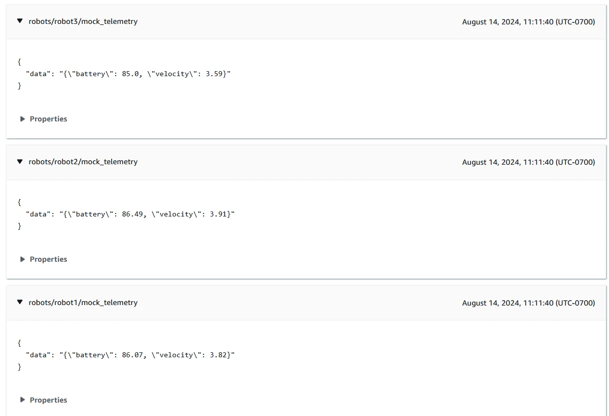

This post is about connecting ROS2 robots to the cloud with a quick and simple Greengrass setup. I'll guide you through building a sample component that can be hosted on a server connected to your robot fleet, which will connect the robots to AWS IoT Core without modifying the robot software in any way. Setup requires installing only a few prerequisites. Let's see how it works!

This post is also available in video form, if you want to follow along:

<iframe class="youtube-video" src="https://www.youtube.com/embed/kyW57FHPU6k?si=ymx0QDSke0fYjB8m" title="YouTube video player" frameborder="0" allow="accelerometer; autoplay; clipboard-write; encrypted-media; gyroscope; picture-in-picture; web-share" referrerpolicy="strict-origin-when-cross-origin" allowfullscreen></iframe>

## Methods of Connecting to IoT Core

### ROS2 Conversion by Robot

A reliable way of connecting robots to the cloud is to provision a Thing for each robot. In AWS, this means registering a Thing in your AWS account and downloading a certificate for each robot, which is then used for authentication and authorization. I have a video on how to set this up, including sample code that you can run through, available here:

<iframe class="youtube-video" src="https://www.youtube.com/embed/OnVewSeayjI?si=8y7LNwpuSrOHUvSU" title="YouTube video player" frameborder="0" allow="accelerometer; autoplay; clipboard-write; encrypted-media; gyroscope; picture-in-picture; web-share" referrerpolicy="strict-origin-when-cross-origin" allowfullscreen></iframe>

I also have another video which extends this setup by connecting all the robots to a single server with AWS IoT Greengrass installed on it, acting as a single connection point to the public internet. This is a hub-and-spoke model where all robots connect to the Greengrass server and the server connects to the cloud. It has the advantage of being easier to manage remotely, offering the ability to download more Greengrass components to the server, and managing a single connection to AWS IoT Core, which reduces costs. I have a video on setting this up as well:

<iframe class="youtube-video" src="https://www.youtube.com/embed/3FHvtxQ62nY?si=1d-hZUaqueBLMroa" title="YouTube video player" frameborder="0" allow="accelerometer; autoplay; clipboard-write; encrypted-media; gyroscope; picture-in-picture; web-share" referrerpolicy="strict-origin-when-cross-origin" allowfullscreen></iframe>

With this method, the individual robots are responsible for converting any messages destined for the cloud into JSON blocks that could be sent as MQTT messages, which requires coding manually and setting up each robot individually with its own certificate and conversion nodes.

### ROS2 Conversion by Greengrass

In this method, the Greengrass server has a component which operates by subscribing to ROS2 topics and converting the messages to MQTT directly. This has two major advantages:

1. The robots do not need certificates, conversion nodes, or any custom code to convert topics.
1. The Greengrass component can be configured from a central location with the topics it should subscribe to.

In addition, the Greengrass server provisions its own AWS IoT certificate, which means that all the server setup requires is installing Greengrass and Docker for running the components. Everything else can be configured from the cloud!

This method comes with its own downsides, including:

1. The Greengrass component does no verification on the device publishing messages on its subscribed topics. That is, if an attacker published messages on the ROS2 network, the Greengrass component would treat them as if they came from a real robot. That means this solution is best used in a closed, protected system, or where the ROS2 network is secured.
1. The component only has public messages available to it. If you use custom messages in your ROS2 applications, you will need to build these into the Greengrass component or provide them separately so the component can convert ROS2 messages to JSON correctly.

If these downsides don't sound too detrimental to use in your system, then let's continue! We'll start by building the Greengrass component and publishing it to our AWS account.

## Building the Greengrass Component

For this sample, we will build a Greengrass component that runs a Docker Compose application. This is the same setup as in my [Deploying Docker Compose with Greengrass](/blog/docker-compose-in-gg) post, and uses the same code as a base. We will use the Docker Compose application to run a ROS2-based Docker container that can be configured to subscribe to any ROS2 topic, and it will dynamically import the relevant message class, subscribe to the topic, convert incoming messages to JSON, and send them over local pub/sub to other Greengrass components. By deploying additional components that include an MQTT broker, we can then automatically forward those messages into the cloud.

Overall, this means we have a system where changing the configuration of our component on the Greengrass server will result in all messages from connected robots being converted and sent to the cloud automatically.

In order to build the Greengrass components, we need a system with a few prerequisites installed. I used a fresh EC2 instance to build the components and run the demo system.

### System Setup

Any platform that can run Docker and Greengrass will work for this demo. I used Ubuntu 24.04, so feel free to translate the commands to your preferred system. The version of Ubuntu does not matter here, as we can use Docker to run any version of ROS2.

First, before installing any prerequisites, make sure your system is up to date:

```bash
sudo apt update && sudo apt upgrade -y
```

Then, we can proceed to install the build requirements.

#### AWS CLI

We can follow the [user guide](https://docs.aws.amazon.com/cli/latest/userguide/getting-started-install.html) for installing the AWS CLI, and the simplest thing to do is execute these commands:

```bash
sudo apt install -y unzip
curl "https://awscli.amazonaws.com/awscli-exe-linux-x86_64.zip" -o "awscliv2.zip"
unzip awscliv2.zip
sudo ./aws/install
```

We also need to provide AWS permissions to the system. In my case, I assigned an IAM role with admin permissions to my EC2 instance.

Check that the installation is working and has valid credentials by running the following command:

```bash
aws sts get-caller-identity
```

#### Docker

The simplest way to install Docker is using the [Get Docker script](https://get.docker.com/), as follows:

```bash
curl https://get.docker.com/ | sh
```

Once installed, make sure your user has permission to run containers as follows:

```bash
sudo usermod -aG docker $USER
# To activate in current shell:
newgrp docker
```

Check that the installation worked by getting responses from the following commands:

```bash
docker --version
docker compose --help
```

#### Greengrass Development Kit

Finally, to build the Greengrass component, [install the Greengrass development kit](https://docs.aws.amazon.com/greengrass/v2/developerguide/install-greengrass-development-kit-cli.html) as follows:


```bash
sudo apt install -y pipx
pipx ensurepath
pipx install git+https://github.com/aws-greengrass/aws-greengrass-gdk-cli.git@v1.6.2
```

Then reload the shell for the PATH changes to take effect, or execute `source ~/.bashrc`. Once complete, you can check the library is working by executing:

```bash
gdk --version
```

### Cloning and Building the Sample

With the system prerequisites installed, let's clone the sample application!

```bash
git clone https://github.com/mikelikesrobots/gg-ros2-mqtt-converter
cd gg-ros2-mqtt-converter
git submodule update --init --recursive
```

The next step is to create two ECR repositories to host the Docker images built by this repository. You can accomplish this in the console or by using the following commands:

```bash
aws ecr create-repository --repository-name aws-iot-robot-connectivity-samples-ros2
aws ecr create-repository --repository-name ros2-mqtt-converter
```

Extract the base URI from either repository URI and edit the `.env` file with the new value. These commands can also accomplish the same automatically:

```bash
URI=$(aws ecr describe-repositories --query repositories[0].repositoryUri --output text | cut -d/ -f1)
sed -i -e "s/REPLACE_ME/$URI/g" .env
```

You should then be ready to build and publish the Docker images and Greengrass component using the following scripts:

```bash
./build_all.sh
./publish_all.sh
```

This is all that's needed to build the software. This process only needs to be completed once per AWS account, no matter how many Greengrass deployments are created from it.

Let's take a look at what it's doing to understand how it works.

### Understanding the Component

This repository builds one Greengrass component which runs two Docker images. The component only needs one of the two for message conversion - the other image is used to produce mock data so we can see the system working. We can see this in the `components/io.github.mikelikesrobots.Ros2MqttConverter/docker-compose.yml` file:

```yaml
ros2-mqtt-converter:
  image: "{ECR_REPO}/ros2-mqtt-converter:latest"
# ...
robot-1:
  image: "{ECR_REPO}/aws-iot-robot-connectivity-samples-ros2:latest"
```

This is showing the converter using the `ros2-mqtt-converter` Docker image and three robots using the `aws-iot-robot-connectivity-samples-ros2`. If we had a system with real data, we could strip these services from the Docker Compose and remove the related folder from the `docker` folder.

We can also see each of the three robot services have namespaces set:

```yaml
robot-1:
  image: "{ECR_REPO}/aws-iot-robot-connectivity-samples-ros2:latest"
  command: ros2 run telemetry_mqtt mock_telemetry_pub --ros-args -r __ns:=/robot1
```

This is to separate the mock telemetry produced by each of the robots. In your own robot fleet, the messages should be namespaced to include the robot they came from so that this information can be included when ingesting data to the cloud.

The converter component works by taking a list of topics to subscribe to and trying to dynamically import the relevant message class for those topics. This is done at startup and periodically afterwards, to account for the cases where a topic isn't yet available, so the message type cannot be determined. The logic is contained in the `_update_subscriptions` method on line 56 of `converter.py`:

```python
def _update_subscriptions(self):
    topic_tuples = self.get_topic_names_and_types()
    available_topics = dict((key, val[0]) for key, val in topic_tuples)
    for topic in self._config:
        # topic already exists in both? Continue
        if topic in available_topics and topic in self._dynamic_subscriptions:
            self.get_logger().info("Subbed to {} already".format(topic))
            continue
        # if topic is subscribed but has no topic name, delete
        elif topic not in available_topics and topic in self._dynamic_subscriptions:
            self.get_logger().info("Destroying sub for {}".format(topic))
            self.destroy_subscription(self._dynamic_subscriptions.pop(topic))
        # if topic is not subscribed but should be, subscribe to it
        elif topic in available_topics and topic not in self._dynamic_subscriptions:
            self._subscribe_to(topic, available_topics[topic])
```

ROS2 provides a method to get all available topic names and types. These are then compared to the list of topics to subscribe to, and if any topic is available that hasn't already been subscribed to, the method `_subscribe_to` is called with the topic name and type:

```python
def _subscribe_to(self, topic_name, topic_type):
    logger = self.get_logger()
    logger.info("Creating subscription to topic {}".format(topic_name))
    pkg = ".".join(topic_type.split("/")[:-1])
    _cls = topic_type.split("/")[-1]
    logger.info("from {} import {}".format(pkg, _cls))
    msg_type = getattr(__import__(pkg, globals(), locals(), [_cls], 0), _cls)

    sub = self.create_subscription(
        msg_type,
        topic_name,
        lambda msg: self._callback(topic_name, msg),
        10
    )
    # self._subscriptions is in use by the base class
    self._dynamic_subscriptions[topic_name] = sub
```

This function parses the message type string to find the import path, then tries to import the class. If successful, the node will create a subscription that calls the `_callback` method with the topic name and message contents:

```python
def _callback(self, topic_name, msg):
    mqtt_topic = "robots/" + topic_name
    mqtt_topic = mqtt_topic.replace("//", "/")

    ordered_dict = message_to_ordereddict(msg)
    mqtt_msg = json.dumps(ordered_dict)

    self.get_logger().debug("Publishing on topic {} with message {}".format(mqtt_topic, mqtt_msg))

    binary_message = BinaryMessage(message=bytes(mqtt_msg, "utf-8"))
    publish_message = PublishMessage(binary_message=binary_message)
    self._ipc_client.publish_to_topic(topic=mqtt_topic, publish_message=publish_message)
```

Inside the callback, the message is converted to an ordered dictionary by a ROS2 method, then converted to JSON by the `json` package. This is sufficient to package and publish, so the node then publishes the request to publish over local pub/sub to Greengrass. From there, the Bridge and MQTT broker take the message and publish it to AWS IoT Core. This mechanism is described more in [Testing the Component](#testing-the-component).

Now we understand how the converter functions, let's see how to use it, and discuss the data flow through Greengrass to publish to the cloud.

## Testing the Component

To test the component out, we need a Greengrass installation. I will continue to use the same machine for testing, as the prerequisites for building the code are also useful for installing Greengrass. We only have one more dependency to install:

```bash
sudo apt install -y default-jre
```

To set up Greengrass, including with a deployment of our new component, we only need to run the `scripts/setup_greengrass.sh` script. This script downloads the Greengrass installer and runs it with some parameters that you may need to update, such as the region. Once complete, it retrieves the ARN of the Greengrass core device you just created, then creates a deployment for it that includes all of the components we need.

If you would like to learn more about Greengrass and see a more thorough guide on installing it, take a look at my video linked below:

<iframe class="youtube-video" src="https://www.youtube.com/embed/2VXIILtiMiU?si=R47FbTkgP4nh3scq" title="YouTube video player" frameborder="0" allow="accelerometer; autoplay; clipboard-write; encrypted-media; gyroscope; picture-in-picture; web-share" referrerpolicy="strict-origin-when-cross-origin" allowfullscreen></iframe>

The components and config are defined in the `scripts/greengrass_deployment_config.json` file. This defines a few components with some configuration:

1. Nucleus - needed for all Greengrass operations.
1. Cli - not required in this instance, but useful to modify the installation locally.
1. EMQX - an MQTT broker provided by AWS. This will be used to publish messages to AWS IoT Core.
1. MQTT Bridge - a component that can be configured to pass messages between AWS IoT Core, the local MQTT broker, or Greengrass's pub sub mechanism. In this case, it is configured to forward any message received on local pub/sub that begins with `robots/` up to AWS IoT Core.
1. Docker Application Manager - required to run Docker containers, including the ROS2 MQTT Converter.
1. ROS2 MQTT Converter - our custom component, configured to listen to the `mock_telemetry` topic of three robots.

Between these components, the data flows as follows:

1. Robots 1, 2, and 3 in the Greengrass component publish mock telemetry messages.
1. ROS2 MQTT Converter is subscribed to these topics. It receives the messages, converts them to JSON, and publishes them using Greengrass pub/sub.
1. The MQTT Bridge subscribes to these messages and packs them into MQTT messages, then uses the MQTT Broker to publish to AWS IoT Core.
1. The messages are received in AWS IoT Core.

Try updating the script with your region and any other parameters you wish to change, then run it to see the results:

```bash
./scripts/setup_greengrass.sh
```

Once the Greengrass core device has had a few minutes to start up and receive its deployment, it should start a few Docker containers and begin publishing messages to AWS IoT Core. We can check this using the [MQTT Test Client](https://us-west-2.console.aws.amazon.com/iot/home?region=us-west-2#/test) by subscribing to the `#` topic and seeing the messages come through:



## Next Steps

In this post, I showed how to set up a Greengrass component that will subscribe to ROS2 topics and send messages up to AWS IoT Core automatically, with the option to configure the subscription topics in the cloud via Greengrass. With this working, I would recommend removing the mock data generator and connecting it to your robot fleet. You will soon find that the component is missing messages you need, either from custom ones you have defined or standard ones in extra packages, such as nav messages. See if you can figure out how to add the message definitions to the Greengrass component!

You could also work on [ingesting the data into AWS IoT SiteWise](https://youtu.be/9ZRZhrJFz7A), or [retrieving logs and posting them to Amazon Cloudwatch](https://youtu.be/cCZwQfaE6Jc). Both are topics I have covered in previous videos, but with a different way of connecting robots to the cloud. Try using the new method to ingest data and collect logs into the cloud!
