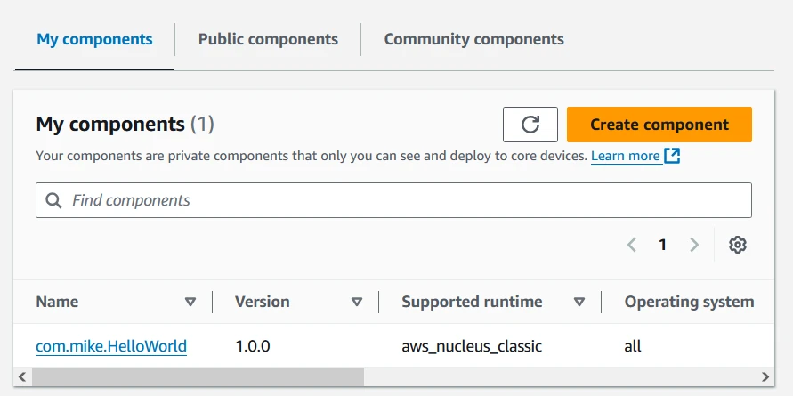

AWS IoT Greengrass, or Greengrass for short, is a way of deploying software to
an edge device, like a server on a factory floor, and managing the lifecycle of
that software. From the cloud you can configure the software that is deployed
to the edge and how that software is configured, as well as build your own
software to be deployed by Greengrass.

There are three parts: building and deploying [software
applications](#building-a-component), the device(s) that those applications are
being deployed to, and the [management service](#management-service) doing the
deployment. This post goes over each part to explain how Greengrass as a whole
works, and how you can try it out for yourself.

_This post was originally published as a video, but given how many people it has
helped, converting it to a blog post made sense. If you prefer video format,
click below._

<iframe class="youtube-video" src="https://www.youtube.com/embed/2VXIILtiMiU?si=9ShnkT9WRSnuaV4I" title="YouTube video player" frameborder="0" allow="accelerometer; autoplay; clipboard-write; encrypted-media; gyroscope; picture-in-picture; web-share" referrerpolicy="strict-origin-when-cross-origin" allowfullscreen></iframe>

<!-- truncate -->

## Management Service

The management service is the part of Greengrass running in the AWS cloud. In
the AWS console, there are 3 subheadings under Greengrass devices that show the
main concepts of the management service:

- [Core devices](#core-devices)
- [Components](#components)
- [Deployments](#components)


### Core Devices

Each core device is a server or device at the edge which has been registered
with Greengrass as a core device by the Nucleus software. In the console,
clicking core devices will go to a list of all the core devices registered with
the account.


The Nucleus is software deployed to all core devices. It is responsible for
registering a device as a core device, managing the lifecycles of all software
deployed to that device, and reporting the device status back to the cloud.

Clicking on any core device brings up more information about that device, such
as its corresponding IoT Thing name, its status, logs, platform, and installed
components. It also has a list of [deployments](#deployments), as each core
device can have multiple [deployments](#deployments).


### Deployments

A deployment is a group of [components](#components), with specific version
numbers and configuration per component. When a deployment is created or
revised, the information in that deployment is sent to a core device. The core
device can then download any new [components](#components) it needs, start and
stop software as needed, and apply new configuration as instructed by the
deployment.

In the console, opening a deployment shows its status, time of creation, and
list of [components](#components) within the deployment. Each component is
listed with the version in the deployment. There are bullet points by each
component to allow you to select that component and view its configuration. In
the custom component built for this post, the message has been changed to
"YouTube".


### Components

A component is a defined bundle of software and the configuration needed to
manage and run that software.

There are 3 types of components available from the Components list in the
Console:

- My components
- Public components
- Community components

**My components** are the components that a user has built and uploaded to their
AWS account. This means that you can build your own Greengrass components from
scratch and make use of Greengrass to deploy and configure it to any [core
devices](#core-devices).



**Public components** are [components made available by
AWS](https://docs.aws.amazon.com/greengrass/v2/developerguide/public-components.html)
directly. There is a long and growing list of components available here: a few
examples are a Secrets Manager, for deploying Secrets to the device in a secure
way; the MQTT bridge, which allows MQTT message passing from cloud to device and
back; and Secure Tunneling, which allows a user to create an SSH tunnel from the
cloud to the core device.


Finally, **Community components** are a list of components that the Greengrass
team keeps track of that you can build and upload to your own account, then
deploy to your own devices, just as with **My components**.

### Management Service Summary

Overall, the cloud service is responsible for tracking [core
devices](#core-devices) registered with Greengrass and managing
[deployments](#deployments) for those devices. Each deployment is a list of
[components](#components) with the exact version and configuration to be
deployed. Components are the bundles of software and configuration that can be
deployed to devices, which can be built by yourself (manually or from open
source) or supplied by AWS.

## Core Device Demonstration

To demonstrate setting up a core device for Greengrass, I'll use an EC2
instance. Feel free to follow along, although I wrote this as a demo rather than
a lab; some steps may be missing.

You can follow the documentation at [Install the AWS IoT Greengrass Core
software](https://docs.aws.amazon.com/greengrass/v2/developerguide/install-greengrass-core-v2.html),
but I refer to instructions from the [automatic
provisioning](https://docs.aws.amazon.com/greengrass/v2/developerguide/quick-installation.html)
link.

### Provision EC2 Instance

First, I'm provisioning an EC2 isntance with these settings:

- Name: Greengrass Server
- AMI: Amazon Linux 2023 AMI
- Region: us-east-1
- Instance type: t2.micro
- Key pair: Proceed without
- Network: Any security group that allows port 22
- Storage: 30GiB gp3
- Number of instances: 1


It's important that the machine has AWS CLI permissions for Greengrass to
install itself correctly. I'm doing this by creating a role for EC2 with
AdministratorAccess permissions and assigning it to the instance.

### Install Greengrass Dependencies

With the instance up, I use Instance Connect to get a command line. I then
install Java using the following command:

```bash
sudo dnf install java-11-amazon-corretto -y
```

### Install Greengrass Core

There are a few ways to install Greengrass Core, but I tend to copy the
installation commands from the console. Other ways are listed in the [automatic
provisioning](https://docs.aws.amazon.com/greengrass/v2/developerguide/quick-installation.html)
instructions.

In the Console, I navigate to Core Devices, then click Set up one Greengrass
core device. I'm leaving the name as it is, selecting no group, and leaving
Linux as the selected Operating System.

For device setup method, I select "Set up a device by downloading and running an
installer locally on device".

Credentials are already be configured from the [provisioning
step](#provision-ec2-instance), so I just run the "Download the installer" and
"Run the installer" commands one at a time to deploy the software.

:::note

Greengrass groups are a way of deploying the same deployment to multiple devices
in the same group at once.

:::

These commands will download a software bundle to install the core device, then
run the bundle. The bundle creates users and permissions both locally and in the
cloud to correctly function, and starts the Nucleus component.


### Check Core Devices

With installation complete, the new core device appears in the list. If I click
that device and go to the deployments, there is one deployment available. The
deployment lists only the Cli component to be installed, and it has a
Device status of Healthy and a Deployment status of Active (soon to become
Completed).


An Active status means that software is still being deployed to the device.
Completed means a successful deployment.

If we look at the core device again, it now lists several components, rather
than just the Cli. The Cli depends on a few components to work correctly, and
Greengrass will automatically install these dependencies for you.


### Revise the Deployment

With the Cli installed on the new core device, it's time to deploy another
component. This is done by revising the deployment. In the deployment screen,
I select the Actions drop-down in the top right and click Revise.


For the Select components screen, there are two tables available. The first is
My components, which contains all of your custom components. Tick the custom
component from this section.

There are also Public components. Only Cli will be visible here; to see other
available components, uncheck the Show only selected components button.


The next screen is for configuring components. I'm configuring the Hello World
component by checking the circle by it and clicking Configure component. This
shows the default configuration, the configuration paths to reset (clearing that
configuration), and the configuration to merge (adding that configuration). For
more information, see the [recipe section](#the-recipe) later in this post.


I add a new line in the Configuration to merge section:

```json
{
    "Message": "Your Message Here"
}
```


Then I click Confirm and go to the next screen. This is advanced settings, which
you are welcome to explore, but is out of scope for this post. Again, I click
Next to go to the next screen.

Finally, I double-check the deployment on the Review screen, and click Confirm
to start the deployment. Again, I have to wait for the deployment to complete.

:::note

If you are following along using the component from the [Building a
Component](#building-a-component) section, make sure you [Authorize core devices
to interact with AWS
services](https://docs.aws.amazon.com/greengrass/v2/developerguide/device-service-role.html)
\- in this case, Greengrass needs to be able to download components from your S3
  bucket.

:::

### Debugging Deployment Failures

The component fails to deploy, causing the deployment status to become Failed.
In this case, we need to take a look at the device to figure out what went
wrong.


I go back to the Instance Connect screen. Unless you've changed the installation
path, logs will be stored in `/greengrass/v2/logs`. I use `vim` as `sudo` user
to access this folder, as it is protected against your normal user.

```bash
sudo vim /greengrass/v2/logs
```

Here we can see all the logs available. The `greengrass.log` file contains the
log for the Nucleus software, and often contains errors to do with deployment
failures. However, in this case, the error will be in the component's log file,
`com.mike.HelloWorld.log`.

```bash
../
./
aws.greengrass.Nucleus.log
com.mike.HelloWorld.log
greengrass.log
loader.log
main.log
```

Within this log file, we can see that `pip` was not found as a program on the
system. The component uses `pip` to install dependencies, but it is not
installed by default.

```log
2025-01-09T16:50:22.098Z [WARN] (Copier) com.mike.HelloWorld: stderr. /usr/bin/python3: No module named pip. {scriptName=services.com.mike.HelloWorld.lifecycle.Install, serviceName=com.mike.HelloWorld, currentState=NEW}
2025-01-09T16:50:22.106Z [WARN] (pool-3-thread-27) com.mike.HelloWorld: shell-runner-error. {scriptName=services.com.mike.HelloWorld.lifecycle.Install, serviceName=com.mike.HelloWorld, currentState=NEW, command=["python3 -m pip install virtualenv && python3 -m virtualenv venv && source ./ve..."]}
```

We need to install `pip`:

```bash
sudo dnf install -y python3-pip
```

Once complete, I revise the deployment in the AWS Console without changing any
settings. You can just skip straight to the Review screen to do this. This time
around, the console should show a health device and successful deployment.

### Viewing Messages from the Component

To view the messages printed by the console, you can see the log messages and
the MQTT messages.

The log messages are visible from within the text editor. Just as in the
[debugging](#debugging-deployment-failures) section, I use `vim` to open
`com.mike.HelloWorld.log`. This shows a list of messages showing that the
configured message has been repeatedly printed. Greengrass will capture any log
output from an application and store it in the logs directory for you to view.

We can also see MQTT messages by going to the MQTT Test Client and subscribing
to the `#` topic, which receives all MQTT messages. Here, we should see two
messages per second with the custom message inside.


### Summary

In this section, we saw how to provision an EC2 instance and configure it as a
Greengrass core device. We saw that Greengrass automatically deploys the Cli
component to it, after which we can revise the deployment to include our own
components. We also saw how to debug a deployment failure. Finally, we saw our
successfully deployed Hello World component printing messages to log files and
sending MQTT messages to IoT Core.

## Building a Component

To show building a custom component, I'll use the source code in the
[greengrass-hello-world Github
repository](https://github.com/mikelikesrobots/greengrass-hello-world). This
component will print a configurable message to the log file and send the same
message to IoT Core using MQTT.

Let's take a look at the important files in the repository.

<!-- TODO: Line number links for all of these -->

### The README

The
[README](https://github.com/mikelikesrobots/greengrass-hello-world/blob/main/README.md)
is less useful to understand the anatomy of a component, but it is the best
starting point for figuring out how to build and deploy the component for
yourself.

### Main file

The entry point of the software is
[`HelloWorld/main.py`](https://github.com/mikelikesrobots/greengrass-hello-world/blob/main/HelloWorld/main.py).
This is a simple script which receives [command line
arguments](https://github.com/mikelikesrobots/greengrass-hello-world/blob/main/HelloWorld/main.py#L10-L11)
from Greengrass to determine what message to send and how often to send it. It
will print the message directly using a [debug
log](https://github.com/mikelikesrobots/greengrass-hello-world/blob/main/HelloWorld/main.py#L18),
and it will use the helper class `IoTPublisher` to [post it as an MQTT message
to IoT
Core](https://github.com/mikelikesrobots/greengrass-hello-world/blob/main/HelloWorld/main.py#L17).

### `IoTPublisher`

`IoTPublisher` is defined in the [`HelloWorld/src/iot_publisher.py`
file](https://github.com/mikelikesrobots/greengrass-hello-world/blob/main/HelloWorld/src/iot_publisher.py).
It uses the IoT SDK from AWS to pass messages to the Nucleus, using
[Inter-Process Communication
(IPC)](https://en.wikipedia.org/wiki/Inter-process_communication) to do so. This
library can be used to pass requests to the Nucleus, such as requesting a
message be published on a particular topic. The Nucleus checks that the
requester has enough permissions for the request before carrying it out.

### The Recipe

This is the most important file of a Greengrass component. It is defined as
[`HelloWorld/recipe.yaml`](https://github.com/mikelikesrobots/greengrass-hello-world/blob/main/HelloWorld/recipe.yaml)
in this repository, but it can also be defined in JSON. This file instructs the
core device on how to retrieve the software to run, how to unpack it, the
required configuration, and how to control its lifecycle.

For this component, the configuration includes [two fields for the
application](https://github.com/mikelikesrobots/greengrass-hello-world/blob/main/HelloWorld/recipe.yaml#L9-L10):

```yaml
Message: "World"
Period: 0.5
```

These are the default parameters, but can be overridden by a deployment. They
tell the application what message to write and how frequently.

The component also has [another YAML
block](https://github.com/mikelikesrobots/greengrass-hello-world/blob/main/HelloWorld/recipe.yaml#L11-L19)
to define its default access control:

```yaml
accessControl:
  aws.greengrass.ipc.mqttproxy:
    com.mike.HelloWorld:pubsub:1:
      policyDescription: Publish and subscribe to any topic
      operation:
        - aws.greengrass#PublishToIoTCore
        - aws.greengrass#SubscribeToIoTCore
      resources:
        - "*"
```

This access control block allows the application to publish and subscribe to any
topic. This can also be changed in a deployment, which means that an
administrator can override this block to allow an application to be able to
publish on `topic/test` only, for example.

After the configuration is the [manifests
block](https://github.com/mikelikesrobots/greengrass-hello-world/blob/main/HelloWorld/recipe.yaml#L20-L34).
This defines all the system configurations that are acceptable to run the
component on. For this component, as it is written in Python, it can run on any
system; hence, there is [only one entry with `os:
all`](https://github.com/mikelikesrobots/greengrass-hello-world/blob/main/HelloWorld/recipe.yaml#L22)
set.

The manifest [defines the
`Artifacts`](https://github.com/mikelikesrobots/greengrass-hello-world/blob/main/HelloWorld/recipe.yaml#L23-L25)
as all the locations software must be downloaded from.

```yaml
Artifacts:
  - URI: "s3://BUCKET_NAME/COMPONENT_NAME/COMPONENT_VERSION/HelloWorld.zip"
    Unarchive: ZIP
```

This block says to download the `HelloWorld.zip` file from an S3 bucket, which
must be accessible to the core device. The core device can then unzip the file
to get access to the Python files.

Finally, the lifecycle of the component is defined. This component has two
lifecycle stages: Install and Run.

In the [Install
stage](https://github.com/mikelikesrobots/greengrass-hello-world/blob/main/HelloWorld/recipe.yaml#L27-L30),
it is set to create a virtual environment and install all dependencies into it.

In the [Run
stage](https://github.com/mikelikesrobots/greengrass-hello-world/blob/main/HelloWorld/recipe.yaml#L31-L34),
it is set to activate the virtual environment and run the main script using the
configuration parameters set above.

:::tip

For more options in the recipe file, take a look at the [component recipe
reference](https://docs.aws.amazon.com/greengrass/v2/developerguide/component-recipe-reference.html).

:::

### `gdk-config.json`

One last file to mention is the
[`gdk-config.json`](https://github.com/mikelikesrobots/greengrass-hello-world/blob/main/HelloWorld/gdk-config.json)
file. This file defines how to use the [Greengrass Development Kit
(GDK)](https://docs.aws.amazon.com/greengrass/v2/developerguide/greengrass-development-kit-cli.html)
to build and deploy the component into the cloud.

Those are the most important files. If you want to see more complicated
examples, take a look at the [community components
Github](https://github.com/aws-greengrass/aws-greengrass-software-catalog).

## Summary and Challenge

This post showed the three main elements of Greengrass to understand. First, the
management service, which tracks Core Devices and deploys software to them using
Deployments, with each Deployment containing a list of Components to be
deployed.

The post also showed how to set up a Linux device as a core device,
demonstrating how to do so using a new Amazon EC2 instance. After setting up as
a core device, we deployed a custom component to it and saw it producing logs
and MQTT messages.

Finally, we looked at the anatomy of a component. A component is essentially a
recipe file which defines default configuration and how to download, install,
and run software for one or more target configurations.

Now that you understand Greengrass Concepts and Components, try to set up your
own EC2 instance as a core device and deploy the custom component to it. Then
change the configuration so that the printed message changes. If you can manage
to do this, you'll have all the basics necessary to work with Greengrass
yourself!
