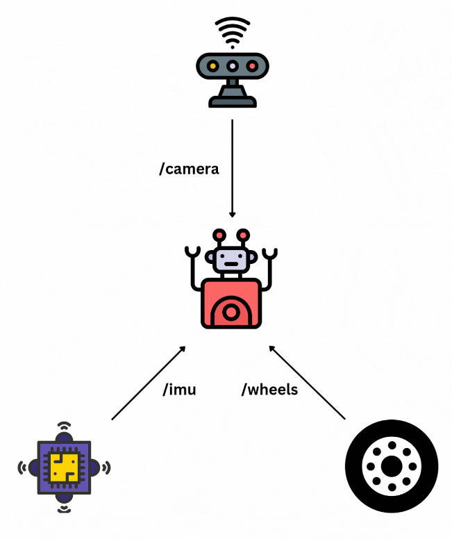
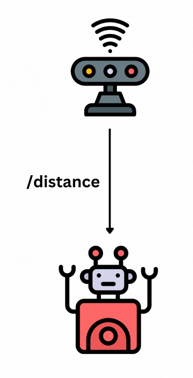
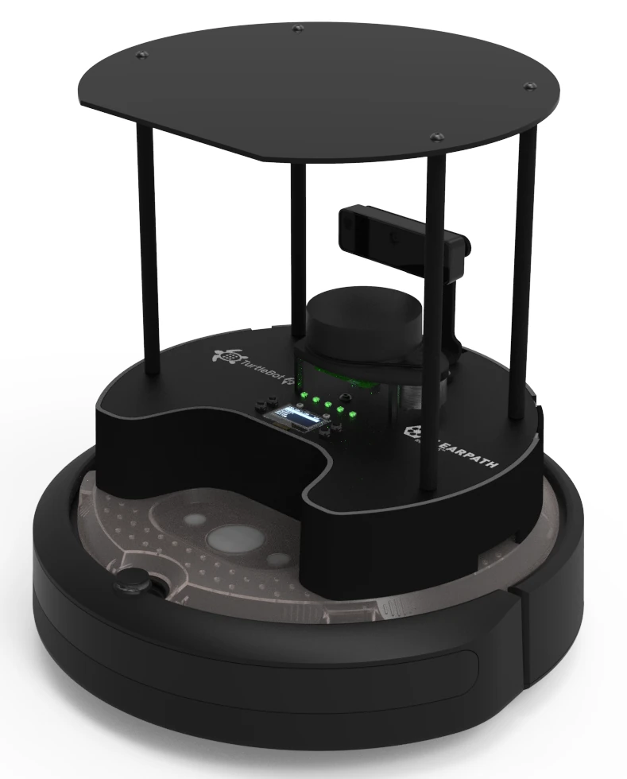

<!-- Some MDX to give syntax colouring on code -->
import CodeBlock from '@theme/CodeBlock'
import { Feedback, Request, Response } from './code_blocks'

Many of the blogs on this site and the videos on [my YouTube
channel](https://youtube.com/@mikelikesrobots) make use of ROS 2, but I have yet
to describe what ROS 2 is or why it's worth taking the time to learn. This
article is an entry level post on what ROS 2 is, the basic concepts, and why you
might want to learn it.

If you'd prefer to see this post in video form, please check the following link
for the YouTube video:

<iframe class="youtube-video" src="https://www.youtube.com/embed/8aoFndU7jos?si=G2xnuD40pkLY8PpZ" title="YouTube video player" frameborder="0" allow="accelerometer; autoplay; clipboard-write; encrypted-media; gyroscope; picture-in-picture; web-share" referrerpolicy="strict-origin-when-cross-origin" allowfullscreen></iframe>

<!-- truncate -->

## Why learn ROS 2 at all?

ROS 2 provides a useful framework for structuring robotics applications, as well
as tools for interacting with robots and pre-built packages to provide
functionality. This framework and tool set make it easier and faster to write
robotics applications.

The more complex a robot application, the more it benefits from using a scalable
structure, which is what ROS 2 aims to provide. For example, a mobile robot that
needs a localization system to keep track of its position could use multiple
sensors at the same time. Writing one huge robot program with localization
buried inside it makes it increasingly hard to develop.

ROS 2 divides up chunks of software with different responsibilities into
different `nodes`, and allows `nodes` to communicate with each other. That means
our localization system can be its own `node` which uses data from the camera
`node`, the IMU `node`, and the wheel encoder `node`, with each sensor `node`
written separately.

Dividing up the software like this makes it much easier to scale up, add new
functionality (such as new sensors), and distribute parts of the robot software
across teams of engineers. It also makes it possible to inspect parts of the
robot system, such as what each node is doing, or how frequently data is being
read from a particular sensor.

It is not necessary to use ROS 2 to build scalable software. Many robotics
applications can be written as one large program, or follow their own pattern
for splitting up robot software. In fact, robotics companies frequently start
their software in ROS 2, then adapt it to their own custom system over time. It
is your choice whether to use it or not - but if you do, you will benefit from
the de facto standard robotics software, which is being actively worked on and
has a large, supportive community behind it.

### ROS 2's Predecessor: ROS

ROS 2 is the successor to ROS, which stands for Robot Operating System. Original
ROS had similar intentions to ROS 2 and proved very popular as a way to get a
robot working quickly, because of the framework and tools it provided, and
because it was free and open source software. ROS is still available for use,
but given it is no longer being actively developed, new applications should use
ROS 2.

ROS 2 takes the excellent starting point from ROS and improves upon the rest. For
a beginner, the changes are not obvious, as the interface and structure is
*mostly* the same. However, for intermediate level, having a new messaging
system and the ability to secure communications are just a couple of the
important improvements ROS 2 brings. All of this makes ROS 2 easy to recommend as
a starting point for hobby projects and professional developments alike.

The rest of this article will focus on ROS 2 only.

## ROS 2 For Beginners

Let's focus on a few major parts of ROS 2 in order to understand it.
Understanding the concepts here should be enough to get you started following
and understanding ROS 2 tutorials.

- [Messaging System](#messaging-system): how nodes in a ROS 2 network can
  interact with one another
- [Packages](#packages): how software is divided up into standalone units that
  can be worked on separately
- [Tools](#topics): how a ROS 2 user can inspect and interact with a running
  application

### Messaging System

The messaging system is the first major benefit of ROS 2. The idea is to divide
up pieces of code for a robotics application into separate `nodes`, where each
`node` runs in a separate process and communicates with other `nodes`
through messages.

For example, this means that a robot with a distance sensor might have one
`node` sending distance messages and another `node` that listens to those
messages to stop the robot if an obstacle is too close.

ROS 2 provides a large number of common message types for use in robotics, such
as an Image from a camera, or a Range measurement from a distance sensor. If
these aren't enough, you can also define your own message types, allowing you to
pass data around in a custom format.

Message passing comes in one of three main forms, explained in detail below:
- [Topics](#topics): publish/subscribe
- [Services](#services): request/response
- [Actions](#actions): request/feedback/response

#### Topics

Topics are the publish/subscribe model of ROS 2. Any node can publish data on any
topic it wants, as long as that topic is not already in use for a different
message type. Any number of nodes can publish to a particular topic.

On the other side, a node can subscribe to any topic it wants. To do so, a
subscriber says the topic it wants to subscribe to, the message type it is
expecting, and the code to call in case of a new message (a `callback`). Then,
whenever a new message comes in, the node's `callback` is called with the
message, allowing it to take action.

For instance, a robot trying to stop in front of obstacles may have two nodes:
- One node reading the distance sensors and publishing `Range` messages on the
  `/distance` topic
- One node subscribed to `Range` messages on the `/distance` topic with a
  callback that stops the robot if the measured `Range` is too close

This allows the robot to stop in front of an obstacle, but also allows any other
node that needs `Range` measurements to subscribe to the `/distance` topic as
well.

#### Services

Services are the request/response model of ROS 2. In this model, any node can
offer a service to perform a particular action. Another node can send a message
to request that service; the first node will then perform the action and send
back a response message.

For example, a robot arm with a gripper attachment might offer a service to
close or open the gripper. Another node can request this service, which causes
the gripper to open or close, then receives a response to its request.

<CodeBlock>
Main Robot -> Gripper: <Request /> close gripper
Gripper -> Main Robot: <Response /> gripper closed successfully
</CodeBlock>

This method makes more sense when a node needs a response to its request before
proceeding. In this example, the robot wants to completely grip an object before
trying to move it, so it should wait for the response saying that the gripper is
closed before moving any further.

#### Actions

Actions are very similar to services, except that they can optionally provide
feedback before sending the final response back to the caller. Therefore, a node
calling an Action will send a Request, receive some Feedback messages, then
receive a final Response message.

In the gripper example from the previous section, the node controlling the
gripper could offer an Action to close the gripper instead of the service. The
Action would send feedback messages with the gripper's current width while it is
closing. The Action might go something like this:

<CodeBlock>
Main Robot -> Gripper: <Request /> close gripper
Gripper -> Main Robot: <Feedback /> gripper is 8cm apart
Gripper -> Main Robot: <Feedback /> gripper is 6cm apart
Gripper -> Main Robot: <Feedback /> gripper is 4cm apart
Gripper -> Main Robot: <Feedback /> gripper is 2cm apart
Gripper -> Main Robot: <Feedback /> gripper is 0cm apart
Gripper -> Main Robot: <Response /> gripper closed successfully
</CodeBlock>

In this way, a node can act upon its feedback while the action is being
performed. This allows the node calling the Action to perform related work; for
example, while navigating along a path, a node could take camera snapshots and
label them with the point along the route they came from.

### Packages

ROS 2 packages are the next major part of ROS 2 to understand. Packages help
divide up code into different folders, where each package contains one or more
nodes. This helps engineers to keep track of where each part of the robot's code
is.

This has an extra advantage. By splitting up code into different packages, it is
possible to make your code reusable by other people - or reuse code written by
other people. For example, to move a robot arm, you could use the ROS 2 package
provided by the arm manufacturer instead of writing your own, saving you time developing and debugging your own.

Given ROS 2's popularity, there are a lot of packages available that you can use
for yourself. All you have to do is install the package onto your system (or
copy it into your ROS 2 workspace) and you can take advantage of new
functionality. For example, you can use
[MoveIt](https://moveit.picknik.ai/main/index.html) to get access to motion
planning, manipulation, 3D perception, kinematics, control, and navigation.

### Tools

The final major benefit of ROS 2 is the tools provided by it. By building or
installing ROS 2, you get access to tools that can help you inspect and interact
with your robot. A few of the major tools are as follows:

- **Recording**: ROS 2 provides rosbags, which is a way of subscribing to topics
  and recording that data into a large file, or rosbag. This bag file can later
  be replayed to produce the same data again.
- **Logging**: ROS 2 allows nodes to log information as they run, which can then
  be recorded to see what happened to the robot as it ran, or viewed live using
  log viewers.
- **Visualization**: desktop applications can subscribe to topics, allowing for
  visualization tools to exist. For example, `rqt` can visualize topics and is
  commonly used to view a robot and its environment, even allowing the user to
  set a goal position for the robot - which actually controls the robot.
- **Transformations**: ROS 2 provides libraries for managing transformations
  between different parts of the robot. For example, the camera and gripper may
  be in different places, so if you spot an object you want to pick up from the
  camera, you need to **transform** that position to the gripper's frame of
  reference.

Between these tools, you can investigate the data being passed around on the
robot live and from recording, check what your nodes are reporting in logs as
they are working, and visualize your full robot and its environment - even
sending navigation targets for your robot to move to.

## A Practical Example

Let's take a look at a practical example - [the TurtleBot
4](https://clearpathrobotics.com/turtlebot-4/). This is an autonomous robot with
a large list of sensors, designed to be used as an educational platform for
ROS 2. The site lists the following sensors available:

- 2D Lidar
- Stereo camera
- IMU
- Floor tracking sensor
- Wheel encoders
- Cliff sensors
- Bump sensor
- Slip detection
- ...

The robot is here, to give you an idea of everything sitting on top:

<figure>

<figcaption>TurtleBot 4 Render - [TurtleBot 4 User Manual](https://turtlebot.github.io/turtlebot4-user-manual/overview/features.html)</figcaption>
</figure>

In this case, we want to use this robot to build a map of a house. We need to
write code to read sensors, move the wheels, and build up a map of the house as
the robot explores it (commonly known as [SLAM: Simultaneous Localization and
Mapping](https://en.wikipedia.org/wiki/Simultaneous_localization_and_mapping)).

All of our sensors are likely to be useful for this application to some degree.
Bump sensors can help find the exact wall location, wheel encoders and IMU can
help with keeping track of our position, the cliff sensors make sure we don't
fall off anything. However, that's a lot of sensors to write code for, and a lot
of sensor data to make use of - and that's before we even get to the SLAM
algorithm!

That is a lot of code to write. Writing one large file to control the robot will
be hard to develop and keep track of, especially if multiple people are working
together on it. This is where using ROS 2 would be very helpful to us - we can
write separate nodes for each type of sensor, a node to control moving the
wheels, and one or more nodes to define the behaviour of the robot.

But, it gets better than that. As mentioned, the TurtleBot is an educational
platform for ROS 2. There are already packages for driving the robot and taking
data from its sensors, and for navigation there is a ROS 2 package called
[Nav2](https://docs.nav2.org/). Between these packages, our robot application
stops being a huge file and instead becomes a collection of pre-built packages,
plus some custom code we write to tie it all together and launch it! There is
still have some development to do, but so much of the heavy lifting has been
done already.

We won't always be so lucky when building robots. Most of the time, the robot
will need some custom code for driving the motors and possibly some sensors. If
done correctly, these can still tie in to the rest of the ROS 2 ecosystem, like
the Nav2 package. If you're interested in the code for driving motors, take a
look at my [`ros2_control`](/blog/jetbot-motors-pt2) post, which goes in-depth
on how to build ROS 2 code to drive motors.

## How Do I Get Started?

Having explained what ROS 2 is, why you might want to learn it, and some of the
major components, you are hopefully ready to learn it for yourself. If so, great
news! ROS 2 has extensive information on how to get up and running, including a
[whole set of tutorials](https://docs.ros.org/en/jazzy/Tutorials.html) that use
their `turtlesim` software to let you try out anything you like without even
needing a robot of your own. 

Further to this, ROS 2 is a very popular framework for robotics, meaning that
there are a lot of resources available online for it - including on [my own
blog](/blog/tags/ros-2).

If you're looking for a challenge, and to build your own robot, take a look at
the [CamJam Edukit post](/blog/camjam-edukit). You can buy your own kit for a
surprisingly low cost and have a go at building it for yourself. I will have a
new post and video up very soon on how to run this post with ROS 2, and I will
update this post once it's published - or you can subscribe to the YouTube
channel to get notified when it's out.

Good luck on your ROS 2 journey!
