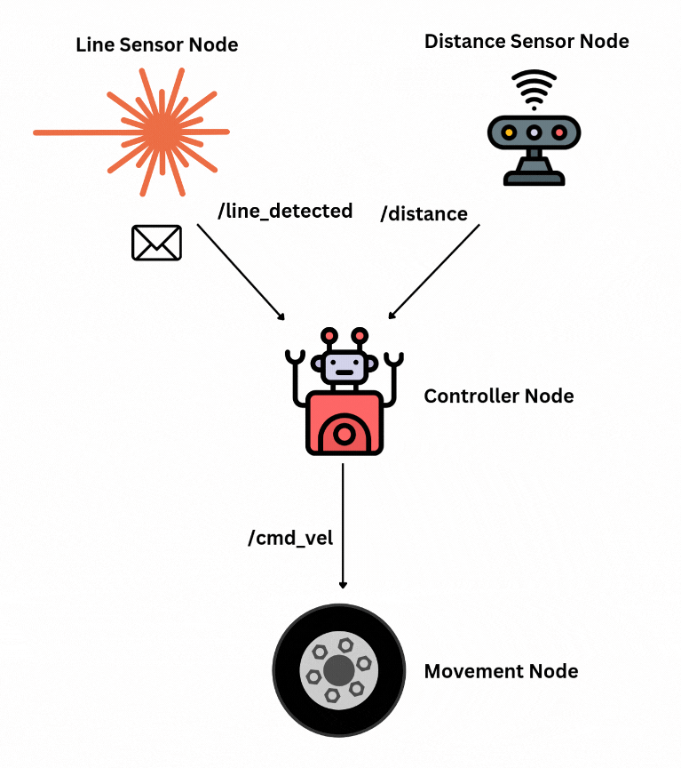

This post shows how to use [ROS 2](https://docs.ros.org/en/jazzy/index.html) to
control the CamJam EduKit #3. It uses a [Raspberry Pi Zero
2W](https://www.raspberrypi.com/products/raspberry-pi-zero-2-w/), which is a
small development board with minimal compute power. However, the Pi Zero can
still run a full Linux Operating System, which makes it a great entry point into
building your own cost-effective robot. All instructions should be
applicable to more powerful Raspberry Pi models, such as the 4 or 5 models.

The [CamJam EduKit #3](https://camjam.me/?page_id=1035) is a cheap robot kit you
can use to build your robot. I have a [series of videos on
YouTube](https://www.youtube.com/playlist?list=PLBrq1OKRHMwUbbujTlmt1YGRzL9O0LfNJ)
of how to assemble and run the kit, and a [blog post](/blog/camjam-edukit) that
will tell you what each video is for. It comes with a series of worksheets to
get to following a line course or avoiding obstacles; this post aims to combine
the line following with obstacle avoidance, while using ROS 2 to read the
sensors and move the robot.

This post is also available in video form. If you'd prefer to watch, click the
link below:

<iframe class="youtube-video" src="https://www.youtube.com/embed/JxhMEpHXym4?si=tzme7QR86opYRF7K" title="YouTube video player" frameborder="0" allow="accelerometer; autoplay; clipboard-write; encrypted-media; gyroscope; picture-in-picture; web-share" referrerpolicy="strict-origin-when-cross-origin" allowfullscreen></iframe>

<!-- truncate -->

## Why use ROS 2?

The EduKit comes with worksheets and sample Python code for controlling the
robot without ROS 2, so why bother to install ROS 2 at all?

The short answer is that ROS 2 isn't *that* useful for a simple robot like this
one, but it paves the way for us to add more complexity in, and it does have
some useful benefits. For example, it becomes much easier to add more sensors to
the robot, or control the robot using a gamepad plugged into another computer on
the same network as the Pi. This is how we were able to use a keyboard to [move
the JetBot around](/blog/jetbot-motors-pt2#running-on-the-jetbot).

In this case, we will use it to continuously **publish** the sensor data from
both the distance sensor and the line sensor, then have separate **nodes** to
determine how to move the robot and to translate movement commands into moving
the wheels.

:::tip

If you're brand new to ROS 2, check out my [Getting Started with ROS
2](/blog/getting-started-ros-2) post, which talks about the key concepts of ROS
2 and why you might want to learn it for yourself. From there, you can start to
learn from the [official
tutorials](https://docs.ros.org/en/jazzy/Tutorials.html) or [other posts on this
site](/blog/tags/ros-2).

:::

With a better idea of why we want to use ROS 2, let's take a look at how to set
it up on the Raspberry Pi Zero.

## Setting up ROS 2

The easiest way to set up ROS 2 on Ubuntu is to install the binaries using
`apt`, as described in the rest of this section. However, if you aren't using
Ubuntu, you can either [install from
source](https://docs.ros.org/en/jazzy/Installation/Alternatives/Ubuntu-Development-Setup.html),
or use
[Docker](https://docs.ros.org/en/jazzy/How-To-Guides/Run-2-nodes-in-single-or-separate-docker-containers.html).

:::warning[Docker probably won't work for the Pi Zero]

I tried to write this post with extra instructions for Docker and Podman, so
that anyone using a Pi Zero running Raspberry Pi OS (or those that just prefer
Docker) could still follow along.

The container could build the workspace, but not run it; it was too much work
and the board would crash. Feel free to try for yourself - you may have better
luck! You can find out more about how to build a suitable Docker image in this
post on [Running ROS 2 on Raspberry Pi
5](https://adventures-with-pi.blogspot.com/2024/08/running-ros2-on-raspberry-pi-5.html).

:::

The reason I used Ubuntu for my Raspberry Pi so far is to make it easier to
install ROS 2 now, so if you've been following along, it should be easy!

To install ROS 2, you can follow the instructions for your board depending on the
version of Ubuntu you are running:

- Ubuntu Jammy (22.04): ROS 2 Humble or Iron
- Ubuntu Noble (24.04): ROS 2 Jazzy

I reflashed my own board to use Ubuntu Noble, so I use the [installation
instructions for ROS 2
Jazzy](https://docs.ros.org/en/jazzy/Installation/Ubuntu-Install-Debs.html). You
can also take a look at the instructions for [ROS 2 on Raspberry
Pi](https://docs.ros.org/en/jazzy/How-To-Guides/Installing-on-Raspberry-Pi.html).

### SSH Connection

Open a terminal, such as Command Prompt on Windows or Terminal on Linux. If you
are using Linux or Mac, you should have SSH already available. If you are on
Windows, try to install [OpenSSH following these
instructions](https://learn.microsoft.com/en-us/windows-server/administration/openssh/openssh_install_firstuse).

:::warning[VSCode might crash the Pi Zero]

In the past, I used VSCode over SSH to edit and run scripts on the robot. For
installing ROS 2, I recommend using a terminal to SSH instead. The board is not
very powerful, so running any ROS 2 command has a high chance of freezing and
restarting the board - at least from my own testing.

If you're on a more powerful version of the Raspberry Pi, you can ignore this
warning!

:::

Once complete, make sure your computer and the Raspberry Pi are both on and
connected to the same network. SSH in to the board using `ssh user@rpi0` - these
will depend on the username and hostname that you set while flashing the board.
For me, this is `ssh mike@rpi0`.

All commands from here on are run in the SSH session with the Raspberry Pi. If
the board goes down, keep trying to SSH in again until it accepts the
connection.

### System Setup

To enable the required repositories, execute the following commands:

```bash
sudo apt install software-properties-common
sudo add-apt-repository universe
```

Add the ROS 2 GPG key:

```bash
sudo apt update && sudo apt install curl -y
sudo curl -sSL https://raw.githubusercontent.com/ros/rosdistro/master/ros.key -o /usr/share/keyrings/ros-archive-keyring.gpg
```

Then add the repository for ROS 2. We added the GPG key so that the board will
connect to this repository without errors.

```bash
echo "deb [arch=$(dpkg --print-architecture) signed-by=/usr/share/keyrings/ros-archive-keyring.gpg] http://packages.ros.org/ros2/ubuntu $(. /etc/os-release && echo $UBUNTU_CODENAME) main" | sudo tee /etc/apt/sources.list.d/ros2.list > /dev/null
```

With all the system dependencies installed, it's time to install ROS 2 itself.

### Installing ROS 2

First, make sure the system is up to date after adding the new repositories.
This may take some time if you've not done it after flashing:

```bash
sudo apt update && sudo apt upgrade -y
```

For this tutorial, we will need the right ROS 2 version and the dev tools.
Replace `jazzy` with your version of ROS 2 for these instructions.

```bash
sudo apt update && sudo apt install ros-dev-tools ros-jazzy-desktop
```

Again, this is likely to take some time. Once complete, you should be able to
run the following command:

```bash
source /opt/ros/jazzy/setup.bash
```

If this works, you're in good shape to start checking out the code! If not, make
sure you installed the right packages above, and take a look at the installation
instructions to see if you (or I) missed anything.

:::note

Running this `source /opt/ros/jazzy/setup.bash` command is important to be able
to run any ROS 2 command. If you open a new SSH session, or the board restarts
for any reason, make sure to run this command again.

:::

### Enabling Access to `RPi.GPIO`

To be able to access the GPIO on the Raspberry Pi, which is required to read the
sensors and turn the motors, we first need to install the library:

```bash
sudo apt install -y python3-rpi.gpio
```

We then need to give our user permission access to the GPIO on the board, so
that we can run ROS 2 nodes. To do so, execute the following:

```bash
sudo usermod -a -G spi $USER
sudo usermod -a -G gpio $USER
sudo usermod -a -G i2c $USER
```

Then edit the file `/etc/udev/rules.d/99-com.rules` as root. You could do this
by executing `sudo nano /etc/udev/rules.d/99-com.rules`. Give it the following
contents:

```bash
SUBSYSTEM=="spidev" , GROUP="spi" , MODE="0660"
KERNEL=="i2c-0"     , GROUP="i2c" , MODE="0660"
KERNEL=="i2c-[1-9]*", GROUP="i2c" , MODE="0660"
KERNEL=="gpiomem"   , GROUP="gpio", MODE="0660"
```

Activate the new permissions by executing this command:

```bash
sudo udevadm control --reload-rules && sudo udevadm trigger
```

Then, log out and back in again. This should be all the configuration needed.

With ROS 2 installed and the system configured, let's take a look at how to
download and build the source code.

## Building the CamJam Packages

### Creating a Workspace

ROS 2 uses workspaces to keep track of everything it needs for a robotics
application. You can use any folder you want as a workspace, but I tend to use
`ros2_ws` as the workspace name, where `ws` stands for workspace. If you want to
use another name, you can edit the commands below with the new name.

First, create the workspace folders and change directory into the `src` folder.

```bash
mkdir -p ~/ros2_ws/src
cd ~/ros2_ws/src
```

Then, clone the packages for the CamJam into the `src` folder. Each package
contains one or more nodes which are useful for running the robot. By cloning
each one, we can build everything together in the same workspace and be able to
launch it all at the same time.

```bash
git clone https://github.com/mikelikesrobots/camjam_sensors.git src/camjam_sensors
git clone https://github.com/mikelikesrobots/camjam_control.git src/camjam_control
```

### Building the Workspace

Next, build the code using `colcon`. The `--symlink-install` means that Python
files are linked instead of copied, which means that changes in the original
will be reflected in the output. Normally, the files are copied, which means
that editing the original has no effect on the copied file.

```bash
cd ~/ros2_ws
colcon build --symlink-install
```

The output should look something like this:

```bash
Starting >>> camjam_control
Starting >>> camjam_sensors
Finished <<< camjam_sensors [19.7s]
Finished <<< camjam_control [20.0s]

Summary: 2 packages finished [22.1s]
```

If the packages built successfully, we are able to start running!

### Running the Robot Software

Once we've built the workspace, we need a second `source` command:

```bash
source install/setup.bash
```

This is the command that sets up our ROS 2 environment, so that when we run ROS
2 commands, it knows where the required files are.

With that complete, make sure that the motor power is on and execute the
following:

```bash
ros2 launch camjam_control camjam_control.launch.py
```

The section on [Explaining the Code](#explaining-the-code) goes over how this
works in more detail, but essentially it launches all of the nodes for the
sensors, main behaviour, and wheel control. Once this has had time to start up,
the robot will start trying to follow a line. Put it on a line course and see
how it does!


Here are some of the logs from running my own robot around the course:

```
[control-3] [INFO] [1738250012.724674335] [camjam01.controller]: Found line! Following...
[control-3] [INFO] [1738250012.844485123] [camjam01.controller]: Lost line! Finding...
[control-3] [INFO] [1738250013.474098541] [camjam01.controller]: Trying right...
[control-3] [INFO] [1738250014.034229698] [camjam01.controller]: Found line! Following...
[control-3] [INFO] [1738250014.094463606] [camjam01.controller]: Lost line! Finding...
[control-3] [INFO] [1738250014.674026633] [camjam01.controller]: Trying left...
[control-3] [INFO] [1738250015.544929398] [camjam01.controller]: Found line! Following...
[control-3] [INFO] [1738250015.604943673] [camjam01.controller]: Lost line! Finding...
[control-3] [INFO] [1738250016.274049901] [camjam01.controller]: Trying right...
[control-3] [INFO] [1738250017.324330833] [camjam01.controller]: Found line! Following...
[control-3] [INFO] [1738250017.434205724] [camjam01.controller]: Lost line! Finding...
[control-3] [INFO] [1738250018.073983312] [camjam01.controller]: Trying left...
[
```

Line following is not all the robot does; it also avoids obstacles. If you put
something large in front of the robot, it will back away until it's far enough
to resume searching for the line.


Here are some of my logs from the robot trying to avoid obstacles:

```
[control-3] [INFO] [1738250039.426828548] [camjam01.controller]: Obstacle too close - avoiding!
[control-3] [INFO] [1738250039.473658732] [camjam01.controller]: I'm avoiding an obstacle...
[control-3] [INFO] [1738250039.674483211] [camjam01.controller]: I'm avoiding an obstacle...
[control-3] [INFO] [1738250039.684512502] [camjam01.controller]: Obstacle too close - avoiding!
[control-3] [INFO] [1738250039.873822858] [camjam01.controller]: I'm avoiding an obstacle...
[control-3] [INFO] [1738250039.929521770] [camjam01.controller]: Obstacle cleared. Looking for line...
```

And that's it! We have successfully installed ROS 2, downloaded and built
packages for controlling the CamJam EduKit #3, and run an application that
follows a line while avoiding obstacles.

**Let's take a closer look at how the code works.**

## Explaining the Code

The code is split into two packages: `camjam_control` and `camjam_sensors`. Each
package contains two nodes.

The `camjam_sensors` package contains the two sensor nodes, and the `camjam_control` package contains the controller and movement nodes. These are illustrated below:



Let's take a look at each package in turn to build up our understanding of how
ROS 2 nodes can interact with each other.

### `camjam_sensors`

The [`camjam_sensors`](https://github.com/mikelikesrobots/camjam_sensors)
package contains two ROS 2 nodes inside a ROS 2 package. Most of the files in
the repository are to help `colcon` build the package correctly:

- `resource/camjam_sensors`: A marker file copied to the ROS 2 package index, so
  that ROS 2 knows this package exists
- `LICENSE`: A file with a permissive licence allowing any viewer to use the
  code however they wish
- `README.md`: A small file to say what the repository is and how to use it
- `package.xml`: Defines the package name and dependencies for `colcon`
- `setup.cfg`: A configuration file for the Python package to define where
  scripts should be installed
- `setup.py`: A standard setup script for a Python package, defining the files
  that are required for correct functioning of the package

The `camjam_sensors` folder contains the code that we are more interested in.
There are three files here. The first, `__init__.py`, is a blank file that
Python needs to understand that there are other files in the directory. Let's
take a look at the other two files in more detail.

#### `line_sensor.py`

The [node for the line
sensor](https://github.com/mikelikesrobots/camjam_sensors/blob/main/camjam_sensors/line_sensor.py)
is a good place to start to understand the structure of a ROS 2 node.

[At the
top](https://github.com/mikelikesrobots/camjam_sensors/blob/main/camjam_sensors/line_sensor.py#L1-L6),
we import all of the libraries needed to build a node and control the line
sensor pins:

```python
import rclpy  # The ROS 2 package
from rclpy.node import Node  # The Node we use to build the Line Sensor class

from std_msgs.msg import Bool  # The message type we publish from the node
from RPi import GPIO  # The library needed to access the line sensor pins
import time  # An extra library used in the code for sleeping
```

We also [set the default line pin sensor as pin
25](https://github.com/mikelikesrobots/camjam_sensors/blob/main/camjam_sensors/line_sensor.py#L8):

```python
DEFAULT_PIN_LINE_SENSOR = 25
```

Next, we declare that the LineSensorPublisher is a Node. It has the `__init__`,
`_is_line_detected`, and `timer_callback` functions. It works by creating a
timer that will call the `timer_callback` function every 10 milliseconds. The
callback then checks if a line exists with `_is_line_detected` and publishes
that value in a message.

The `__init__` method is what sets this all up. This method is the first method
called when building an instance of a Python class. In this case, it begins by
[declaring and accessing a
parameter](https://github.com/mikelikesrobots/camjam_sensors/blob/main/camjam_sensors/line_sensor.py#L16-L17):

```python
self.declare_parameter("line_sensor_pin", DEFAULT_PIN_LINE_SENSOR)
self._line_sensor_pin = self.get_parameter("line_sensor_pin").value
```

This states that the line sensor pin should be pin 25 by default, but can be
overridden by a user using the node. That in turn means that a user can use the
line sensor on a different pin, making it possible to add extra line sensors
without changing the code. With this configuration, you can launch two nodes
with different pin configurations to access two different line sensors!

Next, the node [sets up the GPIO to access the line
sensor](https://github.com/mikelikesrobots/camjam_sensors/blob/main/camjam_sensors/line_sensor.py#L20-L23).
This should look familiar from the [EduKit code for the line
sensor](https://github.com/CamJam-EduKit/EduKit3/blob/master/CamJam%20Edukit%203%20-%20RPi.GPIO/Code/5-line.py#L8-L15).

```python
self.get_logger().info("Setting up pins for line sensor")
GPIO.setmode(GPIO.BCM)
GPIO.setwarnings(False)
GPIO.setup(self._line_sensor_pin, GPIO.IN)
```

The node then sets up the publisher and timer. The
[publisher](https://github.com/mikelikesrobots/camjam_sensors/blob/main/camjam_sensors/line_sensor.py#L26)
is an object that can be used to publish ROS 2 messages of a particular type to
a particular topic - in this case, the [`Bool`
message](http://docs.ros.org/en/jazzy/p/std_msgs/interfaces/msg/Bool.html),
published to the `line_detected` topic.

```python
self.publisher_ = self.create_publisher(Bool, "line_detected", 10)
```

The node [sets up a ROS 2
timer](https://github.com/mikelikesrobots/camjam_sensors/blob/main/camjam_sensors/line_sensor.py#L27-L28)
that calls the `timer_callback` function every 0.01s, giving us our sensor
readings every 10 milliseconds.

```python
timer_period = 0.01
self.timer = self.create_timer(timer_period, self.timer_callback)
```

That's it for initialisation! Now, the node is set up to call
[`timer_callback`](https://github.com/mikelikesrobots/camjam_sensors/blob/main/camjam_sensors/line_sensor.py#L35-L38)
every 0.01s:

```python
def timer_callback(self):
    msg = Bool()
    msg.data = self._is_line_detected()
    self.publisher_.publish(msg)
```

As in the code above, the timer callback will call the `_is_line_detected`
function to determine if a line is detected, then publish that in a message.

[`_is_line_detected`](https://github.com/mikelikesrobots/camjam_sensors/blob/main/camjam_sensors/line_sensor.py#L32-L33)
just reads the pin for the line sensor, exactly as written in the [EduKit
worksheet](https://github.com/CamJam-EduKit/EduKit3/blob/master/CamJam%20Edukit%203%20-%20RPi.GPIO/Code/5-line.py#L21).

```python
def _is_line_detected(self) -> bool:
    return GPIO.input(self._line_sensor_pin) == 0
```

Finally, the rest of the file contains a [`main`
function](https://github.com/mikelikesrobots/camjam_sensors/blob/main/camjam_sensors/line_sensor.py#L41-L49)
that constructs a `LineSensorPublisher` object and runs it until the node is
shut down. This is accomplished by using the `rclpy.spin` function, which takes
a node and runs it until the process is shut down.

```python
def main(args=None):
    # Initialise rclpy
    rclpy.init(args=args)
    # Build a line sensor object
    line_sensor = LineSensorPublisher()
    # Run it until rclpy shuts down
    rclpy.spin(line_sensor)
    # Do any cleanup before exiting
    line_sensor.destroy_node()
    rclpy.shutdown()
```

That's all for the line sensor. Let's use what we've learned to understand a
slightly more complex sensor-reading ROS 2 node: the distance sensor (the
[HC-SR04](https://thepihut.com/products/ultrasonic-distance-sensor-hcsr04)).

#### `hcsr04.py`

The node for the distance sensor is similar to the [line
sensor](#line_sensorpy), so this section will describe the important
differences.

First, this node published [`Range`
messages](https://docs.ros.org/en/jazzy/p/sensor_msgs/interfaces/msg/Range.html)
instead, which changes the [import
code](https://github.com/mikelikesrobots/camjam_sensors/blob/main/camjam_sensors/hcsr04.py#L4):

```python
from sensor_msgs.msg import Range
```

It also [changes the
publisher](https://github.com/mikelikesrobots/camjam_sensors/blob/main/camjam_sensors/hcsr04.py#L32)
to publish `Range` messages on the `distance` topic instead.

```python
self.publisher_ = self.create_publisher(Range, "distance", 10)
```

There are more pins required for the distance sensor as well, which means there
are more default pins, more declared parameters, and more GPIO setup.

The `timer_callback` function is [very
similar](https://github.com/mikelikesrobots/camjam_sensors/blob/main/camjam_sensors/hcsr04.py#L65-L69),
except that it uses the `_read_distance` function to get a distance measurement
and publishes a `Range` measurement instead.

```python
def timer_callback(self):
    msg = Range()
    msg.range = self._read_distance()
    if msg.range is not None:
        self.publisher_.publish(msg)
```

The [`_read_distance`
function](https://github.com/mikelikesrobots/camjam_sensors/blob/main/camjam_sensors/hcsr04.py#L38-L63)
is quite a bit larger because it has some timing to check the pulse length, so
it's not included here. The important point to note is how close it is to the
[original code from EduKit](https://github.com/CamJam-EduKit/EduKit3/blob/master/CamJam%20Edukit%203%20-%20RPi.GPIO/Code/6-distance.py#L25-L64).

The rest of the file is the same parameter declaration setup and main function
as for the line sensor.

#### Summary

The `camjam_sensors` package contains two nodes. One reads whether the line
sensor is detecting a line and publishes a `Bool` message on the `line_detected`
topic every 0.01s (100 Hz). The other node reads the distance sensor and
publishes `Range` messages on the `distance` topic every 0.25s (4 Hz).

Both are set up with parameters controlling the pins used, so that if extra
sensors are attached or the pins are changed, a user can change the pins used.

:::tip

If you want some practice with working with ROS 2, see if you can modify these
nodes to have their timer periods read from parameters, so that a user can speed
up or slow down the measurements.

:::

### `camjam_control`

This package has a similar setup to [`camjam_sensors`](#camjam_sensors), so I
will skip all of the package files and go straight to the source files in the
`camjam_control` directory. However, there is a new file called
`launch/camjam_control.launch.py`, which is discussed in [a later
section](#camjam_controllaunchpy).

#### `camjam_movement.py`

As with the `camjam_sensors` package, this node uses `RPi.GPIO` to control the
pins for the motors. However, this time it uses PWM to send a signal (see [my
explanation of PWM and I2C here](/blog/jetbot-motors-pt1)). This means 4 pins
worth of parameters, plus an extra couple to control the [PWM frequency and
maximum duty cycle](https://github.com/mikelikesrobots/camjam_control/blob/main/camjam_control/camjam_movement.py#L13-L14).

```python
DEFAULT_PWM_FREQUENCY = 20  # Hz
DEFAULT_FULL_SPEED_DUTY_CYCLE = 40  # %
```

Between the pin configuration and maximum duty cycle, the user can decide which
pins correspond to which motors and what max speed on the robot looks like.

With these pins and PWM frequency parameters, the node [sets up the PWM
signals](https://github.com/mikelikesrobots/camjam_control/blob/main/camjam_control/camjam_movement.py#L37-L50).

```python
self._motor_a_fwd = GPIO.PWM(motor_a_pin_fwd, pwm_frequency)
self._motor_a_rev = GPIO.PWM(motor_a_pin_rev, pwm_frequency)
self._motor_b_fwd = GPIO.PWM(motor_b_pin_fwd, pwm_frequency)
self._motor_b_rev = GPIO.PWM(motor_b_pin_rev, pwm_frequency)
```

The last step in the `__init__` function of this node is to [set up a
subscriber](https://github.com/mikelikesrobots/camjam_control/blob/main/camjam_control/camjam_movement.py#L53-L58).
Subscribers listen for messages instead of publishing them, and when they
receive one they call a callback function to decide how to handle it. In this
case, the movement node subscribes to `cmd_vel` topic for [`Twist`
messages](https://docs.ros.org/en/jazzy/p/geometry_msgs/interfaces/msg/Twist.html),
and when one is received, it calls the `_vel_callback` function.

```python
self.vel_sub_ = self.create_subscription(
    Twist,
    "cmd_vel",
    self._vel_callback,
    10  # This means 10 messages can be queued up to be handled
)
```

`Twist` messages contain information about the requested velocity of the robot.
It defines linear movement and angular movement. This robot can only move in the
`x` direction linearly, meaning forwards and backwards, and can only rotate
around the `z` axis, meaning turning left and right. Therefore, the
[`_vel_callback`
function](https://github.com/mikelikesrobots/camjam_control/blob/main/camjam_control/camjam_movement.py#L61-L81)
calculates values for the left and right wheels based on `linear.x` and
`angular.z`, then sends those values as PWM signals to the motors.

```python
def _vel_callback(self, msg: Twist):
    fwd = msg.linear.x
    turn = msg.angular.z
    # A bit of forward and turn, limited to a speed of 1
    right = min(1, fwd - turn / 2)
    left = min(1, fwd + turn / 2)
    # Multiply by maximum duty cycle for speed
    left = int(left * self._full_speed_duty_cycle)
    right = int(right * self._full_speed_duty_cycle)

    # If positive, send to fwd wheel, else send negative to reverse wheel
    if left >= 0:
        self._motor_b_fwd.ChangeDutyCycle(left)
        self._motor_b_rev.ChangeDutyCycle(0)
    else:
        self._motor_b_fwd.ChangeDutyCycle(0)
        self._motor_b_rev.ChangeDutyCycle(-left)

    if right >= 0:
        self._motor_a_fwd.ChangeDutyCycle(right)
        self._motor_a_rev.ChangeDutyCycle(0)
    else:
        self._motor_a_fwd.ChangeDutyCycle(0)
        self._motor_a_rev.ChangeDutyCycle(-right)
```

#### `camjam_controller.py`

This file defines the node that brings it all together. It listens for sensor
readings, decides how the robot should move, then sends that command to the
movement node using the `cmd_vel` topic.

The node works by keeping a state of what it should currently be doing, which is
one of:

- `find_line`
- `follow_line`
- `avoid_obstacle`

When any data arrives from the sensors, the state is changed depending on the
sensor value.

Assuming the robot is trying to find or follow the line, a line sensor reading
will [change its
state](https://github.com/mikelikesrobots/camjam_control/blob/main/camjam_control/camjam_controller.py#L75-L85)
depending on whether the line is present or not.

```python
if msg.data:
    if self._mode == "find_line":
        self.get_logger().info("Found line! Following...")
    self._line_miss_count = 0
    self._mode = "follow_line"
else:
    if self._mode == "follow_line":
        self.get_logger().info("Lost line! Finding...")
        self._direction_change_limit = self._starting_search_size
    self._line_miss_count += 1
    self._mode = "find_line"
```

The code says that if the robot is currently finding the line, and the line
sensor detects a line, that means the line has been found and should be
followed. The state is changed accordingly. The reverse happens if the line is
lost. The other variable changes will be explained in the [line search section](#search-algorithm).

For the [range
messages](https://github.com/mikelikesrobots/camjam_control/blob/main/camjam_control/camjam_controller.py#L87-L94),
if a range message is received and an obstacle is too close, the robot should
avoid it no matter what state it is in. However, if the robot is already
avoiding an obstacle and a range message says there is no obstacle close, the
robot can go back to trying to find and follow the line.

```python
def _range_msg_callback(self, msg: Range):
    if msg.range <= self._avoid_range:
        self._mode = "avoid_obstacle"
        self.get_logger().info("Obstacle too close - avoiding!")
    elif self._mode == "avoid_obstacle":
        self._mode = "find_line"
        self._direction_change_limit = self._starting_search_size
        self.get_logger().info("Obstacle cleared. Looking for line...")
```

The controller uses a timer to run a control loop every so often - 5 Hz by
default, controllable by parameter. The state is determined by the sensors,
which means that the control loop just needs to decide how to drive based on the
current state.

If it's [avoiding an obstacle](https://github.com/mikelikesrobots/camjam_control/blob/main/camjam_control/camjam_controller.py#L105-L108), it backs away.

```python
if self._mode == "avoid_obstacle":
    # Back away slowly
    cmd.linear.x = -self._reverse_speed
    self.get_logger().info("I'm avoiding an obstacle...")
```

If it's following the line, it goes [forward at a set speed](https://github.com/mikelikesrobots/camjam_control/blob/main/camjam_control/camjam_controller.py#L123-L125).

```python
elif self._mode == "follow_line":
    # Follow the line!
    cmd.linear.x = self._follow_speed
```

Finally, if the robot is trying to find the line, it [moves left or
right](https://github.com/mikelikesrobots/camjam_control/blob/main/camjam_control/camjam_controller.py#L119-L122)
to search for it.

```python
if self._search_direction == "left":
    cmd.angular.z = self._turn_speed
else:
    cmd.angular.z = -self._turn_speed
```

Finally, it [publishes the `Twist`
message](https://github.com/mikelikesrobots/camjam_control/blob/main/camjam_control/camjam_controller.py#L130),
which will be received by the movement node to actually move the robot.

```python
self.publisher_.publish(cmd)
```

##### Search Algorithm

The robot uses a slightly more complex version of finding the line than [the
EduKit
version](https://github.com/CamJam-EduKit/EduKit3/blob/master/CamJam%20Edukit%203%20-%20RPi.GPIO/Code/8-linefollower.py#L100-L118).
It tracks whether it should be looking left or right, but it also tracks how
many range readings it has had while looking left or right, which determines how
big an area it has searched for the line.

If the number of range measurements reaches a limit, the robot will [change
search
direction](https://github.com/mikelikesrobots/camjam_control/blob/main/camjam_control/camjam_controller.py#L112-L117).

```python
if self._search_direction == "right":
    self.get_logger().info("Trying left...")
    self._search_direction = "left"
else:
    self.get_logger().info("Trying right...")
    self._search_direction = "right"
```

On top of this, the limit for how far to search for the line increases over
time, controlled by the `search_increment` and `starting_search_size`
parameters. The robot searches until it has received `starting_search_size`
range measurements, then [increases the limit by
`search_increment`](https://github.com/mikelikesrobots/camjam_control/blob/main/camjam_control/camjam_controller.py#L118).
This means that the robot moves left, then more to the right, then more *still*
to the left. This allows the robot to find the line quickly if it's close, but
eventually find the line if it has moved far away.

```python
self._direction_change_limit += self._search_increment
```

<figure>

<figcaption>Robot searches blue, then through red, then through green.</figcaption>
</figure>

#### `camjam_control.launch.py`

This is the file that launches everything from both packages to move the robot.
It is very simple, as it simply declares each node that should be run as part of
the launch, such as [the distance sensor node](https://github.com/mikelikesrobots/camjam_control/blob/main/launch/camjam_control.launch.py#L6-L11):

```python
Node(
    package='camjam_sensors',
    namespace='camjam01',
    executable='distance',
    name='distance',
),
```

The launch file can do a lot more, though. For example, it can change parameters
and topic mappings. If you wanted to add a second line sensor, you could add
another Node that changes the pin configuration using parameters, and changes
the topic it publishes to from `line_detected` to `right_line_detected`.

There is a parameter [set in this
file](https://github.com/mikelikesrobots/camjam_control/blob/main/launch/camjam_control.launch.py#L24-L32)
which changes the maximum speed the robot can drive at. Try changing this
parameter to control how fast your robot moves around the line following course.

```python
Node(
    package='camjam_control',
    namespace='camjam01',
    executable='move',
    name='movement',
    parameters=[
        {"max_duty_cycle": 50},
    ]
),
```

### Deep Dive Recap

Between two packages, we have:
- a node publishing line sensor readings at 100 Hz rate
- a node publishing distance sensor readings at 4 Hz rate
- a movement node that understands how to move the motors of the robot based on
  messages on `cmd_vel`
- a controller that uses sensor readings to determine what the robot should do
  before publishing motor speed requests to the movement node.

One package also contains a launch file, which we can use to launch all the
nodes at the same time, plus reconfigure them. We could change pins used for the
nodes, the speed of the robot, or even add extra sensors and launch nodes to
control them using this file.

## Overall Summary

In this post, we saw how to run ROS 2 on a Raspberry Pi Zero 2W to control the
CamJam EduKit #3 robot. Using ROS 2, we were able to program the robot to follow
a line while also backing away from any obstacles it finds.

Using ROS 2 isn't necessary for an application this simple, but it does help to
separate out code into different nodes. It also means we could scale up to add
more sensors more easily, give our code to other people, or even control the
robot with a gamepad or keyboard.

We saw how to install ROS 2 on the Raspberry Pi, check out and build the
workspace, and run the launch file. This spawns ROS 2 nodes that will read both
sensors, decide how to move the robot, and move the motors to accomplish the
line following and obstacle avoidance.

Finally, we took a deeper look into how ROS 2 packages and nodes are structured,
working up from the simplest example in the line sensor to a full controller
node with increasing search area to locate and follow a line, plus back away
from obstacles as they appear.

Give the code a try for yourself, and if you're feeling ready to challenge
yourself, try to add more parameters to configure the ROS 2 nodes.
