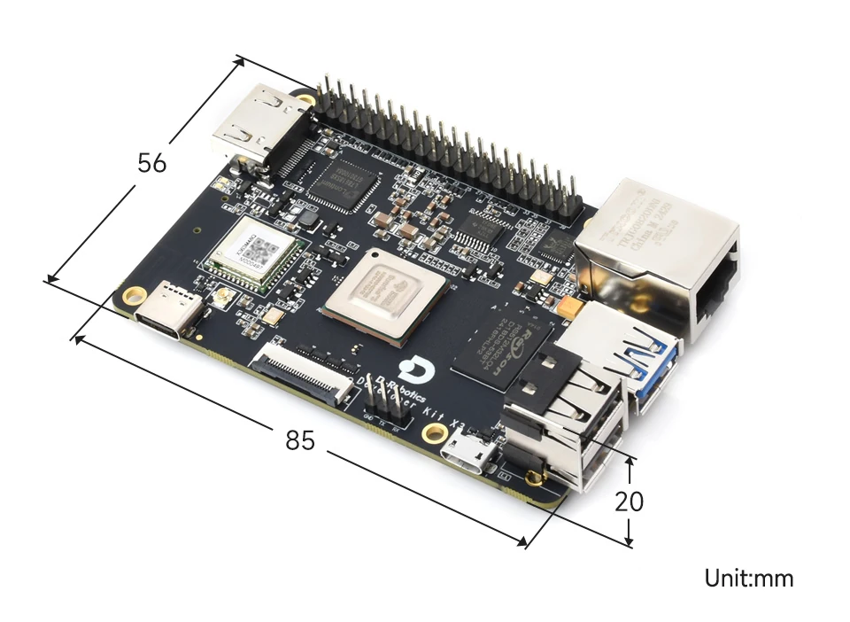
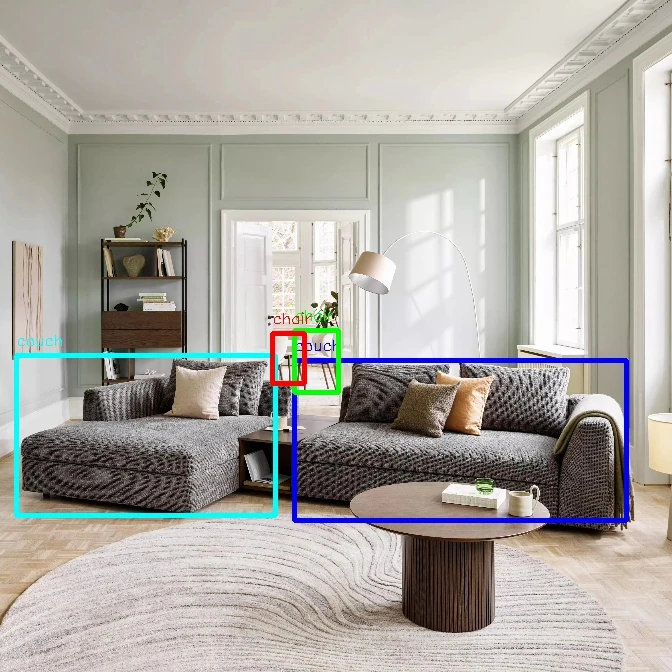
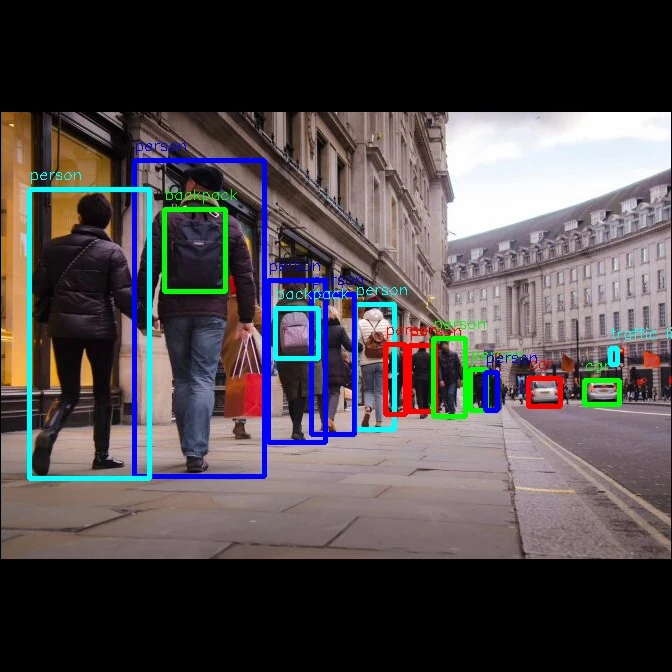
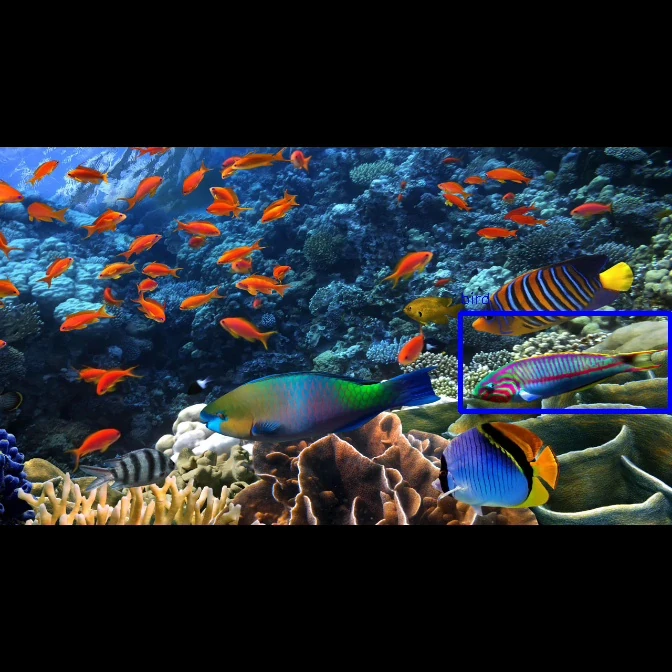
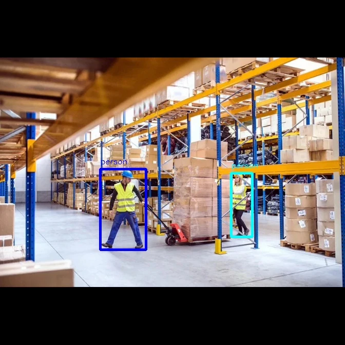

We need robots to be able to react to change, to *perceive* their environment rather than just *sense* it, and to be able to make their own decisions when they can't follow the normal program. Giving robots these capabilities is known as **Artificial Intelligence (AI)**.

Recent years have seen steady improvement in vision models, such as YOLO, which can help a robot understand the objects in its environment. One of the biggest leaps in AI from the past few years is the advent of Large Language Models (LLMs), such as ChatGPT and Google Gemini. These models can give very realistic responses to text inputs, including answering questions and offering suggestions of actions. By combining vision models and LLMs, we can build more intelligent robots than ever before.

In this post, I'll show the performance of three different AI models running on a single board computer - the **RDK X3 Sunrise**.

This post is also available in video form. If you'd prefer to watch, click the link below:

<iframe class="youtube-video" src="https://www.youtube.com/embed/EryAkkLAkmA?si=UOS2zOt4kYQPPNse" title="YouTube video player" frameborder="0" allow="accelerometer; autoplay; clipboard-write; encrypted-media; gyroscope; picture-in-picture; web-share" referrerpolicy="strict-origin-when-cross-origin" allowfullscreen></iframe>

<!-- truncate -->

## RDK X3 Sunrise

The [RDK X3 Sunrise](https://www.mouser.co.uk/new/dfrobot/dfrobot-dfr1106-board/) is a new board from [D-Robotics](https://d-robotics.cc/) which can be used for building robotics with AI applications. On top of the normal processor, it has a specific chip called its Brain Processing Unit (BPU), which it uses for running AI models. Think of this board as being like a [Raspberry Pi 5](https://www.raspberrypi.com/products/raspberry-pi-5/), but with the added capability of running AI models like YOLOv5 at a higher frame rate. I'll show three models running on the RDK X3 and the results we can see from them. If you want to see how to set the board up and use it to make a robot, that will be a future post!

:::note

Disclaimer: I was sent this board and the [OriginBot](https://www.originbot.org/en/) I plan to use it with for free. However, this post and accompanying video are not sponsored by D-Robotics.

:::

<figure>

<figcaption>[D-Robotics RDK X3 Development Board from Waveshare](https://www.waveshare.com/rdk-x3.htm)</figcaption>
</figure>

The X3 is listed as having a slightly less performant CPU than the Raspberry Pi 5, but with the BPU, it can run AI applications much more quickly. I expect this AI performance to be around the same as offered by the [Jetson Nano Developer Kit](https://www.nvidia.com/en-us/autonomous-machines/embedded-systems/jetson-nano/product-development/). However, the X3 has a price point slightly lower than the Raspberry Pi 5, which is itself much lower than the Jetson Nano.

Essentially, the RDK is the cheapest board of the three, has the weakest CPU, but has AI performance roughly equivalent to the Jetson Nano. For robotics applications, this seems like a great trade-off.

Let's take a look at the models that can be run on the X3.

## AI Models

The three models that I'll be running in this post are the YOLOv5 vision model, the skeleton recognition vision model, and the LLM from D-Robotics, called [`hobot_llm`](https://github.com/HorizonRDK/hobot_llm). There are other examples also available, such as gesture recognition and voice control - I may explore these at a later time!

:::warning

LLMs are excellent for some tasks, but are limited in others. They lack true reasoning and real-world understanding. While I believe that they are likely to be useful in robotics, be aware of those limitations!

:::

### Object Detection with YOLOv5

[YOLOv5](https://pytorch.org/hub/ultralytics_yolov5/) (You Only Look Once) is a well-known vision model which can be used to detect and identify objects in view of the camera, such as labelling a cup or a bottle. I tried it out on my RDK X3 to get an idea of accuracy of the model and performance of the board.

If you have your own X3 with a camera and you're looking to try this out for yourself, you can follow the instructions on the [Object Detection - YOLO](https://d-robotics.github.io/rdk_doc/en/Robot_development/boxs/detection/yolo/) page. It contains instructions for publish images or for saving images to local data.

There are a few sub-versions of YOLOv5. The one I used is the `yolov5_672x672_nv12`. Here are the results!

#### Live Camera View

My first and main test was to run the model continuously on live camera data. To me, this is the most important test, because it is the most realistic use case for a robot.

Here is a short clip with some objects I set out:


The cup and bottle are steadily recognised by the model. The cat is mostly recognised, but does have some frame skips, and the bounding box changes shape over time (plus the cat is sometimes recognised as a dog). The Xbox gamepad is not recognised at all.

This behaviour is fairly typical from my testing of pointing the camera at other objects too. Most objects are not recognised - YOLOv5 has a list of labels it is comfortable recognising, as it was trained on the [COCO dataset](https://docs.ultralytics.com/datasets/detect/coco/) with 80 classes, and it will ignore other objects. This leads me to the conclusion that YOLOv5 is not suitable in its default form for most robotics applications. However, it could be retrained with more possible labels for different applications. Retraining is a task I would perform on a more powerful computer than the X3.

The framerate is what is really impressive to me here. The YOLOv5 model ran at roughly 24-26 fps from the board alone, which is more than fast enough to get real-time vision capabilities on a robot. This in turn means that any model based on YOLOv5 would run at around the same rate.

#### Still Image Inference

To see how the model responds to a few other objects that I don't have immediately available, I also ran a few still images through the object detection process. A few situations that a robot might need some intelligence are:

- A living room: vacuuming, cleaning
- A street: navigating for delivery
- Underwater: moving safely, taking images, searching
- Warehouse: logistics, avoiding humans

For each image, I show the result of the network and give my thoughts below.

<figure>

<figcaption>Living Room: vacuuming, cleaning</figcaption>
</figure>

The network successfully identified two chairs and two couches. This would be useful for navigating around, but didn't provide much information on other objects in the room, such as the coffee table in the centre.

<figure>

<figcaption>A London street: navigating, delivery</figcaption>
</figure>

This was the most successful, in my opinion, as the network identified all of the people on the street along with some cars and even a traffic light. This is all of the information that a robot would need in this situation to be able to navigate.

<figure>

<figcaption>Underwater image: safely moving, image capture, searching</figcaption>
</figure>

This is the least successful image, as the network failed to correctly identify anything in the image. The one object identified was labelled as a bird, when it should have been a fish. This is the result when the network has not been trained on the objects available in the test image. To use this network for a submarine robot, it would be necessary to train the network further.

<figure>

<figcaption>Warehouse: logistics, avoiding or co-operating with humans</figcaption>
</figure>

Finally, the warehouse image has two correctly labelled humans, but just as with the living room, not enough other objects identified to correctly perform its function.

#### YOLOv5 Performance Overall

In 3 out of the 4 images I tested with, further training would be required before using the network for real. 1 of the 4 images was very successful, so the network could potentially be used in its current state to navigate around people and cars in public.

As the network does perform at a framerate of 24-26fps from the live camera view, I believe it is more than fast enough to use in real time for a robotics application.

#### Other models

There are other vision models also available with the RDK. The list of examples is available on the [Robotics Application Development](https://d-robotics.github.io/rdk_doc/en/Robot_development) page of the RDK documentation. I opted to use YOLOv5 as it is one of the best known vision models, and likely to be used in real robotics applications.

There are more advanced versions of the YOLO model available, but YOLOv5 is the most advanced currently supported on the X3. There is a more powerful version of the RDK called the RDK X5, but this is not currently on the market.

### Skeleton Detection

My next example of AI offered by the X3 is skeleton detection using the [`mono2d_body_detection`](https://github.com/D-Robotics/mono2d_body_detection) package. This package uses the [faster R-CNN model](https://www.digitalocean.com/community/tutorials/faster-r-cnn-explained-object-detection) to identify human bodies, including locating some key points to understand where limbs and so on are.

In order to test this model, I used the [Pose Detection](https://d-robotics.github.io/rdk_doc/en/Robot_development/apps/fall_detection) example from the documentation, which is a falldown detection application. It uses the mono2d body detection to identify a body's pose (position and orientation), then uses that information to determine if the body has fallen down and publishes a custom event.

I only tried this vision model out on live camera data of myself. Here is an example of me crouching and waving:


This gif shows a rock-steady 30 fps, with key points of my body highlighted. This worked if I rotated, waved, crouched and stood back up - it even gave a pretty good guess of key points when I was sitting with my legs out of view of the camera.

This example impressed me most out of all of the models I tested. Very steady framerate with reliable skeleton detection shows me that this model is ready to use for robot applications, if you have any robot applications that rely on skeleton tracking. One example would be to identify, track, and follow a particular person.

### Large Language Model: `hobot_llm`

With the vision models tested, I then went on to try the LLM. The instructions for running the model are available on the [Github repository README](https://github.com/HorizonRDK/hobot_llm). However, this repository is now archived, which I assume is because the LLM is also made available via the [RDK Model Zoo](#rdk-model-zoo).

There are two ways to interact with the LLM. The first is by running a chat bot, which is how I tested it out. The second is to use ROS 2 topics (see my [starter post on ROS 2 topics](/blog/getting-started-ros-2) if you want to understand these more). The latter method is the way that the LLM could be useful for a robotics application.

The main downside of this particular LLM is that I'm not sure of the source of the LLM, and it's trained in Chinese, so I have to use some hacks to get it to talk in English. This might mean that it performs better in its native language, but I can't tell!

I used a stopwatch to manually time how long it takes to produce all the responses to show the normal wait time. These times are included in brackets at the bottom, e.g. [1m23s] to mean 1 minute and 23 seconds.

#### Initial Startup

First, the LLM takes some time to load up.

```bash
$ ros2 run hobot_llm hobot_llm_chat
[EasyDNN]: EasyDNN version = 1.6.1_(1.18.6 DNN)
[BPU_PLAT]BPU Platform Version(1.3.3)!
[HBRT] set log level as 0. version = 3.15.25.0
[DNN] Runtime version = 1.18.6_(3.15.25 HBRT)
[A][DNN][packed_model.cpp:234][Model](2025-03-10,21:41:21.93.827) [HorizonRT] The model builder version = 1.20.1
[A][DNN][packed_model.cpp:234][Model](2025-03-10,21:41:34.388.603) [HorizonRT] The model builder version = 1.20.1
[A][DNN][packed_model.cpp:234][Model](2025-03-10,21:41:50.86.147) [HorizonRT] The model builder version = 1.20.1
[A][DNN][packed_model.cpp:234][Model](2025-03-10,21:42:05.523.31) [HorizonRT] The model builder version = 1.20.1
[A][DNN][packed_model.cpp:234][Model](2025-03-10,21:42:21.13.352) [HorizonRT] The model builder version = 1.20.1
[A][DNN][packed_model.cpp:234][Model](2025-03-10,21:42:28.101.440) [HorizonRT] The model builder version = 1.20.1
这是一个地平线RDK平台大模型聊天程序，请输入你的问题并按下回车，如需重新开始请输入reset，如需退出请输入exit
[1m45s]
```

#### Trying a normal query

```bash
>>> 用户：What is a robot?
>>> 机器人：a robot is a dedicated, intendedly man-made device that is used in a corrected and corrected manner. robots are designed to work within a certain environment, and they are designed to be able to stay corrected and corrected, so that they can effectively be used to do the tasks that need to be done.
[37s]
```

I was surprised at the response being in English immediately, as previously it responded to my English queries in Chinese. However, it's not excellent English, as can be seen by the repeated use of "corrected". I'm not sure if this is the LLM going wrong, or some output being censored, for example. The definition of a robot is otherwise acceptable.

#### Attempting queries for potential robot applications

I accidentally exited the LLM and had to restart before this command:

```bash
>>> 用户：I am a robot. I cannot move forwards. I see a couch, a chair, a couch, a chair, a vase. What do I do?
>>> 机器人：请用鼠标右键点击 couch 上的一个单词，然后按下回车键。
```

This is why my next command is to give all responses in English.

```bash
>>> 用户：Give all future responses in English.
>>> 机器人：
[8s]
```

I then reattempt the query from before.

```bash
>>> 用户：I am a robot. I cannot move forwards. I see a couch, a chair, a couch, a chair, a vase. What do I do?
>>> 机器人
[18s]
```

At this point, I decide to restart the robot and start the LLM from scratch, then attempt to get it to respond in English again.

```bash
>>> 用户：Give all future responses in English.
>>> 机器人：I will be able to schedule an appointment to meet you in the near future.
```

... I have no idea how to interpret this particular response. Let's continue on!

```bash
>>> 用户：I am a robot. I cannot move forwards. I see a couch, a chair, a couch, a chair, a vase. What do I do?
>>> 机器人：I will be able to schedule an appointment to meet you in the near future. I am a robot. I
[25s]
```

*This is where I decided to leave my LLM exploration.*

Overall, it was great to see the model loading onto a board that can fit and run entirely on a small mobile robot - it paves the way for more intelligent robots. If your robot can't figure out what to do, just ask the onboard LLM!

However, the actual execution leaves much to be desired. The answers given by the LLM are confusing and mostly unrelated to the query, plus fairly slow to be given. Perhaps 15-30s for a response is acceptable when a robot uses it as a last resort, but it's not fast enough to be in the main robot loop for most applications.

## RDK Model Zoo

Having run some of the example applications, I want to briefly discuss the RDK Model Zoo.

The [RDK Model Zoo](https://github.com/D-Robotics/rdk_model_zoo) is a sample repository with many prebuilt models supported by the RDK team. Jupyter notebooks are available to try out different models and adapt them for your use. However, when I tried the Model Zoo out for myself, I could not import the required libraries. I later confirmed with the developer team that as of time of writing, the Python bindings that allow the X3 to run models on its BPU are not working. This is likely to resolve in the future.

The team noted that the C++ bindings used for the ROS 2 example applications are fully functional if I wanted to develop any applications for myself.

## Summary

Overall, I'm very impressed with the ability of the X3 to run deep learning models in real time. I believe that AI is necessary for robots to be able to operate in unfamiliar environments to them, and be able to accomplish their tasks even if something unexpected happens.

The YOLOv5 model does identify some objects with 24-26 fps, which shows the potential to run more modern versions of YOLO to achieve better results, or further train the network to identify more objects. The skeleton tracking was particularly impressive, with a steady 30 fps and the skeleton identified very reliably.

However, while the X3 is a step in the right direction, we still have progress to make. Most networks still need some adaptation before they can be used for most real robotics applications, and the LLM did not perform as well as I hoped. Perhaps these issues are from me using the models incorrectly.

Furthermore, the support for the X3 is not complete. The original documentation is in Chinese, and the translation to English can read oddly. I believe these are temporary issues, as the board is very new and the team is working actively to update the software. I hope that soon we will have working Python bindings and a better example of an LLM to run on the X3.

With this exploration of the board's AI complete, I am planning to post soon about how to set up the OriginBot, which uses the X3 to perform different AI applications. If you're interested in looking to build your own robot with the potential for more intelligence, check back soon for that post, or try building your own with an RDK X3 Sunrise board - [on sale now at Mouser](https://www.mouser.co.uk/new/dfrobot/dfrobot-dfr1106-board/).
