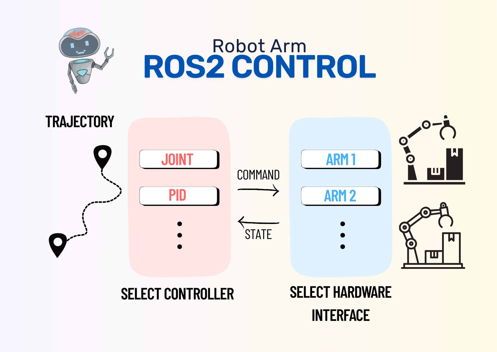
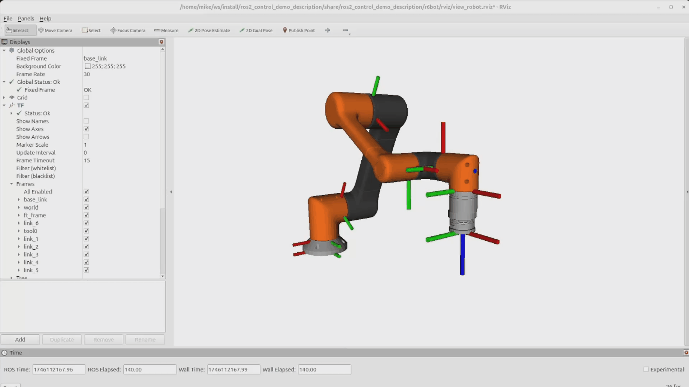
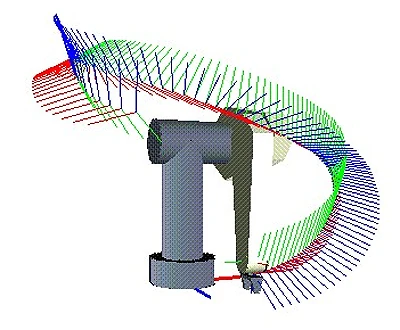
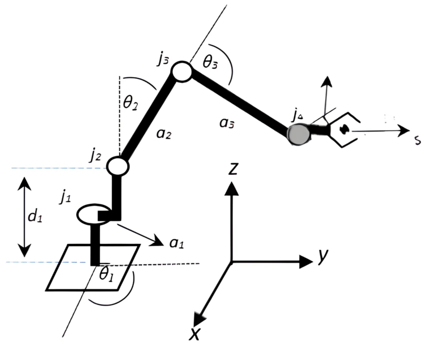

Moving and manipulating objects are one of the most common tasks in robotics. Examples include moving objects, folding clothes, or solving Rubik's cubes. Robots that perform these tasks are often called manipulators, and they tend to be arms with some kind of gripper on the end - in my experience, a pinch or suction gripper.

One method of controlling the movement of a robot arm to a given pose is using `ros2_control`. By using this framework, we can use existing robot controllers for moving motors, and we even gain access to advanced behaviour like incorporating feedback into a PID control loop to more accurately position our arm. This post is all about how to control a simulated robot arm with 6 joints, using the sample code from the ROS 2 Controller Examples.

This post is also available in video form. If you'd prefer to watch, click the link below:

<iframe class="youtube-video" src="https://www.youtube.com/embed/ZRrC6Hss01Y?si=WesFazz_tXGJIkdl" title="YouTube video player" frameborder="0" allow="accelerometer; autoplay; clipboard-write; encrypted-media; gyroscope; picture-in-picture; web-share" referrerpolicy="strict-origin-when-cross-origin" allowfullscreen></iframe>

<!-- truncate -->

## Controlling a Simulated Robot Arm with `ros2_control`

Before attempting to control a real arm, it's important to understand how the framework functions. I have previously shown how to use `ros2_control` with the JetBot, which adapts the differential mobile robot controller to control the robot and move it around ([part 1](/blog/jetbot-motors-pt1), [part 2](/blog/jetbot-motors-pt2)).

Now, I want to show how the framework functions for moving a robot arm by controlling a simulated 6 DOF arm. The [examples repository](https://github.com/ros-controls/ros2_control_demos) has a tutorial and set of sample code for an arm like this, so I'll show the simulation running, describe how the controller works, and point out where to change it to use it for a real robot arm.

Once we understand how the 6 DOF controller works and where to change it, we can look at a real robot arm and start to control it with all the advantages of `ros2_control`.

## Why use `ros2_control`?

My JetBot posts on ROS2 Control (see [part 2](/blog/jetbot-motors-pt2)) talks about the differences between ROS Control and ROS2 Control, and goes into depth as to the purpose of the latter.

In brief, the reason to use `ros2_control` is to build hardware controllers that can work across different robot models of the same type with only configuration changes. For example, one controller for 6 DOF robot arms can control differently sized robot arms, or control one arm based on target joint positions and another robot arm based on target velocities.

<figure class="text--center">

<figcaption>Infographic of ROS 2 Control with a robot arm. Trajectory messages are sent to a controller, which writes commands to and reads state from the hardware interface(s). The hardware interface interacts directly with the hardware. A configuration file specifies one or more controllers to use with one or more hardware interfaces to control the arm.</figcaption>
</figure>

For this to work, we will build two software libraries: the controller, and the system (both are `ros2_control` terms). The controller listens for ROS 2 messages on how to move, and uses **hardware interfaces** to do the actual movement. The system is our implementation of a hardware interface, and is responsible for moving the motors and reading the sensors to determine if the movement worked correctly.

This split means that the system can be reused by any controller, so we can swap a simple controller for a more complex one, like a PID controller. In the same way, our controller can use different hardware interfaces depending on the specific robot arm it is moving. The hardware interfaces and controller can be changed using configuration files for the specific robot.

Let's take a look at the example code running to see what it does, before diving in to how it works.

## Setting up the example simulation

The 6 DOF arm example is `example_7` from the [examples repository](https://github.com/ros-controls/ros2_control_demos/tree/master/example_7). The repository as a whole has documentation to help understand `ros2_control`, including this [tutorial](https://control.ros.org/jazzy/doc/ros2_control_demos/example_7/doc/userdoc.html) with more detail than other `ros2_control` tutorials. Note that it has a lot of detail on setting up the URDF file that describes the robot, but I want to focus on understanding the code, so I skip past this.

The instructions for building the sample are in the tutorial, but I'll repeat them here so you can follow along. I'm using an [Ubuntu 24.04](https://ubuntu.com/download/desktop) VM from [VirtualBox](https://www.virtualbox.org/), and I have [ROS 2 Jazzy](https://docs.ros.org/en/jazzy/index.html) already installed.

First, I create a workspace and check out the examples repository into it. I then install the example's dependencies, build the workspace, and source the setup file to activate it.

```bash
source /opt/ros/jazzy/setup.bash
mkdir -p ~/ws/src
cd ~/ws/src
git clone https://github.com/ros-controls/ros2_control_demos
cd ~/ws
rosdep install -r --from-paths . --ignore-src -y
colcon build --symlink-install
source install/setup.bash
```

Once complete, I run the simulation using the launch file from the example.

```bash
ros2 launch ros2_control_demo_example_7 r6bot_controller.launch.py
```

Once the RViz window has fully loaded the robot arm into the view, I open another terminal and execute the following:

```bash
ros2 launch ros2_control_demo_example_7 send_trajectory.launch.py
```

The RViz screen now shows the robot arm doing a circular motion. If you want to repeat this motion, kill the previous command with Ctrl+C and run it again.

This was the result:



That's the simulation running! Next, we can dig into the code to understand what's happening and learn from it.

## Understanding the example code

Before diving in, we need to understand an important difference from the JetBot: where the JetBot was controlled with velocity commands, we will control the robot arm using [Joint Trajectory](https://docs.ros.org/en/jazzy/p/trajectory_msgs/msg/JointTrajectory.html) commands.

Imagine that we want to move a robot arm to pick up an object. We need to know the path that the arm moves from where it currently is to where it needs to be - the _trajectory_. We can divide that trajectory up into segments, and for each segment, calculate the position that the gripper needs to be in. This describes a motion of the robot gripper through space.

<figure class="text--center">

<figcaption>[Robot Arm Trajectory | Motion Planning Methods for Industrial Robots by Dan Mihai](https://www.smashingrobotics.com/motion-planning-methods-for-industrial-robots/)</figcaption>
</figure>

That's not where we stop, though. We know the position that the gripper needs to be in for each point along the trajectory, but then we need to calculate the position of each motor in the robot arm to put the gripper there. Instead of motors, we call them _joints_, and we use _inverse kinematics_ to calculate the joint positions based on our desired tool location.

<figure class="text--center">

<figcaption>[Joint angles for a given tool position | Pose Determination System for a Serial Robot Manipulator Based on Artificial Neural Networks](https://www.researchgate.net/publication/371070660_machines_Pose_Determination_System_for_a_Serial_Robot_Manipulator_Based_on_Artificial_Neural_Networks)</figcaption>
</figure>

Once we have the joint values of each point in the movement trajectory, we join them together to form a Joint Trajectory. Our controller will go through each set of angles in this joint trajectory to move the robot arm along our planned trajectory.

### Package Structure

As discussed in [Why use `ros2_control`?](#why-use-ros2_control), we therefore need to build a controller and a system. The controller will listen for Joint Trajectory messages, then use the system to move the simulated robot arm based on that trajectory.

The repository has quite a few folders and files in it. We don't need to look at these files in-depth to understand the example - it will suffice to understand the purpose of the files.

- **README.md**: gives contents of package and link to documentation
- **CMakeLists.txt, package.xml**: defines the ROS 2 package and how to build it
- **ros2_control_demo_example_7.xml**: a `ros2_control` file that states the package contains a `RobotSystem` class and `RobotController` class, which can then be used to control the simulated arm
- **bringup**: contains launch files for running the controller simulation and sending the circle trajectory. Includes a [config file](https://github.com/ros-controls/ros2_control_demos/blob/master/example_7/bringup/config/r6bot_controller.yaml) that we need to understand the controller code
- **description**: contains the URDF of the robot, required for understanding the joint positions needed for a particular tool position
- **reference_generator**: contains the source code for generating the trajectory that moves the tool in a circle. Only required for the simulation demo
- **test**: test files for the package to confirm it works correctly

The remaining folders I haven't yet mentioned, **controller** and **hardware**, contain the files for the controller and the system respectively.

### Controller

The controller folder contains two files - the header and source file for the controller class. This is standard for C and C++, and the controller is written in C++.

#### Controller Header File

The [header file](https://github.com/ros-controls/ros2_control_demos/blob/master/example_7/controller/include/ros2_control_demo_example_7/r6bot_controller.hpp) contains most of the information from the tutorial. It declares a class `RobotController` that extends from `ControllerInterface`, the required `ros2_control` class for controllers. It overrides the main functions and declares protected member variables required for the controller to function.

The main functions that must be overridden for a controller include:

- `command_interface_configuration`: used to set up the command interfaces, which write data to the hardware
- `state_interface_configuration`: used to set up the state interfaces, which read data from the hardware
- `update`: used to read and write from the configured command and state interfaces

As our `RobotSystem` class will both read to and write from the robot arm, we will use it for both the command and the state interfaces. In another implementation, we could use different types, such as a sensor type for the state interface and an actuator type for the command interface. The controller is agnostic to the type it has, so long as it can read and write data when necessary. This means that we can change hardware interfaces using only configuration files.

On top of the required methods, we have a number of optional methods that we override. These are lifecycle methods, which allows us to run code at particular points in the controller execution. These include:

- `on_configure`
- `on_activate`
- `on_deactivate`
- `on_cleanup`
- `on_error`
- `on_shutdown`

Our class uses these to initialise and reserve the hardware interfaces it needs to function. We can look at the source file to see how this is handled.

#### Controller Source File

With the main functions defined in the header file, the [source file](https://github.com/ros-controls/ros2_control_demos/blob/master/example_7/controller/r6bot_controller.cpp) then defines the actual logic of the controller.

For each function defined in the file, I'll give some detail of how it works. I recommend reading through the code yourself and making sure you understand what it's doing, and why.

**`on_init`**

This function reads joint names, command interfaces, and state interfaces from ROS 2 parameters. It uses a function called `auto_declare` to read the parameters and save them into local variables. It also writes zeroes into the local variable `point_interp_`, which is the current point the robot arm should move to.

The number of joints depends on the length of the `joint_names_` vector, which means the controller can be used for robot arms with different numbers of joints.

However you run the controller, these parameters must be set for it to understand how to work; in this example, they are set by the [launch file](https://github.com/ros-controls/ros2_control_demos/blob/master/example_7/bringup/launch/r6bot_controller.launch.py#L51-L57), which reads them from the [config file](https://github.com/ros-controls/ros2_control_demos/blob/master/example_7/bringup/config/r6bot_controller.yaml). The config file lists joints `joint_1` through `joint_6`, so we know the robot has 6 joints, and it specifies command and state interfaces:

```yaml
command_interfaces:
    - position
    - velocity
state_interfaces:
    - position
    - velocity
```

From this file, we know that our robot can write both positions and velocities to its motors, and it can read both positions and velocities from its motors. This may be different based on the robot arm we are actually used, which is why the config file is used.

:::info

The example package contains extra files needed to run the example as well as the controller and system for `ros2_control`. It is important to understand which files are for which purpose to be able to adapt the package to a new robot arm. The header and source file are for the controller, and the launch and config files are specific to our robot arm.

:::

**`*type*_interface_configuration`**

The controller builds a list of names of the interfaces to reserve them, which grants exclusive access to those interfaces until they are released.

**`on_configure`**

This function is called once, near the start of the lifecycle, and subscribes to a joint trajectory topic. When any message is received on that topic, it will copy the data into its own message, then raise a flag internally to say a new message is ready.

To copy the data, a method called `writeFromNonRT` is used. This is because `ros2_control` is real time, but ROS 2 subscriptions are not real time. The data therefore has to be copied in a thread-safe way.

**`on_activate`**

At this point, the requested interfaces have been activated, so the controller saves them to an internal map. After this step, data can be read and written to the interfaces.

**`update`**

This function is run frequently to refresh the state data and write any waiting command data. The controller checks if a new message exists, and if it does, reads it (in real time, using `readFromRT`) and saves the time as the start time of the trajectory. Reading the message means the controller now has a new trajectory to follow.

Assuming no new messages arrive, the controller then follows the trajectory by calculating how far along the trajectory it ought to be. This is calculated from the current time given to the update function, and the start time saved with the trajectory message.

To determine the right position along the trajectory, it uses the `interpolate_trajectory_point` function, which in turn calls the `interpolate_point` function. The two functions use the time since starting the trajectory to figure out the current and next position in the trajectory, then interpolates between them to create a smooth motion. This position is then written to the hardware interface to move the arm.

**`on_deactivate`**

Finally, the deactivate function is called to release the interfaces, allowing another controller to use them.

#### Overall Controller Function

Overall, we have seen how the controller reserves hardware interfaces from configuration, waits for a trajectory message, then moves the robot arm along the trajectory using its reserved interfaces.  The controller doesn't know whether it's using systems, actuators, or sensors, and it doesn't know how many joints it is using in advance. This means that the controller can actually be used for any number of joints, as long as the joint positions/velocities are given in the Joint Trajectory command.

This controller implementation exists to show how a similar controller works. The ROS2 Controllers package contains a more detailed implementation called the [Joint Trajectory Controller](https://control.ros.org/jazzy/doc/ros2_controllers/joint_trajectory_controller/doc/userdoc.html). You can find its source code on [Github](https://github.com/ros-controls/ros2_controllers/blob/master/joint_trajectory_controller/doc/userdoc.rst), which I recommend doing, as you can learn from the differences between the example controller and the real controller.

### System

The system is reponsible for writing commanded position and velocity data to the robot arm's motors, and reading back position and velocity data from the same motors. As with the controller, it has a header and a source file.

#### Header File

The [header file](https://github.com/ros-controls/ros2_control_demos/blob/master/example_7/hardware/include/ros2_control_demo_example_7/r6bot_hardware.hpp) defines the `RobotSystem`, which extends from `SystemInterface`. It overrides only the required methods, and has no protected member variables, because it's too simple to need them.

The required methods are:

- `on_init`
- `on_configure`
- `read`
- `write`

Again, we see how these functions work in practice from the source file.

#### Source File

The [source file](https://github.com/ros-controls/ros2_control_demos/blob/master/example_7/hardware/r6bot_hardware.cpp) is very simple in its implementation. When told to read data, it looks up the velocities the robot *should* have and returns those values. When told to write data, it immediately returns that it's finished. This is because there's nothing to move or read data from; RViz shows the robot model performing exactly the motion it's been told to perform, because this system echoes the data back exactly as it's given.

We can take a closer look at the functions to understand them better.

**`on_init`**

This simply calls the base class version of `on_init`, and returns successfully if the base class did too.

**`on_configure`**

This loops through its joint states, joint commands, and sensors states, setting all the values to 0. These variables are not used again for this system, because it is too simple, but a real implementation should follow this step ready for the variables to be used by the rest of the code.

**`read`**

For velocity data, the System uses the `get_command` function to retrieve the current commanded velocity, then sets the state to that value with `set_state`. This means the system claims the robot is moving exactly as fast as it's been told to with no delay.

For position data, the System reads the current position data, then adds the previous velocity data multiplied by the time since the last read. This means that the new position is the old position plus the amount the arm has moved. You could edit this function to act like velocity and return the values from the `get_command` function, but having this integration step shows how the System can use the provided time data to calculate information about the joints it is responsible for.

**`write`**

This simple function simply returns OK immediately. By doing so, the function claims it has written the joint positions to motors with no delay - which makes sense, because no motors exist for it to write to!

### Overall System Function

Overall, the system sets up some internal variables that it doesn't use, then repeatedly echoes back its commanded data in the `read` function and returns immediately from the `write` function.

## Modifying the sample code for a real robot

We have taken a look at the example controller and system and skimmed over the supporting files in the repository. To adapt the example for a real robot arm, we can use this as a starting point, but with a few differences:

- We don't need the controller at all. Instead, we can remove this and define our robot to use the existing `joint_trajectory_controller`, but with the same configuration.
- We need to change the robot description to match our real robot, so that when we calculate joint positions for a tool position, it matches the robot correctly.
- Most significantly, we need to define how to actually communicate with the robot. 

The system class has `on_init`, `on_configure`, `read`, and `write` methods, which we need to rewrite to initialise, configure, and read/write to our real motors. This might be with I2C, as in the JetBot post, or another method of communication. This is where we will focus our efforts when it comes to writing a system for a real robot arm.

## Conclusion

Overall, the purpose of the example repository is to educate us on how `ros2_control` works for robot arms. We saw how to build a reusable joint trajectory controller, and how to define a simple system that echoes back its command data, so that in simulation it appears like a robot arm is really moving. Importantly, the controller only finds out the interfaces and number of joints it is using at runtime, so it can work with any number of joints and different interfaces, depending on the configuration.

We have also seen that the controller does not know about the structure of the robot it is operating - the robot description. The joint positions are calculated before being sent to the controller. That means if we want to send a tool position, we need other software to calculate the right joint positions for that tool position.

On top of its primary purpose, the example serves as a great starting point for our future development with 6 DOF robot arms. The changes needed are fairly substantial - deleting one of the major folders, changing the robot description URDF, and defining how the system communicates with real robot motors instead of echoing its commands back as state data.

With our newfound understanding, the next step is to adapt the example to control a real 6 DOF robot arm. Check back for a future post, where I will show how to adapt the example and communicate with a real robot arm.
