How are complex robot arm motions actually planned and executed? Robot arms are usually mounted within an enclosure or with some kind of environment that restricts their movement, and their task is rarely as simple as picking a simple object from above. How can we plan arm movements that avoid colliding with anything and reliably accomplish their tasks? There's more than one answer, of course, but one excellent answer is to use MoveIt.

[MoveIt](https://moveit.picknik.ai/main/index.html) is a powerful and widely used framework for motion planning in robotics. It helps robots figure out how to get from one point to another while avoiding obstacles, respecting joint limits, and following physical constraints.

In this post, I'll go through the [tutorials available from the MoveIt website](https://moveit.picknik.ai/main/doc/tutorials/tutorials.html) for MoveIt 2. I have a few notes to add for the first few tutorials, but the majority of my focus is on the final tutorial, [Pick and Place with MoveIt Task Constructor](#pick-and-place-with-moveit-task-constructor). I'll explain more about how it works and the underlying principles so you can get started building your own task set for MoveIt.

This post is also available in video form. I work through all the tutorials on camera so you can see every step. If you'd prefer to watch, click the link below:

<iframe class="youtube-video" src="https://www.youtube.com/embed/yIVc5Xq0Xm4?si=MjV4Us6Wn_L2XPJU" title="YouTube video player" frameborder="0" allow="accelerometer; autoplay; clipboard-write; encrypted-media; gyroscope; picture-in-picture; web-share" referrerpolicy="strict-origin-when-cross-origin" allowfullscreen></iframe>

<!-- truncate -->

## MoveIt Tutorials 1-5

This post is based on [the tutorials from the MoveIt website](https://moveit.picknik.ai/main/index.html). I only have a few tips and notes to add to the first few tutorials, which are written below.

<figure class="text--center">
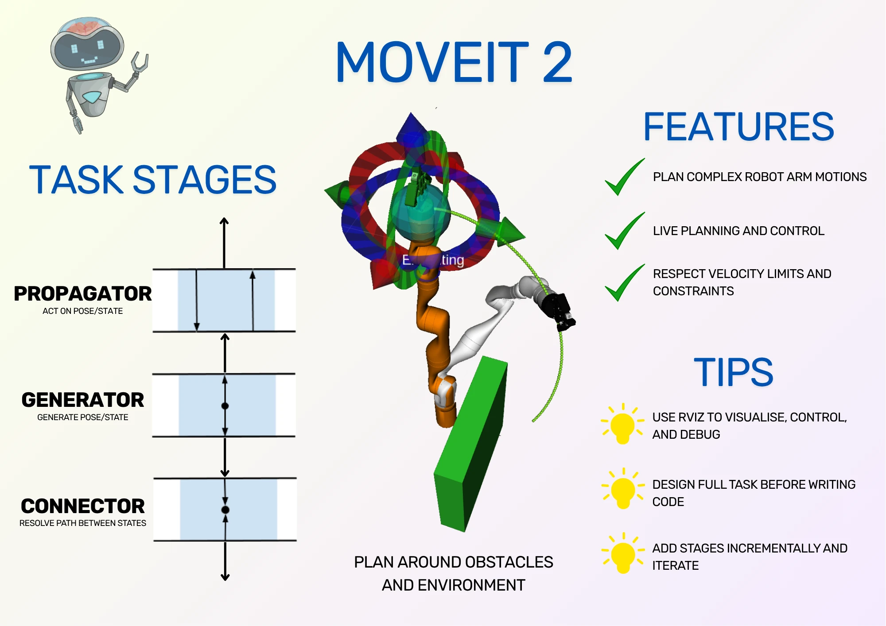
<figcaption>Infographic showing the uses of MoveIt, some key tips while working with it, and the main stages of the MoveIt Task Constructor. This can be a cheat sheet once you understand the concepts - read on to learn MoveIt.</figcaption>
</figure>

More detail is available in the [Pick and Place section](#pick-and-place-with-moveit-task-constructor), as it has more advanced concepts to cover.

To learn MoveIt for yourself, my recommendation is to read through my tips for each section, then work through the tutorial from the site directly.

### Getting Started

[Getting Started](https://moveit.picknik.ai/main/doc/tutorials/getting_started/getting_started.html) shows how to install MoveIt by compiling from source, assuming that ROS 2 has already been installed. It explains all of the steps and their purpose, so I combine them into one block for easier copying/pasting.

:::tip Use Debug Mode

For the tutorials, I recommend compiling using Debug mode, as I use in my instructions. Otherwise, you will need to compile the whole codebase twice, once in release mode for the MoveIt packages and once in debug mode for the tutorial packages. For a serious project, do use release mode (even a separate workspace to avoid compiling it multiple times), but for the tutorials, debug is fine!

:::

My instructions use ROS 2 Jazzy. Feel free to change this to your ROS version, which might require changing the MoveIt branch you check out. At time of writing, either `humble` or `main` branches are available, where `main` is for Jazzy.

```bash
# Dependency installation
source /opt/ros/jazzy/setup.bash
sudo apt install -y python3-rosdep python3-colcon-common-extensions python3-colcon-mixin python3-vcstool
sudo rosdep init
rosdep update
sudo apt update
sudo apt dist-upgrade
colcon mixin add default https://raw.githubusercontent.com/colcon/colcon-mixin-repository/master/index.yaml
colcon mixin update default
sudo apt remove ros-$ROS_DISTRO-moveit*

# Workspace creation and building
mkdir -p ~/ws_moveit/src
cd ~/ws_moveit/src
git clone -b main https://github.com/moveit/moveit2_tutorials
vcs import --recursive < moveit2_tutorials/moveit2_tutorials.repos
sudo apt update && rosdep install -r --from-paths . --ignore-src --rosdistro $ROS_DISTRO -y
cd ~/ws_moveit
colcon build --mixin debug
```

:::warning Resources for Compiling

The build might fail if your system doesn't have sufficient resources. If this happens, you can replace the last command with:

```bash
MAKEFLAGS="-j4 -l1" colcon build --executor sequential --mixin debug
```

Be warned: this will make the build take longer!

:::

After an hour and change, you should have the workspace set up and ready to use! The next step is optional, but helpful, which is to automatically source the workspace.

```bash
echo 'source ~/ws_moveit/install/setup.bash' >> ~/.bashrc
```

The next step is to run and play with the demo.

### MoveIt Quickstart in RViz

[MoveIt Quickstart in RViz](https://moveit.picknik.ai/main/doc/tutorials/quickstart_in_rviz/quickstart_in_rviz_tutorial.html) goes through running a simple demo using RViz that will allow you to plan simple paths between two points. It also shows how to visualise the motion before executing and use different planners for different motions. I'll write my notes and tips, but otherwise advise you to [follow the tutorial directly](https://moveit.picknik.ai/main/doc/tutorials/quickstart_in_rviz/quickstart_in_rviz_tutorial.html).

On the **Moving into collision** step, I was unable to get the robot to collide with itself, even with IK solver turned off. I assume this is a change of behaviour from when the tutorial was written, because the robot would slide over the points where it should have collided, or just waited for the mouse to move to a valid position again; it never showed red.

Also, the cartesian planner failed to plan any movements for me. The cartesian planner can be used for straight-line motions. One example is a robot arm using a pen, where the pen needs to draw a straight line on a page. By providing start and end coordinates from the drawing surface to a cartesian planner, the resulting path will be a straight line across the surface. As the cartesian planner comes up again in the last tutorial, I was happy to skip past this.

:::tip Saving Your Configuration

Before going on to the next tutorial: this tutorial has a section called **Saving Your Configuration**. It's a great idea to try it and make sure it works correctly for you - it will help in the testing stages of later tutorials, and it's good to know for ROS 2 development in general!

:::

### Your First C++ MoveIt Project

[Your First C++ MoveIt Project](https://moveit.picknik.ai/main/doc/tutorials/your_first_project/your_first_project.html) shows how to build a ROS 2 node that will move the robot arm from the previous demo to a point defined in code. This means setting up the build system, linking to MoveIt, and sending commands to move the robot.

My main advice for this section is to act like you're writing the project yourself from first principles, only using the tutorial as a guide. Type everything yourself, and do it in the same order you would for a fresh C++ project: start with a main function and work from the ground up to the working demo. By doing this, you're likely to see how all the pieces fit together better, and you're also likely to make some mistakes that you then need to debug. That will help you understand the code even better.

As an optional extra, you can try to modify parts of the code to check your understanding. I made a simple change to the lambda function so it returns a `std::optional` instead of a `std::pair` of `success` and `plan`. This may be my preference for Rust coming through, but I think it makes more sense, and it's how I would have written it to begin with if I didn't have the tutorial.

### Visualizing in RViz

[Visualizing in RViz](https://moveit.picknik.ai/main/doc/tutorials/visualizing_in_rviz/visualizing_in_rviz.html) adds to the project from the previous tutorial by adding labels and button interactions, which allows you to step through tasks in a plan. It's important to be able to debug your projects later.

I can't emphasise enough how useful graphical interfaces are when debugging. Usually engineers are comfortable using command line tools for debugging, but if it's possible to use or build your own graphical tools, I recommend doing so! Being able to see a visualisation of the robot, what it's doing, and what it's planning, all with buttons to allow for simpler interaction, will speed up your development in the long run. (This goes for all software, not just robotics.)

As with the previous section, try to write the code using the tutorial as a guide, and understand each function as you go over it. One point that tripped me up was needing to trigger an update to the visual tools every time I changed something; for a while I was wondering why the robot state wasn't being drawn on screen.

Keep in mind that you can save your RViz workspace and reopen it from the command line. This was incredibly useful for me after a few times of setting up the workspace manually, as I was trying to debug my issue with labels not being drawn on screen.

### Planning Around Objects

[Planning Around Objects](https://moveit.picknik.ai/main/doc/tutorials/planning_around_objects/planning_around_objects.html) shows how MoveIt can insert objects into the environment, and understands how to plan movements around them. One of my previous projects used this technique to load the enclosure for the robot arm, then plan paths that didn't hit the enclosure walls or surface. This feature is an important reason to use MoveIt!

Again, try to write the code as if you're building it yourself from scratch. One mistake that I made here was that I didn't update the destination of the robot gripper. The previous destination doesn't need the arm to move around the box, but the new destination is on the other side of the box from the base of the robot. Notice that the elbow of the robot avoids the box as well as the gripper - obstacle avoidance means all the links of the robot avoid obstacles, not just the gripper.

## Pick and Place with MoveIt Task Constructor

With the first tutorials complete, it's finally time to talk about the [Task Constructor](https://moveit.picknik.ai/main/doc/tutorials/pick_and_place_with_moveit_task_constructor/pick_and_place_with_moveit_task_constructor.html). This is the section I spent the most time on by far, because I didn't understand what the different stage types were for or how they fit together.

:::note MTC Is An Optional Add-On

[MoveIt Task Constructor (MTC)](https://moveit.github.io/moveit_task_constructor/index.html) is actually an optional add-on for MoveIt. It's not necessary to use all the features of MoveIt, but does enable programming complex motions, and is included in the core tutorial set of MoveIt.

As an optional add-on, you may need to enable it in launch files for your projects. This can be done [using launch files](https://github.com/moveit/moveit2_tutorials/blob/63b89e04f61720b10ece95b3674ac8c7807445da/doc/tutorials/pick_and_place_with_moveit_task_constructor/launch/mtc_demo.launch.py#L21-L24), as an example.

:::

To understand the different stages, I'll show how to build a design for the task set first before writing code for it. By understanding how the pieces fit together, the code should make more sense.

### Tasks and Stages

The point of the Task Constructor is to break up a big problem into a series of smaller problems to be solved one after the other. For example, to grip an object, we need to figure out a safe approach point to pick it up from, then find paths from our current position to the approach point.

The top-level problem is a Task and the smaller problems are Stages.

Broadly, there are three main stage types:
- **Generators**: provide states or poses to other stages
- **Propagators**: act on data from neighbouring states, producing new data
- **Connectors**: solve trajectory between start and goal states

That's a high level overview, so to get more context, let's take a look at what we're planning to build. 

### Planning a Pick

Let's assume that we have a robot arm with an open gripper, and an object that we want to pick up. We want to construct a task for the robot arm to pick that object up.

We'll start by figuring out where we want to grip the object. This will be a **generator** stage called a **GenerateGraspPose**, which looks for the object in the `PlanningScene`. `PlanningScene` is the MoveIt object containing all of the scene data, including obstacles, objects, and the robot.

<figure class="text--center">
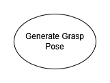
<figcaption>Task begins with Generate Grasp Pose. In my diagrams, ellipses represent generator stages.</figcaption>
</figure>

Next, we want to generate an *approach pose* for the robot. This is to make sure the robot can move in a straight line from the approach pose to the grip pose to more reliably pick up the object. We can do this by using a **propagator** stage called a **MoveRelative**.

Notice that it's above the **Generate Grasp Pose** stage in the diagram because it executes first, but the arrow is pointing upwards because it needs data from the stage *after* it. We don't need to specify in the code that it takes data from the stage afterwards; this is worked out by MoveIt so the stage can function correctly. By doing this, the arm can move to a new point slightly back from the object.

<figure class="text--center">
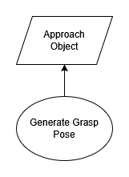
<figcaption>Approach the object before picking. Parallelograms are used for propagators.</figcaption>
</figure>

Now we've defined the approach pose and the grip pose, we want to close the gripper on the object. This is accomplished using a **MoveTo** stage, which is another **propagator**. It starts the arm from the grasp pose and moves the gripper to the closed position.

<figure class="text--center">
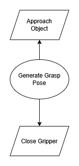
<figcaption>Close the gripper on the object.</figcaption>
</figure>

Just like the approach point, we now want to lift directly upwards to lift the object. Also just like the approach point, we can accomplish this using a **MoveRelative** stage. This takes the pose from the gripper closing and calculates a new pose directly above, which will move the arm upwards to lift the object.

<figure class="text--center">
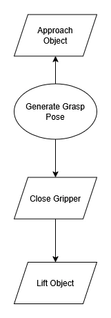
<figcaption>Lift the object after the grip pose.</figcaption>
</figure>

That's it for the logic of a pick. Pretty simple! However, we're not done yet; we have some changes to make so the logic works with the MoveIt system.

First, the stages are currently using poses, but we can't direct the robot directly to a pose; instead, we have to calculate a set of joint angles that moves the robot to that pose. This process is called **Inverse Kinematics**, or IK for short.

<figure class="text--center">
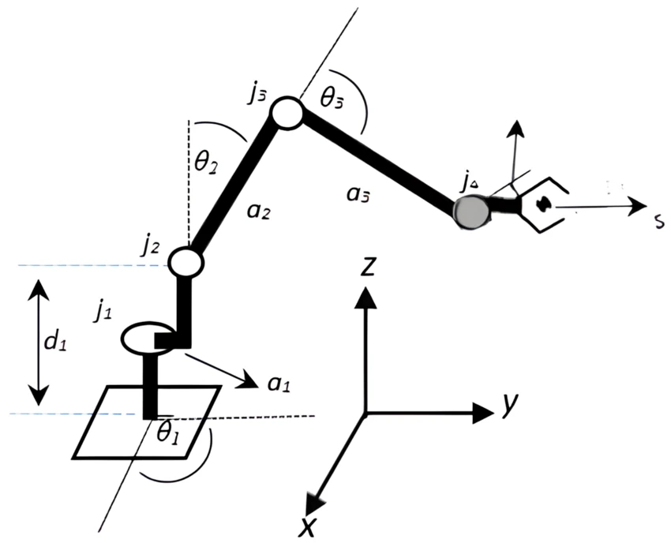
<figcaption>[Joint angles for a given tool position | Pose Determination System for a Serial Robot Manipulator Based on Artificial Neural Networks](https://www.researchgate.net/publication/371070660_machines_Pose_Determination_System_for_a_Serial_Robot_Manipulator_Based_on_Artificial_Neural_Networks)</figcaption>
</figure>

MoveIt provides a **ComputeIK** stage, which is a special wrapper stage, not one of the main types. This stage wraps the generator stage to convert its generated pose into joint angles using IK.

<figure class="text--center">
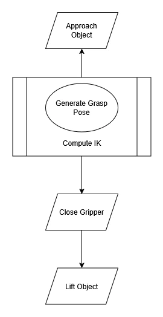
<figcaption>Compute joint angles for generated pose. Compute IK wraps around Generate Grasp Pose.</figcaption>
</figure>

By adding this wrapper stage around the generator stage, any propagator stage that uses the data also knows to use the same IK solver. Neat!

Finally, we'll add two stages, which are more like housekeeping for MoveIt. We need to allow collisions between the gripper and the object so the grip can happen, and we need to *attach* the object to the gripper so MoveIt knows to move the object around the `PlanningScene` with the gripper. Both of these stages are propagators so that they can pass required data from the stage before to the stage after, even if they don't need to use that data. We insert them before and after closing the gripper, respectively.

<figure class="text--center">
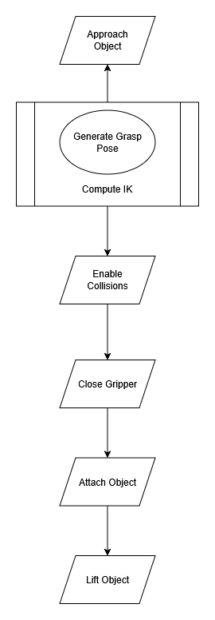
<figcaption>Add stages to enable collisions and attach object to gripper.</figcaption>
</figure>

Our full pick process is complete! In the code, we group these stages together using a `SerialContainer`, another special type of stage. That means we can reuse the same set of stages in different Tasks. In future diagrams, instead of repeating all of the stages above, I'll draw a single Pick Object box.

:::danger Stop! Now it's your turn!

Now we've worked through the Pick process, it's your turn to define the opposite process: placing the object. Start with a generator called **GenerateFixedPlace**, which gives a fixed pose to place the object. Surround it with stages that drop the object and move the arm away.

You can use pen and paper to draw the diagram. Once you're done, check your work below!

<details>

<summary>Complete Place Process</summary>

<figure class="text--center">
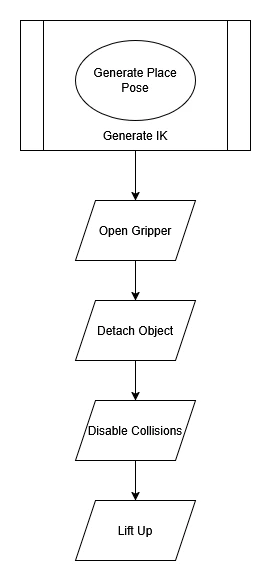
<figcaption>Completed place process stages. The approach pose is skipped because it's not necessary to safely drop the object. Note that Open Gripper, Detach Object, and Disable Collisions can be run in any order; this version matches the tutorial.</figcaption>
</figure>

</details>

:::

### End-to-end Pick and Place

So far, we've seen generator and propagators stages, plus a couple of special stages for IK and grouping tasks together. Now, we want to use our pick and place subtasks and join everything together - start from home, pick an object, place an object, and move back home.

We start with a generator for the current position:

<figure class="text--center">
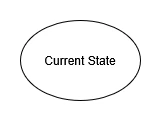
<figcaption>The Task begins with the current state of the robot.</figcaption>
</figure>

We also want to make sure the gripper is open, in case a previous action left it closed. This is a propagator just like the close hand stage from the pick process.

<figure class="text--center">
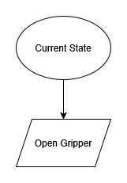
<figcaption>Ensure the gripper is open before trying to pick.</figcaption>
</figure>

At this point, the last of our major stages comes into play. The connector can solve a path between a start point and an end point. In this case, our start point is the robot state after opening the gripper, and the end point is our Pick Object subtask.

<figure class="text--center">
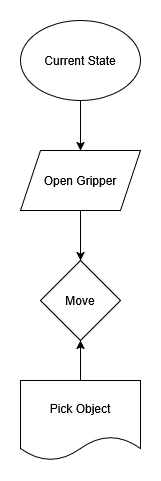
<figcaption>Connect the Open Gripper stage to the Pick Object subtask.</figcaption>
</figure>

Again, notice the difference between the stage execution order and the data flow direction. **First** the gripper is opened, **then** the robot moves to the first pick point, and **last** the full pick object process is carried out. However, to calculate the path, the data from the pick process must go upwards to the Move stage, so it knows how to calculate the robot arm trajectory.

:::tip Bidirectional Communication

In the MoveIt documentation about Stages, it always refers to stages as having data flowing in both directions. This is why they do so! Generators can pass data upwards or downwards, depending on their neighbours. Connectors need data from two directions to connect them, and propagators can receive data from below **or** above.

:::

We can apply the same logic to move to the place process.

<figure class="text--center">
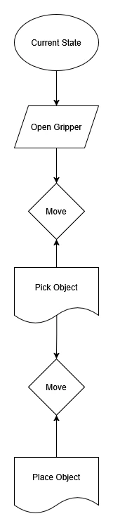
<figcaption>Connect the pick subtask to the place object subtask.</figcaption>
</figure>

Finally, we want to move home. For that, we will use another propagator **MoveTo** stage, connected to the place process with a connector.

<figure class="text--center">
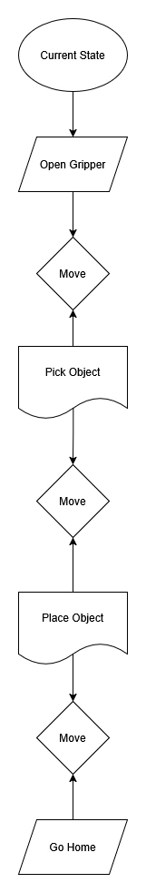
<figcaption>Connect the place object subtask to the Go Home stage.</figcaption>
</figure>

Our pick and place task is *complete*. We can check it against the more compact task definition from the MoveIt tutorials:

<figure class="text--center">

<figcaption>[Stage Outline for Pick and Place task from MoveIt tutorials.](https://moveit.picknik.ai/main/doc/tutorials/pick_and_place_with_moveit_task_constructor/pick_and_place_with_moveit_task_constructor.html#adding-stages)</figcaption>
</figure>

The arrows denote the direction of data, and matches our diagram. The stages have the same order, but without defining the stage _type_. However, the biggest difference is the extra two arrows from MoveIt. These arrows show data from previous stages being forwarded to later stages in order to allow the IK to resolve correctly. These are stored in the code as pointers. I omitted them from my diagram because they don't affect data direction or the stages needed, but they are a key piece of information when implementing the code!

### Writing the Code

Here, it's best to go back to [the original MoveIt tutorial](https://moveit.picknik.ai/main/doc/tutorials/pick_and_place_with_moveit_task_constructor/pick_and_place_with_moveit_task_constructor.html). It supplies all of the code in bite-sized pieces.

My one piece of advice is to use scoped variables to your advantage! Every time the tutorial uses an open curly brace, you should copy it, because it will help keep the variables tidy.

If you would like to see me working through writing the code and explaining it, I do so in my video, which is also linked at the top of this post.

:::note RViz Plugin

MTC is an optional add-on for MoveIt, which is why it has its own RViz plugin. This is why the plugin is listed separately.

:::

## MoveIt Overall

Overall, the MoveIt tutorials are a great place to start to learn how to build code for operating robot arms. They show how to interact with a robot using MoveIt to plan paths between points, how to visualise parts of the demo, and how to build ROS 2 nodes of increasing complexity to perform robot arm tasks.

This post was intended to provide some extra tips and tricks while running through the tutorials, plus give a step-by-step breakdown of the stage types and how to use them. The tasks and stages of MoveIt are the concepts that I personally struggled with the most, not because they were poorly explained on the MoveIt site, but because I struggled to link the concepts to their practical uses.

If you feel like you understand MoveIt better, it's time to start building some robot software! My challenge to you is to design an enclosure in a 3D design software for the robot arm, then import it into MoveIt's `PlanningScene`. See if you can build trajectories that go around your new obstruction. Good luck!
