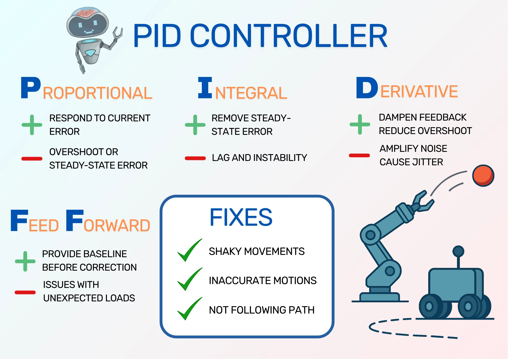
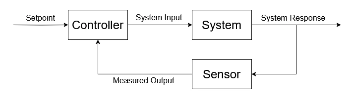
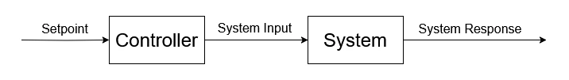
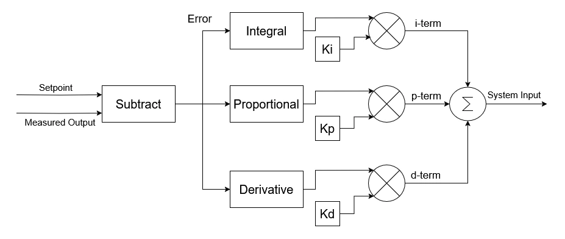
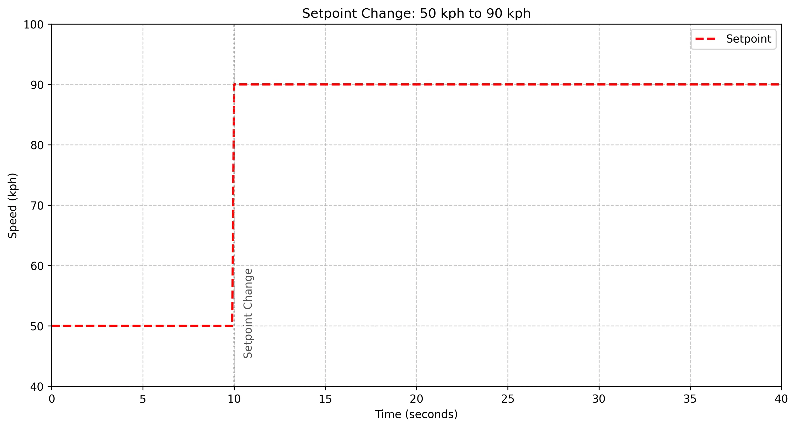
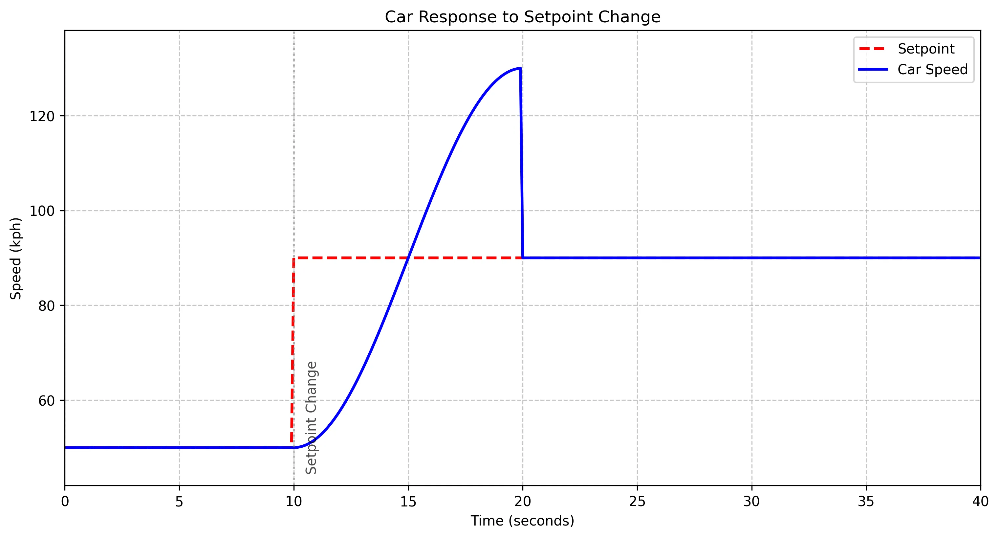
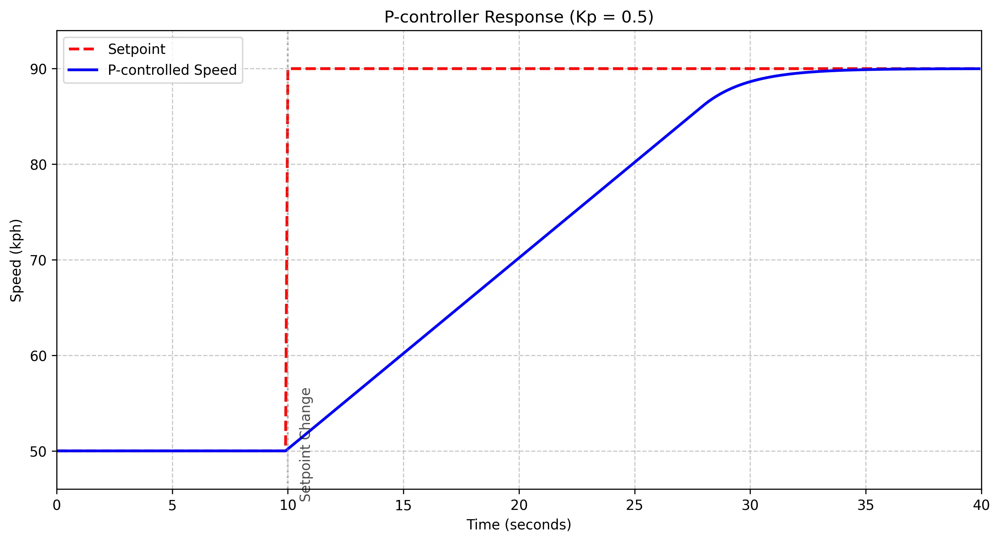
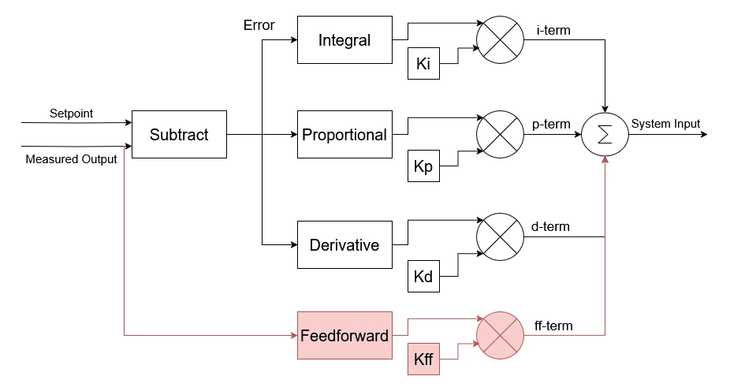

import PIDController from '@site/src/visualisations/PIDController';

This post takes a look at the PID Controller, which is widely used in robotics for providing more accurate motions of any moving parts on a robot. It uses some basic control theory to give a better understanding of what the controller is, then looks at each of the P, I, and D terms for a more intuitive understanding of the controller, ready to use in your own projects.

If you're interested in seeing this post in video form, check the YouTube link below:

<!-- TODO: YouTube video link -->

<!-- truncate -->

## What is PID Control?

The PID in PID control stands for **P**roportional **I**ntegral **D**erivative. It is a form of closed loop control with three parameters, used to control an output to be more stable and react to changes quickly. This makes it very useful in robotics, where moving as accurately as impossible improves the performance of the system. For example, moving wheels at the requested speed makes navigation more accurate, and moving joints accurately makes motions smoother and more reliable.

<figure class="text--center">

<figcaption>Infographic showing the uses of PID Controller, and breaking down the four terms into their uses and drawbacks.</figcaption>
</figure>

To explain more about what PID control is and how it works, including the general overview from the diagram above, it helps to define a few terms from control theory.

### Control Theory Terminology

First, any kind of **control** is the process of adjusting an output to be at a required level, or **setpoint**. This could be the heat level of a tank of water, which can be controlled by burning gas to heat the water. Another type of control is controlling the speed of a motor to spin a wheel or move a robot arm's joint.

A **controller** is the process responsible for controlling the output. In cars, the controller is a human, and the control process is to reach and maintain a certain speed by changing the acceleration of the car with an accelerator pedal. The controller should also respond to changes in speed as quickly as it can; if the desired speed increases, the controller should accelerate to the new setpoint, then maintain the speed there. Controllers should try to reach the setpoint quickly without overshooting or oscillating about the setpoint.

The controller produces a **system input**, which is the signal it uses to adjust the system. In a car, the system input is the accelerator position. In turn, the **system response** or **system output** is how the system behaves based on the system input; in a car, the system response is to speed up. Finally, the **measured output** is the measured value of the system response, such as the reading on a speedometer.

<figure class="text--center">

<figcaption>Control Theory Terms defined above, shown in a feedback loop.</figcaption>
</figure>

#### Open and Closed Loop Controllers

Controllers can either be **open loop** or **closed loop**, depending on whether they measure and react to the system as part of the control process.

**Open loop** controllers do not react to the measured output as part of the control process. Instead, the controller guesses the correct system input to reach the setpoint and assumes the system responds as expected. For example, it tells two motors to move at a particular speed and assumes that they move at exactly that speed, with no issues. This control works well enough in many applications, and it's the type of control [we used for the JetBot](/blog/jetbot-motors-pt2).

<figure class="text--center">

<figcaption>Open loop system. Setpoint fed to controller, which controls the system, assuming the system behaves perfectly.</figcaption>
</figure>

**Closed loop** controllers use measured output from the system to adjust the system input for better control. With a differential mobile robot, the controller can use wheel encoders to measure how fast the motors are actually moving, then adjust how fast it tells the motors to move to correct for the change. This allows the robot to keep a constant speed even if one motor is slightly more powerful than the other one.

<figure class="text--center">

<figcaption>The same diagram as in the previous section shows a feedback loop, where the measured output from the sensor is fed back to the controller to adjust the system input.</figcaption>
</figure>

### PID Controller

With our control theory terms defined, we can now define PID control as a form of closed loop control that calculates its system input from proportional, integral, and derivative terms based on the measured output. The controller first calculates the **error** term as the difference between the setpoint and the measured output, then uses the error to form the control terms:

1. **Proportional (P)**: the error is directly multiplied by a constant **Kp** to get the proportional term (**p-term**).
2. **Integral (I)**: tracks the total error over time, and multiplies this value by a constant **Ki** to get the integral term (**i-term**).
3. **Derivative (D)**: calculates the change in error by comparing to the previous error, then multiplies this value by a constant **Kd** to get the derivative term (**d-term**).

The controller sums these values together to form the system input.

The parameters Kp, Ki, and Kd are the tuning parameters of the controller. These three values alone determine how a controller reacts to the measured input, so adjusting a controller to work for a system (**tuning** the controller) is the process of finding the parameters that get the most reliable output. This is generally done manually by running the system and adjusting parameters to get the best response from the controller.

<figure class="text--center">

<figcaption>The setpoint and measured output are compared to find the error, which is used to calculate the proportional, integral, and derivatives. These values are multiplied by the controller parameters and added together for the system input.</figcaption>
</figure>

## Why use a PID Controller?

A huge advantage of using a PID controller is that it can be used for any system. Instead of picking a controller that works well for a particular system, PID controllers are versatile enough to work for that system, even if they don't work quite as well as another controller. As they work very well in most applications, they are widely used in robotics.

PID controllers are therefore used for controlling most moving parts on a robot. When the performance of a robot depends on how well it responds to input commands, PID controllers can help improve that performance, making the robot move in the desired paths much more closely or reach for an object more accurately. Some parts don't *need* PID controllers, or don't have the sensors necessary to provide feedback data; still, PID controllers are very commonly used, so it's worth understanding how they work.

## Understanding PID Controllers

So far, we've discussed what a PID controller is, and why we use them - particularly in robotics. Now, to give a more intuitive understanding of how they work, we will look at an example, then look at each of the P, I, and D terms to see the effect they have on the system input.

### Driving a Car

Let's take the example of a car with a human driver. The driver has one pedal to accelerate or brake the car; pushing the pedal further down accelerates more, and releasing the pedal slows the car down. The task of the driver is to keep the car at a steady speed in spite of winds, changes in the road, and so on. The driver should also speed up the car or slow it down to turn corners, drive through towns, and so on.

We're going to make the driver's job more difficult by saying that the pedal is *stiff*. Releasing the pedal means it slowly brakes, and pressing the pedal takes time because of its stiffness.

The driver is driving through a town at 50 kph and will soon leave the town. Once back on the main road, the driver plans to accelerate up to 90 kph. How should the driver do it?

<figure class="text--center">

<figcaption>The speed setpoint changes from 50 kph to 90 kph as the driver leaves the town.</figcaption>
</figure>

The simple solution is to push the pedal hard to accelerate the car, then mostly release the pedal to maintain the correct speed. However, because the pedal is stiff, the car keeps accelerating. The car has now overshot its target speed.

<figure class="text--center">

<figcaption>The driver stops accelerating when they reach the setpoint, so the speed overshoots.</figcaption>
</figure>

The driver decides to try a different method: releasing the pedal based on how close to the target speed the car is. This is a P controller (it only contains the P component of the PID controller), as it relies on multiplying the error between the current speed and the set speed. As the car gets closer to the target speed, the error reduces, so the driver releases the accelerator a bit more.

<figure class="text--center">

<figcaption>The driver releases the pedal as the error decreases, smoothly meeting the target speed.</figcaption>
</figure>

We can see that the car took longer to reach the target speed, but didn't overshoot at all. This is better behaviour for our system, but we could try different Kp values to reach the target speed faster - it depends on the system response, i.e. how stiff the accelerator pedal is and how fast the car can accelerate.

### PID Visualisation Tool

The car example shows the need for a closed loop controller, but it's a fairly simple system. To better examine how the different PID terms work, I've built the interactive tool below. (Cursor saved me a _lot_ of time building it - thanks, Cursor!)

The tool shows the response from a more complex system: a [mass-spring-damper system](https://en.wikipedia.org/wiki/Mass-spring-damper_model). Imagine a weight attached to a surface by a spring and a "damper" - something that resists the weight moving too quickly. The more force you apply to the weight, the more force the spring applies in the opposite direction. The setpoint is a particular distance from the surface you're moving the weight to.

The tool is available here. Feel free to play with any of the sliders, but we'll be taking a look at each of them in the subsequent sections anyway! The time slider is used to show the values of the system at any point in time along the system response.

<PIDController initialKp={0.5} initialKi={0.0} initialKd={0.0} setpoint={1} initialValue={0} />

Here, a Kp value of 0.5 struggles to meet the output. Unlike in our car example, the mass-spring-damper system resists our movement, which means we need to apply more force to be able to get to the setpoint. This shows that different systems need different parameters to perform well.

### Proportional Term

TODO: talk about the proportional term and the effect on the system response.

The first term to look at is the proportional term. This is a multiplication of the error, so it's the simplest to calculate - and to understand! Decreasing Kp will move the system response down and to the right, while increasing it moves it up and to the left. Too large, and the system starts to oscillate. This oscillation is from trying to reach the setpoint, but moving too far to either side. Try moving the Kp value from the very bottom to the very top, and see what happens.

<PIDController initialKp={4.0} initialKi={0.0} initialKd={0.0} setpoint={1} initialValue={0} />

P controllers can work in isolation, but if the system needs it, we can improve the performance by adding just the I term, just the D term, or both the I and D terms.

- P + I: PI controller
- P + D: PD controller
- P + I + D: PID controller

Let's look at adding the derivative term to our controller.

### Derivative Term

Our controller will now adjust the system input based on the *rate of change* of the measured output. This means that at each point in time, the measured output is subtracted from the previous output and multiplied by Kd, the derivative constant. Our controller is now a PD controller.

Adding a derivative term effectively dampens the response, meaning that the output can't change as quickly. Take a look by adjust the P-term of the controller so that the output oscillates around the setpoint, then move the D-term until it is no longer oscillating. You should see that the gradient of the line changes as you move the time slider, shown by a purple line. This shows the gradient that is being multiplied by Kd.

<PIDController initialKp={4.0} initialKi={0.0} initialKd={0.0} setpoint={1} initialValue={0} />

You should see that the output is getting closer to the setpoint line. This is exactly the behaviour we want! In general, the d-term helps to dampen the system response to make it more stable, but tends be more sensitive to noise. Imagine your sensor is noisy and suddenly produces a false high value; the controller would give a very large response to the large gradient from the false reading.

Still, the system response is not *that* close to the setpoint. We can do better, which is where we introduce the last letter of the PID Controller: the I-term.

### Integral Term

For the integral term, we're going to track the total error over time. This is a process called integration, and for our controller it means adding the error to a total error value, then using that total error to adjust our system input. The longer that there is a large error value, the more effort the controller puts in to reach the setpoint. This helps compensate for steady-state errors over time.

Just as with the other terms, we then multiply by a constant, Ki in this case, and add it to the total output of our controller. Increasing Ki to be too large can lead to oscillation and overshooting, but if it's small enough, it can compensate for errors over time and bring the output to the right setpoint.

Try adjusting Ki in the tool below and see the effect on the output for very large and very small values. Then try to match the setpoint as closely as possible, including adjusting the Kp and Kd parameters. As you move the time slider along, you should see the area between the system response and the setpoint highlighted; this is added to the total error over time. You can also see the integral value, which is the total value at that point in time.

<PIDController initialKp={4.0} initialKi={0.0} initialKd={4.0} setpoint={1} initialValue={0} />

:::tip

I get a good response by using Kp=4.0, Ki=3.60, and Kd=7.20.

:::

### Feedforward

Our controller is looking pretty good! It doesn't exactly meet the setpoint when it changes, but in reality, it's not possible for a system to exactly match the setpoint like that. There will always be some delay, and likely some ramping to meet the setpoint. This is true of robots as much as other systems.

Our final parameter to tune is feedforward. This isn't necessarily a part of PID controllers in general, but it *is* available in the `ros2_control` implementation of a PID controller. That's why I haven't mentioned it until now.

The feedforward parameter **Kff** is multiplied by the input value, *not the error value*. This provides an initial value for the controller that it can change on top of, which means the P and I parameters don't need to work as hard to correct for error.

<figure class="text--center">

<figcaption>The PID controller has a new feedforward term, derived from the measured output and multiplied by Kff.</figcaption>
</figure>

Try modifying the constant Kff in the tool to see the change in output. If you can, get a system response even closer to the setpoint.

<PIDController initialKp={4.0} initialKi={3.60} initialKd={7.20} setpoint={1} initialValue={0} />

:::tip

The best response I can get is using Kp=9.50, Ki=0.00, Kd=20.00, and Kff=0.50. However, this is a very large value for Kd, which is sensitive to noise. I doubt that this controller would work well for a real system, which is why it's so important to tune on the real robot - your model for a system will never accurately represent real life.

:::

## PID Controllers with ROS 2

With our understanding of PID controllers, the next question is how to implement one for a robot. One way to do so is to use the pre-built PID controller from `ros2_control`.

The [PID Controller](https://control.ros.org/rolling/doc/ros2_controllers/pid_controller/doc/userdoc.html) can be launched as part of a `ros2_control` system, and tuned by parameters in the configuration file. The controller documentation has recommendations on whether to use PI, PID, or PD controller based on the measured output and the system input types. It also provides an example project showing [how to use PID controllers with a differential mobile robot](https://github.com/ros-controls/ros2_control_demos/tree/master/example_16). In a future post or video, I plan to go through this example more thoroughly, showing how to set up and tune the two PID controllers used to control each wheel on a real robot.

## Summary

In this post, we took a look at PID control, which is a fundamental concept in robotics for achieving precise, responsive motion. It's a type of **closed loop control** that continuously adjusts a system's input based on the error between the measured output and the desired output. This error is used by the p-term, integrated for the i-term, and subtracted from the previous error value for the d-term, with each term multipled by a parameter **Kp**, **Ki**, and **Kd** respectively.

We saw the need for a closed-loop controller with a car driving example, then looked at each term of the PID controller to see its effect on the system input, using an interactive visualisation of a mass-spring-damper system to do so. We also looked at feedforward control as used in ROS 2's implementation, and finally discussed how to implement a PID controller for real using `ros2_control`.

Having an intuitive understanding of PID controllers will help make your robots more accurate, stable, and effective. If you have a real robot with a feedback mechanism, see if you can use PID control to make the movement smoother and more effective. This is exactly what I hope to do in a future post!
