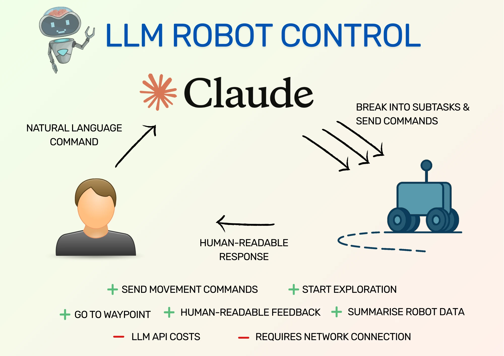
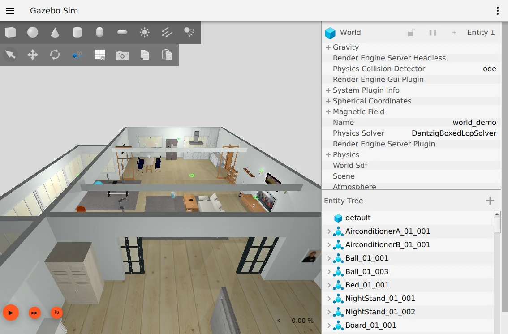
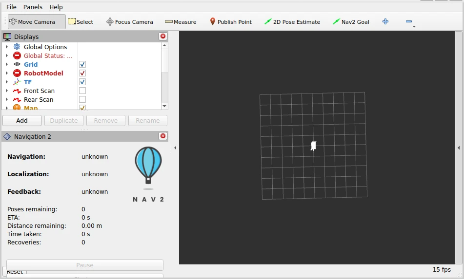
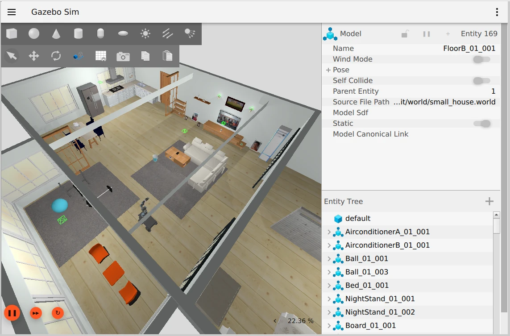
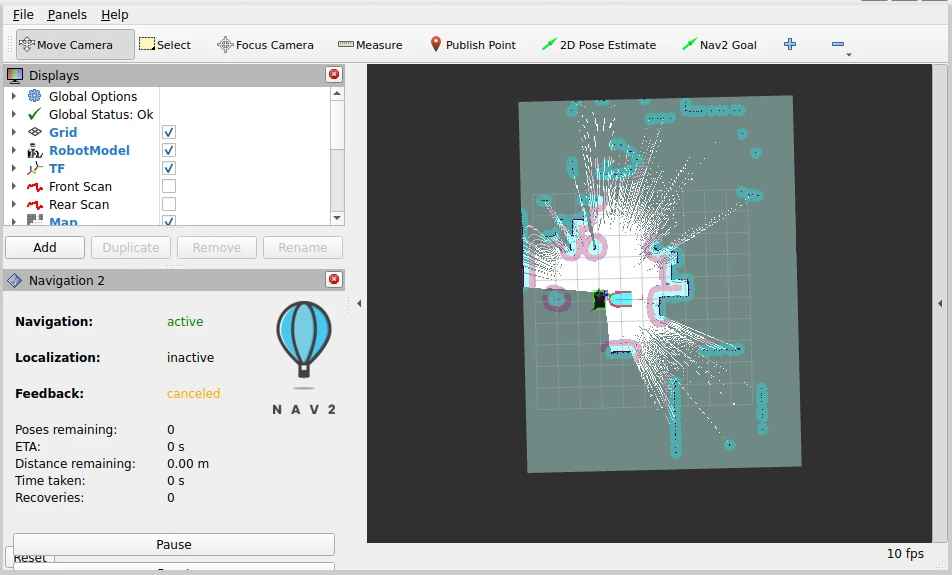

In the past, a human controlling a robot has depended entirely on what commands the human can send the robot, either through structured messages or through user interfaces. That's changing with Large Language Models (LLMs), because we can provide a few tools for controlling robots to an LLM and then give commands in natural language, and the LLM works out how to send the right commands to the robot. This gives us a lot more flexibility in how we can interact with robots.

In this post, I show an example project that runs a Gazebo simulation of a robot in a small house.
The project uses [Claude](https://www.anthropic.com/claude), an LLM from Anthropic, to interact with the robot, which allows the user to give the robot natural language commands and see those changes happen in simulation.

After the demo, I show how to set it up, then talk about how the code interfaces with Claude.

:::note With Thanks

The demonstration project in this post is from a university-based robotics course. One of the groups on the course kindly released their submission on Github so that I could show it in this post. Therefore, I'd like to thank [Senior Lecturer Giovanni Toffetti](https://www.linkedin.com/in/giovannitoffetti/) at [Zurich University of Applied Sciences](https://www.zhaw.ch/en/university) and his students [Alexander Kolenaty](https://www.linkedin.com/in/alexander-kolenaty/), [Jan Affeltranger](https://www.linkedin.com/in/jan-affeltranger-a03a10219), and Ilimea Gall.

:::

This post is also available in video form. If you'd prefer to watch, click the link below:

<iframe class="youtube-video" src="https://www.youtube.com/embed/Lr-LjwPR1hM?si=CwY2vn-VHDPKB4Pv" title="YouTube video player" frameborder="0" allow="accelerometer; autoplay; clipboard-write; encrypted-media; gyroscope; picture-in-picture; web-share" referrerpolicy="strict-origin-when-cross-origin" allowfullscreen></iframe>

<!-- truncate -->

## Why Control Robots With an LLM?

LLMs are AI models that perform very well at understanding human language and intentions. That means using an LLM to control a robot comes with a few benefits:

- Humans can request high-level actions from the LLM, expressed in natural language. The LLM can translate these into commands for the robot and automatically execute them.
- LLMs allow extra tools to be added that aren't directly programmed into the robot, such as moving forwards for a set amount of time. For this, the LLM approximates the robot's location after that time, and requests movement to that location. This depends on the capabilities of the LLM.
- LLMs can break down high level tasks into separate sub-tasks, as they often understand the steps necessary to complete an overall task.
- LLMs can give human-readable responses to requests, which provides an excellent feedback mechanism for understanding what the robot is doing.

Unfortunately, LLMs are computationally very expensive, and most robots are limited on their compute power and energy storage. This means that running a capable LLM such as Claude is all but impossible to do on most robots. LLMs are generally only deployed to large servers or run in data centers.

To get around this limitation, we give the robot a network connection and configure it to communicate with an LLM operating in the cloud. This does have its drawbacks as robots that don't have a stable network connection will be unable to communicate properly with the LLM. This isn't an issue in simulation, but for a real robot, think carefully before making the robot's behaviour depend on the LLM. If you're interested in why you should connect your robots to the cloud, [take a look at my post here](/blog/why-use-cloud-robotics).

With our robot connected to the internet, we can issue commands to Claude, which then breaks down the command and translates it into commands for the robot. For this to work, we need to define commands in the robot software that the LLM can use. Take a look at the [Code Description](#code-description) section to see how this works.

<figure class="text--center">

<figcaption>Infographic showing issuing commands to the LLM, which breaks the commanded task into subtasks and passes them to the robot. The feedback is then interpreted by the LLM and given to the user.</figcaption>
</figure>

For now, let's see how this works in simulation using a demonstration project.

## Gazebo Simulation Demo

To set up the demo for yourself, take a look at the [Demo Setup Instructions](#demo-setup-instructions).

Once the project is running, there will be 3 windows:

1. Gazebo simulation of a small room containing a [Robotnik Summit](https://robotnik.eu/products/mobile-robots/rb-summit/) robot.
1. RViz window to show the currently loaded map and robot location.
1. Claude prompt for sending instructions to the robot.

After starting the project, the simulation hasn't yet started _simulating_, which means the map is blank.

<figure class="text--center">

<figcaption>Initial Gazebo simulation window. The simulation contains a single floor of a small house along with a robot, which will be used for the demo.</figcaption>
</figure>

<figure class="text--center">

<figcaption>Before the simulation has started, there is no data to build a map from, so the map is blank.</figcaption>
</figure>

Clicking the play button in the bottom left of the simulation window will start the simulation. The data can now be used to form a map, shown in RViz.

<figure class="text--center">

<figcaption>Gazebo window with simulation started. The camera has been reoriented to show the robot position.</figcaption>
</figure>

<figure class="text--center">

<figcaption>The map has been built up from data sent from Gazebo.</figcaption>
</figure>

We also have the Claude prompt ready:

```
Hi from rosa_summit.
Using Anthropic API with Claude Sonnet 3.5
Type 'exit' or 'quit' to end the program
Enter your request:
```

:::note LLM Response Sections

For the rest of the article, I'll use collapsible sections for the LLM outputs, as they tend to be quite wordy!

:::

The simplest operations are relative moves. We can request a relative movement with a simple sentence:

<details>

<summary>Move backwards 1.5 meters</summary>

Enter your request: *Move backwards 1.5 meters*

Request sent

Great! I've sent the command to move backwards 1.5 meters. Here's what I did:

1. I used the navigate_relative function, which moves the robot relative to its current position.
2. I set the x parameter to -1.5, which represents moving backwards 1.5 meters.
3. I kept y at 0 since we don't want any sideways movement.
4. For the orientation, I used z_orientation = 0 and w_orientation = 1, which means we're maintaining our current orientation (not turning).

The system has confirmed that the relative navigation goal has been sent successfully. The robot should now be moving backwards 1.5 meters from its current position.

Is there anything else you'd like me to do, or do you have any questions about the movement?
</details>

This causes the robot to move backwards 1.5m, then straighten back to its original orientation. I haven't included the RViz screen as it doesn't add too much to the map based on this simple movement.

<figure class="text--center">

<figcaption>The robot moves backwards 1.5m, then straightens up. Sped up 10x from slow simulation speed.</figcaption>
</figure>

To find out what other operations are possible, we can just _ask the LLM directly_.

<details>

<summary>What operations do you have available?</summary>

Enter your request: *What operations do you have available?*

Request sent

Thank you for your patience. Based on the available topics, nodes, and services, I can provide you with an overview of the operations I have available. These operations allow me to interact with the robotic system and perform various tasks. Here's a summary of the key functionalities:

1. Navigation and Movement:
   - Move to specific poses or locations
   - Navigate through a series of poses
   - Control velocity (forward, backward, turning)
   - Follow waypoints

2. Mapping and Localization:
   - Perform SLAM (Simultaneous Localization and Mapping)
   - Save and load maps
   - Access and modify costmaps (for obstacle avoidance)

3. Sensor Data:
   - Access data from various sensors (cameras, lasers, point clouds)
   - Merge laser scan data

4. Path Planning:
   - Plan paths to avoid obstacles
   - Smooth trajectories

5. Exploration:
   - Autonomous exploration of the environment

6. Robot State and Control:
   - Monitor and control joint states
   - Access odometry data
   - Manage the robot's lifecycle (start, stop, pause operations)

7. Parameter Management:
   - Get and set various parameters for different nodes

8. Visualization:
   - Interact with RViz for visualization purposes

9. Collision Monitoring:
   - Monitor and respond to potential collisions

10. Docking:
    - Perform docking operations

11. Diagnostics:
    - Access diagnostic information about the robot's systems

Some specific operations I can perform include:

- Moving the robot to a specific position and orientation
- Navigating to predefined locations
- Starting or stopping autonomous exploration
- Saving the current map
- Listing saved maps
- Reading sensor data (e.g., camera images, laser scans)
- Controlling the robot's velocity
- Checking the robot's current pose and odometry
- Managing and querying various parameters of the robot's systems

Is there a specific type of operation you're interested in, or would you like more details about any of these functionalities?

</details>

From this list, I'll show the fixed point navigation and the autonomous exploration. If you'd like to see the other operations in action, feel free to set up the demo and try it for yourself!

For fixed point navigation, I first need to know what locations are defined.

<details>

<summary>What predefined locations do you know?</summary>

Enter your request: *What predefined locations do you know?*

Request sent

Great! I've retrieved the list of predefined locations that I know. Here are the available locations:

1. Gym
2. Kitchen
3. Living Room
4. Office
5. Bedroom

These are the locations that have been pre-programmed into my system. I can navigate to any of these locations using their names. For example, if you want me to go to the kitchen, you can simply ask me to "navigate to the kitchen," and I'll use the `navigate_to_location_by_name` function to move there.

Is there a specific location you'd like me to navigate to, or do you have any questions about these predefined locations?

</details>

With the list defined, I'll request navigation to the kitchen.

<details>

<summary>Navigate to the kitchen</summary>

Enter your request: *Navigate to the kitchen*

Request sent

Great! The navigation goal has been sent successfully. I'm now moving towards the kitchen. The system has provided me with the target position and orientation for the kitchen location:

- Position: x = 7.35, y = -3.46, z = 0.0
- Orientation: x = 0.0, y = 0.0, z = -0.073, w = 0.997

These coordinates represent the kitchen's location in the map. The orientation values (especially z and w) indicate that I'll be facing a specific direction when I arrive at the kitchen.

The navigation system will now guide me to this location, avoiding any obstacles along the way. It may take a moment for me to reach the destination, depending on my current location and any potential obstacles in the environment.

Is there anything specific you'd like me to do once I reach the kitchen, or do you have any questions about the navigation process?

</details>

Requesting navigation to the kitchen from the LLM results in the robot planning a path to the kitchen, shown as a red line in RViz. The robot does seem to get stuck on the rug, as it thinks there's an obstacle there, before proceeding to move to the kitchen.

<figure class="text--center">

<figcaption>The robot navigates to the kitchen, with a red line on the RViz window showing the planned path, and the map filling in as the robot moves.</figcaption>
</figure>

Finally, for this demo, we can also autonomously explore the map. Once the map has been explored, exploration will end.

<details>

<summary>Fully explore the map</summary>

Enter your request: *Fully explore the map*

Request sent

Great! The autonomous exploration has been successfully started. The robot will now move around the environment, using its sensors to map out unexplored areas and update its internal map. This process will continue until the entire accessible area has been explored or until we decide to stop it.

During the exploration:
1. I'll use my sensors (like LIDAR) to detect obstacles and open spaces.
2. I'll continuously update the map as I discover new areas.
3. I'll plan paths to unexplored regions, prioritizing efficiency and coverage.
4. I'll avoid obstacles and ensure safe navigation throughout the process.

Keep in mind that the time required for full exploration depends on the size and complexity of the environment. It could take several minutes or even longer for larger or more complex spaces.

Would you like me to provide updates on the exploration progress, or is there anything specific you'd like me to look out for during the exploration?

</details>

The robot does explore the map fully, but it gets stuck right at the end. It looks like the robot is afraid of colliding as it moves sideways through the gap, so it stops where it is. Navigation is triggered by the LLM but controlled by the robot software and navigation stack.

<figure class="text--center">

<figcaption>The robot explores the rest of the floor, starting in the kitchen, until it gets stuck passing between a surface. At this point, the map is almost entirely filled in thanks to SLAM.</figcaption>
</figure>

Those are a few of the commands available. There are far more complex commands that are possible using the LLM. For example, I have previously requested moving to a location, then moving relative to that location, then spinning on the spot - all in one prompt. The limit depends on the LLM used and the tools it has available.

If you are interested in setting this demo up for yourself, read on! The next section shows how to set it up for yourself. If you are only interested in how the code interfaces with the LLM, take a look at the [Code Description](#code-description) section.

## Demo Setup Instructions

### System Requirements

This demo is run using [Docker](https://docs.docker.com/engine/install/). Ideally, Linux should be used, but it is possible to run on Windows if [Docker Desktop with WSL](https://docs.docker.com/desktop/features/wsl/) is correctly installed.

:::tip GPU Acceleration

The simulation is sped up a lot using GPU acceleration, which is why I recommend using a Linux system with GPU available. I spent a lot of time trying to get GPU acceleration in Docker for Windows, but I unfortunately wasn't able to do so! I plan to show my process for debugging graphics acceleration in a future post, as it took a lot of time to get GPU acceleration working for Linux as well.

Let me know in the comments if this would be useful for you. Also, comment if you'd like to see a post on performing this simulation in the cloud instead.

:::

On top of Docker, the NVIDIA Container Toolkit is needed, which makes it possible to create the Gazebo and RViz windows. Follow the instructions from NVIDIA to install the [NVIDIA Container Toolkit](https://docs.nvidia.com/datacenter/cloud-native/container-toolkit/latest/install-guide.html).

### Anthropic API Key

To be able to connect the robot to the LLM, we need to provide credentials for the connection in the form of an Anthropic API key.

You can sign up for an Anthropic developer account on the [Anthropic API page](https://www.anthropic.com/api). Click the "Start building" button and set up an account. Once logged in, click "Get API Key". This will prompt you to enter billing information to add $5 to your account, which is necessary to access the LLM.

On the [API keys page](https://console.anthropic.com/settings/keys), click Create Key. Give it a name of your choice and use the Default workspace.

An API key will be generated and displayed on the page. Make sure to copy this and save it somewhere, as once it stops being displayed, Anthropic won't provide it again! You can always delete the key and regenerate it if necessary.

At this point, create a folder somewhere on your computer and save the key inside in a file called `api-key.txt`. For example:

```bash
mkdir ~/llm-robot-control
cd ~/llm-robot-control
# Paste the key inside this file:
nano api-key.txt
```

With the API key ready, it's time to build the simulation Docker image!

### Docker Image Build

The instructions here are adapted from the [README of the source repository](https://github.com/RAP-2025-Project-Group-2/RAP-2025-Project-Group-2). I have added a Dockerfile in [my own fork of the repository](https://github.com/mikelikesrobots/RAP-2025-Project-Group-2) to make it simpler to build the image directly.

Download the Dockerfile from my repo and build it with these commands:

```bash
cd ~/llm-robot-control
wget https://raw.githubusercontent.com/mikelikesrobots/RAP-2025-Project-Group-2/refs/heads/main/Dockerfile
docker build -t llm-robot-control:latest .
```

:::warning API Key Safety

After this build, the Docker image *contains* your API key. Don't distribute the key or the image you've just built if you want to keep your key safe!

:::

Once built, you can run a container using one of the commands below. Use the first command if you're running on a computer with no graphics card, and the second command if you're running on a Linux laptop that has access to the GPU. Both have extra flags that are necessary to create UI windows that you can interact with.

```bash
# Command for most machines
docker run -it --rm \
    --gpus all \
    -v /tmp/.X11-unix:/tmp/.X11-unix \
    -e NVIDIA_DRIVER_CAPABILITIES=all \
    -e DISPLAY=$DISPLAY \
    -e XDG_RUNTIME_DIR=$XDG_RUNTIME_DIR \
    -e XAUTHORITY=$XAUTH \
    --name robotcontrol \
    llm-robot-control:latest \
    bash -c "ros2 launch rosa_summit summit.launch.py slam:=True"

# Command for Linux laptops with GPU
docker run -it --rm \
    --gpus all \
    --device /dev/dri \
    -v /tmp/.X11-unix:/tmp/.X11-unix \
    -e NVIDIA_DRIVER_CAPABILITIES=all \
    -e DISPLAY=$DISPLAY \
    -e XDG_RUNTIME_DIR=$XDG_RUNTIME_DIR \
    -e XAUTHORITY=$XAUTH \
    --name robotcontrol \
    llm-robot-control:latest \
    bash -c "__NV_PRIME_RENDER_OFFLOAD=1 __GLX_VENDOR_LIBRARY_NAME=nvidia ros2 launch rosa_summit summit.launch.py slam:=True"
```

Gazebo and RViz should pop up. These windows will be slow to load, particularly if your system does not have a dedicated GPU, so be patient! Once the simulation is loaded, click the Play button in the bottom left to start simulating.

To start the prompt for Claude, open another terminal and execute the following:

```bash
docker exec -it robotcontrol /ros_entrypoint.sh ros2 run rosa_summit rosa_summit
```

This will start another process in the same container as the simulation command. It will read the API key and use it to authorise a connection to Claude, then wait for your prompt.

Give it a try! Commands sent to Claude at this point should move your robot around. The next section is about how the code interfaces with Claude, so you can add your own tools or extend the existing ones.

## Code Description

Claude can interact with the code by using *tools*. These are defined in [one file in the demo repository](https://github.com/RAP-2025-Project-Group-2/RAP-2025-Project-Group-2/blob/main/rosa_summit/rosa_summit.py), which makes it easy to find all of the functions.

### LLM Cloud Connection

The project uses [LangChain](https://python.langchain.com/docs/introduction/) for the LLM connection, which is "a framework for developing applications powered by large language models". The LLM connection is created by [this code](https://github.com/RAP-2025-Project-Group-2/RAP-2025-Project-Group-2/blob/main/rosa_summit/rosa_summit.py#L335-L340):

```python
llm = ChatAnthropic(
      model="claude-3-5-sonnet-20240620",
      temperature=0,
      anthropic_api_key=api_key,
      max_tokens=4096,
)
```

The API key is read from file, and the model used is specified here. You can change this to another model, if you prefer.

### LLM to Robot Interaction

With the connection complete, the next step is to provide the LLM with the tools defined in the code. This is accomplished using [ROSA](https://github.com/nasa-jpl/rosa), which is a layer on top of LangChain built to allow LLMs to interact with ROS and ROS 2. It is the key framework for interacting with robots using natural language.

On top of the tools that we define in code, it can also perform operations with ROS 2 like listing topics, summarising information from topics, and so on. Take a look at [the ROSA repository](https://github.com/nasa-jpl/rosa) to see what else it can do!

The ROSA layer is started by creating a new object with access to the LLM, the tools available, and the prompt for the LLM. The code is [here](https://github.com/RAP-2025-Project-Group-2/RAP-2025-Project-Group-2/blob/main/rosa_summit/rosa_summit.py#L345-L364):

```python
prompt = RobotSystemPrompts()
prompt.embodiment = "You are an helpful robot named Summit, designed to assist users in a simulated environment. You can navigate, explore, and interact with the environment using various tools."

# Pass the LLM to ROSA with both tools available
agent = ROSA(
   ros_version=2,
   llm=llm,
   tools=[
      send_vel,
      stop,
      toggle_auto_exploration,
      navigate_to_pose,
      navigate_relative,
      save_map,
      list_saved_maps,
      get_location_names,
      navigate_to_location_by_name,
   ],
   prompts=prompt,
)
```

The rest of the `main` function waits for typed requests, passes them to the `agent` object, and prints the response.

Let's take a look at the tool functions to see how to define our own interactions between the LLM and the robot code.

### Tool Definitions

Each of the tool definitions takes the same form. The function optionally takes an argument, such as the velocity to travel at, and returns a `str`. The idea is that the LLM can directly call these functions with data and get a string response that it can then interpret. For instance, if the function returns a `str` stating that exploration has started, the LLM can then change its response to the user to reflect this information.

The [`stop` tool](https://github.com/RAP-2025-Project-Group-2/RAP-2025-Project-Group-2/blob/main/rosa_summit/rosa_summit.py#L121-L130) is the simplest tool:

```python
@tool
def stop() -> str:
    """
    Stops or halts the robot by setting its velocity to zero

    """
    global vel_publisher
    twist = Twist()
    vel_publisher.publish(twist)
    return "Robot stopped"
```

There is no argument, because the function behaves the same no matter what data would be passed to it. It accesses a global velocity publishes and publishes an empty `Twist` object, which tells the robot to stop. It then returns a response that the robot as stopped for the LLM.

The key part is that the tool can either execute code directly, like in the `list_saved_maps` function, or can publish ROS 2 messages for other parts of the robot system to use. This could be velocity commands; messages for the `nav2` framework, which allows the robot to set a destination and handles the navigation to it; or just toggling autonomous exploration on or off.

A couple more examples:

[`get_location_names`](https://github.com/RAP-2025-Project-Group-2/RAP-2025-Project-Group-2/blob/main/rosa_summit/rosa_summit.py#L261-L266) has a dictionary containing all of the fixed locations, such as the office, bedroom, and kitchen. This tool simply returns those locations to the LLM so it understands where the robot can navigate to. Another tool called `navigate_to_location_by_name` then defines the position and orientation for a given location, so the LLM can command the robot to move there.

```python
@tool
def get_location_names() -> str:
    """
    Returns a list of available location names.
    """
    return f"Available locations: {', '.join(LOCATIONS.keys())}"
```

[`toggle_auto_exploration`](https://github.com/RAP-2025-Project-Group-2/RAP-2025-Project-Group-2/blob/main/rosa_summit/rosa_summit.py#L133-L148) interacts with the `nav2` library to toggle autonomous exploration. It takes a data argument of whether to explore or not, then constructs a ROS 2 message and publishes it to the `explore_publisher`.

```python
@tool
def toggle_auto_exploration(resume_exploration: bool) -> str:
    """
    Starts or stops the autonomous exploration.

    :param resume_exploration: True to start/resume exploration, False to stop/pause exploration.
    """
    global explore_publisher
    msg = Bool()
    msg.data = resume_exploration
    explore_publisher.publish(msg)

    if resume_exploration:
        return "Autonomous exploration started/resumed."
    else:
        return "Autonomous exploration stopped/paused."
```

There are other tools defined in the code! Take a look at the remaining functions to understand how they work. Once you understand the framework, you can begin to define your own tools to upgrade the robot's capability. What's more, this works for real robots as well as for simulated. Give it a try on a real robot!

## Summary

This post demonstrates how a robot can be controlled through natural language by using a large language model (LLM). By supplementing Claude with extra tools using the ROSA Python library, Claude can translate a user's instructions into commands the robot can understand directly. This is only possible by connecting to an LLM in the cloud due to the high compute power required for LLMs to work.

The post showed a demonstration project of a Gazebo simulation, where you can move a Robotnik Summit robot around using natural language commands. It then showed how to set up the project on your own computer, and finally discussed the basics of setting up the tools that the demonstration project has available.

Armed with this knowledge, you can now use an LLM to supplement your robots! See if you can get the demo project running, then extend it with your own tools to increase what the robot is capable of. Remember that ROSA gives access to all the ROS 2 topics, meaning any simulated data produced can be used by LLM tools as well.
