This post shows how to deploy an EC2 Spot Instance on AWS capable of running [O3DE](https://o3de.org/), [Ignition Gazebo](https://gazebosim.org/home), and [NVIDIA Isaac Sim](https://developer.NVIDIA.com/isaac/sim) at a reduced cost. This Spot Instance is part of a system that uses an Amazon S3 bucket to store project data, such as robot environment levels, and scripts to automate starting up and shutting down instances to save on costs when the simulation instance is not in use; the whole system is deployed using CDK, except for a few manual setup steps.

By the end of this post, you’ll have a fully automated system to spin up high-end GPU simulation machines for a fraction of the usual cost. What's more, you'll have ROS 2 access, remote desktop viewing, and one-line start/stop scripts to manage the instances.

This post is also available in video form. If you'd prefer to watch, click the link below:

<iframe class="youtube-video" src="https://www.youtube.com/embed/62QHXpeWVqw?si=-NuLQnrSHlrC6rI3" title="YouTube video player" frameborder="0" allow="accelerometer; autoplay; clipboard-write; encrypted-media; gyroscope; picture-in-picture; web-share" referrerpolicy="strict-origin-when-cross-origin" allowfullscreen></iframe>

<!-- truncate -->

## Running Simulations in the Cloud

Robotics simulators are highly useful for development, but very resource-intensive to run. One way to get access to computers with huge hard drives and powerful GPUs is to access them from a cloud provider like AWS. Of course, this does cost money; you need to pay for what you use. That means it's a great option if you infrequently run simulations, or if you want to run simulations in the background for testing, for example. If you need to run simulations frequently, you may prefer to buy your own computer and graphics card capable of running simulations.

The system is summarised in this infographic:

<figure class="text--center">
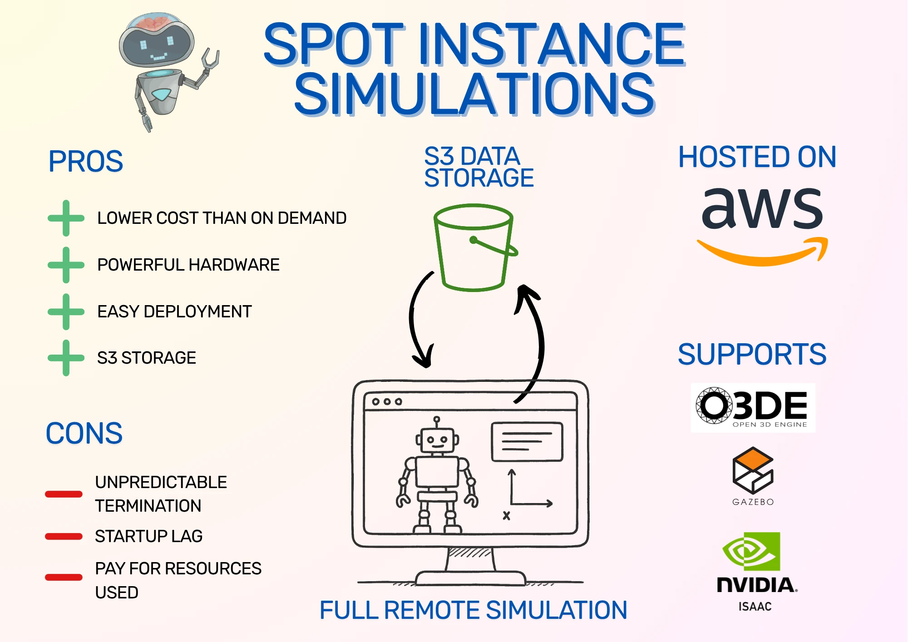
<figcaption>Infographic summarising the blog post. O3DE, Gazebo, and NVIDIA Isaac Sim are the supported simulators, and the infrastructure is hosted on AWS. Pros and Cons are listed on the left.</figcaption>
</figure>

I have previously written about [running simulations in the cloud](/blog/simulation-in-cloud). However, that post was about setting up O3DE and uses on-demand instances. O3DE is now much easier to set up thanks to a community AMI from [Robotec AI](https://www.robotec.ai/), which means that all the setup necessary for O3DE and remote desktop viewing via DCV is already available on the EC2 instance starting up - it's like resuming a system snapshot with everything already installed. Also, on-demand instances can be off-putting in terms of machine and storage costs. Instead, I'll show how to use Spot Instances to reduce EC2 costs and Amazon S3 to reduce storage costs.

## What are Spot Instances?

Spot Instances are an alternative way to run virtual machines in the cloud using Amazon EC2. Instead of on-demand instances, where you are guaranteed an instance for as long as you need it, Spot Instances can be taken away with only a few minutes' notice. This is because AWS needs to reclaim the instance space for another customer. In exchange, the Spot Instances cost less, often 60-70% less than the equivalent on-demand instance! That means instead of $1 per hour for a powerful GPU instance, you can pay as low as $0.30 per hour.

However, that's not the only downside of Spot Instances. Due to the way that Spot Instances are requested and terminated, we need to set up a system to quickly restore a Spot Instance if removed, including simulator installation and project data. If reducing costs is worth this risk to you, then read on - but even if not, this post and the accompanying CDK code show how to install Ignition Gazebo and Isaac Sim reliably, so you can use it for your own setup. O3DE is already installed by the AMI, so no extra installation is necessary.

:::note In My Experience

In practice, Spot interruptions are rare. I’ve only seen it happen once, and even then I might have been mistaken! It seems very rare, because it's only done when Amazon completely runs out of that instance type. You can also make it more rare by specifying multiple acceptable instance types to make losing an instance less likely.

:::

In this post, we use an Amazon S3 bucket to store project data. We launch Spot Instances with startup scripts that automatically copy all the project data in the bucket onto the Spot Instance, ready to use. O3DE is installed as part of the base AMI, Gazebo can be optionally installed with startup scripts, and NVIDIA Isaac Sim can be launched from a secondary drive snapshot that we build as a separate one-time setup. When we're ready to save our work and shut down, one command will synchronise all your data with the bucket, ready for your next run.

## Simulation Spot Instance Setup

Let's take a look at the system we'll be setting up. Here are the system components as a diagram, divided into stacks:

<figure class="text--center">
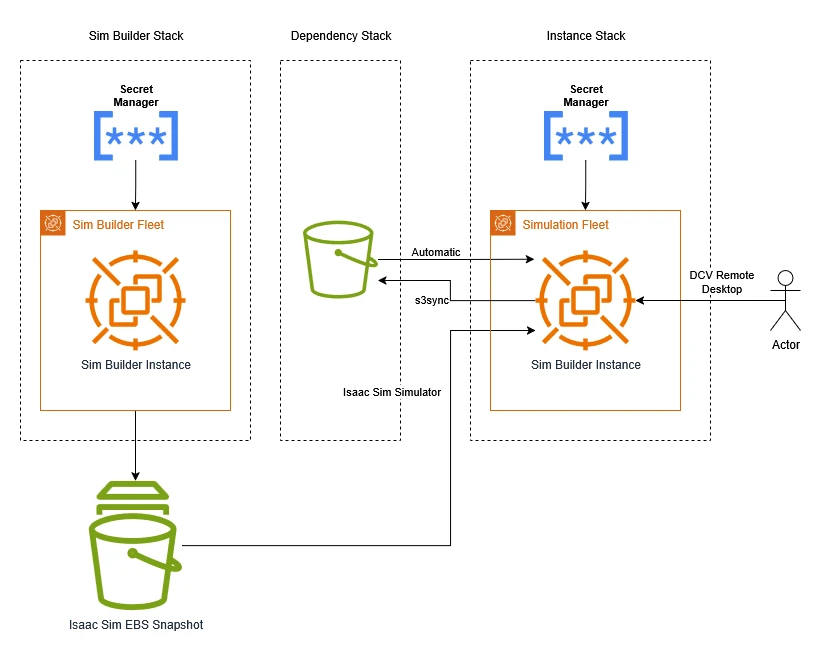
<figcaption>System Diagram showing AWS system components deployed using different stacks from the CDK code. Components are described separately above.</figcaption>
</figure>

The components break down as follows:

1. **Amazon S3 Bucket**: used to store project data. The contents are copied automatically into the simulator instance on startup.
1. **Isaac Sim EBS Snapshot**: as Isaac Sim is a large program with a lot of data to download, we set up an EBS snapshot with the simulator on. This means we can create a virtual hard drive with Isaac Sim installed at a moment's notice and attach it to our simulator instance. EBS is Elastic Block Storage, which is AWS's way of providing virtual hard drives.
1. **Spot Fleet Request**: this requests a Spot Instance for running simulations on. You can scale your Spot Instance fleet up or down by changing its target capacity: 1 to launch an instance, 0 to stop it.
1. **AWS Secrets Manager**: you can choose whether to set your own password or securely generate one. If you generate one, it is stored in AWS Secrets Manager.
1. **O3DE AMI**: an Amazon Machine Image (AMI) is the software that the instance will start up with. The O3DE AMI is a free community AMI from [Robotec AI](https://www.robotec.ai/) that comes with O3DE, ROS 2 Humble, graphics drivers, and the DCV server already installed and configured (DCV allows for remote desktop streaming). This makes O3DE installation incredibly easy: just launch an EC2 instance with this AMI, and you'll have full remote control of an instance with a graphics card running O3DE!

:::tip AWS Cost Summary

AWS charges for resources you create and for how you use them. Some costs include:
- Spot Instance: ~$0.30/hr (g4dn.2xlarge)
- EBS Snapshot (for Isaac Sim only): ~$0.05/GB/month. The Snapshot will be around 30 GB for a total of $1.50/month of EBS snapshot storage.
- S3 Storage: ~$0.023/GB/month
- Network usage: depends on downloads. This will be increased by downloading large assets, including the startup installation of Gazebo.

:::

Because there are a few different parts to this setup, I've written CDK code that automates almost all of it. This also makes it easier to specify startup scripts that synchronise project data, install extra dependencies, and so on. CDK stands for Cloud Development Kit, which is an AWS tool that lets you define Infrastructure as Code (IaC), meaning that it's easier to version, reuse, and automate deployment of systems like the one from this post.

I'll explain how to [run the setup code](#downloading-and-configuring-the-cdk-code) and how to [use the simulation instance](#deploying-and-using-the-simulation-stack), then dive into the code to [explain how the system is built](#popping-the-cdk-stacks).

### Installing Dependencies

You'll need the following dependencies to run the CDK stack:

- git
- Node Package Manager (`npm`)
- AWS CDK
- AWS CLI (Command Line Interface)

Once the stack is up, you will also need the NICE DCV Client to view the remote desktop. The files are available on the [Amazon DCV site](https://www.amazondcv.com/), so follow the installation instructions there.

#### Linux

Use `apt` or your equivalent package manager to install the first two dependencies:

```bash
sudo apt install -y git npm
```

The AWS CLI has its own installation instructions, available from the [AWS CLI user guide](https://docs.aws.amazon.com/cli/latest/userguide/getting-started-install.html). I've copied the latest instructions as of time of writing for your convenience:

```bash
curl "https://awscli.amazonaws.com/awscli-exe-linux-x86_64.zip" -o "awscliv2.zip"
unzip awscliv2.zip
sudo ./aws/install
```

Finally, the AWS CDK can be installed using `npm`:

```bash
npm install -g aws-cdk
```

#### Windows

On Windows, you can download installers for three of the four tools from these links:

- git: [https://git-scm.com/downloads/win](https://git-scm.com/downloads/win)
- `npm`: [https://docs.npmjs.com/downloading-and-installing-node-js-and-npm](https://docs.npmjs.com/downloading-and-installing-node-js-and-npm)
- AWS CLI: [https://awscli.amazonaws.com/AWSCLIV2.msi](https://awscli.amazonaws.com/AWSCLIV2.msi)

Once installed, the final dependency can be installed using `npm`:

```powershell
npm install -g aws-cdk
```

### Downloading and Configuring the CDK code

Clone the code:

```
git clone https://github.com/mikelikesrobots/spot_instance_sims
cd spot_instance_sims
```

Open the code folder in your preferred editor, then open the `bin/spot-instance-sims.ts` file. Lines 17 and 27 use an insecure password: either change this to your own password, or remove the lines completely to use a password generated by AWS Secrets Manager.

:::warning Copying into the Instance

Using a generated password is likely to be more secure, especially because the stack is configured to print out your specified password if you're not generating one, which can be read from logs. However, I found that copying the password into the instance using the DCV Viewer doesn't work well out of the box, which makes it really inconvenient to use!

:::

Line 23 has a TODO where you can paste the snapshot ID from [setting up the Isaac Sim EBS Snapshot](#optional-set-up-the-isaac-sim-ebs-snapshot), if you choose to do so.

Finally, line 26 has a flag to `installGazebo`. If you want to use Gazebo, leave this as it is, but it does need to be installed on every startup, which takes time and may incur bandwidth costs (AWS charges extra for uploads and downloads).

Once you've set up all the options as you want them, we need to set up AWS credentials to be able to deploy the resources.

### AWS Credentials Setup

There are a few methods to provide CDK with AWS credentials. I'm going to use IAM user long-term credentials as it's one of the quickest to set up, although it's not recommended by AWS. You can pick your preferred method from [Authentication and access credentials for the AWS CLI](https://docs.aws.amazon.com/cli/v1/userguide/cli-chap-authentication.html).

Sign in to the [AWS Console](https://eu-north-1.signin.aws.amazon.com/), then navigate to the [IAM service](https://us-east-1.console.aws.amazon.com/iam/home?region=us-east-1#/home). Access the [Users page](https://us-east-1.console.aws.amazon.com/iam/home?region=us-east-1#/users) and create a user if you don't have one already.

To create the user, give it your preferred name, then on the "Set permissions" page, select "Attach policies directly" and select "AdministratorAccess". This will grant all privileges to AWS. *I will leave constructing a least permissive policy as an exercise to the user!*

<figure class="text--center">
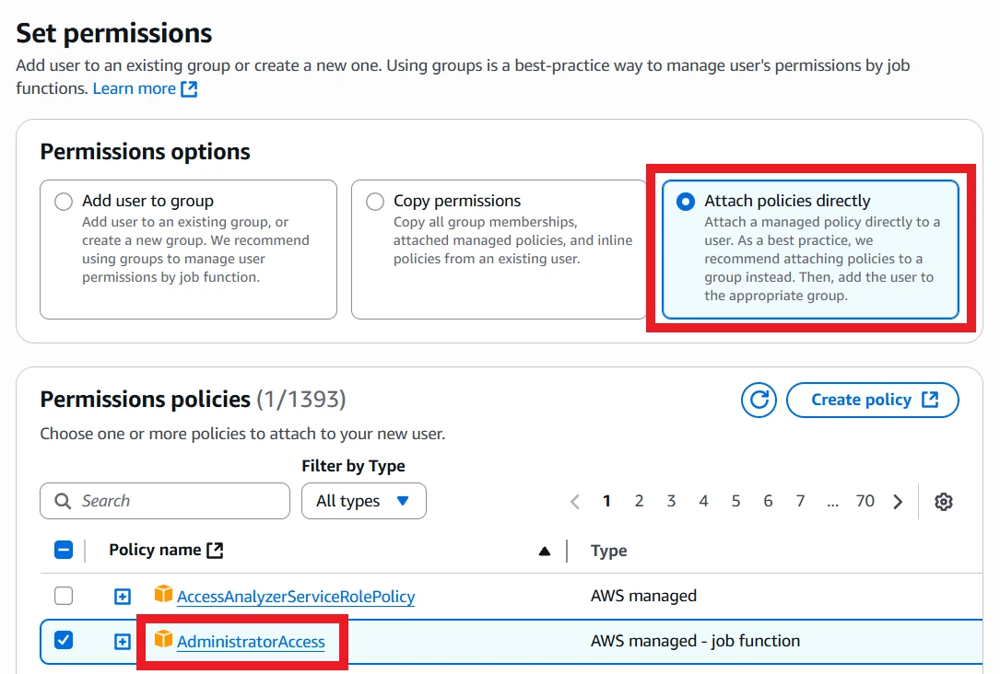
<figcaption>When creating a user in the IAM console, select the Attach policies directly button and attach AdministratorAccess.</figcaption>
</figure>

Once the user is created, select it and navigate to the "Security credentials" tab. Scroll down to Access keys and click Create access key.

<figure class="text--center">
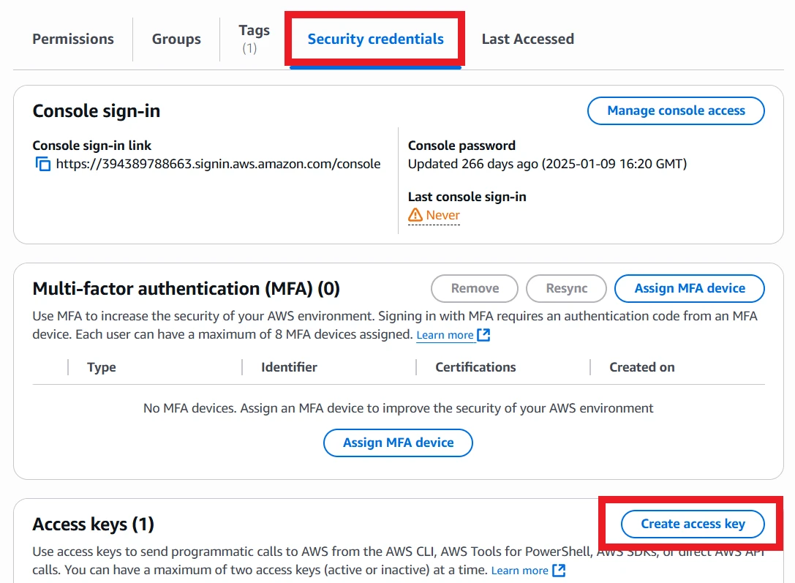
<figcaption>Select the user's Security credentials, then Create access key.</figcaption>
</figure>

The access key should be for "Command Line Interface (CLI)". Read the confirmation statement at the bottom and check it if you agree, then click Next. Set a description tag if you want, then go to retrieve access keys. Keep this page open until the AWS CLI has been fully configured!

Open a command prompt or terminal, then execute:

```bash
aws configure
```

This will prompt you for details of your access key. Copy the access key ID and secret from the AWS Console. The region and output format are up to you: I use `eu-west-2` and `json` respectively.

Once the configuration is complete, you can close the AWS Console if you want, although it will come in useful in later steps.

### Deploy the Dependency Stack

Open a command prompt or terminal and navigate to the CDK code folder:

```bash
cd path/to/spot_instance_sims
```

The code is divided into a few stacks. The first to deploy is the dependency stack, which only contains the Amazon S3 bucket for storing project data. This is separate so that it can be referenced by other stacks and won't be deleted when other stacks are deleted.

:::warning Clean Up Resources

If you want to completely clean up your AWS account resources, make sure to empty and delete this bucket!

:::

First, we need to initialise the environment, which means creating a few resources that CDK needs to help with deployment:

```bash
cdk bootstrap
```

Then we can deploy the dependency stack using the following command:

```bash
cdk deploy spot-sim-deps
```

Accept the changes, then wait for deployment to complete.

### [Optional] Set up the Isaac Sim EBS Snapshot

This step is completely optional and can be skipped if you don't plan to use Isaac Sim. It's also very time-consuming: doing it takes more than an hour, all told.

If you don't want to use NVIDIA Isaac Sim, make sure to delete the section in `bin/spot-instance-sims.ts` for `isaacSimParams`. If the `isaacSimParams` configuration section doesn't exist, the CDK will not take any actions towards deploying Isaac Sim.

If you _do_ want to use Isaac Sim, you will need to deploy a stack and then go through a few manual steps. First, we will deploy an EC2 Spot Instance with a fast EBS volume for storing Isaac Sim on:

```bash
cdk deploy isaac-builder
```

This instance will have instructions to download and extract Isaac Sim automatically. You can either wait for around thirty minutes for the instance to do its work, or you can monitor it by signing in and monitoring the log. If you wish to do so, the method of accessing the Spot Instance are the same as in [Deploying and Using the Simulation Stack](#deploying-and-using-the-simulation-stack); [get the instance's IP address](#get-sim-ip), then log in using the DCV Viewer. Once you have desktop access, use the following command in a termianl:

```bash
sudo tail -f /var/log/cloud-init-output.log
```

This will show what the startup script is doing. Once it gets to running the simulator headlessly, it will wait for 10 minutes, then quit the simulator. That's the point where you can access the instance and check that Isaac Sim is working correctly.

Once complete, open a terminal and execute `isaac`. This should load the simulator up. Wait until it's fully loaded, which takes around five minutes, then click the Play button to run the simulation. It will show an empty world. If you reach this point, congratulations! You have an EBS volume with NVIDIA Isaac Sim installed on it.

<figure class="text--center">
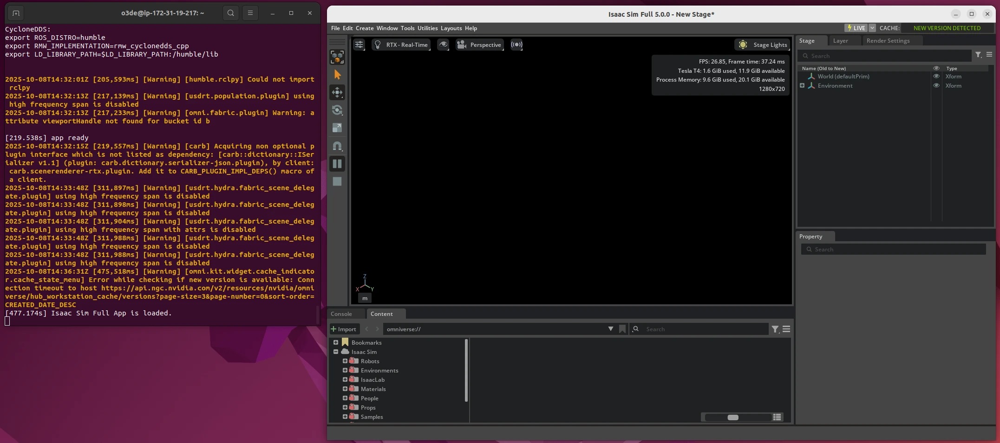
<figcaption>NVIDIA Isaac Sim running on the Spot Instance. Note that the time shows 477s before the app is fully ready, which is about 7-8 minutes.</figcaption>
</figure>

With Isaac Sim installed, the next step is to take a snapshot that can be used for future Spot Instances. The work of our current Spot Instance is done, so we can delete it to save on costs - see the [stop sim script](#stop-sim).

Next, navigate to the [Volumes page in the EC2 Console](https://eu-west-2.console.aws.amazon.com/ec2/home?region=eu-west-2#Volumes). Once the volume is no longer in use, check the checkbox and select Create snapshot from the Actions menu.

<figure class="text--center">
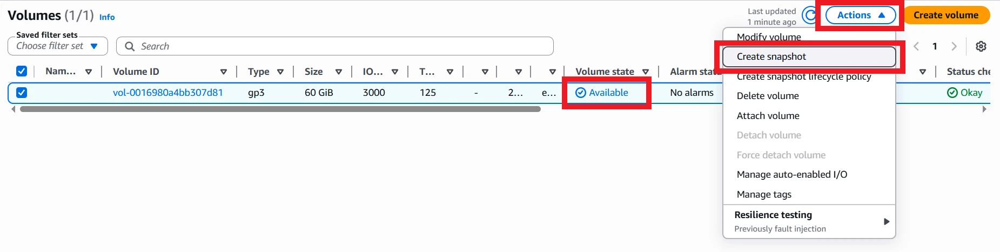
<figcaption>Once the volume says Available, highlight it, click Actions, then Create snapshot.</figcaption>
</figure>

Add a description and tags, if you like, then click Create snapshot. This operation will take a while, roughly 15-20 minutes, so settle in! Once complete, copy the Snapshot ID and replace the placeholder in the sim stack on line 24 of `bin/spot-instance-sims.ts`.

<figure class="text--center">

<figcaption>Once the Snapshot status is Completed, copy the Snapshot ID into the CDK code.</figcaption>
</figure>

Once the snapshot is complete, you can delete the Volume used to create it. It won't be needed any more, and it does cost money to keep it around.

<figure class="text--center">
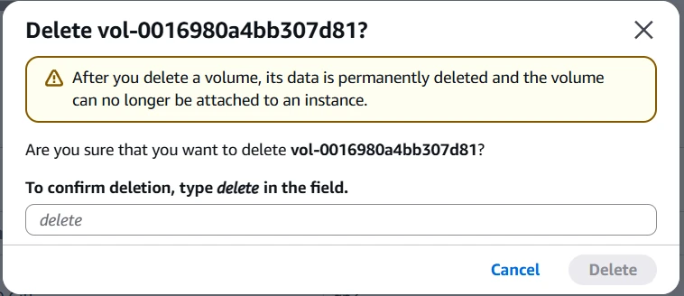
<figcaption>Go back to the Volumes page, select the volume, then select Delete volume from the Actions menu. Enter the given text to confirm deletion.</figcaption>
</figure>

That's all the setup you need for Isaac Sim - you can follow the rest of the instructions below.

### Deploying and Using the Simulation Stack

To get your simulation stack running, there's just one more stack to deploy:

```bash
cdk deploy spot-sim
```

Accept the changes to your AWS account, and it will create all of the resources.

:::warning EC2 Instance

You have now created the Spot Fleet Request that will start a Spot Instance for you. This Spot Instance is what costs the most money out of the whole system, so be careful not to leave it running unused! You can either destroy the stack or use the `stop_sim` script to make sure nothing is running and costing you money.

:::

At this point, your simulation instance is very likely to have started up already. If you are installing Gazebo, it may take a couple of minutes before it's ready to be used, but either way you can start the remote desktop viewer.

To access the instance, you need to find the IP address. Unfortunately, CDK can't directly give this to us because it creates the _fleet request_, not the Spot Instance itself, and it can't wait until the Spot Instance is up to find the IP address. One option is to use the AWS Console:

<figure class="text--center">
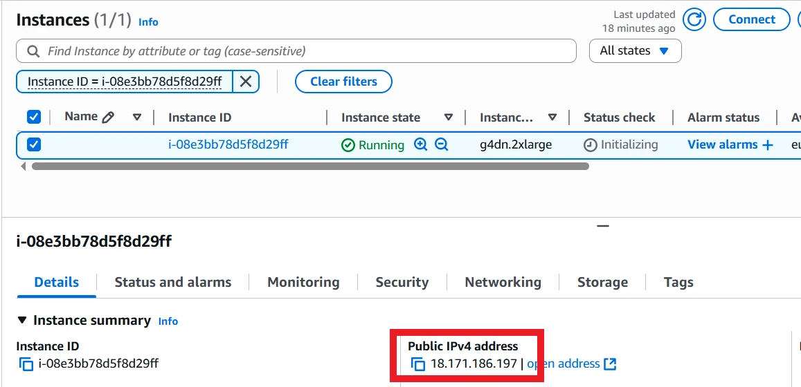
<figcaption>Find the Spot Instance under the Running Instances list or directly from the fleet request. Scroll right to find the Public IPv4 address, or select the instance and look at the information at the bottom.</figcaption>
</figure>

Another option is to use one of the provided scripts:

<span id="get-sim-ip"></span>

```bash
# Windows
.\scripts\get_sim_ip.bat
# Linux
./scripts/get_sim_ip.sh
```

The scripts work by looking up a Spot Instance with a particular tag, created automatically by the CDK stack, and getting its public IP. An example output is:

```bash
$ .\scripts\get_sim_ip.bat
-------------------------------------------       
|            DescribeInstances            |       
+----------------------+------------------+       
|  i-08e3bb78d5f8d29ff |  18.171.186.197  |       
+----------------------+------------------+
```

If you chose to generate a password, now is also a good time to look that password up. You can either use the AWS CLI to obtain it (replace the placeholder ARN with the ARN from the CDK stack output):

```bash
aws secretsmanager get-secret-value --secret-id arn:your-arn-here
```

Or, you can open up the [AWS Secrets Manager console](https://eu-west-2.console.aws.amazon.com/secretsmanager/listsecrets?region=eu-west-2) and access it there.

<figure class="text--center">
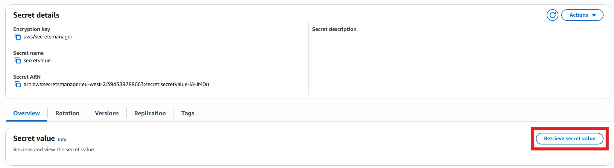
<figcaption>Select the secret in the AWS console, then click Retrieve secret value.</figcaption>
</figure>

Open the DCV Viewer application and paste the IP address in. Click Trust and Connect, then use the username `o3de` and your chosen or generated password to log in. You'll then need to log in to the Ubuntu desktop itself with the same username and password.

At this point, you should have the full Ubuntu desktop available! You can test by launching each simulator that you've installed in turn, and seeing if that simulator will load and run. Open a terminal and try each of these commands:

```bash
# For O3DE
o3de
# For Gazebo
gz sim shapes.sdf
# For NVIDIA Isaac Sim
isaac
```

Remember, only O3DE is installed by default! For Gazebo, you need to have the flag set to true in the CDK stack, and for NVIDIA Isaac Sim, you need to follow the [optional setup steps](#optional-set-up-the-isaac-sim-ebs-snapshot) _and_ update the CDK stack information with the EBS snapshot ID.

:::note Isaac Sim Asset Caching

The CDK build does try to cache assets for Isaac Sim. However, I'm not convinced that cached assets are preserved between launches of the Spot Instance. This should be possible by finding the cache paths of Isaac Sim and setting up symlinks to point them to the EBS drive, then add those symlink commands to the user data scripts. If you are able to figure this out, please submit a PR or comment on this article!

:::

<figure class="text--center">
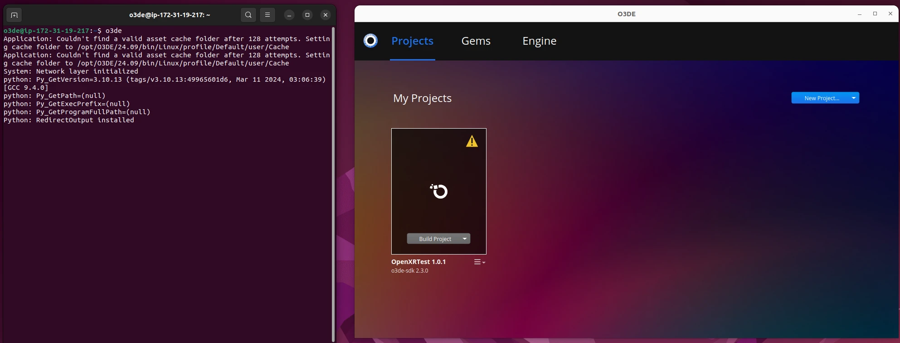
<figcaption>O3DE running on the Spot Instance.</figcaption>
</figure>

<figure class="text--center">
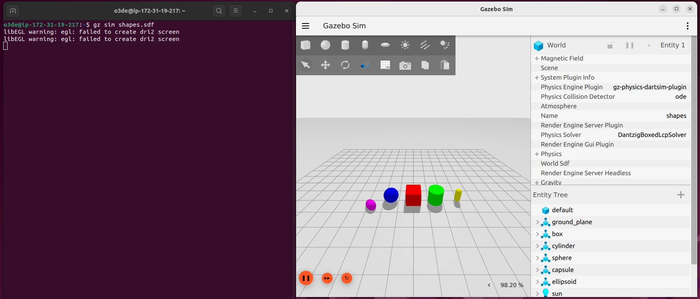
<figcaption>Ignition Gazebo running on the Spot Instance.</figcaption>
</figure>

<figure class="text--center">

<figcaption>NVIDIA Isaac Sim running on the Spot Instance.</figcaption>
</figure>

If you do try to run Gazebo or Isaac Sim and get an error, try waiting a few more minutes for the setup script to finish working, then use command `source ~/.bashrc`. If that still isn't enough, you can try the installation steps yourself to see what went wrong, or comment on this article to see if I can help!

#### Saving Project Information

The CDK stack will automatically set up a command for syncing project data back to the S3 bucket. The command can't be used automatically by the system, because it isn't guaranteed to have a full shutdown cycle, so instead you will need to remember to save project data back!

The command to use is:

```bash
s3sync
```

This will copy any project files from your spot instance to the S3 bucket created by the CDK stack. The next time a Spot Instance starts up, it will automatically have all data from the bucket copied into it, meaning that your data is preserved between runs. However, only project data created in the `/data` folder will be copied!

If we open up O3DE and create a new project, you can give that project a folder path of `/data/your-project-name`. If you do so, running `s3sync` will copy it to the S3 bucket. You can build the project, run and do any testing, then sync to S3 if you want to keep the changes. On next run, that project will be available on disk, but won't be in the project manager; you'll need to open an existing project to get access to it.

<figure class="text--center">
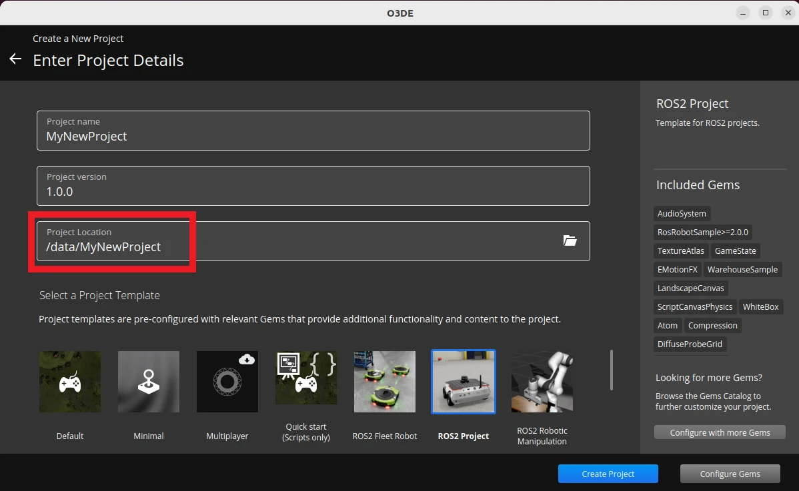
<figcaption>When creating a new project in O3DE, make sure to specify a project location in the `/data` folder so it can be synced back and forth with the S3 bucket.</figcaption>
</figure>

After you've finished working with the project, remember to use `s3sync`:

```bash
o3de@ip-172-31-17-163:~$ s3sync
Completed 381 Bytes/~47.9 KiB (7.3 KiB/s) with ~27 file(s) remaining (calculatinupload: ../../data/MyNewProject/.gitattributes to s3://spot-sim-deps-simbucket31bbb824-m0194qsbkyyz/MyNewProject/.gitattributes
Completed 381 Bytes/~47.9 KiB (7.3 KiB/s) with ~26 file(s) remaining (calculatinCompleted 2.2 KiB/~134.3 KiB (25.0 KiB/s) with ~46 file(s) remaining (calculatinupload: ../../data/MyNewProject/Examples/slam_navigation/launch/navigation.launch.py to s3://spot-sim-deps-simbucket31bbb824-m0194qsbkyyz/MyNewProject/Examples/slam_navigation/launch/navigation.launch.py
... (Removed for brevity) ...
upload: ../../data/MyNewProject/project.json to s3://spot-sim-deps-simbucket31bbb824-m0194qsbkyyz/MyNewProject/project.json
upload: ../../data/MyNewProject/project.json.bak0 to s3://spot-sim-deps-simbucket31bbb824-m0194qsbkyyz/MyNewProject/project.json.bak0
```

#### Starting and Stopping the Instance

The fleet request has a target capacity of 1, which means that it always tries to have 1 running Spot Instance. If you shut that instance down, the fleet request will start another one up. To stop any new instances being created, we have two options:

1. Destroy the CDK stack
1. Set the target capacity to 0

Either option will have the desired effect, but destroying the stack takes a lot longer and would require you to redeploy the stack later for another instance. Instead, we can modify the fleet request to have a target capacity of 0. If we do so, it will stop any running instances in a couple of minutes, then wait to be updated. That means we can leave the fleet request where it is for next time we want a Spot Instance!

To make this easier, I've set up tags on the fleet request using the CDK stack, and written a couple of scripts to update the target capacity. These scripts are as follows:

**Stopping the Instance**

This will stop a running instance in a couple of minutes. If the target capacity is already 0, it has no effect.

<span id="stop-sim"></span>

```bash
# Windows
.\scripts\stop_sim.bat
# Linux
./scripts/stop_sim.sh
```

**Starting the Instance**

This will start a new instance. If the target capacity is already 1, it has no effect.

<span id="start-sim"></span>

```bash
# Windows
.\scripts\start_sim.bat
# Linux
./scripts/start_sim.sh
```

This gives you the option to start and stop instances at your convenience without having to tear down and set up CDK resources.

#### Cleaning Up Resources

If you want to totally destroy all the resources you've used, there are a couple of resources to destroy manually. Access the S3 bucket and empty it, then delete the bucket. Also, if you created an EBS snapshot in [the Isaac Sim setup](#optional-set-up-the-isaac-sim-ebs-snapshot), this will need to be deleted manually, as it was created manually.

All remaining resources will be destroyed by destroying the CDK stacks:

```bash
cdk destroy --all
```

This will make sure there are no outstanding costs on your AWS account. Still, it is up to you to check that there are no outstanding expenses! If you want help tracking costs and usage on AWS, take a look at my video on the subject below:

<iframe class="youtube-video" src="https://www.youtube.com/embed/LreFpJDXZs0?si=SF8vhMUs2AfCSMeK" title="YouTube video player" frameborder="0" allow="accelerometer; autoplay; clipboard-write; encrypted-media; gyroscope; picture-in-picture; web-share" referrerpolicy="strict-origin-when-cross-origin" allowfullscreen></iframe>

## Popping the CDK stacks

At this point, you should have a running simulator in the cloud! You can use this for running O3DE, Isaac Sim, or Gazebo simulations as you require. If you're interested to learn how the resources are created, this section goes into more depth of how it works. I won't explain every line of code, but I'll highlight the important parts. The repository is available [on Github](https://github.com/mikelikesrobots/spot_instance_sims).

### Overall CDK Application

The main file for CDK to read is in `bin/spot-instance-sims.ts`. This file is simple; it defines some environment variables that it gets from the calling process, and it declares three stacks: `spot-sim-deps`, `isaac-builder`, and `spot-sim`.

Aside from the variables to change how the stacks behave that I first described in [Downloading and Configuring the CDK code](#downloading-and-configuring-the-cdk-code), there is also the `dependencyStack` variable passed into the `spot-sim` stack. That's because the dependency stack creates the Amazon S3 bucket separately to preserve it in case the sim stack is destroyed. By passing it into the sim stack, that stack is able to link to the bucket, so it can copy data in and out of it.

### The Dependency Stack

This code is contained in `lib/sim-dependency-stack.ts`. It simply creates an S3 bucket that blocks public access, versions data copied into it, and retains its contents if bucket removal is requested.

### Spot Fleet Request

This is not a stack, but a component used by the Isaac Sim builder stack and the Sim Spot Instance stack. It is contained in `lib/sim-spot-fleet-request.ts`, and it has quite a few steps. In fact, most of the complexity of the stack is in this file.

To begin with, it looks up the default VPC, which is required for launching EC2 instances.

```typescript
const vpc = ec2.Vpc.fromLookup(props.callingStack, "DefaultVpc", {
  isDefault: true,
});
```

It creates two IAM roles. The first is required by the fleet request, which allows it to request Spot Instances. It also gains the `AmazonEC2SpotFleetTaggingRole`, which allows us to tag the fleet request and any Spot Instances with tags to make script automation easier.

```typescript
const spotFleetRole = new iam.Role(props.callingStack, "SpotFleetRole", {
  assumedBy: new iam.ServicePrincipal("spotfleet.amazonaws.com"),
  managedPolicies: [
    iam.ManagedPolicy.fromAwsManagedPolicyName(
      "service-role/AmazonEC2SpotFleetTaggingRole"
    ),
  ],
});
```

The second IAM role is reserved for the Spot Instances. The fleet request object must have the role defined now so it can pass it to any Spot Instances it starts up. The policies it has attached are defined by the stacks that are calling it: for the Isaac Sim builder stack, no extra policies are required; for the sim spot stack, it must have read and write access to the S3 bucket.

```typescript
const instanceRole = new iam.Role(props.callingStack, "SimInstanceRole", {
  assumedBy: new iam.ServicePrincipal("ec2.amazonaws.com"),
});
const instanceProfile = new iam.CfnInstanceProfile(
  props.callingStack,
  "SimInstanceProfile",
  {
    roles: [instanceRole.roleName],
  }
);
props?.additionalPolicies?.forEach((policy) =>
  instanceRole.addToPolicy(policy)
);
```

The next section is about setting a password on the instance. If you defined a password, this will output the password to remind you. If you removed the password argument, it will generate a new password with the Secrets manager, and add permission to the Spot Instance IAM role to read that password. It also defines a command to get the password as an AWS CLI call:

```typescript
getPasswordCommand = `O3DE_PASSWORD=$(aws secretsmanager get-secret-value --secret-id "${passwordSecret.secretName}" --region ${region} --query 'SecretString' --output text | jq -r .password)`;
```

The stack creates a security group for the Spot Instances to use. This allows SSH and DCV access.

```typescript
const sg = new ec2.SecurityGroup(props.callingStack, "SimInstanceSG", {
  vpc,
  description: "Allow SSH and DCV",
  allowAllOutbound: true,
});
sg.addIngressRule(ec2.Peer.anyIpv4(), ec2.Port.tcp(22), "Allow SSH");
sg.addIngressRule(ec2.Peer.anyIpv4(), ec2.Port.tcp(8443), "Allow DCV");
```

Then, the stack defines user data commands. These are commands that the Spot Instance runs automatically on startup. At this point, it retrieves the password that the instance should use, then changes the password on the system and restarts the DCV server. It also adds any extra user data commands, which are defined by the stack using the component. We will see these commands in [Isaac Sim Builder Stack](#isaac-sim-builder-stack) and [Sim Spot Instance Stack](#sim-spot-instance-stack).

```typescript
const userData = ec2.UserData.forLinux();
userData.addCommands(
  // Change o3de user's password and restart DCV
  getPasswordCommand,
  `echo "o3de:$O3DE_PASSWORD" | chpasswd`,
  "systemctl restart dcvserver"
);
if (props?.additionalUserDataCommands) {
  userData.addCommands(...props.additionalUserDataCommands);
}
```

The final step of this stack is to make the actual fleet request, which is what everything else has been building up to. It mostly passes in data that was already defined, but there are a few extra parts to highlight.

First, the following image ID is used. This [O3DE for 3D Games and Simulations on Ubuntu](https://aws.amazon.com/marketplace/pp/prodview-o3x2kjp3r3mgi) image already has the DCV server, O3DE, and graphics drivers installed.

```typescript
imageId: "ami-070cda0e6952fbf24",
```

Next, the `blockDeviceMappings` are passed in to the component. If this array is empty, it doesn't add any disks to the Spot Instances. If it has one or more entries, these will be automatically attached to Spot Instances that are launched. This is how we can attach a drive with the Isaac Sim installation: define the EBS drive parameters, including the snapshot ID, and it will be created and attached automatically.

```typescript
blockDeviceMappings: props?.blockDeviceMappings || [],
```

Finally, the instance type is specified as `g4dn.2xlarge`. You could change this to a larger image type if you like. When I tried to change it to a smaller one, it refused to launch, but feel free to try for yourself!

Also, there can only be one instance type specified here. To specify a second instance type, you will need to create another entry in `launchSpecifications`.

```typescript
instanceType: 'g4dn.2xlarge',
```

That's mostly it! There are also a couple of tag definitions, and one last output with the username, which is always `o3de` from the AMI. Next, we'll see how this component is used by the Isaac Builder stack and the sim spot stack.

#### Isaac Sim Builder Stack

This is the simpler of the two stacks that use the `SimSpotFleetRequest` component from the previous section, defined in `lib/isaac-sim-builder-stack.ts`. It specifies an additional set of commands to run on startup which mount a drive, make a filesystem on it, then install Isaac Sim there. Finally, it does one headless launch to cache assets, terminating automatically after 10 minutes to allow the user to check the installation.

As well as the script, it creates the EBS volume that Isaac Sim is to be installed on. Crucially, the volume is **not deleted on termination**, which means you can create snapshots from it even after the Spot Instance has been deleted. However, it also means that destroying the CDK stack won't delete it - it will stay around forever, costing money, unless you delete it manually.

```typescript
const blockDeviceMappings: DeviceMapping[] = [
  {
    deviceName: "/dev/sdf",
    ebs: {
      volumeType: "gp3",
      deleteOnTermination: false,
      iops: 16000,
      volumeSize: 60,
    },
  },
];
```

#### Sim Spot Instance Stack

This is where the main sim instance is created. It starts by getting the URL and ARN for the S3 bucket created by the dependency stack and adding an inline policy to allow read and write access to it.

```typescript
const bucketURL = props?.dependencyStack.bucket?.s3UrlForObject();
const bucketArn = props?.dependencyStack.bucket?.bucketArn;
if (bucketArn) {
  additionalPolicies.push(new iam.PolicyStatement({
    ...
```

Most of the rest of the file define the user data commands to run on startup. First, no matter the simulators used, it installs the AWS CLI and synchronises data from the S3 bucket into `/data` on the system. It also creates the sync command alias that allows you to run the `s3sync` command.

Next, it checks whether Isaac Sim is being used, and if it is, adds extra commands and an EBS volume to support it. The commands attach the device and mount it, then create the `isaac` command to run it. The EBS volume is defined by the snapshot ID passed in to the stack, and is set to delete on termination, so that when the Spot Instance is destroyed, that EBS volume is as well.

```typescript
blockDeviceMappings.push({
  deviceName: deviceName,
  ebs: {
    snapshotId: props?.isaacSimParams.snapshotId,
    volumeType: "gp3",
    deleteOnTermination: true,
  },
});
```

The last set of commands are only run if the `installGazebo` command is true. It adds extra `apt` repositories for Gazebo, then installs the `libignition-gazebo7-dev` package.

```typescript
if (props?.installGazebo) {
  const gazeboCommands = [
    'echo "deb http://packages.osrfoundation.org/gazebo/ubuntu-stable `lsb_release -cs` main" > /etc/apt/sources.list.d/gazebo-stable.list',
    "wget http://packages.osrfoundation.org/gazebo.key -O - | sudo apt-key add -",
    "sudo apt update",
    "sudo apt install -y libignition-gazebo7-dev",
  ];
  additionalUserDataCommands = [
    ...additionalUserDataCommands,
    ...gazeboCommands,
  ];
}
```

#### Other Repository Files

Apart from the CDK code, the files are mostly supporting the CDK deployment, such as `package.json` defining the `npm` packages needed. The `scripts` folder does contain some useful scripts which I welcome you to look through, but the functions are pretty simple:

- **get_sim_ip**: write a table of IP addresses for all EC2 instances with the `sim-spot-instance` tag
- **start_sim**: list all fleet requests, check each one for the spot-fleet tag, and set the first matching fleet request to have target capacity of 1
- **stop_sim**: the same as **start_sim**, except that it sets the target capacity to 0

That's all the code that's used!

## What's Next

So far, we've seen that Spot Instances can be used in Amazon EC2 to control virtual machines capable of running robotic simulators.
Spot Instances have drawbacks in that they need to be initialised in a particular way and may be closed down by AWS with a couple of minutes' notice.
On the other hand, the prices are reduced by up to 60-70%, making this a potentially great trade-off.
We can use CDK code to define the Spot Instances, their dependencies, _and_ the startup scripts to automatically install the simulators we need to run in the cloud.

To get access to O3DE, we can use a particular AMI, which _also_ provides remote desktop access and ROS2 installation. For Gazebo, we can install it automatically on startup, and for NVIDIA Isaac Sim, we can create an EBS snapshot with the simulator already installed, then create a new drive from that snapshot for every new Spot Instance.

If you need to run infrequent or background robotic simulations, running in the cloud might be a great option for you. The CDK code can help you get up and running, and with it being open source under a permissive licence, you can make any changes you want, including installing extra simulators.

In a future post, I will show how to use the new ROS 2 [simulation interface messages](https://github.com/ros-simulation/simulation_interfaces). This is a new package that allows control of different simulators from the same set of messages. What's more, we can send those messages from an RViz plugin, which means no matter the simulator in use, we can control it from the same ROS 2 environment! So far, this package is supported on O3DE and Isaac Sim, and support for Gazebo is planned.
