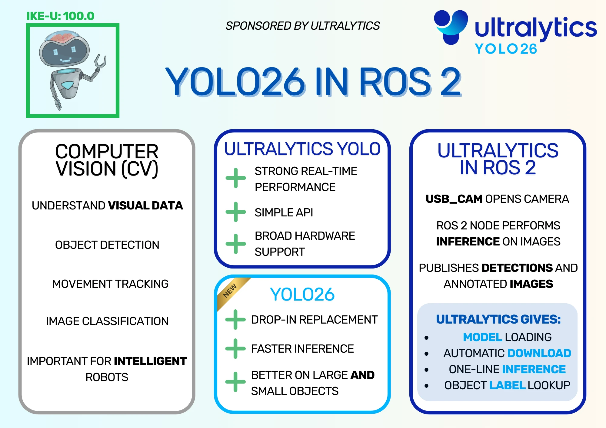
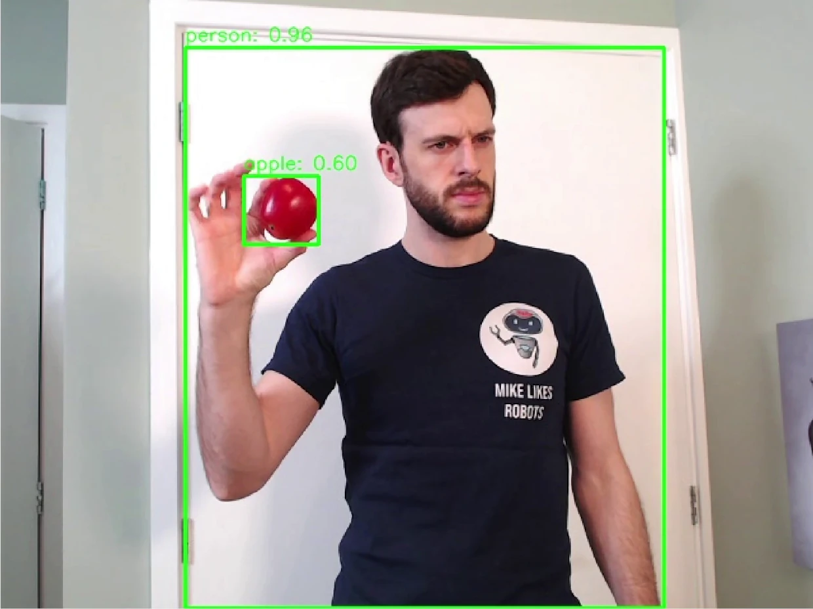
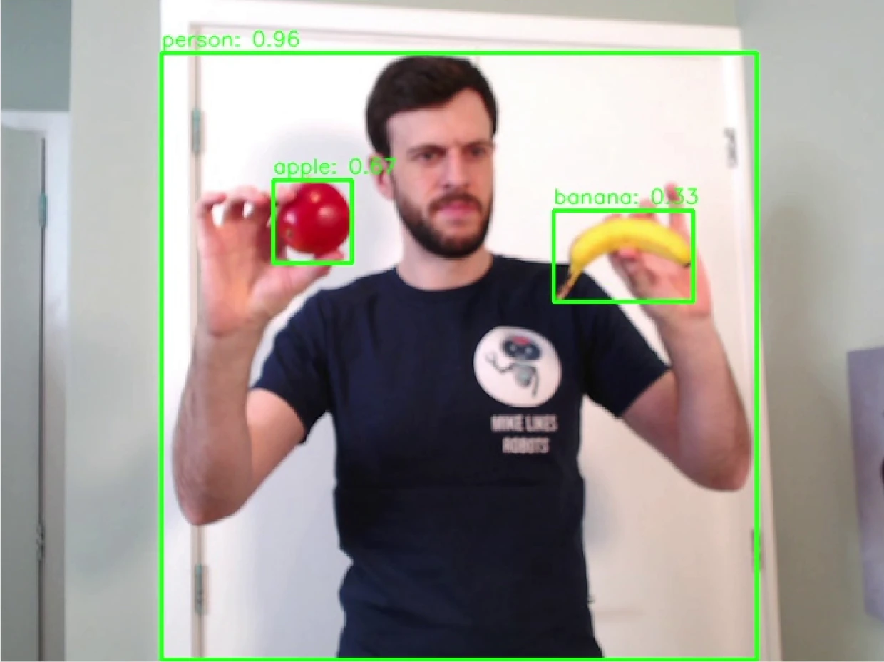
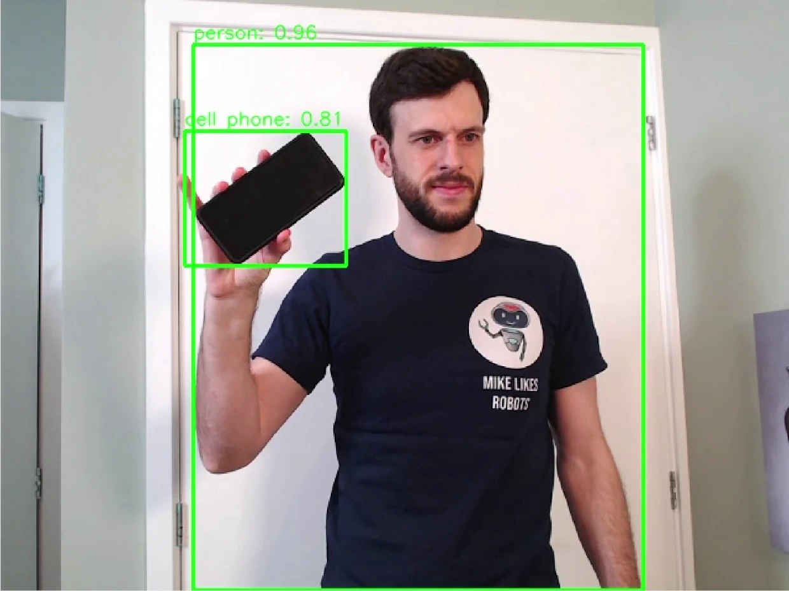
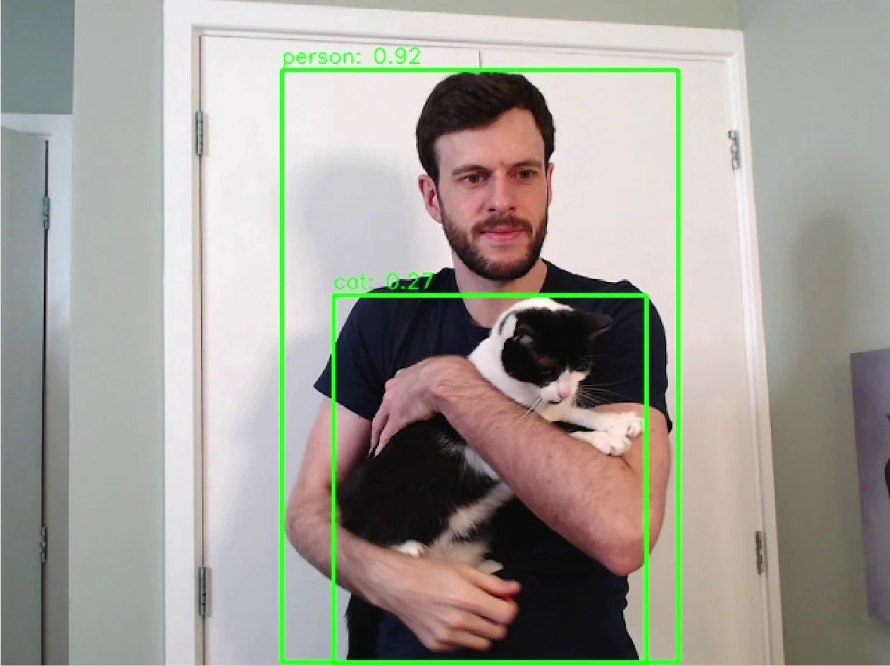
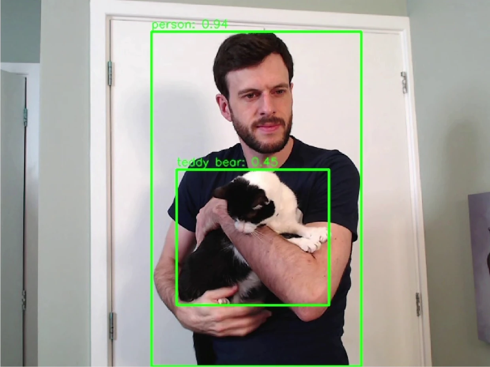
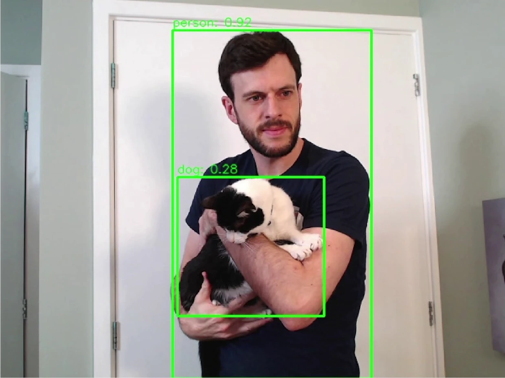
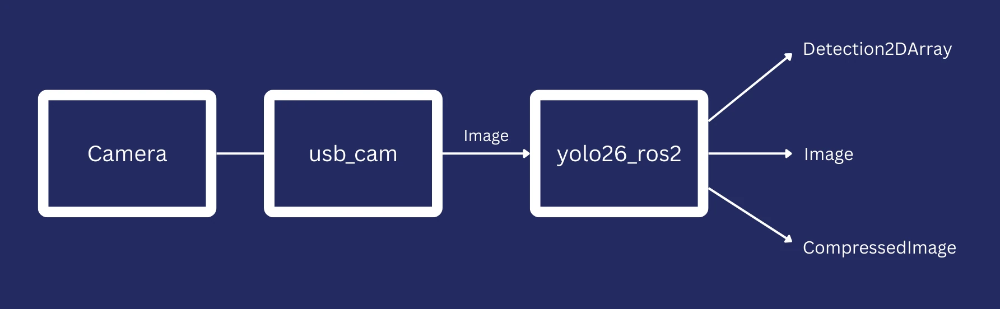

Computer Vision (CV) is when a machine processes visual data to perceive its environment, just as humans can. Robots using CV can operate on single images or continuous video data, which allows them to recognise objects, detect obstacles, track movements over time, and navigate in complex space. For instance, autonomous vehicles can use camera data for safety systems or even fully autonomous driving.

This post walks through building a simple ROS 2 node that detects objects in real time using a robot's webcam and the Ultralytics YOLO26 model. The purpose is to show how simple it is to deploy Ultralytics models on a robot using the `ultralytics` Python package, as well as walking through a simple ROS 2 node for CV.

<iframe class="youtube-video" src="https://www.youtube.com/embed/jZtmxtWO3Dk?si=q6LPSO1TcJ2WlSfO" title="YouTube video player" frameborder="0" allow="accelerometer; autoplay; clipboard-write; encrypted-media; gyroscope; picture-in-picture; web-share" referrerpolicy="strict-origin-when-cross-origin" allowfullscreen></iframe>

<!-- truncate -->

:::note[Sponsored by Ultralytics]

This post has been sponsored by Ultralytics. Check the following links for more information about Ultralytics YOLO26 or metrics of specific Ultralytics YOLO26 models:

**Ultralytics YOLO26 Docs**: https://docs.ultralytics.com/models/yolo26/?utm_source=infl&utm_medium=video&utm_campaign=yolo26&utm_term=mh

**Ultralytics YOLO26 Platform**: https://platform.ultralytics.com/ultralytics/yolo26?utm_source=infl&utm_medium=video&utm_campaign=yolo26&utm_term=mh

*The links have parameters to show you came from here!*

:::

**Ultralytics YOLO26 Infographic**

<figure class="text--center">

<figcaption>Infographic showing the uses of Computer Vision, the benefits of Ultralytics YOLO and Ultralytics YOLO26 in particular, and the key points of using Ultralytics in ROS 2.</figcaption>
</figure>

## Ultralytics YOLO

### YOLO Models

Ultralytics provides a suite of CV models called YOLO, or You Only Look Once, designed for efficient and accurate CV tasks. These models are widely used due to their strong real-time performance, simple APIs, and broad hardware support. In my case, it was extremely simple to deploy a model to the OriginBot, although it only runs on the CPU; the RDK X5 on board has hardware acceleration available, but I wanted to keep the ROS 2 node simple so it would be easy to understand. See my article [Exploring AI on the RDK X3 Sunrise](/blog/rdk-x3-ai-explore) for more information on the RDK X5's predecessor, the RDK X3.

YOLO models offer the following applications:
- **Object Detection**: Identify and locate multiple objects within a frame.
- **Segmentation**: Generates masks, or pixel regions, which belong to a particular object. For example, highlight the areas of an image occupied by ships in a dock.
- **Image Classification**: Classify an image as belonging to a particular class. For example, an image containing a keyboard may be given the Keyboard class.
- **Pose estimation**: Estimate the position and orientation of any humans within a frame. Each humans can have a simple skeleton drawn showing the location of their heads, torsos, and limbs.
- **Tracking**: Tracks an object or person between frames of a video, showing the change in position over time.

<figure class="text--center">

<figcaption>Graphic showing computer vision tasks supported by YOLO, courtesy of blog post [Behavioral AI is making computer vision more impactful by Abirami Vina](https://www.ultralytics.com/blog/behavioral-ai-is-making-computer-vision-more-impactful).</figcaption>
</figure>

Ultralytics YOLO26 is available under two licensing options. The AGPL-3.0 license is an OSI-approved open-source license, perfect for students, researchers, and enthusiasts who want to collaborate openly and share their work. For commercial use or private R&D, the Ultralytics Enterprise License allows seamless integration into proprietary products and services without the open-source requirements of AGPL-3.0. I'm using the models under the AGPL-3.0 License for this demo.

### Ultralytics YOLO26

Ultralytics has released multiple sets of YOLO models over the years, including YOLOv5, YOLOv8, and YOLOv11. The latest model that was released (generally available as of January 2026!) was Ultralytics YOLO26, which is the model we will use for the demo.

Ultralytics YOLO26 is a drop-in replacement for previous YOLO models, so if you're using any other YOLO models (e.g. YOLOv5), it is simple to update your code to use the new model. There are a few advantages to upgrading, as the new architecture of Ultralytics YOLO26 offers faster inference, better performance on large _and_ small objects, and broad hardware compatibility.

The demo from this post only runs on CPU, although it could run much faster with hardware acceleration, and Ultralytics aims to support as many types of hardware acceleration as it can.

## Running Ultralytics YOLO26 model on my robot

To test Ultralytics' claim that the model is easy to deploy, I wrote a simple ROS 2 node that receives images from a camera and performs inference on them. More information on how to build and deploy the node in [this sections](#how-to-run-ultralytics-yolo26-in-a-simple-ros-2-node).

I ran this node on my OriginBot, which uses the RDK X5 as a brain. The RDK X5 has hardware acceleration on board that can run YOLO models extremely quickly, but I chose to run the model using CPU to keep the node simple and easy to understand. Hence, the images come through more slowly than the board is capable of.

I also ran the node on my desktop computer, as it could process the images much faster, so that I could get some examples of the detections from the model. Hence, running the `yolo26n.pt` model on my desktop gave some of the following results. I tried a series of objects I had nearby to see what would be recognised by the model to select the objects used below.

First, the model performed very well with fruit like apples and bananas, even when the image wasn't properly focused.





The model also performed well for my phone.



The model had more trouble with objects like these scissors and toothbrush, but could still recognise the objects most of the time. I found that the model could recognise scissors more easily when up close and opened up.


There were also some objects that the model didn't recognise well. My examples are a water bottle and a screwdriver.


:::info[Further Model Training]

This isn't surprising, because the model was likely not trained on these objects at all. The model will only be able to recognise objects it has been trained on; otherwise, it will ignore the objects, or label them as a similar object that is has been trained on. If you're using YOLO models in your own application, you may need to train them further for better performance on your required objects. More information is available at [Model Training with Ultralytics YOLO](https://docs.ultralytics.com/modes/train/).

:::

Finally, as a bonus, my cat was mostly recognised as a cat, but was also labelled as a teddy bear and a dog. I enjoyed that the teddy bear confidence (45%) was higher than the cat confidence (27%), depending on the frame.





The dog label isn't too surprising to me. Depending on the angle, it can be hard to tell cats and dogs apart.

Now that we've seen some examples of objects detected by the network, let's look at how to deploy the model to a real robot.

## How to run Ultralytics YOLO26 in a simple ROS 2 node

I tend to build robotics applications using the ROS 2 framework. ROS 2 comes with a lot of advantages, but the main reason I use it is that it's free and very widely used, which makes it a great teaching tool. For more details on ROS 2, take a look at my previous blog post [Getting Started with ROS 2](/blog/getting-started-ros-2).

ROS 2 works by separating robot tasks into different nodes that communicate by passing messages. In a robot with Computer Vision, we might have one node that reads images from the camera and publishes them, and another node that subscribes to those images and performs inference on them. That's exactly the setup in today's demo.

Let's go through installing dependencies and running the code before taking a closer look at the code in the [Code Deep Dive](#code-deep-dive) section.

### Install ROS 2

The first step on a robot is to install ROS 2. If your robot is running Ubuntu, it's very simple - just follow the instructions [here](https://docs.ros.org/en/humble/Installation/Ubuntu-Install-Debs.html).

:::note[Not using Ubuntu?]

If your robot isn't running Ubuntu, there are still installation options. Take a look through the website above for how to install, or run in an Ubuntu VM if you just want to try the demo node out in simulation.

:::

After installing ROS 2, source the setup file. Change `humble` for the version of ROS 2 that you've installed:

```bash
source /opt/ros/humble/setup.bash
```

This needs to be done in every terminal session that you run ROS 2 commands in. If you ever get the error that `ros2` isn't recognised as a command, try running this source command again.

### Create a Workspace

To create the workspace for this example, run the following:

```bash
mkdir -p ~/yolo_ws/src
```

This creates the source folder of the workspace, into which we can clone the example node:

```bash
git clone https://github.com/mikelikesrobots/yolo26_ros2/ ~/yolo_ws/src/yolo26_ros2
```

As can be seen from the line above, all of the code for the demo is kept on my GitHub in the [yolo26_ros2](https://github.com/mikelikesrobots/yolo26_ros2/) repository.

With the code checked out, we can now install dependencies and build the node. For this, we will use the `rosdep` tool that comes with ROS 2, which makes it very easy to install extra dependencies for packages as long as they're recognised by the ROS package index. Execute the following:

```bash
# Only needs to be executed once per system
sudo rosdep init
# Run these for any new package, including our example node
rosdep update
rosdep install --from-paths ~/yolo_ws/src --ignore-src -r -y
```

:::note[Ultralytics Python Package]

`rosdep` is installing the Ultralytics Python package automatically. For other robotics frameworks, or to install the package manually, you can run `pip3 install ultralytics` instead.

:::

:::warning[Numpy Package Conflict]

If you're running this command on Ubuntu 24.04, you may find that the `ultralytics` package doesn't install correctly, and has an odd error about uninstalling `numpy`. To fix this, the best thing to do is build the OpenCV bridge from source, which bypasses the conflict.

```bash
git clone -b humble https://github.com/ros-perception/vision_opencv.git ~/yolo_ws/src/vision_opencv
cd ~/yolo_ws
colcon build --packages-select cv_bridge --cmake-args -DCMAKE_BUILD_TYPE=Release
```

You can then proceed with the instructions as before.

:::

With all dependencies installed, we can now build the workspace:

```bash
cd ~/yolo_ws
colcon build --symlink-install
```

The code is now fully built and ready to run.

### Running the Node

The package only builds one node called `yolo26_ros2`. We could run this node by itself, but it's not very useful without being supplied with camera images. To get images from a webcam, we can use a package called `usb_cam`, which is available for download without us having to build anything. In fact, it's already installed, as it is one of the `yolo26_ros2`'s dependencies - we only need to run it at the same time as our CV node.

To make running both nodes at the same time easier, the package includes a launch file, which is configured to launch the `yolo26_ros2` node and the `usb_cam` node at the same time. The `usb_cam` node will open the first available camera on the system and publish images from it using ROS 2. By launching these two nodes together, we can open a webcam, move images from the `usb_cam` node to the `yolo26_ros2` node, and perform inference on them.

```bash
source ~/yolo_ws/install/setup.bash
ros2 launch yolo26_ros2 yolo_camera.launch.py
```

If you want to run the demo node by itself, use this `ros2 run` command instead:

```bash
source ~/yolo_ws/install/setup.bash
ros2 run yolo26_ros2 yolo26_ros2
```

Either way you launch the demo node, it will automatically download the model you've requested, which is `yolo26n.pt` by default, and save it to the `share` directory of the ROS 2 workspace.

:::note[Model Downloading]

The Ultralytics Python package has a useful feature where it will download a requested model if it's not available on disk. This should be used cautiously in our ROS 2 workspace.

As `colcon build` copies *source* files to the *build* output, and our node runs from the *built* files rather than the *source* files, the Ultralytics package downloads the model to the `build` area. If you delete the built files while cleaning the workspace, the model will be deleted too. To keep a model permanently, download the model yourself to the `models` directory of the source `yolo26_ros2` package, and it will be copied by the build tool.

If you're not deleting the *built* files from your workspace, you don't need to worry!

:::

:::warning[USB Cam Parameters]

The `usb_cam` package can be configured with quite a few parameters, including the camera to use and the resolution to capture images at. I've disabled these to keep the launch file more readable, but if you find that you need to change parameters, you can find more information at [the GitHub page for usb_cam](https://github.com/ros-drivers/usb_cam). Use the current launch file as a template for adding the parameters back in.

:::

### Viewing the Output

The `yolo26_ros2` publishes 3 outputs, mostly for demonstration purposes. For your own use, you can remove the outputs you don't actively need, or separate them into different nodes. The 3 outputs are:

<figure class="text--center">
| Message Type     | Default Topic                      | Description                          |
| ---------------- | ---------------------------------- | ------------------------------------ |
| Detection2DArray | /detections                 | An array of detections, where each detection has co-ordinates and detected class |
| Image            | /image_annotated            | The original image annotated with bounding boxes based on the Detection2DArray  |
| CompressedImage  | /image_annotated/compressed | The same as the previous line, except that the image is compressed so it can be sent across a network more easily |

<figcaption>Outputs from the `yolo26_ros2` node, including the default topic and description of data produced.</figcaption>
</figure>

<figure class="text--center">

<figcaption>Diagram showing the data flow from `usb_cam` (controlling a webcam), to `yolo26_ros2`, and to any other nodes.</figcaption>
</figure>

The easiest way to view the output is to use a tool to visualise the CompressedImage messages. You can either use `rqt` for this, or my preferred tool, `rqt_image_view`:

```bash
ros2 run rqt_image_view rqt_image_view /image_annotated/compressed
```

You should be able to see the images streaming live from the robot! You can now try moving it around and seeing what it can detect.

:::warning[No User Interface (UI)]

If you're running on a robot, you might not have a UI for viewing images. Don't worry! Any computer on the same LAN should be able to view the images from the robot. I tend to use a Windows desktop, so I run an Ubuntu VM via [VirtualBox](https://www.virtualbox.org/) with ROS 2 installed to view the images. Normally, I use WSL2 to run ROS 2, but the networking setup makes it difficult to send ROS 2 messages across the network, so I stick with VirtualBox.

:::

### YOLO Model Parameter

Computer Vision algorithms tend to be divided into classical and Machine Learning. Classical algorithms work by spotting features in images, like edges, whereas Machine Learning versions will build a "model" from training data. This means that it uses a huge set of images with labels of what it should be looking for, and it learns to recognise those labels in those images. Switching out the model will change how the algorithm behaves.

The default model used here is `yolo26n.pt`, but this isn't the only model you could use. The model is set by a parameter, which is a ROS 2 way to change the configuration of nodes when they start up. In this case, we can set the `model_name` parameter with a different model name, and the node will attempt to load that model instead. For example, `yolo26n.pt` and `yolo26s.pt` are both valid. Take a look at the [metrics for the Ultralytics YOLO26 models](https://platform.ultralytics.com/ultralytics/yolo26?utm_source=infl&utm_medium=video&utm_campaign=yolo26&utm_term=mh) to select the right model for yourself. For this example, make sure to use a "Detect" model, as the other models work differently.

To set the parameter, we can either edit [the launch file](https://github.com/mikelikesrobots/yolo26_ros2/blob/main/launch/yolo_camera.launch.py#L8-L10):

```python
# Change the default_value argument
model_name_arg = DeclareLaunchArgument(
    "model_name", default_value="yolo26n.pt", description="YOLO model filename"
)
```

Or we can override the parameter when we launch the node:

```bash
ros2 launch yolo26_ros2 yolo_camera.launch.py model_name:=yolo26s.pt
```

In either case, launching the node will download the new model and run it instead, which gives us the ability to easily change out the model we're using as well as easily deploy it.

Now that we're able to run the node and change the model being used easily, let's take a look at how the code to see how this happens.

## Code Deep Dive

From running the example, we've already seen that the package:

- Allows ROS 2 to automatically install package dependencies
- Copies any models in the `models` directory to the build output
- Contains a launch file for launching the `usb_cam` node at the same time as the `yolo26_ros2` node
- Contains a node that:
    - Can be configured using parameters to change the model being loaded
    - Loads the model using the `ultralytics` Python package
    - Subscribes to images from the webcam
    - Performs CV inference on those images using the Ultralytics YOLO26 model
    - Publishes the outputs as a Detection2DArray, an annotated image, and a compressed version of the annotated image

This section looks closely at the code to show how each of those functions are performed.

### ROS 2 Package Setup

This package started with the default Python package template. The template includes package description file `package.xml`, a Python package build file called `setup.py`, and the source code of the node in `yolo26_ros2/yolo26_ros2.py`.

### Package Description

This file contains information about the package, such as the author and the license of the package. It also has a section for package dependencies, which tells ROS 2 which dependencies need to be installed to run the package. [These lines](https://github.com/mikelikesrobots/yolo26_ros2/blob/main/package.xml#L15-L21) state the dependencies for the package:

```xml
<depend>rclpy</depend>
<depend>sensor_msgs</depend>
<depend>cv_bridge</depend>
<exec_depend>vision_msgs</exec_depend>
<exec_depend>python3-ultralytics-pip</exec_depend>
<exec_depend>usb_cam</exec_depend>
```

This means that when `rosdep` is used to install dependencies for this package, it will look up the right packages to install based on these keys and install them. It also tells the build system that this package needs access to the dependencies to function correctly.

### Python Package Build File

The `setup.py` file also states the package author, as this is standard for a Python package, but it has some extra parameters describing what should be copied during the package build. [These lines](https://github.com/mikelikesrobots/yolo26_ros2/blob/main/setup.py#L6-L11) state that all files in the `models` and `launch` folders should be copied to the output:

```python
data_files = [
    ('share/ament_index/resource_index/packages',
        ['resource/' + package_name]),
    ('share/' + package_name, ['package.xml']),
    ('share/' + package_name + '/launch', glob.glob('launch/*.launch.py')),
    ('share/' + package_name + '/models', glob.glob('models/*')),
]
```

When `colcon` is used to build this package, these data files will be copied to the build output. You can use this to download a YOLO model to the `models`, then copy it to the build output automatically with `colcon`.

### Launch File

The launch file system is more powerful than a list of nodes to launch at the same time. We are using it for a simple use case, which is to provide the two nodes to launch and the parameters that can be tweaked as we launch them.

The launch file is available at [`launch/yolo_camera.launch.py`](https://github.com/mikelikesrobots/yolo26_ros2/blob/main/launch/yolo_camera.launch.py).

It starts with imports and a function to generate the launch description, which is used by ROS 2 to launch the nodes. The first lines in the launch description are to set parameters, such as [the model name](https://github.com/mikelikesrobots/yolo26_ros2/blob/main/launch/yolo_camera.launch.py#L8-L10):

```python
model_name_arg = DeclareLaunchArgument(
    "model_name", default_value="yolo26n.pt", description="YOLO model filename"
)
```

The other parameters are similarly structured.

The launch description then defines the nodes to be launched. For example, the `yolo26_ros2` node [looks like this](https://github.com/mikelikesrobots/yolo26_ros2/blob/main/launch/yolo_camera.launch.py#L34-L47):

```python
yolo_node = Node(
    package="yolo26_ros2",
    executable="yolo26_ros2",
    name="yolo_detector",
    parameters=[
        {
            "image_topic": LaunchConfiguration("image_topic"),
            "detections_topic": LaunchConfiguration("detections_topic"),
            "annotated_image_topic": LaunchConfiguration("annotated_image_topic"),
            "model_name": LaunchConfiguration("model_name"),
        }
    ],
    output="screen",
)
```

This defines that the `yolo26_ros2` executable from the `yolo26_ros2` package should be run with the given parameters, and the node name should be `yolo_detector`. The `output` argument just says that the log statements should be printed to the screen when the launch file is run.

Finally, the parameters and nodes are [collected together into one list](https://github.com/mikelikesrobots/yolo26_ros2/blob/main/launch/yolo_camera.launch.py#L49-L58), which forms the `LaunchDescription`.

```python
return LaunchDescription(
    [
        model_name_arg,
        image_topic_arg,
        detections_topic_arg,
        annotated_image_topic_arg,
        usb_cam_node,
        yolo_node,
    ]
)
```

### `yolo26_ros2` Node

This node ([`yolo26_ros2/yolo26_ros2.py`](https://github.com/mikelikesrobots/yolo26_ros2/blob/main/yolo26_ros2/yolo26_ros2.py)) is where most of the work is being done. Let's go through the file section by section to see how it all fits together.

The first section contains imports for the package. This is standard Python, so we will skip past.

The next line creates a class for the detector node, which extends the ROS 2 Node class. It creates a Python constructor and calls the Node's constructor with the node name ([source](https://github.com/mikelikesrobots/yolo26_ros2/blob/main/yolo26_ros2/yolo26_ros2.py#L13-L15)).

```python
class YoloDetectorNode(Node):
    def __init__(self):
        super().__init__("yolo_detector")
```

The function continues by [setting up parameters](https://github.com/mikelikesrobots/yolo26_ros2/blob/main/yolo26_ros2/yolo26_ros2.py#L17-L27). These are ways to configure the node's behaviour, such as changing the YOLO mode to be used. Each parameter is declared to ROS 2, then the value of that parameter is retrieved from ROS 2.

```python
# Declare parameters
self.declare_parameter("image_topic", "/image_raw")
self.declare_parameter("detections_topic", "/detections")
self.declare_parameter("annotated_image_topic", "/image_annotated")
self.declare_parameter("model_name", "yolo26n.pt")

# Get parameters
image_topic = self.get_parameter("image_topic").value
detections_topic = self.get_parameter("detections_topic").value
model_name = self.get_parameter("model_name").value
annotated_image_topic = self.get_parameter("annotated_image_topic").value
```

The node sets up a `CvBridge` and finds the right location to load the model from, then constructs the model ([source](https://github.com/mikelikesrobots/yolo26_ros2/blob/main/yolo26_ros2/yolo26_ros2.py#L32-L38)). This is the point where the `ultralytics` library will automatically download the model if it's not already available on disk.

```python
# Load YOLO model from package share directory
package_share_dir = get_package_share_directory("yolo26_ros2")
full_model_path = os.path.join(package_share_dir, "models", model_name)

self.get_logger().info(f"Loading YOLO model from: {full_model_path}")
self.model = YOLO(full_model_path)
self.get_logger().info("YOLO model loaded successfully")
```

The model is now loaded and ready for use!

The [next lines](https://github.com/mikelikesrobots/yolo26_ros2/blob/main/yolo26_ros2/yolo26_ros2.py#L40-L46) set up the publishers and subscribers for ROS 2. One subscriber subscribes to Image messages from the camera, giving an `image_callback` function as an argument, which is called whenever an Image message is received. The other lines set up publishers which can publish messages later in the code.

```python
# Create subscriber and publishers
self.img_sub = self.create_subscription(Image, image_topic, self.image_callback, 10)
self.det_pub = self.create_publisher(Detection2DArray, detections_topic, 10)
self.annotated_img_pub = self.create_publisher(Image, annotated_image_topic, 10)
self.compressed_img_pub = self.create_publisher(
    CompressedImage, annotated_image_topic + "/compressed", 10
)
```

Every time an Image is received by the node, it calls the [`image_callback` function](https://github.com/mikelikesrobots/yolo26_ros2/blob/main/yolo26_ros2/yolo26_ros2.py#L51-L54) with that message as an argument. The function immediately converts the message from the ROS 2 Image message to the OpenCV format, which can be passed to the loaded model.

```python
def image_callback(self, msg):
    try:
        # Convert ROS Image to OpenCV format
        cv_image = self.bridge.imgmsg_to_cv2(msg, desired_encoding='bgr8')
```

The model can then [perform inference](https://github.com/mikelikesrobots/yolo26_ros2/blob/main/yolo26_ros2/yolo26_ros2.py#L56-L57) on the image:

```python
# Run YOLO detection
results = self.model(cv_image, verbose=False)
```

:::info[Ultralytics Code]

So far the only two lines from the `ultralytics` package have been to load the model and then use the model to perform inference on an image. These lines respectively are:

```python
self.model = YOLO(full_model_path)
results = self.model(cv_image, verbose=False)
```

The rest of the code has all been code for interacting with ROS 2 so the node can run on the robot. The Ultralytics part has been very simple!

:::

Now that the node has the results of the inference, it can package it up into the three different outputs. First, it goes over all the results and [builds a `Detection2DArray` message](https://github.com/mikelikesrobots/yolo26_ros2/blob/main/yolo26_ros2/yolo26_ros2.py#L59-L110):

```python
# Create Detection2DArray message
detection_array = Detection2DArray()
detection_array.header = msg.header

# Process each detection
for result in results:
    boxes = result.boxes
    for box in boxes:
        detection = Detection2D()
...
# Publish detections and annotated image
self.det_pub.publish(detection_array)
```

The lines I've skipped are building the individual `Detection2D` messages from the results of the inference.

The node also takes the original image and adds green rectangles, class labels, and score percentages for each one ([source](https://github.com/mikelikesrobots/yolo26_ros2/blob/main/yolo26_ros2/yolo26_ros2.py#L83-L114)):

```python
cv2.rectangle(cv_image, (x1, y1), (x2, y2), (0, 255, 0), 2)
label = int(box.cls[0])
label_readable = self.model.names[label]
score = float(box.conf[0])
cv2.putText(...)
annotated_img_msg = self.bridge.cv2_to_imgmsg(cv_image, encoding='bgr8')
annotated_img_msg.header = msg.header
self.annotated_img_pub.publish(annotated_img_msg)
```

One of the key parts of drawing the bounding boxes is labelling the box with what's inside it. However, the model's prediction contains a number rather than a name for the class. That means we need to look up the name from the model. We can look up the name using [this code](https://github.com/mikelikesrobots/yolo26_ros2/blob/main/yolo26_ros2/yolo26_ros2.py#L86):

```python
label_readable = self.model.names[label]
```

At this point, the node has published an array of objects it detected in the image, plus the original image annotated with bounding boxes for each detection. The [last output](https://github.com/mikelikesrobots/yolo26_ros2/blob/main/yolo26_ros2/yolo26_ros2.py#L116-L120) is simple - it's the JPEG compressed version of the annotated image. This is purely done so that if you are viewing the images across the network like I do, the performance will be much better.

```python
compressed_image_msg = CompressedImage()
compressed_image_msg.header = msg.header
compressed_image_msg.format = "jpeg"
compressed_image_msg.data = np.array(cv2.imencode(".jpg", cv_image)[1]).tobytes()
self.compressed_img_pub.publish(compressed_image_msg)
```

After this, there are some log statements to print information to the console and exception catching to make sure errors are handled correctly.

The [final part of the node](https://github.com/mikelikesrobots/yolo26_ros2/blob/main/yolo26_ros2/yolo26_ros2.py#L128-L138) is very simple. It's the main function, which constructs an instance of the `YoloDetectorNode` class, then runs it until the process is shut down.

```python
def main(args=None):
    rclpy.init(args=args)
    node = YoloDetectorNode()

    try:
        rclpy.spin(node)
    except KeyboardInterrupt:
        pass
    finally:
        node.destroy_node()
        rclpy.shutdown()
```

And that's the complete file! The three functions that we used from `ultralytics` were to load a model, perform inference on an image using the loaded model, and look up the name of a class from the model given the label number from a prediction.

```python
# Load the model from disk, or download if not available
self.model = YOLO(full_model_path)
# Perform inference on an image
results = self.model(cv_image, verbose=False)
# Look up the name for a label number from a detection
label_readable = self.model.names[label]
```

It's clear that Ultralytics has worked hard to make their `ultralytics` Python package as simple to use as possible. That's great news for robotics engineers, because intelligent robotics almost certainly needs some kind of CV!

:::info[Hardware Acceleration Challenge]

If you've run the demo successfully and you're looking for a challenge, see if you can run the model with hardware acceleration! This could be on your desktop with a GPU, or on any hardware acceleration on the robot's board, such as the NPU or the RDK X5's BPU chip. Measure the latency and framerate against the CPU-only model and let me know your results!

:::

## Summary

In this post, we saw a simple ROS 2 node for performing Computer Vision (CV) inference on images from other ROS 2 nodes. We combined this node with the `usb_cam` node, which can be used to stream images from a webcam. All of this runs directly on a robot using the CPU, although other hardware acceleration is available.

By looking into the structure of the node, we saw how the `ultralytics` Python package could be used to download, load, and use the Ultralytics YOLO26 model. With just three lines, we could detect objects in an image with a confidence value, and we could also change the model in use by changing a ROS 2 parameter.

The Ultralytics YOLO26 model proved extremely easy to deploy on a robot. The other reasons to use Ultralytics YOLO26, such as faster inference and better performance on large and small objects, are up to you to test! Try the node for yourself and see what kind of performance you can get from various models. Also see if you can enable hardware acceleration, such as enabling `cuda` on a machine with a graphics card.
