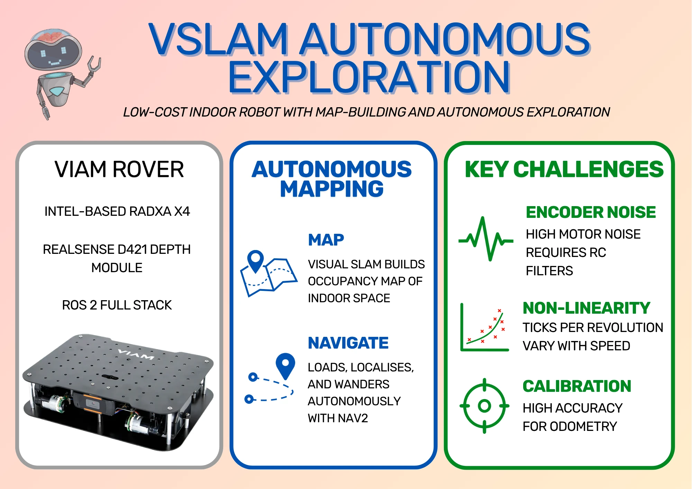
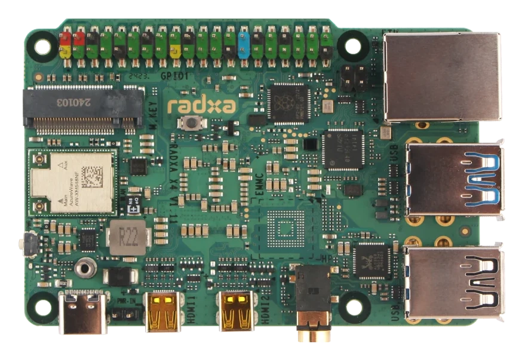
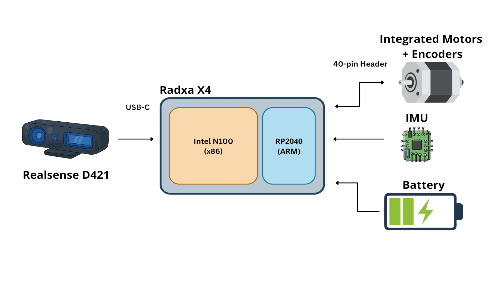
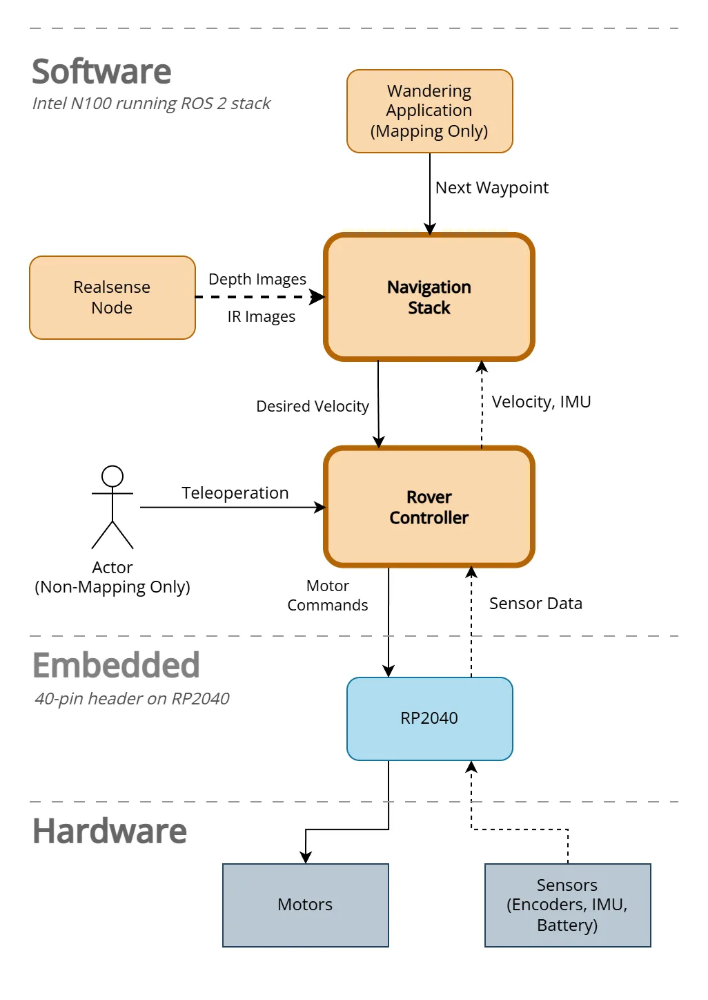
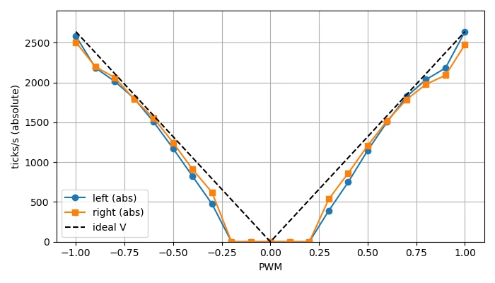
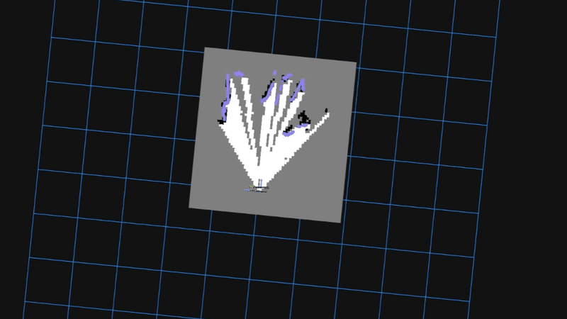
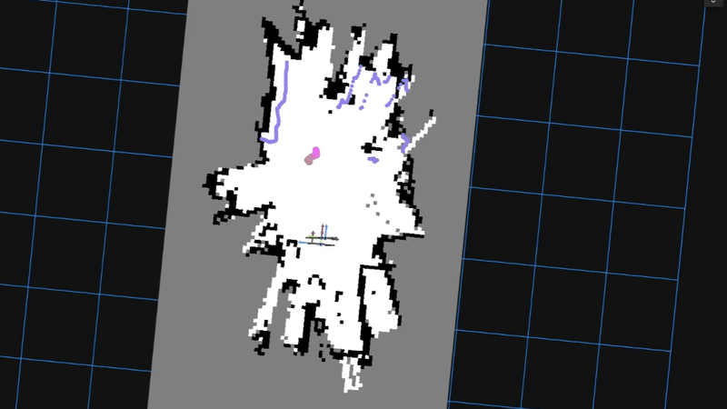
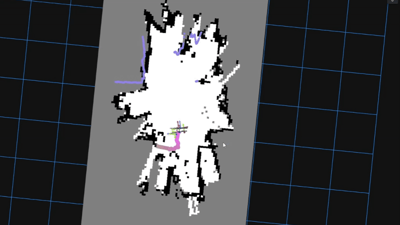

This project is about a low-cost robot that you can drop into a room, have it explore and map the entire space, then set navigating autonomously - all without GPS or lidar.

In this post, I walk through how I built an autonomous indoor mapping robot using the [Viam Rover](https://www.viam.com/resources/rover) as a base, swapping out the webcam for an [RealSense Depth Module D421](https://www.realsenseai.com/products/stereo-depth-camera-module-d421/) and using a [Radxa X4](https://radxa.com/products/x/x4/) as the central compute (instead of the already-supported Raspberry Pi or Jetson Orin). The robot runs a full [ROS 2](https://www.ros.org/) stack, including Visual SLAM for map building and Nav2 for autonomous navigation. 

While building this robot out, I ran into some interesting challenges around encoder noise and calibration, which I cover in detail. If you want to build one yourself, there's a [parts list](#can-i-build-this-robot) at the bottom, and all the source code is on [GitHub](https://github.com/mikelikesrobots/viam-rover2).

:::note Hardware Provided by Intel

This project was built using hardware provided by Intel - thank you, Intel! The choice of hardware was my own, and the purpose of the project was also my idea.

:::

<!-- truncate -->

**Autonomous Rover Infographic**

<figure class="text--center">

<figcaption>Infographic showing the basics of the robot setup, the mapping and navigation features, and the major challenges I go over in this post. Viam Rover image comes from the [product page](https://www.viam.com/resources/rover).</figcaption>
</figure>

## Viam Rover

From their [documentation](https://docs.viam.com/what-is-viam/), "Viam is a software platform for building, deploying, and managing robotics applications." To help with being able to deploy their software and try out what they're offering, Viam also sells the [Viam Rover](https://www.viam.com/resources/rover), which is an inexpensive kit that runs Viam software out of the box.

All you need to supply is the Single Board Computer (SBC), like a Raspberry Pi, and compatible batteries. Otherwise, everything comes pre-assembled and ready to go. Configure the power, install the Viam software on the SBC, and you should be ready to drive the robot around! Viam provides the control software and makes the interface for managing the robot very simple.

<figure class="text--center">

<figcaption>Image of the Viam Rover, courtesy of the [product page](https://www.viam.com/resources/rover).</figcaption>
</figure>

Still, I wanted to develop an inexpensive robot capable of autonomous navigation, and the rover doesn't quite have the hardware to make it happen. It provides encoders, IMU, and webcam, but these sensors alone don't provide enough information for building a map. I decided to swap the webcam for a RealSense camera and use a Radxa X4 board to provide enough computing power to build a map on board. Again, if you're interested in building the robot yourself, I have a [parts list](#can-i-build-this-robot) at the bottom of this post.

### Radxa X4

The Radxa X4 is a relatively low-cost SBC with a unique selling point: it contains both an Intel N100 chip, for compute-heavy work, and an RP2040 chip, which can be used for real-time embedded software. This works very well for robotics; it's fairly common to use a powerful board to run high-level software like mapping while using a microcontroller for real-time operations. The X4 provides both in one package.

<figure class="text--center">

<figcaption>Radxa X4 board image, courtesy of [Radxa X4 product page](https://radxa.com/products/x/x4/).</figcaption>
</figure>

There are a couple of drawbacks of using the X4 for this project. First, it needs its own power supply; the Raspberry Pi can be powered directly from the robot batteries, but the X4 needs its own battery bank with separate connections. Second, it produces quite a bit more heat, so it needs a fairly large heat sink. That expands the size of the robot and means it has to be mounted upside down, which requires extra parts. Thankfully, the rover comes with some parts to expand upwards already, so it's already designed to accommodate larger boards.

<figure class="text--center">

<figcaption>This diagram shows the Radxa X4 with Intel N100 chip and RP2040 chip. The N100 powers the main board and communicates with the D421 camera over USB. The RP2040 handles the 40-pin header and communicates with the N100 over a serial connection.</figcaption>
</figure>

The ROS 2 package I've written will build custom firmware for the RP2040, flash it automatically, and then communicate with the RP2040 over a serial link on UART0. This means the RP2040 is responsible for reading sensors and sending PWM signals to the motors, while the Intel N100 operates with a non-realtime Ubuntu installation.

### RealSense D421

As I've previously stated, creating a map from webcam data alone simply isn't enough. We either need lidar or some kind of depth data, which is where the RealSense camera comes in. These sensors are very popular in robotics as they automatically calculate depth data from stereo cameras and can output depth images or point clouds. Depending on the model, they can also provide RGB (colour) data. I chose one of the lowest cost models to keep the total cost of the robot down: the RealSense Depth Module D421. This produces infrared images and a depth image that I use with the rover to map its environment.

<figure class="text--center">

<figcaption>Image of the RealSense Depth Module 421, courtesy of the [product page](https://www.realsenseai.com/products/stereo-depth-camera-module-d421/).</figcaption>
</figure>

:::warning The USB-C connection is sided

This depth module has a USB-C connector and connects to a USB 3 port on the Radxa X4. However, I noticed that the camera may not produce data depending on which way the USB-C cable is plugged in. If the camera isn't producing data for you, try flipping the USB-C cable side and seeing if that works any better.

:::

## ROS 2 Instead of Viam

One of the great advantages of using the Viam Rover is that the software for controlling the rover can be installed and configured very easily. The interface is excellent. However, the Viam system isn't based on ROS 2 (although it can be bridged to it). I chose to implement ROS 2 Jazzy fully on my robot instead of using the Viam software, and this section is to explain my reasoning.

### Mapping Isn't Supported by Viam

As far as I can tell, Viam doesn't provide modules for indoor mapping and navigation. If you take a look at the [Viam navigation documentation](https://docs.viam.com/navigation/how-to/set-up-gps/), the system requires GPS position and heading to work, which doesn't work with indoor mapping. Hence, my choices were to build the module myself, or use the existing Nav2 framework from ROS 2.

It's possible that I could have used Viam software and separately run a ROS 2 navigation system, then used a Viam module to bridge between them. I wasn't sure how complicated that would have been to do or how efficient the system is at passing data back and forth for high-volume data like images and point clouds, so I didn't go this route.

### No Radxa X4 Support

Viam does offer support for a few different SBCs, most notably the Raspberry Pi boards and Jetson Orin Nano series, but doesn't have support for the Radxa X4 already. In fact, I couldn't find support for any x86 board, and [asking for help in the forums](https://discord.com/channels/1083489952408539288/1483504854956769381) didn't yield any responses. I had to choose between building a Viam module for the Radxa X4 or building with ROS 2. I chose ROS 2 as I'm much more familiar with the system, and because I don't know how well the Viam module would have handled spanning across both the Intel N100 and the RP2040 chips.

### Custom Encoder Software

During development, I found that the encoders used for position feedback on the motors behaved very poorly. The signals from the encoders are very noisy when the motors are running, which required me to add extra hardware to fix the noise. I originally had some software filtering to partially compensate for the noise, which I wouldn't have been able to do with the prebuilt Viam module. I have since removed the software filter due to the hardware fix, but this was originally a factor in my decision, hence including it here.

I did ask [in the Viam forums](https://discord.com/channels/1083489952408539288/1493941300574031892) if anyone else had experienced this issue or had a solution, but this also yielded no responses.

### RealSense Support

Viam does have a [RealSense module](https://app.viam.com/module/viam/realsense) which supports:

- D435
- D435i
- D455

Unfortunately, the list does not include my D421 model. I either needed to add support for it myself or use the existing ROS 2 support. Again, I could have used the ROS 2 node and bridged it to the Viam system, but this is adding complexity over a complete ROS 2 system.

### Teaching Opportunity

The reasons above are challenges that I possibly could have overcome with time and effort, but the major reason I went this route was so I could use it as an example for teaching ROS 2 concepts, such as using ros2_control with closed loop feedback (another future post/video!).

## ROS 2 Software Architecture

Given my decision to build the system fully in ROS 2, I chose to build the following architecture (heavily simplified):

<figure class="text--center">

<figcaption>System diagram showing high-level software, such as wandering and navigation, down to low level components, such as motors. Note that the Software section runs on the Intel N100 chip and the Embedded section runs on the RP2040.</figcaption>
</figure>

Some components, such as the Navigation Stack, have quite a few parts inside. I'll dive deep into these systems in future videos, or you can take a look at the [source code](https://github.com/mikelikesrobots/viam-rover2) for yourself!

## Setup and Encoder Calibration

The majority of the time on this project went into making sure the robot produced reliable odometry. Odometry is the robot measuring its own movement based on its sensors; in this case, its rotary encoders.

These encoders work by attaching a disc with evenly-spaced holes around its circumference onto the same shaft that the wheels are on. The encoder then shines a light through one side of the disc and detects if it passes through the disc. As the disc rotates with the shaft rotation, the disc holes alternately block and allow the light through, measured as pulses/ticks by the encoder. The faster the ticks occur, the faster the shaft is spinning. To calibrate the encoders, I had to find the ticks per revolution of the wheel.

I had a lot of trouble getting the encoders to reliably produce accurate wheel speeds. The rest of this section details the issues I had and how I dealt with them.

### Single-pin Vs Quadrature Encoders

The Viam Rover uses motors with single-pin integrated encoders. The difference between single-pin and quadrature is that quadrature has at least two light sources and sensors set at right angles from one another. By comparing the times between the ticks from the different pins, it's possible to tell which sensor detected a change first, and hence both the speed and direction that the shaft is spinning.

Single pin encoders don't have this ability. They can detect speed, but not direction. My control system requires that the direction is also known, which means I have to infer the direction that wheels are being driven based on how they've been told to move. That generally works, as long as the robot only moves under its own power! As soon as you drag the robot backwards to a new position, the robot believes it's been moved forward because the last commanded direction was forwards, and everything gets out of synchronisation again.

I'll give more detail about single-pin and quadrature encoders in a future post.

### Encoder Signal Noise

The signal from the encoders suffers from a lot of high-frequency noise when the motors are being powered. The only time this doesn't happen is when I'm manually turning the wheels, which is exactly how I was initially trying to calibrate the robot! I would slowly turn the wheel ten times, then divide the number of received pulses by ten to get the ticks (pulses) per revolution. When I ran the robot for real, the motors made the tick frequency incredibly high, throwing off any measurements I took - the robot looked like it was zooming along!

I tried a software filter to reject the high-frequency noise, but the real signal was already lost in the noise, so all I succeeded in doing was capping the tick rate at the frequency cutoff.

Eventually, I reluctantly added RC filters to both signal lines to reduce the motor noise. I wanted to avoid this because it adds build complexity for anyone copying my build, and it requires extra parts. Still, the encoders were all but useless without the filters.

### Ticks Vary Non-Linearly With Speed

The ticks per revolution seems to vary non-linearly with the speed. By that, I mean that doubling the speed did not double the tick rate - it would be slightly off. Honestly, _I don't know why_. All I know is that measuring the graph got me the following results for speed versus ticks per revolution:

<figure class="text--center">

<figcaption>Graph showing how the measured ticks per second varies compared to the PWM, or speed at which the motors were driven. The black dashed line is the ideal result, while the blue and orange lines are for the left and right encoder measurements respectively. The deadband is clear for both motors, and the encoders follow roughly the same pattern but differ slightly from each other. This made it challenging to drive the motors at the right speed or measure the speed correctly.</figcaption>
</figure>

This is an issue because I can't tell if the motors are being driven at the wrong speed or if the encoders measure different speeds as they spin slower/faster. I assume that the encoders are correct because they're the simpler mechanism, so I had to add a new calibration step. I drive the motors at different PWM values and measure the speed according to the encoder ticks, then use this to create a Look-Up Table (LUT). When the system needs to drive at a particular speed, the required PWM is interpolated from the table and sent to the motors so the robot actually drives at the speed it's been commanded to.

:::note Interpolation

By interpolation, I mean looking up a value between two entries. If I know that 0.4 m/s requires a PWM of 0.5 and 0.6 m/s requires a PWM of 0.6, then 0.5 m/s must be halfway between those two points, which is a PWM of 0.55.

If the entry already exists in the table, the value is looked up directly.

:::

### Inaccurate Calibration

Even with the hardware filter in place, calibrating based on manually turning the wheels gives a poor result from the robot. Again, I'm not sure why not! Instead of putting the robot on a box and carefully measuring the ticks per revolution, my current method is to put the robot on the floor, drive it forwards at a steady speed, and measure how far it travelled. Using the distance travelled and the ticks counted over that distance, I can calculate the ticks per revolution.

However, even that isn't perfect! The motors don't perform identically, which means the robot slightly turns as it moves, veering to one side or the other. This _should be_ easily fixed using a feedback loop that measures the speed and changes the commanded speed to compensate. However, we haven't yet calibrated the speed measurement! Instead, I guess initial values for ticks per revolution, then run the full closed-loop control system to drive the robot and adjust the ticks on each side by eye until the robot drives in a straight line. Once it's driving in a straight line, _only then_ can I perform the calibration process.

Still, in the end, I get values of ticks per revolution for each side that drive the robot in a straight line and allow for somewhat accurate measurement of distance travelled and amount the robot has turned. Having good values here is vital, because building a map from bad robot odometry is very difficult. It leads to phantom obstacles and walls in the wrong place. Worse than that, though - inaccurate odometry means navigation drives the robot erratically, so it frequently drives into walls/obstacles as well as building an inaccurate map.

## Building a Map

I started from Intel's [Wandering Application on AAEON robot](https://docs.openedgeplatform.intel.com/dev/edge-ai-suites/robotics-ai-suite/robotics/dev_guide/tutorials_amr/navigation/wandering_app/wandering-aaeon-tutorial.html), which was originally meant for the UP Xtreme i11 Robotic Kit using the UP development kits.

<figure class="text--center">

<figcaption>The UP Xtreme i11 Robotic Kit, intended for use with the Wandering AAEON example from Intel</figcaption>
</figure>

The Wandering AAEON example uses the `ros2_amr_interface` to connect the ROS 2 navigation system to the AMR's controls. As I was starting from scratch, I didn't have AMR controls to interface with, which meant I could directly implement a `ros2_control` system and connect it directly to the navigation system. The example still gave a great starting point with mapping built from camera data only, and a wandering application to show it in use.

This starting point is especially useful because most autonomous mapping robots use lidar as their source of truth for the environment. Using depth data instead is a process known as Visual SLAM or VSLAM, and it means the robot can only map ahead of itself, where the camera is pointing. The launch file contains a node for converting depth data from the camera into a scan, which looks like it could have come from a lidar, but in a narrow cone in front of the robot; from here, it can be used by the mapping node `rtabmap`. Hence, the map has to be built by turning the robot to look in every direction.

Another change I made to the application was to have a mapping mode toggle. With mapping on, the robot clears its memory of previous maps, then moves as commanded by a user until a space is completely mapped. With mapping off, the robot loads its existing map and starts wandering. Hence, to build a map, I start by running the wandering application in mapping mode, then using Foxglove teleoperation controls to move the robot around the space until everything is completely mapped out. The command is as follows:

```bash
ros2 launch viam_rover2 wandering_mapper.launch.py mapping:=true
```

<figure class="text--center">

<figcaption>Clip from Foxglove showing the robot exploring an area, sped up to 4x speed. The purple dots show where the depth data detects an object within range, which is used to build the map.</figcaption>
</figure>

With the mapping stage complete, I had a complete map of my office that I could use for the next part, built only from depth and infrared data from the RealSense D421 camera.

## Wandering the Map

Once I had a usable occupancy map, I switched to non-mapping mode (or, autonomous mode). This is the mode that allows the robot to wander its saved map, but first I have to tell the robot where it is! The issue here is that the robot can load the map, but has to guess where it is within the map, and I've yet to see the robot get it right the first time. Hence, the trick is to use Foxglove to send an initial pose, which sets the robot to the position you know it to be. You always know it's correct when the laser scan visualisation matches up with the obstacles in the environment.

The wandering application is set on a delay timer, both to give the navigation system time to start up, and to allow me to set the initial pose before it starts wandering. The command is the same except with the mapping argument removed.

```bash
ros2 launch viam_rover2 wandering_mapper.launch.py
```

The first step is to set the initial pose. This is a bit time sensitive, as the wandering application starts up before too long (this can be adjusted in launch file parameters!). The clip below shows me setting the initial pose three times; first, based on my idea of where the robot is; the latter two were adjustments to line the scan up with the environment correctly.

<figure class="text--center">

<figcaption>Clip from Foxglove showing the process of setting the initial pose of the robot, before it starts exploring, sped up to 2x speed.</figcaption>
</figure>

With the initial pose set and the robot in the right position, it started wandering! I'm not sure if the purpose of the application is to completely map a space or simply wander forever, but my robot seems happy to just keep wandering around. I tend to leave it wandering around (a bit like a pet!) until it gets stuck on an obstacle, like the leg of my desk. The robot is generally pretty good at avoiding obstacles, but obstacles lying flat close to the ground can be hard for it to see and avoid. You can see one example of wandering below:

<figure class="text--center">

<figcaption>Clip from Foxglove showing the robot wandering, sped up to 4x real time. It starts stuck near my desk, eventually manages to get free, then starts wandering the room. The coloured stroke shows its planned path. Also note how the robot adjusts its position based on the depth camera data matching up with the predetermined environment, which is called localisation.</figcaption>
</figure>

## Can I build this robot?

Yes! The whole idea behind this project was to build an autonomous mapping robot from easily accessible parts. I tried to keep the cost and build complexity to a minimum. This section contains the required parts and some extra parts that you might already have lying around.

### Required Parts

| Part | Cost | Link |
| ---- | ---- | ---- |
| Viam Rover | $99 | [Viam Rover product page](https://www.viam.com/resources/rover) |
| Radxa X4 (4GB) | $110 | [Radxa X4 listing (RS Online)](https://uk.rs-online.com/web/p/rock-sbc-boards/0329066) |
| Heat sink for Radxa X4 | $20.91 | [Radxa X4 heat sink (RS Online)](https://uk.rs-online.com/web/p/rock-sbc-add-ons/0329071) |
| NVMe/SSD (M.2 2230) | $92.08 | [Compatible SSD (RS Online)](https://uk.rs-online.com/web/p/hard-drives/0155530) |
| 5V Power Bank | $57.77 | [5V power bank (Amazon UK)](https://www.amazon.co.uk/dp/B0CXDXP8VR) |
| RealSense D421 | $85.57 | [RealSense D421 (Digi-Key)](https://www.digikey.co.uk/en/products/detail/realsense/99CLKV/24775599) |
| 18650 batteries & charger | $33.58 | [18650 battery pack & charger (Amazon UK)](https://www.amazon.co.uk/Matbc-Rechargeable-Battery-headlamps-Flashlight/dp/B0DDY49P68) |
| **Total** | $399.91 | - |

<br />

Note that prices are given based on GBP, which includes VAT, so you might be able to buy these for less!

:::info Radxa X4 Stock Issues

Unfortunately, the Radxa X4 is out of stock at time of writing this post! Hopefully it will come back in stock soon. It should be fine to get an equivalent Radxa board, but I haven't tested anything else, so I can't tell how well it will work.

:::

### Parts you may already have

On top of the required parts above, there are several parts needed that you might already have in stock. In case you haven't, I've given links to compatible hardware. The downside is that they are mostly sold in kits, as shops don't want to sell 1-2 resistors at a time, so you're likely to have a lot of parts left over. Still, maybe that will be good for future projects!

:::note RS Individual Components

RS Online does sell individual electronic components, as long as the total order size is large enough. If you want to keep costs to an absolute minimum, this might be a good way to go.

:::

| Part | Cost | Link |
| ---- | ---- | ---- |
| Plastic standoffs | $9.38 | [Plastic standoffs (Amazon UK)](https://www.amazon.co.uk/dp/B0DCS5C7SN) |
| USB-C to USB-C cable | $6.70 | [Charger Cable (Amazon UK)](https://www.amazon.co.uk/UGREEN-Charger-Compatible-MacBook-Samsung/dp/B08FDJ36XW) |
| Resistors, capacitors, jumper cables | $21.49 | [480 Pcs Electronics Kit (Amazon UK)](https://www.amazon.co.uk/dp/B099MQV8ZW) |
| Breadboard | $9.38 | [ELEGOO Breadboard (Amazon UK)](https://www.amazon.co.uk/ELEGOO-tie-points-Breadboard-Breadboards-Electronic/dp/B01N0YWIR7) |
| Large ruler or measuring tape (for calibration) | $13.44 | [1m Ruler (Amazon UK)](https://www.amazon.co.uk/Toolzone-Aluminium-Spirit-Levels-Handle/dp/B002NH4DHO) |

<br />

Hopefully, this is enough to get you going building it yourself. I will release more blog posts and videos in the future to show the full process in detail.

## Conclusion

Taking the Viam Rover and converting it to use the Radxa X4 and Realsense D421 took a _lot longer_ than I'd hoped! It was a journey of finding the best hardware modifications, writing custom firmware to communicate between Intel chip and RP2040, getting correct robot odometry from encoder data, and debugging a full ROS 2 navigation stack. It required more hardware changes than I initially wanted, but these turned out to be required because of the encoder noise that made them so unreliable.

In the end, this is a project you should be able to replicate for a relatively low price. It provides a way to study closed-loop feedback mechanisms with `ros2_control`, explore using the ROS 2 Nav2 stack, and operates using only depth data, where most exploration robots use some kind of lidar.

The source code is all available on [GitHub](https://github.com/mikelikesrobots/viam-rover2), and I'll be publishing follow-up posts and videos covering the build process and the software in detail. Subscribe to my [YouTube channel](https://youtube.com/@mikelikesrobots) or check back here ([RSS feed](/blog/rss.xml)) to stay up to date.
