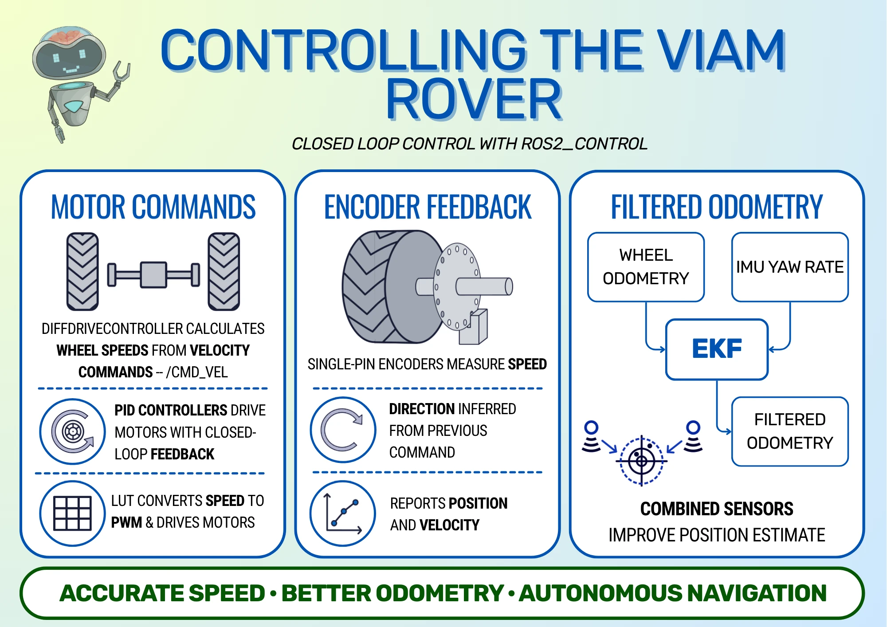
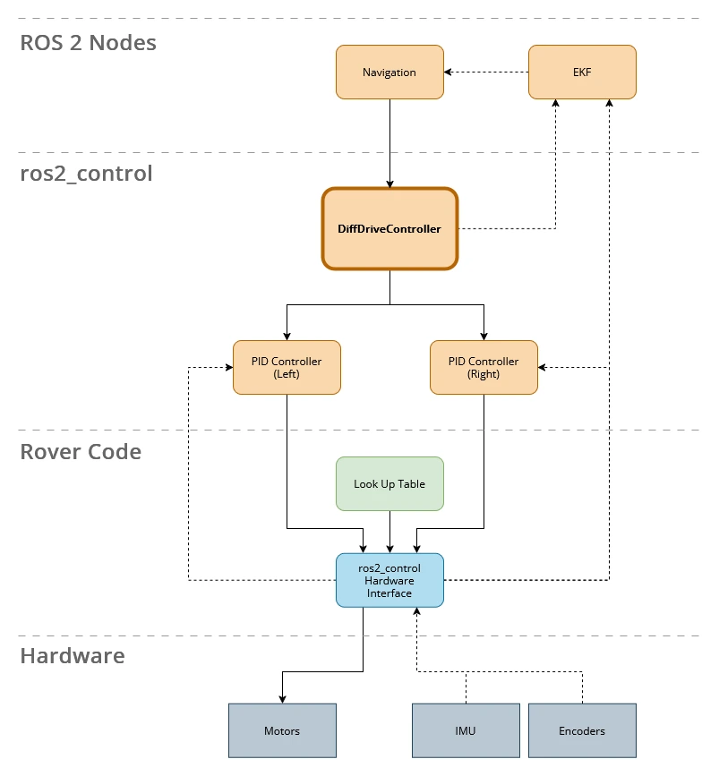
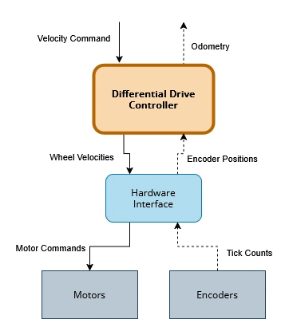
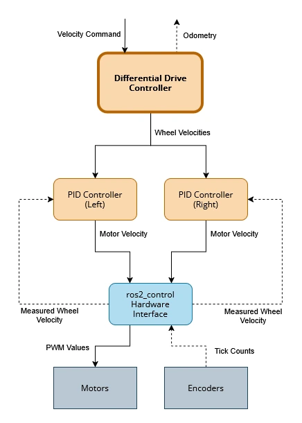

This post is part of a series about the Autonomously Exploring Viam Rover (see [my previous blog post](/blog/autonomous-viam-rover)). The rover is my attempt to build an inexpensive rover that is easy to assemble, so that anyone can replicate it. In this series, I'm showing how both the hardware and the software for the rover work. 

This post in particular focuses on the control system of the rover, including motor control, sensor reading, and fusing data together to track the robot's position.

<iframe class="youtube-video" src="https://www.youtube.com/embed/FyVvHbA4nBs?si=B4BPcqL-BAbgjYzP" title="YouTube video player" frameborder="0" allow="accelerometer; autoplay; clipboard-write; encrypted-media; gyroscope; picture-in-picture; web-share" referrerpolicy="strict-origin-when-cross-origin" allowfullscreen></iframe>

<!-- truncate -->

<figure class="text--center">

<figcaption>Infographic showing the complete control flow: navigation commands are converted into regulated wheel movement, encoder feedback produces odometry, and an EKF combines that odometry with IMU measurements.</figcaption>
</figure>

## Control System Overview

The rover uses a closed-loop control system, which means that it uses feedback from sensors on the robot to adjust the robot's speed to more closely match the desired speed. If the sensor shows that the robot is moving too fast, the control system can slightly slow the motors until it reaches the correct velocity. This is a more accurate way of moving the robot than open-loop control systems, which simply drive the motors at a speed without checking what actually happens. Better accuracy is important when the robot is moving autonomously, as it can track its own position and velocity.

:::tip Source Code

All of the code in this post can be found on my [Viam Rover GitHub repository](https://github.com/mikelikesrobots/viam-rover2).

:::

The rest of this article details how the control system takes commands from the navigation system, converts that into accurate robot movement, and measures the robot's position to feed back to the navigation system. I'll explain how the motor control and encoder reading work, then discuss how `ros2_control` interfaces with the hardware through PID controllers, and finish by explaining how the EKF fuses `ros2_control`'s odometry with IMU data to get the best idea of the robot's position.

<figure class="text--center">

<figcaption>Full system architecture diagram. Each part will be explained in detail throughout the post; this provides a top-level overview for reference.</figcaption>
</figure>

### Units of Velocity

To understand how the control system is used to move the robot, think about moving the robot from one position on the floor to another. The navigation system calculates a path that the robot should follow, then calculates the linear and angular speeds that the robot should move at to follow this path. The control system is responsible for moving at these speeds as closely as possible.

The standard units for linear and angular speeds are metres per second (m/s) and radians per second (rad/s) respectively. Radians measure angles, similar to degrees, and can easily be converted to and from degrees. As radians are defined in terms of pi, they have some advantages when calculating speeds and rotations, which is why they are used.

The differential drive controller then converts the linear and rotational velocities to desired wheel velocities. To do this, it needs to know the wheel sizes and how far apart they are spaced. If you're interested in the mathematics behind this, take a look at the [Robotics Book by Frank Dellaert and Seth Hutchinson](https://www.roboticsbook.org/S52_diffdrive_actions.html). For our purposes, it is enough to understand that the controller converts linear and angular speeds into the speeds that the wheels should move at, also defined in rad/s.

:::warning Different Rotational Velocities

Don't confuse the different rotational velocities! There is the overall rotational velocity, which is when the robot is turning left or right, and the wheel rotational velocities, which is how fast and in which direction each wheel should spin.

:::

## Driving the Motors

At the lowest level, our hardware controller (later referred to as the hardware interface in `ros2_control` sections) is responsible for taking the desired wheel velocities and moving the motors at those speeds. The motors on the Viam Rover are driven using Pulse Width Modulation (PWM) signals, so the hardware controller has to convert the wheel speeds to the right PWM values and send PWM signals to the motors.

:::tip PWM Signals

More information on PWM can be seen in my [Pulse Width Modulation](/blog/jetbot-motors-pt1#pulse-width-modulation) blog post. In essence, PWM is turning the power to a motor on and off very quickly so that the average power reaching the motor makes it move at the desired velocity.

:::

The PWM signal to send depends on the motors in question. The simplest method is to determine the maximum speed of the motors when driven at full power, which can be measured using the encoders (explained more in the [Reading the Encoders](#reading-the-encoders) section). The hardware controller can then assume that wheel speed is proportional to the PWM duty cycle.

That means if the motors drive at a maximum speed of 1.0 rad/s, and the desired velocity is 0.5 rad/s, it assumes that the correct signal is 0.5 (PWM doesn't have units because it's a fraction of a maximum). If the desired velocity is 0.25 rad/s, it uses a PWM value of 0.25.

With that said, the real system doesn't behave quite that well. I measured the speed of the wheels against different PWM values to obtain the following graph:

<figure class="text--center">

<figcaption>Graph showing how the measured ticks per second vary compared to commanded PWM. The black dashed line is the ideal result, while the blue and orange lines are for the left and right encoder measurements respectively. The deadband is clear for both motors, and the motors follow roughly the same pattern but differ slightly from each other.</figcaption>
</figure>

The graph is flat around the middle, which is the deadband of the motors. This is where the motors don't have enough power to overcome inertia, so they can't even start moving. The graph also shows that the motors don't exactly match the expected tick rate (the dotted black line) even after overcoming inertia.

With closed-loop feedback, the `ros2_control` controller can correct for the motors not moving at the correct speed. Still, the more accurately we can drive the motors at the commanded speed, the less work that controller needs to do to correct the speed. For the rover, we use a Look-Up Table (LUT) to get each motor close to its commanded velocity, so that the PID controllers from `ros2_control` can remove the remaining error more quickly and reliably.

### Mapping Wheel Velocity to PWM

The LUT is used to convert desired wheel velocity to PWM value. The table first has to be built by measuring motor speeds; I have a [Motor Diagnostic script](https://github.com/mikelikesrobots/viam-rover2/blob/main/tools/motor_diagnostic.py) that will build the table by sending different PWM signals and measuring the wheel speeds, then using those measured values to build the LUT. The wheels have to be free-spinning for this to work. The user can then copy and paste the output into the [`rover2_system.cpp` source code](https://github.com/mikelikesrobots/viam-rover2/blob/main/hardware/src/rover2_system.cpp#L96-L114).

The software looks up values from the LUT by following a simple process.

1. Is the desired velocity in the table? If yes, use the corresponding PWM value.
1. Is the desired velocity below the minimum? If yes, use the minimum PWM value.
1. Is the desired velocity above the maximum? If yes, use the maximum PWM value.
1. Otherwise, the desired velocity is between two entries in the table. Find the two entries and interpolate between them to find the PWM value.

Interpolation calculates an intermediate PWM value by splitting the difference between two adjacent entries. For example, given the following LUT:

| Desired Velocity (rad/s) | PWM |
| ------------------------ | --- |
| 1.0                      | 0.5 |
| 2.0                      | 0.7 |

<br />

If the desired velocity is 1.4, it is 40% of the distance between 1.0 and 2.0, so the result should be 40% of the distance between the PWM values 0.5 and 0.7, which is 0.58. The relevant code is in [the `rover2_system.cpp` file](https://github.com/mikelikesrobots/viam-rover2/blob/main/hardware/src/rover2_system.cpp#L390-L410).

This is how the hardware controller will move motors at a commanded speed. Next, we can look at how the controller reads data from the encoders.

## Reading the Encoders

Encoders are devices that can count how fast a shaft spins. The Viam Rover contains encoders integrated with the motors, but these are single-pin encoders, which means they can detect speed but not direction. This section describes how encoders work, how direction can be _detected_ by the sensor, and how we work around the Viam Rover's speed-only sensing by guessing the direction.

### Single-Pin

The encoder mechanism is a light source and detector on either side of a disc with evenly-spaced holes around the edge. The encoder is attached to the shaft of a robot's wheel. When the shaft spins, the disc rotates, and the holes alternately block and transmit the light. The light sensor can then detect the presence or absence of light. Each time the light is detected is called a tick, and the rate of ticks can be used to calculate the speed of the shaft.

<figure class="text--center">

<figcaption>Animation showing the single-pin encoder. The graph on the right shows how the sensor outputs the signal. Software on the controller board can then count the ticks in the graph.</figcaption>
</figure>

However, single-pin encoders don't know the direction that the shaft is spinning in. A clockwise spinning shaft looks the same as an anticlockwise spinning shaft. That's where quadrature encoders come in.

### Quadrature

Quadrature encoders work by having two sets of sensors on the same encoder disc, but spaced at an angle from one another. By looking at which sensor receives the pulses first, it's possible to tell both the direction and the speed of the shaft.

<figure class="text--center">

<figcaption>Animation showing the quadrature encoder. The graph shows the spin direction by looking at which sensor outputs a tick first compared to the other sensor.</figcaption>
</figure>

<details>
  <summary>Incremental Encoders</summary>

  <div>
    <p>
      Many higher-end incremental encoders also include a third channel that
      only produces one pulse per revolution. This provides a known reference
      position, allowing the controller to re-synchronise its position estimate.
      These encoders aren't common in hobbyist robotics, but they're still useful
      to know about!
    </p>

    <figure className="text--center">
      
      <figcaption>
        Animation showing an industrial encoder with a third channel. The third
        channel sees one pulse per revolution, allowing the encoder to determine
        a home position and remove accumulated error.
      </figcaption>
    </figure>
  </div>
</details>

### Interpreting Speed

`ros2_control` requires velocity feedback, which means it needs to know both the speed of movement _and the direction_. Given that the Viam Rover only has single-pin encoders, we need another way to determine the direction. In this case, that way is to assume that the robot is moving in the direction it's been commanded to, and combine that with the measured speed. This works as long as the robot is moving under its own power; if you drag the robot around by hand, it can quickly get confused!

In [code](https://github.com/mikelikesrobots/viam-rover2/blob/main/hardware/src/rover2_system.cpp#L267-L276), this is done for each motor by checking the last commanded direction, then changing the tick delta to be positive or negative depending on the result.

```cpp
// Single-pin encoder can't detect direction; infer purely from commanded velocity.
if (hw_commands_[i] < 0.0) {
    last_direction_[i] = -1;
} else if (hw_commands_[i] > 0.0) {
    last_direction_[i] = 1;
}

if (last_direction_[i] < 0) {
    delta = -delta;
}
```

Now that we've examined how the motors are driven and the encoders are read, it's time to look at how they are combined in the `ros2_control` system.

## Control Using `ros2_control`

The whole robot is running ROS 2 for a few reasons (see [here](/blog/autonomous-viam-rover#ros-2-instead-of-viam) for details), including the control system, which is built using `ros2_control`. I have previously written about `ros2_control` basics and shown how to use it for [a simulated robot arm](/blog/6dof-arm-ros2-control) and [open-loop control of a real rover](/blog/jetbot-motors-pt2), so take a look at those for a more detailed introduction. In brief, the reason to use `ros2_control` is that it provides modular controllers for different kinds of robots, which means we only need to build the hardware interface that allows `ros2_control` to connect its existing Differential Drive Controller (DiffDriveController) to our robot.

Hence, the challenge for this robot was to set up a `ros2_control` system that incorporates feedback. I chose to build all of the hardware interface code into one System, as opposed to splitting it into Sensors and Actuators. This System is the hardware interface between `ros2_control` and the motors and encoders.

### State and Command Interfaces

For a robot to be controllable from `ros2_control`, it must declare the types of commands it can receive and the types of feedback data it produces. These are called command and state interfaces respectively.

For the rover, the motors accept velocity commands, so our System needs to register a velocity command interface. This is the same as for the [JetBot](/blog/jetbot-motors-pt2#jetbot-system-implementation), and that robot had no feedback data, so that System only had one command interface. However, our robot also reports sensor feedback data, so we also need to register a _state_ interface.

In our case, we are counting ticks on the encoders. Encoder ticks represent a change in angular position, which tells us the change in position of the wheel. Hence, our System registers a position state interface as well as its velocity command interface.

However, reporting position data alone isn't enough. If we were only using the DiffDriveController, it would accept position data, but wouldn't make any use of it. We need to adjust the output speed based on the feedback data, which means we need to use PID controllers, and PID controllers require velocity data. Hence, every time the encoder positions are read, the velocity is calculated by dividing the change in wheel position by the time since the last read.

In [code](https://github.com/mikelikesrobots/viam-rover2/blob/main/hardware/src/rover2_system.cpp#L260-L282), this is done by dividing the change in radians by the change in time since last read:

```cpp
double dt = period.seconds();
// ...
// Convert tick delta to radians and accumulate position.
double delta_rad = (static_cast<double>(delta) / ticks_per_rev_[i]) * 2.0 * M_PI;
hw_positions_[i] += delta_rad;
hw_velocities_[i] = delta_rad / dt;
```

We report this calculated velocity as another state interface for the PID controllers to use.

Our final list of System interfaces is:

- Velocity (command)
- Velocity (state)
- Position (state)

To set the interfaces, we declare them in [the `rover2.ros2_control.xacro` file](https://github.com/mikelikesrobots/viam-rover2/blob/main/description/ros2_control/rover2.ros2_control.xacro#L27-L36):

```xml
<joint name="${prefix}left_wheel_joint">
<command_interface name="velocity"/>
<state_interface name="position"/>
<state_interface name="velocity"/>
</joint>
<joint name="${prefix}right_wheel_joint">
<command_interface name="velocity"/>
<state_interface name="position"/>
<state_interface name="velocity"/>
</joint>
```

We also need to [export the interfaces](https://github.com/mikelikesrobots/viam-rover2/blob/main/hardware/src/rover2_system.cpp#L173-L194) in code. This is done using the `export_state_interfaces` and `export_command_interfaces` functions, which report the available interfaces to the `ros2_control` resource manager.

```cpp
// Declare position and velocity state interfaces for left and right motors
std::vector<hardware_interface::StateInterface> Rover2SystemHardware::export_state_interfaces() {
  std::vector<hardware_interface::StateInterface> state_interfaces;
  for (auto i = 0u; i < info_.joints.size(); i++) {
    state_interfaces.emplace_back(hardware_interface::StateInterface(
        info_.joints[i].name, hardware_interface::HW_IF_POSITION, &hw_positions_[i]));
    state_interfaces.emplace_back(hardware_interface::StateInterface(
        info_.joints[i].name, hardware_interface::HW_IF_VELOCITY, &hw_velocities_[i]));
  }

  return state_interfaces;
}

// Declare velocity command interfaces for left and right motors
std::vector<hardware_interface::CommandInterface> Rover2SystemHardware::export_command_interfaces() {
  std::vector<hardware_interface::CommandInterface> command_interfaces;
  for (auto i = 0u; i < info_.joints.size(); i++) {
    command_interfaces.emplace_back(hardware_interface::CommandInterface(
        info_.joints[i].name, hardware_interface::HW_IF_VELOCITY, &hw_commands_[i]));
  }

  return command_interfaces;
}

```

The class has the required `write` and `read` functions for `ros2_control`. In both cases, the code is quite long to include verbatim, so the functions are described and linked to below if you want to look for yourself.

The [`write` function](https://github.com/mikelikesrobots/viam-rover2/blob/main/hardware/src/rover2_system.cpp#L383-L442) is responsible for taking the commanded speeds and writing them to the motors. In this case, it uses the LUT to determine the best PWM value for the motors, then sends the requested PWM to the motor controller.

The [`read` function](https://github.com/mikelikesrobots/viam-rover2/blob/main/hardware/src/rover2_system.cpp#L249-L292) is called when the control system needs the latest sensor readings. In open-loop configurations, the simplest action is to report the commanded speed as the measured speed. In our closed-loop case, the function takes the latest encoder readings, guesses the direction of the wheels based on the previous commanded speed, and calculates the velocities of the wheels. It also writes the velocities to a custom sensor publishing node, which runs outside of `ros2_control` and publishes ROS 2 sensor data; this is helpful as `ros2_control` needs to be real-time, but it helps to publish ROS 2 data to check what the system is doing.

With position and velocity data being fed back to the controller, the next step is to actually use the data. The default DiffDriveController doesn't do anything with the information directly; we need to add PID controllers.

## Chaining PID Controllers

As stated in the previous section, the DiffDriveController alone does not make use of feedback data - it operates open loop. To use the feedback data, we chain PID controllers with the DiffDriveController.

<figure class="text--center">

<figcaption>Diagram showing the differential drive controlling the rover. Feedback is not used to adjust motor speeds, although it is used to provide robot odometry.</figcaption>
</figure>

Adding PID controllers is very easy to do with `ros2_control` using the concept of chaining controllers (see [example 12](https://github.com/ros-controls/ros2_control_demos/tree/master/example_12) of the [`ros2_control` examples repository](https://github.com/ros-controls/ros2_control_demos)). Our main controller, the DiffDriveController, sends desired wheel velocities to the left and right PID controllers. Each PID controller has its own parameters, sends velocity commands to the motors, and reads data from the encoders. They then regulate each wheel to the commanded velocity using the feedback data.

<figure class="text--center">

<figcaption>Diagram showing PID controllers chained with the DiffDriveController. Feedback from the encoders is used to regulate motor speeds, and the data is fed up through the controller to publish odometry.</figcaption>
</figure>

The DiffDriveController can drive the robot more accurately using the PID controllers, and it will also publish the odometry of the robot. Odometry is data on the robot's position, orientation, and velocity. It allows higher-level systems like the navigation system to track the pose of the robot.

### Declaring Controllers

The code for declaring these controllers all takes place in [the `rover2_controllers.yaml` file](https://github.com/mikelikesrobots/viam-rover2/blob/main/bringup/config/rover2_controllers.yaml). First, the [controller manager is configured to use](https://github.com/mikelikesrobots/viam-rover2/blob/main/bringup/config/rover2_controllers.yaml#L1-L15) the two PID controllers and the DiffDriveController:

```yaml
controller_manager:
    # ...
    pid_controller_left_wheel_joint:
      type: pid_controller/PidController
    pid_controller_right_wheel_joint:
      type: pid_controller/PidController
    rover2_base_controller:
      type: diff_drive_controller/DiffDriveController
```

We can then [configure the PID controllers](https://github.com/mikelikesrobots/viam-rover2/blob/main/bringup/config/rover2_controllers.yaml#L17-L47) to interact with the rover's hardware interface. The setup is the same for both controllers; it declares the joint it's going to control, that it sends velocity commands, and that it can reads measured velocities. It also specifies PID parameters with feedforward enabled:

```yaml
pid_controller_left_wheel_joint:
  ros__parameters:
    dof_names:
      - left_wheel_joint
    command_interface: velocity
    reference_and_state_interfaces:
      - velocity
    gains:
      left_wheel_joint: {"p": 0.5, "i": 2.5, "d": 0.0, "i_clamp_min": -10.0, "i_clamp_max": 10.0, "antiwindup": true, "feedforward_gain": 0.95}
    enable_feedforward: true
```

The PID controllers also use a feedforward gain, which is separate from the LUT compensation. The feedforward term contributes 95% of the requested wheel velocity directly to the controller's output, while the PID terms correct the difference between the requested and measured velocity. The hardware interface then converts that output velocity into PWM using the LUT, compensating for the motor's deadband and non-linear response.

:::warning PID Parameter Tuning

PID controllers have P, I, and D parameters that need to be tuned for best function. If badly configured, they won't work at all! More information on PID controllers is available on my [interactive blog post](/blog/understand-pid-controllers), and I'll show how to tune the rover's PID controllers for real in a future post.

:::

The DiffDriveController is then configured to control these PID controllers. This is done by giving the left and right wheel names as the [PID controller joints](https://github.com/mikelikesrobots/viam-rover2/blob/main/bringup/config/rover2_controllers.yaml#L51-L54):

```yaml
rover2_base_controller:
  ros__parameters:
    left_wheel_names: ["pid_controller_left_wheel_joint/left_wheel_joint"]
    right_wheel_names: ["pid_controller_right_wheel_joint/right_wheel_joint"]
```

The DiffDriveController has the standard configuration, such as wheel separation and radius, but the crucial difference from the JetBot is to set it to [closed-loop configuration](https://github.com/mikelikesrobots/viam-rover2/blob/main/bringup/config/rover2_controllers.yaml#L70-L71):

```yaml
open_loop: false
position_feedback: true
```

The DiffDriveController doesn't change how it commands the motors when in closed-loop configuration, but it does change how it calculates the robot's odometry. This is used by the navigation system to track the robot.

At this point, we have seen how speeds sent by the navigation system are received by the `ros2_control` DiffDriveController, which calculates required wheel speeds and sends them to the PID controllers. The PID controllers then use the custom hardware interface System to move the motors at those speeds and use encoder feedback to regulate the speeds. The DiffDriveController also publishes odometry, which can be used to track the robot's motion. Still, encoders are not perfect sources of information, so it helps to add another layer above the control system: an EKF, used to filter the encoder data and combine it with IMU measurements.

## Extended Kalman Filter

An Extended Kalman Filter (EKF) is an algorithm that can combine multiple sources of sensor data together. It works by making a prediction, then using sensor data to improve that prediction. In our case, this is predicting the pose of the robot, then using the odometry published by `ros2_control` and the IMU data to improve that prediction. Each source of data is configured with a covariance, which is effectively how much the EKF trusts that source of data.

The EKF is configured to fuse forward velocity and yaw rate from the wheel odometry, along with yaw rate from the IMU. Each measurement includes a covariance describing its uncertainty, which influences how strongly it affects the filter's estimate. In this configuration, the wheel and IMU yaw rate measurements have the same covariance, while forward velocity is supplied only by the wheel odometry.

Combining these measurements allows the sensors to cover the weaknesses of one another. Encoders alone can provide noisy data, and have physical limitations, such as when one of the wheels slips. In this case, the wheel spins a lot and the encoder reports a large change in position, which the controller interprets as the robot spinning, despite the robot not moving. An IMU provides data about the robot's motion independently of wheel movement, so combining its measured yaw rate with the encoder reading produces a better estimate of the robot's pose overall. Even if the final robot pose is incorrect, it should be _closer_ to the truth, which means other layers can more easily correct the mistake: for example, the depth data from the RealSense camera can be used to correct the robot's position as long as the robot is roughly in the right place.

:::note EKF is not part of `ros2_control`

EKF is included in this post because it is a key part of the robot's ability to track its own movement, but it operates at a higher level than `ros2_control`.

:::

EKF is included by [configuring](https://github.com/mikelikesrobots/viam-rover2/blob/main/bringup/config/ekf.yaml) it and [launching](https://github.com/mikelikesrobots/viam-rover2/blob/main/bringup/launch/rover2_control.launch.py#L164-L172) it:

```python
ekf_config = LaunchConfiguration("ekf_config_file")
ekf_node = Node(
    package="robot_localization",
    executable="ekf_node",
    name="ekf_filter_node",
    output="screen",
    parameters=[ekf_config, {"use_sim_time": use_sim_time}],
    ros_arguments=["--log-level", "warn"],
)
```

The EKF is configured to take odometry from `/rover2_base_controller/odom`, published by `ros2_control`, and IMU data from `/rover2_base_controller/imu`, which is [published by the sensor node](https://github.com/mikelikesrobots/viam-rover2/blob/main/hardware/src/rp2040_sensor_node.cpp#L79-L87).

The confidence in the IMU is set by the covariance vector in the [`publish_imu` function](https://github.com/mikelikesrobots/viam-rover2/blob/main/hardware/src/rp2040_sensor_node.cpp#L119-L138):

```cpp
msg.angular_velocity_covariance[8] = 0.02;
```

The confidence in the encoder data is set by [`ros2_control` configuration](https://github.com/mikelikesrobots/viam-rover2/blob/main/bringup/config/rover2_controllers.yaml#L68):

```yaml
twist_covariance_diagonal: [0.001, 0.001, 0.001, 0.001, 0.001, 0.02]
```

It then fuses these two sources together and produces a new odometry topic on `/odometry/filtered`, which can be used by the localisation node to help keep track of the robot's position.

## Conclusion

This post shows how to close the loop between the Viam Rover's motors and encoders using `ros2_control`, allowing the rover to regulate its wheel speeds instead of relying on open-loop PWM commands. It also shows how to combine the resulting wheel odometry with IMU measurements using an Extended Kalman Filter, producing a more robust motion estimate for localisation and navigation.

For the Viam Rover in particular, the post showed how wheel speeds are turned into PWM values adjusted for the motor's behaviour using a Look-Up Table, and how encoders are read to provide an estimate of the robot's velocity and how much it has moved. These are built into a `ros2_control` System, which allows the modular DiffDriveController and PID controllers to correct the remaining error and report the robot's movement as odometry. Finally, the EKF fuses that odometry data with IMU measurements to produce a better idea of the robot's position, which forms a much better foundation for navigation systems than either sensor source could provide by itself.

There are still limitations. The single-pin encoders cannot measure direction directly, so the software has to infer it from the last command, and wheel slip can still make the rover appear to move farther than it really has. Nevertheless, the combination of calibration, feedforward mapping, PID feedback, and sensor fusion is accurate enough to support the rover's autonomous mapping and navigation.

All of the configuration and hardware-interface code is available in the [Viam Rover repository](https://github.com/mikelikesrobots/viam-rover2). In a future post, I'll show how to tune the PID controllers for a real robot and perform other calibration for accurate motion.
