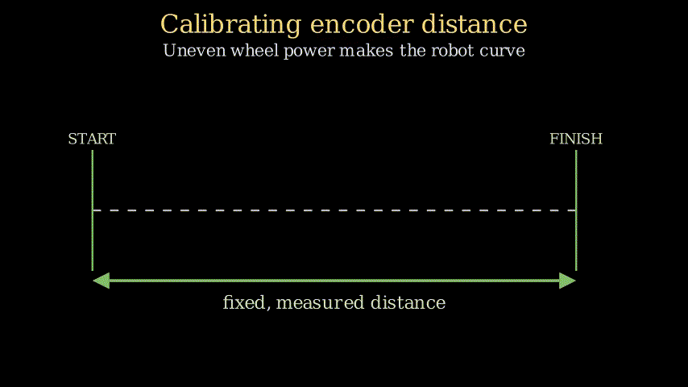
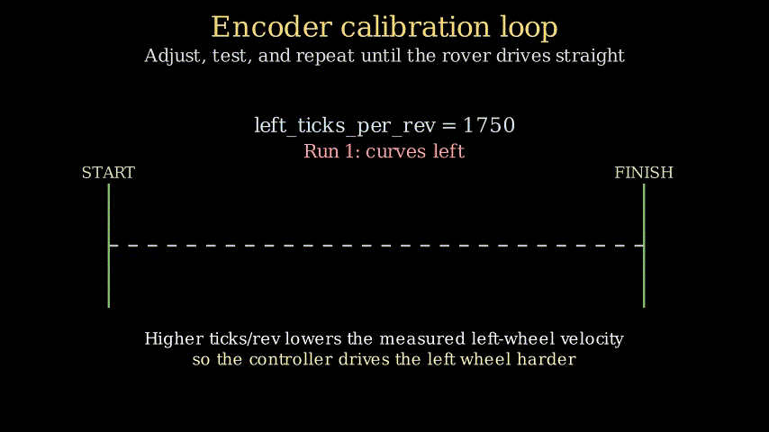
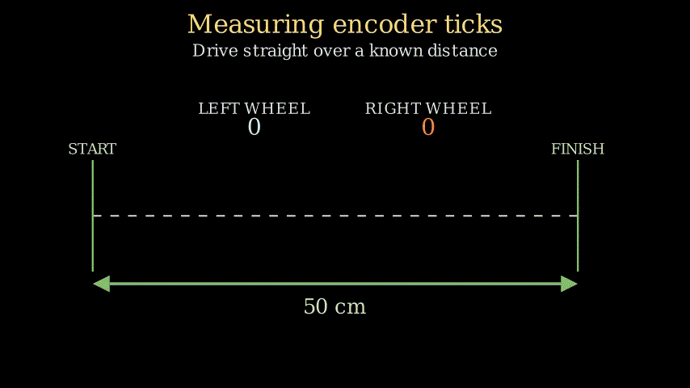

Before the Viam Rover can move autonomously, and hence map and navigate reliably, its control system needs accurate encoder measurements and benefits from a motor lookup table. This guide shows how to install the remaining rover software, calibrate both wheels, and generate that lookup table. At the end, the rover will be ready for mapping and navigation, although I'll save that process for a future post so as to give it more focus.

These instructions are available in less detail from the README of the [GitHub repository](https://github.com/mikelikesrobots/viam-rover2). There is also more information on the Viam Rover project in my previous blog post, [Autonomously Mapping with Visual SLAM](/blog/autonomous-viam-rover).

<iframe class="youtube-video" src="https://www.youtube.com/embed/KgZdrtvqItI?si=JjxtC732Yc2niaAo" title="YouTube video player" frameborder="0" allow="accelerometer; autoplay; clipboard-write; encrypted-media; gyroscope; picture-in-picture; web-share" referrerpolicy="strict-origin-when-cross-origin" allowfullscreen></iframe>

<!-- truncate -->

## Installing the Dependencies

:::note Radxa X4 setup

All instructions should be executed from the Radxa X4, either directly or through an SSH session. I have a video on how to set up the Radxa X4 below. The process is essentially creating a standard USB installation drive with [Ubuntu 24.04](https://releases.ubuntu.com/noble/) and installing it onto the Radxa X4, set up with a heat sink and M.2 SSD. The full robot should also be assembled and ready to use.

<iframe class="youtube-video" src="https://www.youtube.com/embed/v7vi2d8ITEQ?si=78wA7nn3pB8aW_Bq" title="YouTube video player" frameborder="0" allow="accelerometer; autoplay; clipboard-write; encrypted-media; gyroscope; picture-in-picture; web-share" referrerpolicy="strict-origin-when-cross-origin" allowfullscreen></iframe>

:::

### ROS 2 Installation

Almost all ROS 2 dependencies can be installed using the helper script provided by Intel in their [Getting Started guide](https://docs.openedgeplatform.intel.com/dev/edge-ai-suites/robotics-ai-suite/robotics/gsg_robot/index.html). The command is as follows:

```bash
wget https://raw.githubusercontent.com/open-edge-platform/edge-ai-suites/refs/tags/v2026.1.0-rc1/robotics-ai-suite/scripts/setup-robotics-jazzy.sh
chmod +x setup-robotics-jazzy.sh
export USE_PROXY=0
./setup-robotics-jazzy.sh
```

This will set up ROS 2 Jazzy plus some extra dependencies needed for building the code. The rest of the dependencies needed for the ROS 2 packages will be installed using `rosdep` in the [Build the Package](#build-the-package) section.

### RP2040 Setup

We also need to perform a one-time setup for the RP2040. The RP2040 is visible to the Intel N100 chip as a USB device, and the scripts in my project are configured to automatically mount the USB device and send the latest firmware to it, which is the flashing process. The RP2040 will then automatically restart running the new firmware.

To mount the USB device automatically and without being prompted for `sudo` access every time, we need to set up some permissions in advance. First, install the system dependencies:

```bash
sudo apt install -y \
  cmake \
  gcc-arm-none-eabi \
  libnewlib-arm-none-eabi \
  libstdc++-arm-none-eabi-newlib \
  libgpiod2 \
  gpiod \
  udisks2
```

Then, to set the permissions up correctly, we execute the following:

```bash
sudo sh -c 'echo "SUBSYSTEM==\"gpio\", KERNEL==\"gpiochip[0-9]*\", MODE=\"0660\", GROUP=\"dialout\"" > /etc/udev/rules.d/99-gpio.rules'
sudo udevadm control --reload-rules
sudo udevadm trigger
sudo usermod -aG dialout "$USER"
```

Log out and back in to enforce the new permissions. This will allow the build script to automatically mount and flash the RP2040.

### Build the Package

We can now check out the code, install dependencies, and build it as follows:

```bash
mkdir -p ~/ros2_ws
cd ~/ros2_ws
git clone https://github.com/mikelikesrobots/viam-rover2.git --recurse-submodules src/viam_rover2

# Install ROS dependencies
source /opt/ros/jazzy/setup.bash
rosdep install --from-paths src --ignore-src -r -y

# Build
colcon build
source install/setup.bash
```

:::tip Sourcing the ROS 2 Environment

As with all ROS 2 projects, remember to source the environment for each terminal, or ROS 2 won't be able to find your applications and launch files. This is the `source install/setup.bash` line above.

:::

The commands above will:

1. Check out the latest source code from the GitHub repository
1. Build the ROS 2 packages
1. Build the firmware for the RP2040
1. Flash the firmware onto the RP2040

The RP2040 will then be ready to start feeding sensor data back to the main board, as well as accepting motor commands, which is exactly what we need for the next step: calibrating the encoders.

## Encoder Calibration

:::warning Measuring Distance

Calibrating the encoders requires a long ruler (e.g. 1m) or a tape measure, preferably with metric measurements. If you only have imperial available, you can convert the imperial units to metric before using the equations here.

:::

We need to calibrate the encoders so that the feedback system for the robot works correctly. You can read more about the control system in my previous blog post, [Controlling the Viam Rover with ros2_control](/blog/rover-ros2-control).

For the control system of the robot to correctly track the robot's movement, it needs to be able to calculate the distance travelled by the wheels based on the encoder ticks. Our task is to move the robot a fixed distance and count the ticks measured while travelling that distance.

:::note Manually Turning the Wheels

My original method of calibrating the ticks was to mark each wheel with a piece of tape, then slowly turn each wheel 10 full revolutions and see how many ticks it took for each revolution on average. However, this resulted in very inaccurate movements. I'm not certain why, but my theory is that the encoders don't count the same numbers of ticks at low speeds as they do for high speeds, so turning the wheels very slowly gave the wrong tick counts. The method I outline here gave me much better results.

:::

### Straight Line Movement

The first step of calibrating the encoders is to make the robot travel in a straight line. Without this step, the robot is very likely to veer off to one side or the other, making it difficult to accurately measure distance travelled for the correct encoder tick counts.

<figure class="text--center">

<figcaption>Animation showing how uneven wheel power causes the robot to curve. Here, the right motor is slightly stronger than the left, causing the robot to arc to the left.</figcaption>
</figure>

The simplest way to fix this error is to run the full control system for the robot and repeatedly adjust the encoder counts until the robot correctly moves in a straight line. To help with this adjustment, it benefits us to understand how the tick count converts into velocity, so we know which side to accelerate for the robot's movement.

**Calculating Distance Travelled from Encoder Ticks**

The velocity that the wheel is travelling at is the distance travelled divided by time, and the distance can be calculated as the circumference of the wheel multiplied by the number of revolutions. Hence, the velocity is:

```math
v = \frac{2 \pi r * revolutions}{t}
```

The revolutions is the number of ticks counted during travel divided by the ticks per revolution:

```math
v = \frac{2 \pi r * \frac{ticks}{ticks\_per\_rev}}{t}
```

To simplify this equation, we can note that the time and radius are not changing, which means that the velocity is _proportional_ to the revolutions counted:

```math
v \propto \frac{ticks}{ticks\_per\_rev}
```

If the robot is turning left, that means the left motor is not being driven hard enough by the control system. We need to make the measured velocity _appear_ smaller so the controller will drive that motor harder. To do that, we increase the $left\_ticks\_per\_rev$. The same logic works for the right wheel.

:::info Adjusting Robot Curve

If the robot is curving left, increase $left\_ticks\_per\_rev$. <br />
If the robot is curving right, increase $right\_ticks\_per\_rev$. <br />

You can adjust these values in the [`rover2.ros2_control.xacro` file](https://github.com/mikelikesrobots/viam-rover2/blob/main/description/ros2_control/rover2.ros2_control.xacro#L13-L14).

:::

Our task is to place the robot down next to a tape measure or a large ruler and keep running the robot, adjusting the $ticks\_per\_rev$ variables, until the robot drives in a straight line. You will need some clear space for this; I'd suggest around 2m in front of the robot and 1m either side of the robot, just in case the robot veers off or overshoots its target. Also, be ready to pick up the robot if it's travelling too far!

To drive the robot, open two terminals on the robot. Use one to execute:

```bash
# Terminal 1
ros2 launch viam_rover2 rover2_bringup.launch.py enable_vision:=false
```

In the other terminal, every time you want to drive the robot, execute this script:

```bash
# Terminal 2
python3 tools/forward_velocity_probe.py
```

The robot should drive a fixed distance, then output the tick counts measured while travelling. Adjust the ticks per revolution variables, then quit the program running in terminal 1, rebuild, and run again. Try adjusting by about 5% if you're not sure how much to increase it, so 1000 ticks becomes 1050.

```bash
# Terminal 1
colcon build --packages-select viam_rover2
ros2 launch viam_rover2 rover2_bringup.launch.py enable_vision:=false
```

Repeat the process until the robot travels in a straight line. Here's a more compact version:

1. Launch the control system.
1. Run `forward_velocity_probe.py`.
1. Increase the `ticks_per_rev` value depending on which side the robot veers.
1. Stop the control system and rebuild the package.

:::warning Erratic Robot Movement

If your robot is showing extremely erratic movement, with the wheels moving rapidly back and forth and the robot moving around with no inputs, this is likely due to the RC filters not working correctly. Double-check your filter setup. I had the ground pin disconnected while trying to record the accompanying video and didn't realise for 3 days!

:::

<figure class="text--center">

<figcaption>Animation showing the process of manually adjusting the ticks per revolution until the robot tracks straight.</figcaption>
</figure>

:::tip Changing the Distance Travelled

The script tries to drive the robot forward 50cm by travelling at 0.10 m/s for five seconds ($5\,\mathrm{s} \times 0.1\,\mathrm{m/s} = 0.5\,\mathrm{m}$). These parameters can be modified in the runtime arguments of the script. For example, to travel 1m at 0.20 m/s, execute this command instead:

```bash
# Terminal 2
python3 tools/forward_velocity_probe.py --speed 0.20 --distance 1.0
```

:::

### Scaling the Ticks per Revolution

Once the robot is moving in a straight line, run the script another time with your chosen parameters. This time, measure the physical distance travelled with the ruler ($actual_distance$), then note the odometry distance reported by the script ($odom_distance$).

```math
new\_ticks\_per\_rev = old\_ticks\_per\_rev * \frac{odom_distance}{actual_distance}
```

Multiply both calibrated `ticks_per_rev` values by the same ratio. This corrects the overall distance scale without changing the left-to-right relationship that makes the rover travel straight. For example, if the robot travelled 45cm and measured 50cm, you would multiply each ticks per revolution value by $\frac{50}{45}$.

Update the files, rebuild, and run for one last time. The robot should move in a straight line, and the odometry from the robot should be within a few centimetres of the actual value when you measure it.

<figure class="text--center">

<figcaption>Animation showing the robot tracking in a straight line with the corresponding encoder counts as it travels.</figcaption>
</figure>

This step is complete; the next step is to generate a motor lookup table (LUT).

## Motor LUT Generation

The motor LUT is a process that I chose to use for this robot to help output slightly more accurate motor speeds. It's not strictly necessary given that the control system _should_ adjust the motor speed to the commanded value anyway, but the LUT helps it get there with slightly less effort, making the system more responsive and reliable overall. Again, more detail on the LUT and how it works are available in my previous blog post, [Controlling the Viam Rover with ros2_control](/blog/rover-ros2-control).

The process is very simple. It requires the encoders to already be calibrated, which we accomplished in the previous step. It also requires the robot's wheels to be free-spinning, so place the robot on a box or similar object that allows it to spin the wheels freely.

The script for measuring wheel speeds does not go through the `ros2_control`-based system, instead directly commanding the motors and reading the encoders over serial. Hence, we need to manually update the values in the script. (If you'd like to update the script so that it takes these values as parameters instead, feel free to raise a PR!) To update the values, edit lines 23 and 24 in the [`motor_diagnostic.py` script](https://github.com/mikelikesrobots/viam-rover2/blob/main/tools/motor_diagnostic.py#L23-L24) directly.

Once updated, run the script:

```bash
python3 tools/motor_diagnostic.py
```

The script will sweep across PWM values and measure the wheel speeds for each PWM value, then print a LUT block. Example output:

```
motor_lut_[0] = {  // left
    {0.1374, 0.0},
    {0.3, 1.94}, {0.4, 3.39}, ...
};
```

Take this block of code and paste it into [`hardware/src/rover2_system.cpp`](https://github.com/mikelikesrobots/viam-rover2/blob/main/hardware/src/rover2_system.cpp#L103-L114), replacing the existing `motor_lut_[0]` and `motor_lut_[1]` entries. Build the code one final time to incorporate the new LUT values.

The encoder calibration and LUT generation are now complete, and the robot is ready to run!

## Calibration Complete

The robot should now be fully ready for mapping. It should:

- Travel in a straight line when commanded with only a linear velocity
- Accurately measure distance travelled with odometry (that is, the velocity probe reports an encoder-measured distance very close to the ruler-measured distance)
- Have newly generated motor LUTs compiled into the system code
- Complete a clean `colcon build` without errors

At this point, the robot is ready to map, then autonomously navigate an environment. I decided to leave the navigation steps for the next post so I could dive into the navigation system itself. Check back here for future posts if you want to read about how the navigation system works!
